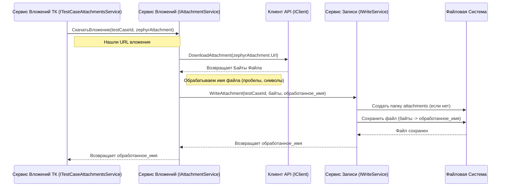

# Chapter 6: Обработка Вложений


В [предыдущей главе](05_конвертация_тест_кейсов_.md) мы узнали, как наш "переводчик" — Сервис Конвертации — берет "сырые" данные о тест-кейсе из Zephyr Scale и превращает их в наши стандартизированные [Модели Данных](04_модели_данных_.md). Мы упомянули, что одной из важных задач этого "переводчика" является работа с вложениями, например, картинками или документами, прикрепленными к тест-кейсам.

Представьте, что вы пишете инструкцию по сборке (тест-кейс), и вам нужно приложить к ней схемы и фотографии деталей (файлы). Как убедиться, что все эти дополнительные материалы тоже будут доставлены вместе с основной инструкцией? Как правильно оформить ссылки на них в самом тексте? Этим и занимается **Обработка Вложений** в нашем приложении.

## Зачем нужна Обработка Вложений? Наш "Отдел Логистики"

Тест-кейсы в Zephyr Scale часто содержат не только текст, но и:

1.  **Файлы, прикрепленные напрямую:** Документы, таблицы, архивы, добавленные к тест-кейсу или его шагу.
2.  **Изображения, встроенные в текст:** Картинки, вставленные прямо в поля описания, предусловия или шагов.

Когда мы экспортируем тест-кейс, нам нужно не просто скопировать текст, но и:

*   **Найти** все эти файлы-вложения.
*   **Скачать** их с сервера Zephyr Scale (или Confluence, если они там).
*   **Сохранить** их на вашем компьютере рядом с экспортированным тест-кейсом.
*   **Обновить текст** тест-кейса, чтобы ссылки на встроенные изображения указывали на скачанные файлы в специальном формате.

Процесс Обработки Вложений — это как работа **отдела логистики**. Он находит все сопроводительные "посылки" (файлы), скачивает их и гарантирует, что они будут доставлены вместе с основным "грузом" (тест-кейсом), а в "накладной" (тексте тест-кейса) будут правильные отметки об этих "посылках".

## Ключевые Идеи: Как это работает?

### 1. Поиск Вложений: Где искать?

Наш "логист" ищет вложения в двух местах:

*   **Список прямых вложений:** Zephyr API может предоставить список файлов, явно прикрепленных к тест-кейсу. Мы запрашиваем этот список с помощью [Клиента Zephyr API](03_клиент_zephyr_api_.md).
*   **Встроенные изображения:** Мы анализируем текстовые поля (описание, предусловие, шаги) на наличие специальных HTML-тегов ``.

### 2. Скачивание: Забираем файлы

Как только мы нашли ссылку на файл (прямую или из тега ``), мы используем [Клиент Zephyr API](03_клиент_zephyr_api_.md), чтобы **скачать** этот файл с сервера Zephyr. Представьте, что наш "логист" идет по адресу (URL), указанному в ссылке, и забирает файл.

### 3. Сохранение: Складируем на диск

Скачанный файл нужно сохранить. За это отвечает [Сервис Записи Данных](07_сервис_записи_данных_.md). Он аккуратно кладет файл в специальную папку `attachments` рядом с JSON-файлом тест-кейса. Имя файла может быть немного изменено (например, пробелы заменены на `_`), чтобы избежать проблем с файловой системой.

### 4. Формат `<<<имя_файла>>>`: Магия для встроенных ссылок

Самое интересное происходит со встроенными изображениями. Когда мы находим тег `` в тексте, например ``, мы делаем две вещи:

1.  **Скачиваем и сохраняем** файл `image.png`, как описано выше.
2.  В тексте тест-кейса **заменяем весь тег ``** на специальную конструкцию: `<<<image.png>>>` (или `<<<image_with_space.png>>>`, если в имени файла были пробелы).

Зачем это нужно? Система, в которую мы будем импортировать данные (Test IT), понимает этот формат `<<<...>>>`. Она увидит эту конструкцию, найдет файл `image.png` в папке `attachments` и автоматически отобразит его в нужном месте текста при импорте. Это способ сохранить связь между текстом и встроенным изображением.

### 5. "Логисты" в Коде: `ITestCaseAttachmentsService` и `IAttachmentService`

За всю эту логику отвечают два основных сервиса-помощника:

*   `ITestCaseAttachmentsService`: Этот сервис **координирует** обработку вложений для *одного конкретного* тест-кейса. Он вызывает [Клиента Zephyr API](03_клиент_zephyr_api_.md), чтобы получить список прямых вложений, использует утилиты для поиска встроенных картинок и затем просит `IAttachmentService` скачать и сохранить каждый найденный файл.
*   `IAttachmentService`: Этот сервис выполняет **конкретную работу** по скачиванию и сохранению *одного* файла. Он использует [Клиент Zephyr API](03_клиент_zephyr_api_.md) для скачивания и [Сервис Записи Данных](07_сервис_записи_данных_.md) для сохранения.

## Обработка Вложений в Действии: Интеграция с Конвертацией

Мы уже видели в [Главе 5](05_конвертация_тест_кейсов_.md), что `TestCaseConvertService` (наш главный "переводчик") использует `ITestCaseAttachmentsService` во время конвертации тест-кейса.

Давайте вспомним этот фрагмент (упрощенно):

```csharp
// Файл: ZephyrScaleServerExporter\Services\TestCase\Implementations\TestCaseConvertService.cs

public class TestCaseConvertService(
    /* ... другие зависимости ... */
    ITestCaseAttachmentsService testCaseAttachmentsService // Сервис для вложений
    /* ... */ ) 
    : ITestCaseConvertService
{
    public async Task<global::Models.TestCase?> ConvertTestCase(
        ZephyrTestCase zephyrTestCase, /* ... */)
    {
        // ... (другие шаги конвертации) ...

        // 1. Извлекаем текст и находим встроенные вложения (БЕЗ скачивания!)
        var descriptionData = Utils.ExtractAttachments(zephyrTestCase.Description);
        var preconditionData = Utils.ExtractAttachments(zephyrTestCase.Precondition);
        // descriptionData теперь содержит:
        // - .Description: Текст с заменами <<<...>>>
        // - .Attachments: Список найденных встроенных вложений (имя и URL)

        // 2. Запускаем задачу на скачивание всех вложений (прямых и встроенных)
        var attachmentsTask = testCaseAttachmentsService.FillAttachments(
            testCaseId, zephyrTestCase, descriptionData);

        // ... (параллельно выполняются другие задачи) ...

        // 3. Дожидаемся завершения скачивания
        await Task.WhenAll(/* ..., */ attachmentsTask /*, ... */);
        var attachments = await attachmentsTask; // Получаем список имен скачанных файлов

        // 4. Обработка вложений для предусловия (если там были <<<...>>>)
        var preconditionAttachments =
            await testCaseAttachmentsService.CalcPreconditionAttachments(
                testCaseId, preconditionData, attachments);

        // ... (Обработка вложений из шагов происходит внутри stepService) ...

        // 5. Собираем итоговую модель TestCase
        var testCase = new global::Models.TestCase
        {
            /* ... другие поля ... */
            Description = Utils.ExtractHyperlinks(descriptionData.Description), // Используем текст с <<<...>>>
            PreconditionSteps = /* ... создаем шаг для предусловия с его текстом <<<...>>> ... */,
            Attachments = testCaseServiceHelper.ExcludeDuplicates(attachments), // Добавляем список имен файлов
            /* ... */
        };

        return testCase;
    }
}
```

**Что происходит:**

1.  `Utils.ExtractAttachments` находит встроенные картинки в описании и предусловии, сразу заменяет теги `` на `<<<имя_файла>>>` и возвращает список этих файлов (но пока не скачивает их!).
2.  `testCaseAttachmentsService.FillAttachments` получает список прямых вложений от API и список встроенных вложений из `descriptionData`. Затем он скачивает *все* эти файлы и сохраняет их, возвращая список имен сохраненных файлов.
3.  Полученный список имен файлов (`attachments`) добавляется в поле `Attachments` нашей модели `TestCase`.
4.  Текстовые поля (`Description`, `PreconditionSteps` и шаги) уже содержат нужный формат `<<<...>>>` благодаря работе `Utils.ExtractAttachments`.

## Под Капотом: Как скачиваются и сохраняются файлы?

Давайте проследим путь одного вложения от Zephyr до вашего диска.

**Шаг за Шагом (без кода):**

1.  **Поиск:** `TestCaseAttachmentsService` находит URL вложения (либо из списка прямых вложений, либо из разобранного `` тега с помощью `Utils.ExtractAttachments`).
2.  **Запрос на Скачивание:** Он передает этот URL и ID текущего тест-кейса сервису `IAttachmentService`, говоря: "Скачай файл по этому адресу для этого тест-кейса".
3.  **Скачивание (Клиент API):** `IAttachmentService` обращается к [Клиенту Zephyr API](03_клиент_zephyr_api_.md) (`IClient`) и просит: "Загрузи содержимое по этому URL". Клиент отправляет HTTP-запрос и получает ответ в виде набора байт (содержимого файла).
4.  **Подготовка Имени:** `IAttachmentService` берет оригинальное имя файла, заменяет в нем пробелы на `_` и удаляет недопустимые символы (`Utils.ReplaceInvalidChars`, `Utils.SpacesToUnderscores`).
5.  **Запрос на Запись:** `IAttachmentService` передает ID тест-кейса, обработанное имя файла и скачанные байты [Сервису Записи Данных](07_сервис_записи_данных_.md) (`IWriteService`), говоря: "Запиши эти данные как файл с таким именем для этого тест-кейса".
6.  **Запись на Диск:** `IWriteService` создает, если нужно, папку `attachments` внутри папки тест-кейса (например, `output/<project_key>/testcases/<testcase_id>/attachments/`) и сохраняет туда байты под указанным именем.
7.  **Возврат Имени:** `IWriteService` возвращает имя сохраненного файла сервису `IAttachmentService`, а тот — обратно `ITestCaseAttachmentsService`.

**Визуализация процесса (схема):**



### Заглянем в Код

**1. Поиск встроенных вложений (`Utils.cs`)**

Этот статический метод использует регулярные выражения для поиска тегов `` и извлечения URL и имени файла.

```csharp
// Файл: ZephyrScaleServerExporter\Services\Helpers\Utils.cs

public static partial class Utils
{
    // Регулярные выражения для поиска  и извлечения URL
    private const string ImgPattern = "]*>";
    private const string UrlPattern = @"src=""\.\.([^""]+)""";
    [GeneratedRegex(ImgPattern)] // <-- Генератор регулярных выражений C#
    private static partial Regex ImgPatternRegex();
    [GeneratedRegex(UrlPattern)]
    private static partial Regex UrlPatternRegex();

    // Метод для извлечения вложений из текста
    public static ZephyrDescriptionData ExtractAttachments(string? description)
    {
        if (string.IsNullOrEmpty(description)) /* ... вернуть пусто ... */

        var data = new ZephyrDescriptionData { /* ... инициализация ... */ };
        var imgRegex = ImgPatternRegex();
        var matches = imgRegex.Matches(description); // Найти все теги 

        if (matches.Count == 0) return data; // Нет картинок - выходим

        foreach (Match match in matches) // Для каждого найденного 
        {
            var urlRegex = UrlPatternRegex();
            var urlMatch = urlRegex.Match(match.Value); // Найти src="..."
            if (!urlMatch.Success) continue;

            var url = urlMatch.Groups[1].Value; // Получить URL из src
            var fileName = url.Split('/')[^1];  // Взять имя файла из URL
            var transformedName = SpacesToUnderscores(fileName); // Заменить пробелы

            // !!! Замена тега на <<<имя_файла>>> !!!
            data.Description = data.Description.Replace(match.Value, $"<<<{transformedName}>>>");
            // Сохранить информацию о найденном вложении
            data.Attachments.Add(new ZephyrAttachment { FileName = transformedName, Url = url });
        }
        return data; // Вернуть измененный текст и список вложений
    }
    // ... другие утилиты (SpacesToUnderscores, ReplaceInvalidChars) ...
}
```

**2. Скачивание и запись одного файла (`AttachmentService.cs`)**

Этот сервис реализует логику скачивания и сохранения, описанную выше.

```csharp
// Файл: ZephyrScaleServerExporter\Services\Implementations\AttachmentService.cs

internal class AttachmentService(
    ILogger<AttachmentService> logger,
    IWriteService writeService, // Сервис для записи на диск
    IClient client              // Клиент для общения с API
    ) : IAttachmentService
{
    public async Task<string> DownloadAttachment(
        Guid id, // ID тест-кейса (для папки)
        ZephyrAttachment attachment, // Информация о вложении (имя, URL)
        bool isSharedAttachment) // Флаг для общих шагов (не важен сейчас)
    {
        logger.LogDebug("Скачивание вложения {@Attachment}", attachment);
        // 1. Скачиваем через Клиент API
        var bytes = await client.DownloadAttachment(attachment.Url);

        // 2. Обрабатываем имя файла
        attachment.FileName = Utils.SpacesToUnderscores(attachment.FileName);
        attachment.FileName = Utils.ReplaceInvalidChars(attachment.FileName);

        // 3. Записываем через Сервис Записи
        return await writeService.WriteAttachment(id, bytes, attachment.FileName, isSharedAttachment);
    }
    // ... другие методы (DownloadAttachmentById, CopySharedAttachments)...
}
```

**3. Координация для Тест-кейса (`TestCaseAttachmentsService.cs`)**

Этот сервис вызывает `IAttachmentService` для каждого вложения тест-кейса.

```csharp
// Файл: ZephyrScaleServerExporter\Services\TestCase\Implementations\TestCaseAttachmentsService.cs

public class TestCaseAttachmentsService(
    IClient client,                   // Нужен для получения списка прямых вложений
    IAttachmentService attachmentService // Наш сервис для скачивания/записи
    ) : ITestCaseAttachmentsService
{
    // Метод, который мы видели в ConvertTestCase
    public async Task<List<string>> FillAttachments(
        Guid testCaseId,
        ZephyrTestCase zephyrTestCase,
        ZephyrDescriptionData description // Данные из Utils.ExtractAttachments
        )
    {
        var attachments = new List<string>(); // Сюда соберем имена скачанных файлов

        // 1. Получаем список ПРЯМЫХ вложений от API
        var zephyrAttachments = await client.GetAttachmentsForTestCase(zephyrTestCase.Key);

        // 2. Собираем общий список того, что нужно скачать:
        List<ZephyrAttachment> toDownloadList = [];
        Utils.AddIfUnique(toDownloadList, zephyrAttachments);      // Прямые вложения
        Utils.AddIfUnique(toDownloadList, description.Attachments); // Встроенные из описания

        // 3. Запускаем скачивание для каждого файла параллельно
        var tasks = toDownloadList
            .AsParallel() // <-- Магия для распараллеливания
            .WithDegreeOfParallelism(Utils.GetLogicalProcessors()) // <-- Используем доступные ядра процессора
            .Select(async x =>
                // Для КАЖДОГО вложения вызываем сервис скачивания
                await attachmentService.DownloadAttachment(testCaseId, x, false)
            ).ToList();

        // 4. Ждем завершения всех задач скачивания
        var downloadedFileNames = await Task.WhenAll(tasks);
        Utils.AddIfUnique(attachments, downloadedFileNames.ToList()); // Собираем имена

        return attachments; // Возвращаем список имен скачанных файлов
    }

    // ... метод CalcPreconditionAttachments работает похоже для предусловия ...
}
```

Здесь используется `AsParallel()` и `Select(async ...)` для ускорения процесса — приложение пытается скачивать несколько файлов одновременно, а не ждать окончания загрузки одного перед началом следующего.

## Заключение

В этой главе мы разобрались с "отделом логистики" нашего экспортера — **Обработкой Вложений**. Мы узнали:

*   Почему важно обрабатывать вложения: чтобы сохранить все картинки и файлы, связанные с тест-кейсами.
*   Где искать вложения: в списке прямых вложений и внутри текста (теги ``).
*   Как происходит процесс: поиск -> скачивание -> сохранение -> обновление ссылок.
*   Что такое формат `<<<имя_файла>>>` и зачем он нужен для встроенных изображений.
*   Какие сервисы отвечают за этот processo (`Utils`, `IAttachmentService`, `ITestCaseAttachmentsService`) и как они взаимодействуют с [Клиентом Zephyr API](03_клиент_zephyr_api_.md) и [Сервисом Записи Данных](07_сервис_записи_данных_.md).

Теперь, когда мы умеем не только конвертировать текст тест-кейсов, но и обрабатывать все сопутствующие файлы, нам осталось разобраться с последним шагом — как именно все эти данные (JSON-файлы тест-кейсов, скачанные вложения, главный `root.json`) аккуратно сохраняются на ваш компьютер.

Этому посвящен финальный этап нашего путешествия — следующая глава про [Сервис Записи Данных](07_сервис_записи_данных_.md).

---

Generated by [AI Codebase Knowledge Builder](https://github.com/The-Pocket/Tutorial-Codebase-Knowledge)