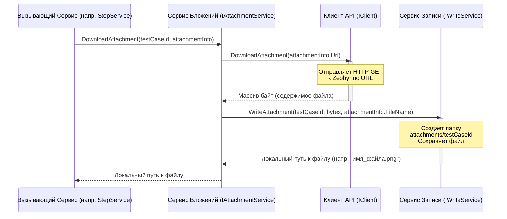

# Chapter 6: Сервис Обработки Вложений

В [предыдущей главе](05_сервис_конвертации_шагов.md) мы видели, как [Сервис Конвертации Шагов](05_сервис_конвертации_шагов.md) разбирает инструкции тест-кейсов, включая поиск картинок, встроенных прямо в текст шагов. Он находит эти картинки, но сам их не скачивает. Он передает эту задачу другому специалисту. Кто же отвечает за то, чтобы все эти файлы (картинки, документы) оказались на нашем компьютере?

Этим занимается **Сервис Обработки Вложений**.

## Зачем нужен "библиотекарь-архивариус"?

Тест-кейсы и их шаги в Zephyr Scale часто содержат вложения: скриншоты, поясняющие изображения, прикрепленные документы. В самом Zephyr они хранятся на сервере и доступны по специальным ссылкам (URL). Когда мы переносим тест-кейсы в другую систему (например, Test IT), нам нужно не только скопировать текст, но и перенести все связанные файлы.

**Проблема:** Как автоматически скачать все нужные файлы из Zephyr и сохранить их так, чтобы потом можно было легко импортировать их вместе с тест-кейсами?

**Решение:** Нам нужен "библиотекарь-архивариус", который умеет работать с файлами. Когда ему говорят: "Нужен файл по вот этому адресу из Zephyr для тест-кейса номер 123", он:

1.  Обращается к "хранилищу" Zephyr (через [Клиента Zephyr API](02_клиент_zephyr_api.md)) и запрашивает файл по указанному адресу (URL).
2.  Скачивает содержимое файла.
3.  Аккуратно кладет этот файл в специальную папку на вашем компьютере, предназначенную для вложений конкретного тест-кейса (например, в папку `attachments/123`).
4.  Сообщает, как теперь называется этот файл и где он лежит локально (возвращает путь к файлу).

Этот "библиотекарь" и есть наш **Сервис Обработки Вложений** (`AttachmentService`). Он берет на себя рутину по скачиванию и организации файлов.

## Ключевые задачи Сервиса Обработки Вложений

1.  **Получение Запроса:** Принимает информацию о том, какой файл нужно скачать (его URL в Zephyr, имя файла) и к какому тест-кейсу он относится (ID тест-кейса, для правильного сохранения).
2.  **Скачивание Файла:** Использует [Клиент Zephyr API](02_клиент_zephyr_api.md) для запроса и получения содержимого файла (в виде набора байт) по его Zephyr URL.
3.  **Сохранение Файла:** Использует другой сервис (сервис записи, `WriteService`) для сохранения полученных байт в файл на вашем диске. Файл сохраняется в подпапку, соответствующую ID тест-кейса, к которому он прикреплен.
4.  **Возврат Локального Пути:** Возвращает путь к только что сохраненному файлу, чтобы другие сервисы (например, [Сервис Конвертации Тест-кейсов](04_сервис_конвертации_тест_кейсов.md)) могли включить эту информацию в данные тест-кейса.

## Как это используется?

Сервис Обработки Вложений – это рабочий инструмент для других сервисов. В основном его используют:

*   [Сервис Конвертации Тест-кейсов](04_сервис_конвертации_тест_кейсов.md): Когда он обрабатывает описание, предусловие или напрямую прикрепленные к тест-кейсу файлы.
*   [Сервис Конвертации Шагов](05_сервис_конвертации_шагов.md): Когда он находит картинки в тексте шагов.

Давайте посмотрим на упрощенный пример того, как [Сервис Конвертации Шагов](05_сервис_конвертации_шагов.md) может вызывать нашего "библиотекаря":

```csharp
// File: Services\StepService.cs (упрощенный фрагмент)

public class StepService : IStepService
{
    private readonly IAttachmentService _attachmentService; // Наш "библиотекарь"
    // ...другие зависимости...

    public StepService(/*...,*/ IAttachmentService attachmentService /*,...*/)
    {
        _attachmentService = attachmentService;
        // ...
    }

    private async Task<Step> ConvertStep(Guid testCaseId, ZephyrStep step)
    {
        // Нашли картинку в описании шага
        var actionData = Utils.ExtractAttachments(step.Description);
        var newStep = new Step { /*...*/ };

        // Просим "библиотекаря" скачать каждую найденную картинку
        foreach (var attachmentInfo in actionData.Attachments)
        {
            // Передаем ID тест-кейса и информацию о вложении (URL, имя)
            string localFileName = await _attachmentService.DownloadAttachment(
                testCaseId, // К какому тест-кейсу относится
                attachmentInfo // Что скачивать (URL, имя)
            );
            // Добавляем полученное имя локального файла в список вложений шага
            newStep.ActionAttachments.Add(localFileName);
        }
        // ... обработка других полей и вложений ...
        return newStep;
    }
    // ...
}
```

Здесь `StepService` нашел информацию о вложении (`attachmentInfo`, содержащую URL и имя файла из Zephyr) и ID тест-кейса (`testCaseId`). Он передает эти данные методу `_attachmentService.DownloadAttachment()`. В ответ он получает `localFileName` – имя файла, под которым он был сохранен локально (например, `имя_файла.png`). Это имя затем добавляется в список вложений шага.

## Под капотом: Как работает "библиотекарь"?

Процесс скачивания файла довольно прост:

1.  **Получение Задания:** `AttachmentService` получает вызов метода `DownloadAttachment` с ID тест-кейса и информацией о файле (URL, имя).
2.  **Запрос к API:** Сервис обращается к [Клиенту Zephyr API](02_клиент_zephyr_api.md) и просит его скачать файл по указанному URL (`_client.DownloadAttachment(attachment.Url)`).
3.  **Получение Содержимого:** [Клиент API](02_клиент_zephyr_api.md) выполняет HTTP-запрос к Zephyr, получает ответ с содержимым файла в виде массива байт (`byte[]`) и возвращает его `AttachmentService`.
4.  **Запись на Диск:** `AttachmentService` передает полученные байты, ID тест-кейса и оригинальное имя файла сервису записи (`_writeService.WriteAttachment(id, bytes, attachment.FileName)`).
5.  **Сохранение и Возврат Пути:** Сервис записи создает нужную папку (если ее нет, например `attachments/айди_тест-кейса`), сохраняет байты в файл (возможно, немного изменив имя, чтобы избежать конфликтов) и возвращает `AttachmentService` путь к этому файлу.
6.  **Возврат Результата:** `AttachmentService` возвращает полученный локальный путь тому, кто его вызвал (например, `StepService`).

Визуализируем это взаимодействие:



## Код в деталях

Сервису обработки вложений нужны два помощника: [Клиент API](02_клиент_zephyr_api.md) для скачивания и Сервис Записи для сохранения. Они передаются ему при создании (через конструктор):

```csharp
// File: Services\AttachmentService.cs (фрагмент конструктора)

public class AttachmentService : IAttachmentService
{
    private readonly ILogger<AttachmentService> _logger;
    private readonly IWriteService _writeService; // Сервис для записи на диск
    private readonly IClient _client; // Клиент для общения с Zephyr API

    // Конструктор получает зависимости
    public AttachmentService(ILogger<AttachmentService> logger, IWriteService writeService, IClient client)
    {
        _logger = logger;
        _writeService = writeService; // Сохраняем сервис записи
        _client = client;             // Сохраняем клиент API
    }

    // ... метод скачивания ...
}
```

Основная логика заключена в одном методе `DownloadAttachment`:

```csharp
// File: Services\AttachmentService.cs (метод DownloadAttachment)

// Этот метод реализует интерфейс IAttachmentService
public async Task<string> DownloadAttachment(Guid id, ZephyrAttachment attachment)
{
    // Логгируем информацию о скачиваемом файле (имя, URL)
    _logger.LogDebug("Скачиваем вложение: Имя={FileName}, URL={Url}", attachment.FileName, attachment.Url);

    // 1. Просим Клиент API скачать файл по URL
    // Он вернет содержимое файла в виде массива байт
    var bytes = await _client.DownloadAttachment(attachment.Url);
    _logger.LogDebug("Получено {BytesCount} байт для файла {FileName}", bytes.Length, attachment.FileName);

    // 2. Просим Сервис Записи сохранить эти байты
    // Передаем ID тест-кейса (для папки), байты и оригинальное имя файла
    // Он вернет имя файла (или путь), под которым он сохранен локально
    var localPath = await _writeService.WriteAttachment(id, bytes, attachment.FileName);
    _logger.LogDebug("Вложение {FileName} сохранено как {LocalPath}", attachment.FileName, localPath);

    // 3. Возвращаем локальный путь вызывающему коду
    return localPath;
}
```

* `Guid id`: Уникальный идентификатор тест-кейса, к которому относится вложение. Используется для создания подпапки.
* `ZephyrAttachment attachment`: Объект, содержащий информацию о файле из Zephyr, как минимум его `Url` (откуда качать) и `FileName` (оригинальное имя).
* `_client.DownloadAttachment(attachment.Url)`: Вызов метода [Клиента API](02_клиент_zephyr_api.md), который реально выполняет HTTP-запрос к Zephyr и получает массив байт (`byte[]`).
* `_writeService.WriteAttachment(id, bytes, attachment.FileName)`: Вызов сервиса записи, который берет эти байты, создает или находит папку вроде `attachments/xxxx-xxxx-...-xxxx` (где `xxxx` – это `id` тест-кейса), сохраняет туда файл и возвращает его локальное имя (например, `original_name.png`).

Вспомогательная модель `ZephyrAttachment` используется для передачи информации о файле:

```csharp
// File: Models\ZephyrAttachment.cs (упрощенно)

using System.Text.Json.Serialization;

namespace ZephyrScaleServerExporter.Models;

public class ZephyrAttachment
{
    // Атрибут указывает, как называется это поле в JSON ответе от Zephyr
    [JsonPropertyName("filename")]
    public string FileName { get; set; } // Имя файла

    [JsonPropertyName("url")]
    public string Url { get; set; }      // Относительный URL для скачивания
}
```

Как видите, сам **Сервис Обработки Вложений** довольно прост. Он выполняет роль связующего звена: получает задание, отдает команду на скачивание [Клиенту API](02_клиент_zephyr_api.md), а результат отдает на сохранение Сервису Записи.

## Заключение

В этой главе мы познакомились с **Сервисом Обработки Вложений** – нашим "библиотекарем-архивариусом". Мы узнали, что он:

*   Отвечает за **скачивание файлов** (вложений), связанных с тест-кейсами или шагами, из Zephyr.
*   Использует [Клиента Zephyr API](02_клиент_zephyr_api.md) для получения содержимого файлов.
*   Использует сервис записи (`WriteService`) для **сохранения файлов** в локальной структуре папок.
*   **Возвращает локальный путь** к сохраненному файлу другим сервисам.
*   Вызывается [Сервисом Конвертации Тест-кейсов](04_сервис_конвертации_тест_кейсов.md) и [Сервисом Конвертации Шагов](05_сервис_конвертации_шагов.md), когда им нужно обработать вложения.

Теперь, когда мы знаем, как обрабатываются тексты, шаги и вложения, осталось разобраться еще с одной важной частью тест-кейсов в Zephyr – параметрами и итерациями (наборами данных).

В следующей главе мы изучим [Сервис Обработки Параметров](07_сервис_обработки_параметров.md), который отвечает за извлечение и преобразование этих данных.

---

Generated by [AI Codebase Knowledge Builder](https://github.com/The-Pocket/Tutorial-Codebase-Knowledge)