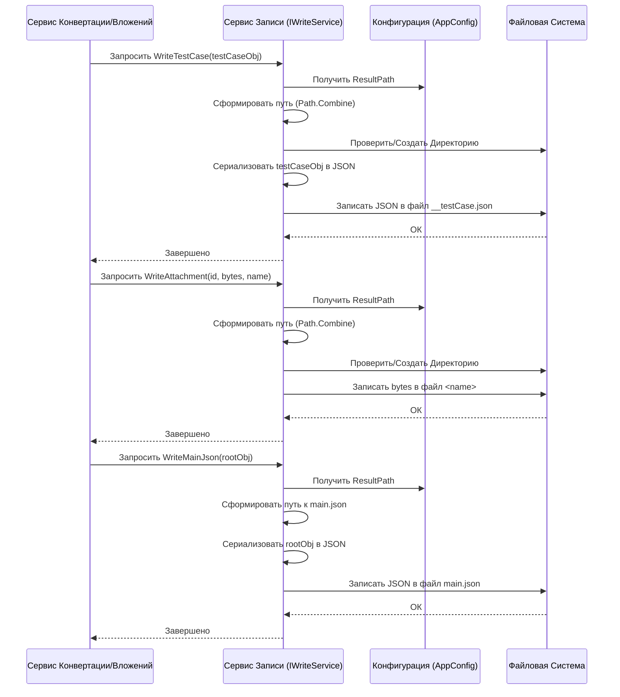

# Chapter 7: Сервис Записи Данных


Добро пожаловать в последнюю главу нашего путешествия по `ZephyrScaleServerExporter`! В [предыдущей главе](06_обработка_вложений_.md) мы подробно разобрались, как наше приложение находит, скачивает и подготавливает все файлы-вложения, связанные с тест-кейсами. Мы получили основной текст тест-кейса, преобразованный в нужный формат, и все его "сопроводительные материалы" (картинки, документы).

Теперь нам нужен финальный штрих: аккуратно **сохранить** всю эту информацию на вашем компьютере. Куда положить JSON-файл с описанием тест-кейса? В какую папку поместить скачанные вложения? Как создать главный файл `main.json`, который свяжет всё воедино?

За все эти задачи отвечает **Сервис Записи Данных (`WriteService`)**. Представьте его как **архивариуса** или **библиотекаря** нашего проекта. После того, как все данные собраны и обработаны другими сервисами, именно он берет их и раскладывает по нужным папкам и файлам в структурированном виде в том месте, которое вы указали в [Конфигурации Приложения](01_конфигурация_приложения_.md).

## Зачем нужен отдельный Сервис Записи?

Может показаться, что запись файлов — простая задача. Зачем для нее отдельный сервис? На это есть несколько причин:

1.  **Централизация Логики:** Вместо того чтобы каждый сервис (конвертации, обработки вложений) сам решал, как и куда писать файлы, мы доверяем это одному специализированному сервису. Это упрощает код и делает его более организованным.
2.  **Управление Путями:** Сервис Записи знает, как правильно сформировать путь к файлу, основываясь на настройке `ResultPath` из [Конфигурации Приложения](01_конфигурация_приложения_.md), ID тест-кейса или общего шага.
3.  **Создание Директорий:** Он автоматически создает необходимые папки (например, папку для каждого тест-кейса и подпапку `attachments` для его вложений), если их еще нет.
4.  **Обработка Форматов:** Он знает, что тест-кейсы и главный файл нужно сохранять как JSON (и даже делает его красиво отформатированным), а вложения — как бинарные файлы.
5.  **Поддержка Пакетного Экспорта:** Если вы используете режим частичного экспорта (с параметрами `Partial` и `PartialFolderName` в конфигурации), Сервис Записи создаст для результатов отдельную подпапку с уникальным номером (например, `output/PROJ/first_50_tests_1`), чтобы разные пакеты не перезаписывали друг друга.

## Что и Куда Сохраняет Сервис Записи?

Наш "архивариус" работает с тремя основными типами данных:

1.  **Тест-кейсы (`TestCase`):** Каждый сконвертированный объект [Модели Данных](04_модели_данных_.md) `TestCase` сохраняется как отдельный JSON-файл.
    *   **Путь:** `[ResultPath]/[TestCaseId]/__testCase.json`
    *   **Пример:** `output/PROJ-T123/4f5a-b87c-e123-abcd/__testCase.json`

2.  **Вложения (`Attachment`):** Каждый скачанный файл-вложение сохраняется как бинарный файл.
    *   **Путь:** `[ResultPath]/[TestCaseId]/attachments/[имя_файла]` (или `[ResultPath]/[SharedStepId]/attachments/[имя_файла]` для вложений общих шагов).
    *   **Пример:** `output/PROJ-T123/4f5a-b87c-e123-abcd/attachments/screenshot.png`

3.  **Общие Шаги (`SharedStep`):** Аналогично тест-кейсам, каждый общий шаг сохраняется как JSON.
    *   **Путь:** `[ResultPath]/[SharedStepId]/__sharedStep.json`
    *   **Пример:** `output/SH-1/a1b2-c3d4-e5f6-g7h8/__sharedStep.json`

4.  **Основной Файл (`Root`):** Главный файл `main.json`, содержащий общую структуру проекта, список атрибутов, секций и ID всех тест-кейсов и общих шагов.
    *   **Путь:** `[ResultPath]/main.json`
    *   **Пример:** `output/main.json`

**Важно:** `[ResultPath]` — это путь, который вы указали в файле `zephyr.config.json`. Если включен пакетный экспорт, то базовый путь будет содержать имя проекта и имя пакета с номером, например `output/MYPROJ/partial_export_1/`.

## Как Пользоваться Сервисом? Интерфейс `IWriteService`

Другие компоненты, такие как [Сервис Конвертации Тест-кейсов](05_конвертация_тест_кейсов_.md) или [Сервис Обработки Вложений](06_обработка_вложений_.md), взаимодействуют с Сервисом Записи через его "контракт" — интерфейс `IWriteService`. Этот интерфейс определяет основные операции, которые умеет выполнять наш "архивариус".

```csharp
// Файл: ZephyrScaleServerExporter\Services\IWriteService.cs
using Models; // Используем наши Модели Данных

namespace ZephyrScaleServerExporter.Services;

public interface IWriteService
{
    // Записать вложение (бинарный файл)
    // id: ID тест-кейса или общего шага
    // content: Содержимое файла (массив байт)
    // fileName: Имя файла для сохранения
    // isSharedAttachment: Флаг, является ли вложение для общего шага
    // Возвращает: Имя сохраненного файла
    Task<string> WriteAttachment(Guid id, byte[] content, string fileName, bool isSharedAttachment);

    // Записать тест-кейс (JSON-файл)
    Task WriteTestCase(global::Models.TestCase testCase); // Используем полную ссылку из-за конфликта имен

    // Записать общий шаг (JSON-файл)
    Task WriteSharedStep(SharedStep sharedStep);

    // Записать главный файл main.json
    Task WriteMainJson(Root mainJson);

    // Скопировать вложение от общего шага к тест-кейсу
    // targetId: ID тест-кейса, куда копируем
    // fileName: Имя файла, который нужно скопировать (предполагается, что он уже сохранен для общего шага)
    // Возвращает: Имя скопированного файла или null
    Task<string?> CopyAttachment(Guid targetId, string fileName);

    // Получить номер текущего пакета (для пакетного экспорта)
    int GetBatchNumber();
}
```

Каждый метод прост и понятен: он принимает объект с данными ([Модель Данных](04_модели_данных_.md) или массив байт) и выполняет соответствующую операцию записи.

## Пример: Сохранение Тест-кейса

Представим, что [Сервис Конвертации](05_конвертация_тест_кейсов_.md) (точнее, его координатор `TestCaseCommonService`) успешно преобразовал "сырые" данные от Zephyr в наш объект `TestCase`. Теперь его нужно сохранить.

```csharp
// Пример вызова из TestCaseCommonService.cs (очень упрощенно)

// testCase - это готовый объект TestCase из Модели Данных
// writeService - это экземпляр IWriteService, полученный через DI

if (testCase != null)
{
    // Просто просим Сервис Записи сохранить тест-кейс
    await writeService.WriteTestCase(testCase);
    // Возвращаем ID для отчетности
    return testCase.Id;
}
```

Что произойдет внутри `WriteService` при вызове `WriteTestCase(testCase)`?

1.  **Определение пути:** Сервис возьмет `testCase.Id` (например, `4f5a-b87c-e123-abcd`) и базовый путь `_path` (например, `c:\export_results`).
2.  **Создание папки:** Создаст папку `c:\export_results\4f5a-b87c-e123-abcd`, если ее нет.
3.  **Формирование имени файла:** Определит имя файла как `__testCase.json`.
4.  **Сериализация в JSON:** Преобразует объект `testCase` в строку JSON, используя стандартный `System.Text.Json`. При этом JSON будет отформатирован для удобства чтения.
5.  **Запись файла:** Сохранит полученную JSON-строку в файл `c:\export_results\4f5a-b87c-e123-abcd\__testCase.json`.
6.  **Логирование:** Запишет в лог информацию о том, что файл успешно сохранен.

Вот как выглядит упрощенный метод `WriteTestCase` внутри `WriteService`:

```csharp
// Файл: ZephyrScaleServerExporter\Services\Implementations\WriteService.cs (упрощенно)

public async Task WriteTestCase(global::Models.TestCase testCase)
{
    // 1. Формируем путь к папке тест-кейса
    var fullPath = Path.Combine(_path, testCase.Id.ToString());
    // 2. Создаем папку, если её нет
    if (!Directory.Exists(fullPath))
    {
        Directory.CreateDirectory(fullPath);
    }

    // 3. Формируем полный путь к JSON-файлу
    var filePath = Path.Combine(fullPath, Constants.TestCase); // Constants.TestCase = "__testCase.json"

    _logger.LogInformation("Запись тест-кейса {Id}: {Path}", testCase.Id, filePath);

    // 4. Открываем (или создаем) файл для записи
    await using var createStream = File.Create(filePath);
    // 5. Сериализуем объект TestCase в JSON и записываем в файл
    // _options содержит настройки для красивого форматирования
    await JsonSerializer.SerializeAsync(createStream, testCase, _options);
}
```

## Пример: Сохранение Вложения

Теперь представим, что [Сервис Обработки Вложений](06_обработка_вложений_.md) (точнее, `AttachmentService`) скачал файл `image.png` для того же тест-кейса (`4f5a-b87c-e123-abcd`) и получил его содержимое в виде массива байт `contentBytes`.

```csharp
// Пример вызова из AttachmentService.cs (упрощенно)

// id - ID тест-кейса (4f5a-b87c-e123-abcd)
// contentBytes - массив байт скачанного файла
// attachment.FileName - "image.png" (имя уже обработано - пробелы заменены на '_')
// writeService - экземпляр IWriteService

// Вызываем метод для записи бинарных данных
return await writeService.WriteAttachment(id, contentBytes, attachment.FileName, false);
```

Метод `WriteAttachment` внутри `WriteService` выполнит похожие шаги:

1.  **Определение пути:** Так же определит путь к папке тест-кейса: `c:\export_results\4f5a-b87c-e123-abcd`.
2.  **Создание папки:** Создаст папку, если её нет.
3.  **Формирование имени файла:** Имя файла (`image.png`) берется из параметра.
4.  **Запись байт:** Откроет (или создаст) файл `c:\export_results\4f5a-b87c-e123-abcd\image.png` и запишет в него напрямую массив байт `contentBytes`.
5.  **Логирование:** Запишет в лог информацию об успешной записи.

Вот как выглядит упрощенный метод `WriteAttachment`:

```csharp
// Файл: ZephyrScaleServerExporter\Services\Implementations\WriteService.cs (упрощенно)

// Используется для синхронизации доступа к одной и той же папке из разных потоков
private readonly ConcurrentDictionary<string, bool> _asyncWriteLock = new();

public async Task<string> WriteAttachment(Guid id, byte[] content, string fileName, bool isSharedAttachment)
{
    // 1. Формируем путь к папке
    var fullPath = Path.Combine(_path, id.ToString());

    // Мини-блокировка, чтобы избежать проблем при создании папки или записи файла
    // для одного и того же ID из разных потоков одновременно
    while (IsLocked(fullPath)) { await Task.Delay(5); } // Ждем, если занято
    _asyncWriteLock[fullPath] = true; // "Занимаем" путь

    try // Используем try-finally, чтобы гарантированно "освободить" путь
    {
        // 2. Создаем папку, если её нет
        if (!Directory.Exists(fullPath))
        {
            Directory.CreateDirectory(fullPath);
        }

        // 3. Формируем полный путь к файлу вложения
        var filePath = Path.Combine(fullPath, fileName);

        _logger.LogInformation("Запись вложения {FileName} для {Id}: {Path}", fileName, id, filePath);

        // 4. Открываем файл и записываем бинарные данные
        await using var writer = new BinaryWriter(File.OpenWrite(filePath));
        writer.Write(content);

        // 5. Возвращаем фактическое имя файла
        return Path.GetFileName(filePath);
    }
    finally
    {
        _asyncWriteLock[fullPath] = false; // "Освобождаем" путь
    }
}

// Вспомогательный метод для проверки блокировки
private bool IsLocked(string fullPath)
{
    var isValue = _asyncWriteLock.TryGetValue(fullPath, out var value);
    return isValue && value;
}
```

Здесь мы видим использование `ConcurrentDictionary` (`_asyncWriteLock`) и `try-finally`. Это нужно для того, чтобы избежать ситуации, когда два потока одновременно пытаются создать одну и ту же папку или записать файл с одним и тем же именем. Это простой механизм "блокировки" на уровне пути к папке.

## Под Капотом: Как Инициализируется Сервис?

Сервис Записи (`WriteService`) создается системой Внедрения Зависимостей (DI), как и другие сервисы. При создании ему передаются логгер и доступ к конфигурации (`IOptions<AppConfig>`).

```csharp
// Файл: ZephyrScaleServerExporter\Services\Implementations\WriteService.cs (Конструктор)

public class WriteService : IWriteService
{
    // ... поля _options, _logger, _config, _path, _asyncWriteLock ...
    public readonly int BatchNumber = 0; // Номер пакета, если используется пакетный экспорт

    public WriteService(
        ILogger<WriteService> logger,
        IOptions<AppConfig> config) // Получаем логгер и конфигурацию
    {
        _config = config.Value; // Извлекаем сам объект конфигурации
        _logger = logger;

        // Проверяем, включен ли режим частичного (пакетного) экспорта
        if (_config.Zephyr.Partial && !string.IsNullOrEmpty(_config.Zephyr.PartialFolderName))
        {
            // Если да - инициализируем специальный путь для пакета
            (_path, BatchNumber) = InitBatchPath();
        }
        else
        {
            // Если нет - используем основной путь из конфигурации
            _path = Path.GetFullPath(_config.ResultPath);
            if (_path == null) throw new ArgumentNullException(nameof(_config.ResultPath)); // Защита от пустой конфигурации
        }
    }

    // Получить номер текущего пакета
    public int GetBatchNumber()
    {
        return BatchNumber;
    }

    // Метод для определения пути для пакетного экспорта
    private (string, int) InitBatchPath()
    {
        // Базовый путь: ResultPath / ProjectKey / PartialFolderName
        var basePath = Path.Combine(_config.ResultPath,
            _config.Zephyr.ProjectKey, _config.Zephyr.PartialFolderName);

        int batchNumber = 1;
        // Добавляем номер _1, _2, ...
        var path = basePath + $"_{batchNumber}";
        // Проверяем, существует ли уже папка с таким номером
        while (Directory.Exists(path))
        {
            // Если существует, увеличиваем номер и пробуем снова
            batchNumber++;
            path = basePath + $"_{batchNumber}";
        }
        // Возвращаем найденный уникальный путь и номер пакета
        return (Path.GetFullPath(path), batchNumber);
    }

    // ... остальные методы сервиса: WriteAttachment, WriteTestCase и т.д. ...
}
```

Ключевое здесь — как определяется переменная `_path`, которая затем используется во всех методах записи. Если в конфигурации включен частичный экспорт (`Partial: true` и `PartialFolderName` задано), вызывается `InitBatchPath`. Этот метод конструирует путь, добавляя имя проекта и имя папки для частичного экспорта, а затем добавляет суффикс `_1`. Если папка `..._1` уже существует, он пробует `..._2`, `..._3` и так далее, пока не найдет свободный номер. Это гарантирует, что каждый запуск частичного экспорта будет сохранять результаты в новую папку. Если частичный экспорт выключен, `_path` просто берется из `ResultPath` конфигурации.

## Визуализация Процесса Записи (Общая Схема)

Давайте представим общую картину, как данные попадают на диск.



Эта схема показывает, что для любой операции записи Сервис Записи сначала обращается к конфигурации за базовым путем, затем формирует полный путь, подготавливает файловую систему (создает папки) и, наконец, записывает данные (JSON или бинарные).

## Заключение

Вот и подошло к концу наше знакомство с `ZephyrScaleServerExporter`. В этой последней главе мы изучили **Сервис Записи Данных (`WriteService`)**, нашего финального "архивариуса". Мы узнали:

*   Его **основная роль** — сохранять все сконвертированные данные (тест-кейсы, общие шаги, `main.json`) и скачанные вложения в файловую систему.
*   Он использует **путь из конфигурации** (`ResultPath`) и создает **структурированную систему папок** для каждого тест-кейса и общего шага.
*   Он умеет записывать как **JSON-файлы** (с красивым форматированием), так и **бинарные файлы** вложений.
*   Он поддерживает режим **пакетного экспорта**, создавая уникальные папки для каждого пакета.
*   Другие сервисы взаимодействуют с ним через простой интерфейс `IWriteService`.

Теперь вы имеете представление обо всех ключевых компонентах `ZephyrScaleServerExporter`:

1.  [**Конфигурация**](01_конфигурация_приложения_.md): Задает параметры работы.
2.  [**Сервис Экспорта**](02_сервис_экспорта_.md): Оркестрирует весь процесс.
3.  [**Клиент API**](03_клиент_zephyr_api_.md): Общается с Zephyr Scale.
4.  [**Модели Данных**](04_модели_данных_.md): Определяют структуру данных.
5.  [**Сервис Конвертации**](05_конвертация_тест_кейсов_.md): Преобразует данные Zephyr в наши модели.
6.  [**Обработка Вложений**](06_обработка_вложений_.md): Скачивает и обрабатывает файлы.
7.  [**Сервис Записи**](07_сервис_записи_данных_.md): Сохраняет результат на диск.

Вместе они образуют конвейер, который берет данные из Zephyr Scale и превращает их в формат, готовый для импорта в другую систему, такую как Test IT. Надеемся, это руководство помогло вам понять, как устроен `ZephyrScaleServerExporter` и как его использовать! Успешных вам экспортов!

---

Generated by [AI Codebase Knowledge Builder](https://github.com/The-Pocket/Tutorial-Codebase-Knowledge)