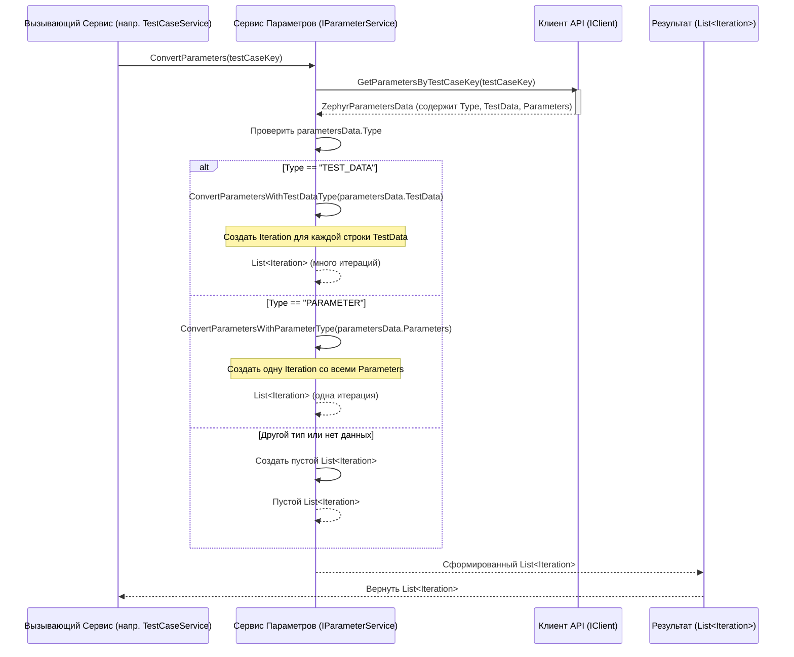

# Chapter 7: Сервис Обработки Параметров

В [предыдущей главе](06_сервис_обработки_вложений.md) мы разобрались, как [Сервис Обработки Вложений](06_сервис_обработки_вложений.md) бережно скачивает и сохраняет все файлы, связанные с нашими тест-кейсами. Теперь пришло время взглянуть на еще одну важную особенность тест-кейсов в Zephyr Scale – **параметры** и **наборы данных (test data)**. Они позволяют выполнять один и тот же тест-кейс несколько раз с разными входными значениями. Кто же отвечает за извлечение и организацию этих данных? Встречайте – **Сервис Обработки Параметров**!

## Зачем нужен специалист по таблицам данных?

Представьте, что у вас есть тест-кейс для проверки входа пользователя в систему. Вместо того чтобы создавать отдельные тест-кейсы для каждого пользователя (admin, user, guest), вы можете создать один параметризованный тест-кейс и указать, что его нужно выполнить с разными комбинациями логинов и паролей.

В Zephyr Scale эти комбинации можно задать двумя основными способами:

1.  **Набор данных (Test Data):** Похоже на таблицу, где каждая строка – это один набор значений для параметров (например, строка 1: {логин: "admin", пароль: "pass1"}, строка 2: {логин: "user", пароль: "pass2"}).
2.  **Параметры (Parameters):** Просто список параметров с их значениями по умолчанию. Обычно используется, если вариаций немного или они задаются более гибко.

Когда мы переносим такие тест-кейсы в другую систему (например, Test IT), нам нужно сохранить эту информацию о "многократном выполнении" с разными данными.

**Проблема:** Как взять специфическую структуру данных из Zephyr (будь то "Test Data" или "Parameters") и превратить ее в унифицированный формат, понятный для целевой системы, который описывает каждую комбинацию входных данных как отдельную "итерацию"?

**Решение:** Нам нужен специалист по работе с данными, наш **Сервис Обработки Параметров**. Он действует как эксперт по таблицам:

*   Запрашивает у [Клиента Zephyr API](02_клиент_zephyr_api.md), есть ли у тест-кейса параметры или наборы данных.
*   Анализирует полученную структуру.
*   Преобразует ее в список **итераций**. Каждая итерация – это как одна строка в таблице данных, содержащая список **параметров** (имя и значение) для одного конкретного прогона тест-кейса.
*   Умеет объединять параметры, если, например, общий шаг ([shared step](05_сервис_конвертации_шагов.md)) добавляет свои параметры к параметрам основного тест-кейса.

Этот сервис гарантирует, что информация о всех необходимых вариантах выполнения тест-кейса будет сохранена правильно.

## Ключевые задачи Сервиса Обработки Параметров

1.  **Получение данных:** Использует [Клиент Zephyr API](02_клиент_zephyr_api.md) для получения информации о параметрах или наборах данных, связанных с конкретным тест-кейсом (`GetParametersByTestCaseKey`).
2.  **Определение типа:** Различает, какой тип параметризации используется в Zephyr (`TEST_DATA` или `PARAMETER`).
3.  **Преобразование "Test Data":** Если тип `TEST_DATA`, сервис проходится по каждой "строке" набора данных Zephyr и создает для нее отдельный объект `Iteration`. Внутри каждой `Iteration` создается список объектов `Parameter`, содержащих имена и значения из этой "строки".
4.  **Преобразование "Parameters":** Если тип `PARAMETER`, сервис создает **одну** `Iteration`, в которую помещает все параметры с их значениями по умолчанию.
5.  **Формирование результата:** Возвращает стандартизированный список объектов `Iteration` (`List<Iteration>`).
6.  **Слияние параметров:** Предоставляет метод `MergeIterations` для объединения списков итераций, например, когда нужно добавить параметры из общего шага к параметрам основного тест-кейса. Этот метод аккуратно добавляет параметры из второго списка в первый, избегая дублирования по именам.

## Как это используется?

Сервис Обработки Параметров используется другими компонентами, которым нужно знать, с какими данными выполнять тест-кейс:

*   [Сервис Конвертации Тест-кейсов](04_сервис_конвертации_тест_кейсов.md): Вызывает его, чтобы получить список итераций и сохранить его в итоговом объекте `TestCase`.
*   [Сервис Конвертации Шагов](05_сервис_конвертации_шагов.md): Использует его при обработке общих шагов, чтобы получить и объединить их параметры с параметрами основного тест-кейса. Также он использует информацию о параметрах для правильной замены плейсхолдеров в тексте шагов.

Посмотрим, как [Сервис Конвертации Тест-кейсов](04_сервис_конвертации_тест_кейсов.md) запрашивает параметры:

```csharp
// Файл: Services\TestCaseService.cs (фрагмент)

public class TestCaseService : ITestCaseService
{
    private readonly IParameterService _parameterService; // Наш сервис параметров
    // ...другие зависимости...

    public TestCaseService(..., IParameterService parameterService, ...)
    {
        _parameterService = parameterService;
        // ...
    }

    public async Task<TestCaseData> ConvertTestCases(...)
    {
        // ... цикл по тест-кейсам ...
        foreach (var zephyrTestCase in cases)
        {
            // ... получаем ID тест-кейса, обрабатываем вложения ...
            _logger.LogDebug("Получаем параметры для тест-кейса {Key}", zephyrTestCase.Key);

            // !!! ВЫЗОВ СЕРВИСА ПАРАМЕТРОВ !!!
            // Передаем ключ (ID) тест-кейса из Zephyr
            List<Iteration> iterations = await _parameterService.ConvertParameters(zephyrTestCase.Key);

            _logger.LogDebug("Получено {Count} итераций.", iterations.Count);

            // Конвертируем шаги, передавая им полученные итерации
            var stepsData = await _stepService.ConvertSteps(testCaseId, zephyrTestCase.TestScript, iterations);
            var steps = stepsData.Steps;
            // Важно: Обновляем итерации, т.к. общие шаги могли их дополнить
            iterations = stepsData.Iterations;

            // ... сборка финального объекта TestCase ...
            var testCase = new TestCase
            {
                // ... другие поля ...
                Iterations = iterations, // Сохраняем список итераций
                // ...
            };
            // ...
        }
        // ...
    }
}

```

Здесь `TestCaseService` вызывает `_parameterService.ConvertParameters(zephyrTestCase.Key)`, передавая уникальный ключ тест-кейса из Zephyr. В ответ он получает `List<Iteration>`. Этот список содержит все комбинации данных, необходимые для выполнения тест-кейса. Затем этот список передается в [Сервис Конвертации Шагов](05_сервис_конвертации_шагов.md) (который может его дополнить, если встретит общие шаги с параметрами) и, наконец, сохраняется в объекте `TestCase`.


## Под капотом: Как происходит магия с данными?

Давайте разберем, что происходит внутри `ParameterService`, когда вызывается метод `ConvertParameters`:

1.  **Запрос к API:** Сервис обращается к [Клиенту Zephyr API](02_клиент_zephyr_api.md) с помощью метода `_client.GetParametersByTestCaseKey(testCaseKey)`, чтобы получить всю информацию о параметризации для данного тест-кейса. Ответ приходит в виде объекта `ZephyrParametersData`.
2.  **Проверка Типа:** Сервис смотрит на поле `Type` в полученном объекте `parametersData`. Оно может быть либо `ZephyrParameterType.TEST_DATA` ("TEST\_DATA"), либо `ZephyrParameterType.PARAMETER` ("PARAMETER").
3.  **Выбор Стратегии:**
    *   **Если тип "TEST\_DATA":** Вызывается внутренний метод `ConvertParametersWithTestDataType`. Этот метод проходит по списку `parametersData.TestData` (который является списком словарей, представляющих строки таблицы данных). Для каждого словаря (строки) он создает новую `Iteration` и заполняет ее `Parameters` на основе пар ключ-значение из словаря.
    *   **Если тип "PARAMETER":** Вызывается внутренний метод `ConvertParametersWithParameterType`. Этот метод проходит по списку `parametersData.Parameters`. Он создает **одну** `Iteration` и добавляет в нее все параметры из списка `zephyrParameters` с их значениями по умолчанию.
    *   **Если тип неизвестен или данных нет:** Возвращается пустой список `List<Iteration>`.
4.  **Возврат Результата:** Готовый список `List<Iteration>` возвращается вызывающему коду.

Изобразим это на диаграмме:



**Слияние параметров (`MergeIterations`)**

Этот метод нужен, когда у нас есть два набора итераций (например, от основного тест-кейса и от общего шага), и мы хотим их объединить. Логика проста:

1.  Берем каждую итерацию из основного списка (`mainIterations`).
2.  Для каждой основной итерации берем каждую итерацию из дополнительного списка (`subIterations`).
3.  Находим в дополнительной итерации те параметры, которых **нет** (по имени) в текущей основной итерации.
4.  Добавляем эти "неконфликтующие" параметры в основную итерацию.
5.  Возвращаем измененный основной список итераций.

Это гарантирует, что параметры из общего шага добавятся, но не перезапишут одноименные параметры из основного тест-кейса.

## Код в деталях

Сервису Параметров нужен доступ к [Клиенту Zephyr API](02_клиент_zephyr_api.md), чтобы получать данные:

```csharp
// Файл: Services\ParameterService.cs (фрагмент конструктора)

public class ParameterService : IParameterService
{
    private readonly ILogger<ParameterService> _logger;
    private readonly IClient _client; // Зависимость от клиента API

    // Конструктор получает логгер и клиент
    public ParameterService(ILogger<ParameterService> logger, IClient client)
    {
        _logger = logger;
        _client = client; // Сохраняем ссылку на клиент
    }

    // ... остальной код ...
}
```

Метод `ConvertParameters` выполняет основную логику выбора стратегии:

```csharp
// Файл: Services\ParameterService.cs (фрагмент ConvertParameters)

public async Task<List<Iteration>> ConvertParameters(string testCaseKey)
{
    _logger.LogInformation("Конвертируем параметры для тест-кейса {Key}", testCaseKey);

    // 1. Получаем данные о параметрах из Zephyr
    var parametersData = await _client.GetParametersByTestCaseKey(testCaseKey);

    // 2. Анализируем тип параметризации
    switch (parametersData.Type)
    {
        // 3а. Если это набор данных (таблица)
        case ZephyrParameterType.TEST_DATA:
            _logger.LogDebug("Тип параметров: TEST_DATA");
            return ConvertParametersWithTestDataType(parametersData.TestData);

        // 3б. Если это просто параметры с значениями по умолчанию
        case ZephyrParameterType.PARAMETER:
            _logger.LogDebug("Тип параметров: PARAMETER");
            return ConvertParametersWithParameterType(parametersData.Parameters);

        // 3в. Если тип не определен или данных нет
        default:
            _logger.LogDebug("Неизвестный тип параметров или параметры отсутствуют.");
            return new List<Iteration>(); // Возвращаем пустой список
    }
}
```

Метод `ConvertParametersWithTestDataType` обрабатывает случай, когда в Zephyr используется "Test Data":

```csharp
// Файл: Services\ParameterService.cs (фрагмент ConvertParametersWithTestDataType)

private List<Iteration> ConvertParametersWithTestDataType(
    List<Dictionary<string, ZephyrDataParameter>> zephyrTestData)
{
    var iterations = new List<Iteration>(); // Список для итоговых итераций

    // ZephyrTestData - это список словарей. Каждый словарь - одна "строка" данных.
    if (zephyrTestData == null) return iterations; // Если данных нет

    foreach (var zephyrDataParameters in zephyrTestData) // Перебираем строки
    {
        var iteration = new Iteration // Создаем новую итерацию для строки
        {
            Parameters = new List<Parameter>() // Список параметров для этой итерации
        };

        // zephyrDataParameters - это словарь {"ИмяПараметра": ZephyrDataParameter}
        foreach (var name in zephyrDataParameters.Keys) // Перебираем параметры в строке
        {
            iteration.Parameters.Add(
                new Parameter // Создаем наш объект Parameter
                {
                    Name = name, // Берем имя параметра
                    Value = zephyrDataParameters[name].Value // Берем значение параметра
                });
        }

        iterations.Add(iteration); // Добавляем готовую итерацию в список
    }

    _logger.LogInformation("Сконвертировано {Count} итераций из Test Data", iterations.Count);
    _logger.LogDebug("Параметры из Test Data: {@Parameters}", iterations);

    return iterations; // Возвращаем список итераций
}
```

Метод `ConvertParametersWithParameterType` обрабатывает случай, когда в Zephyr используются простые "Parameters":

```csharp
// Файл: Services\ParameterService.cs (фрагмент ConvertParametersWithParameterType)

private List<Iteration> ConvertParametersWithParameterType(List<ZephyrParameter> zephyrParameters)
{
    if (zephyrParameters == null || !zephyrParameters.Any())
    {
        return new List<Iteration>(); // Если параметров нет
    }

    var parameters = new List<Parameter>(); // Список для параметров

    // Перебираем параметры из Zephyr
    foreach (var zephyrParameter in zephyrParameters)
    {
        parameters.Add(
            new Parameter // Создаем наш объект Parameter
            {
                Name = zephyrParameter.Name, // Имя параметра
                Value = zephyrParameter.Value  // Значение (по умолчанию)
            });
    }

    _logger.LogInformation("Сконвертировано {Count} параметров типа Parameter", parameters.Count);
    _logger.LogDebug("Параметры типа Parameter: {@Parameters}", parameters);

    // Возвращаем список, содержащий ОДНУ итерацию со всеми этими параметрами
    return new List<Iteration>
    {
        new Iteration
        {
            Parameters = parameters
        }
    };
}
```

Метод `MergeIterations` отвечает за объединение параметров из двух источников (например, основной тест и общий шаг):

```csharp
// Файл: Services\ParameterService.cs (фрагмент MergeIterations)

public List<Iteration> MergeIterations(List<Iteration> mainIterations, List<Iteration> subIterations)
{
    // Если какой-то из списков пустой, нет смысла объединять
    if (!mainIterations.Any() || !subIterations.Any())
    {
        return mainIterations;
    }

    _logger.LogInformation("Объединяем параметры...");
    _logger.LogDebug("Основные итерации: {@MainParameters}", mainIterations);
    _logger.LogDebug("Дополнительные итерации: {@SubParameters}", subIterations);

    // Проходим по каждой основной итерации
    foreach (var mainIteration in mainIterations)
    {
        // Для каждой основной итерации, проходим по каждой дополнительной
        // (Обычно в subIterations будет только одна итерация от общего шага)
        foreach (var subIteration in subIterations)
        {
            // Находим параметры из доп. итерации, которых нет в основной (по имени)
            var nonConflictingIterationParameters = subIteration.Parameters.Where(
                subp => mainIteration.Parameters.FirstOrDefault(
                    mainp => subp.Name == mainp.Name) == null); // Поиск по имени

            // Добавляем найденные "неконфликтующие" параметры в основную итерацию
            mainIteration.Parameters.AddRange(nonConflictingIterationParameters);
        }
    }

    _logger.LogInformation("Параметры объединены.");
    _logger.LogDebug("Результат слияния: {@Parameters}", mainIterations);

    return mainIterations; // Возвращаем измененный список основных итераций
}

```

## Заключение

В этой последней главе нашего погружения в сервисы `ZephyrScaleServerExporter` мы познакомились с **Сервисом Обработки Параметров**. Мы узнали, что он:

*   Отвечает за извлечение и структурирование данных для **параметризованных тест-кейсов**.
*   Умеет работать с двумя основными типами параметризации Zephyr: **Наборы данных (Test Data)** и **Параметры (Parameters)**.
*   Преобразует данные Zephyr в стандартизированный список **Итераций (`List<Iteration>`)**, где каждая итерация содержит набор **Параметров (`List<Parameter>`)**.
*   Предоставляет механизм для **слияния параметров** из разных источников (например, из основных и общих шагов).
*   Обеспечивает, чтобы [Сервис Конвертации Тест-кейсов](04_сервис_конвертации_тест_кейсов.md) и [Сервис Конвертации Шагов](05_сервис_конвертации_шагов.md) получили правильную информацию о данных для выполнения тестов.

Мы рассмотрели все основные сервисы, которые работают "под капотом" утилиты `ZephyrScaleServerExporter`. Каждый из них выполняет свою специализированную задачу – от общения с Zephyr API до конвертации атрибутов, шагов, вложений и параметров – все для того, чтобы [главный Сервис Экспорта](01_сервис_экспорта.md) мог успешно координировать процесс переноса ваших тест-кейсов. Надеемся, это руководство помогло вам лучше понять, как устроена эта утилита!

---

Generated by [AI Codebase Knowledge Builder](https://github.com/The-Pocket/Tutorial-Codebase-Knowledge)