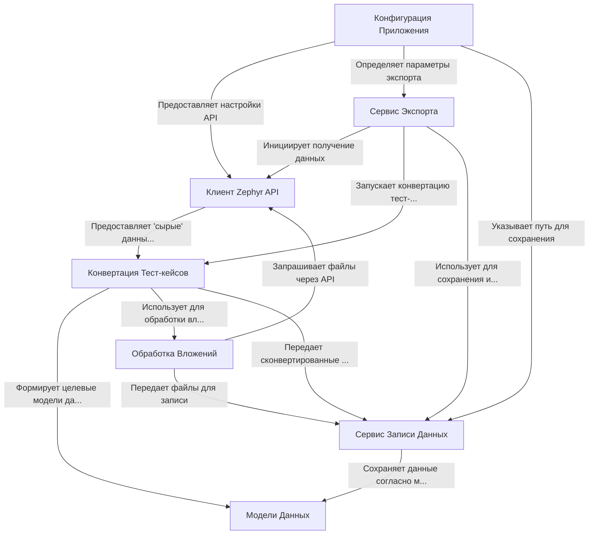

# Tutorial: ZephyrScaleServerExporter

Это **инструмент**, который *автоматически* выгружает данные о тест-кейсах из системы **Zephyr Scale Server** (версия для Jira Server/Data Center).
Он подключается к Zephyr, забирает информацию о проекте, тест-кейсах, шагах, вложениях, и других деталях.
Затем он преобразует эти данные в специальный **JSON-формат**, который потом можно импортировать в другую систему управления тестированием, например, **Test IT**.
Проект умеет обрабатывать *вложения* (картинки, файлы) и сохранять их вместе с основной информацией.

**Source Repository:** [None](None)

## Chapters

1. [Конфигурация Приложения
](01_конфигурация_приложения_.md)
2. [Сервис Экспорта
](02_сервис_экспорта_.md)
3. [Клиент Zephyr API
](03_клиент_zephyr_api_.md)
4. [Модели Данных
](04_модели_данных_.md)
5. [Конвертация Тест-кейсов
](05_конвертация_тест_кейсов_.md)
6. [Обработка Вложений
](06_обработка_вложений_.md)
7. [Сервис Записи Данных
](07_сервис_записи_данных_.md)

---

Generated by [AI Codebase Knowledge Builder](https://github.com/The-Pocket/Tutorial-Codebase-Knowledge)