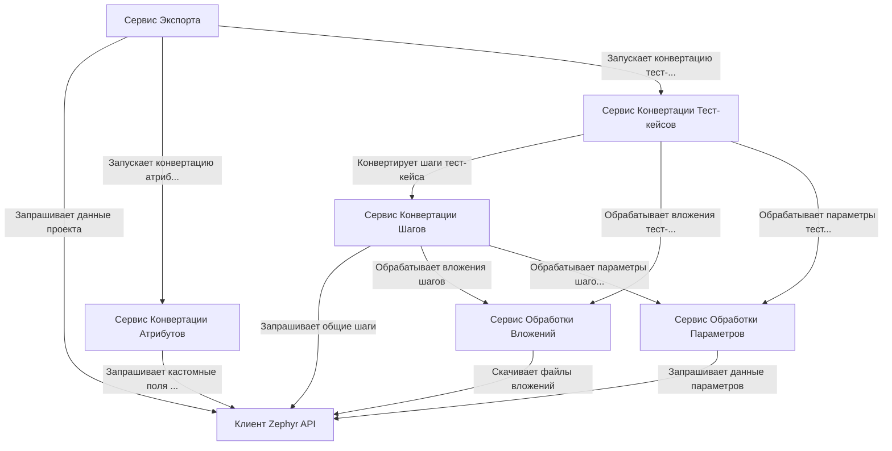

# Tutorial: ZephyrScaleServerExporter

Этот проект представляет собой *экспортер* данных из **Zephyr Scale Server** в определенный JSON формат.
Основная задача - получить все *тест-кейсы* проекта, включая их *шаги*, *атрибуты*, *параметры* и *вложения*, и преобразовать их для последующего импорта в другую систему.
**Сервис Экспорта** выступает главным координатором, вызывая другие сервисы для получения данных из Zephyr через **Клиент API** и их последующей конвертации.

**Source Repository:** [None](None)

## Chapters

1. [Сервис Экспорта](01_сервис_экспорта.md)
2. [Клиент Zephyr API](02_клиент_zephyr_api.md)
3. [Сервис Конвертации Атрибутов](03_сервис_конвертации_атрибутов.md)
4. [Сервис Конвертации Тест-кейсов](04_сервис_конвертации_тест_кейсов.md)
5. [Сервис Конвертации Шагов](05_сервис_конвертации_шагов.md)
6. [Сервис Обработки Вложений](06_сервис_обработки_вложений.md)
7. [Сервис Обработки Параметров](07_сервис_обработки_параметров.md)

---

Generated by [AI Codebase Knowledge Builder](https://github.com/The-Pocket/Tutorial-Codebase-Knowledge)