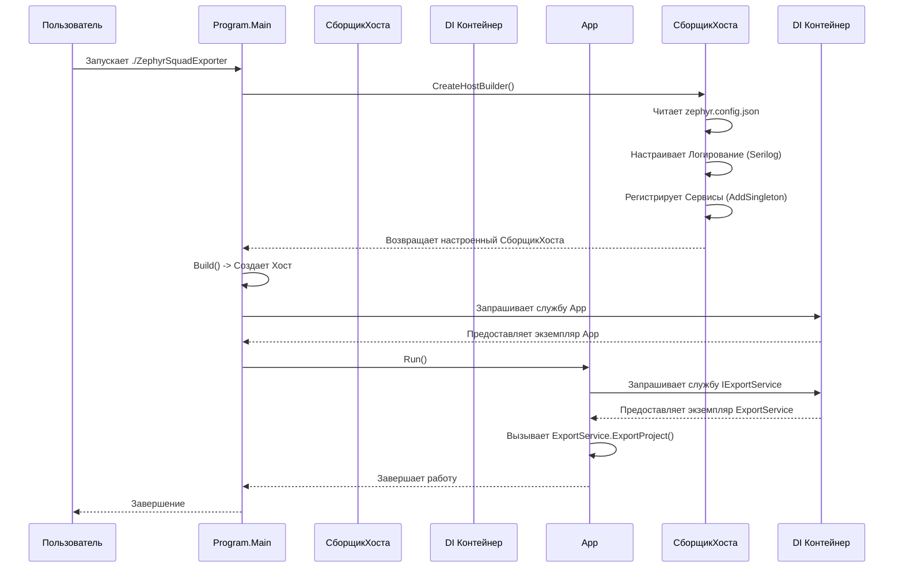

# Chapter 1: Запуск и Конфигурация Приложения


Добро пожаловать в руководство по `ZephyrSquadExporter`! Эта утилита поможет вам перенести ваши тест-кейсы из Zephyr Squad. В этой первой главе мы разберемся, как запустить приложение и как оно настраивается перед началом работы.

Представьте, что вы собираетесь в поездку на автомобиле. Прежде чем тронуться с места, вам нужно вставить ключ зажигания, убедиться, что в баке достаточно топлива, и, возможно, настроить GPS. `ZephyrSquadExporter` работает похожим образом: перед тем, как начать экспорт данных, ему нужна начальная настройка. Эта глава посвящена именно этому первому шагу.

## Зачем нужна конфигурация?

Основная задача `ZephyrSquadExporter` — подключиться к вашему Zephyr Squad, найти нужный проект и выгрузить из него тест-кейсы. Чтобы это сделать, приложению нужно знать:

1.  **Куда подключаться?** (Адрес вашего Zephyr API)
2.  **Как авторизоваться?** (Ваши ключи доступа)
3.  **Какой проект экспортировать?** (ID или имя проекта)
4.  **Куда сохранить результаты?** (Папка на вашем компьютере)

Без этой информации приложение просто не будет знать, что делать. Процесс запуска и конфигурации как раз и решает эту задачу: он считывает все необходимые настройки и подготавливает все компоненты приложения к работе.

## Ключевые Компоненты Запуска

Давайте рассмотрим основные части, отвечающие за старт и настройку:

1.  **`Program.cs`**: Это самая первая точка входа в приложение, как ключ в замке зажигания. Когда вы запускаете `ZephyrSquadExporter`, именно код в этом файле начинает выполняться первым. Его главная задача — прочитать конфигурацию, настроить "внутренние механизмы" (сервисы) и передать управление дальше.
2.  **`zephyr.config.json`**: Это ваш "путевой лист" или "файл настроек". Здесь вы указываете всю важную информацию: адрес сервера Zephyr, ваши ключи доступа, ID проекта и путь для сохранения результатов. Приложение читает этот файл при старте.
3.  **Dependency Injection (Внедрение Зависимостей)**: Звучит сложно, но представьте это как сборку конструктора Lego. У нас есть разные кубики (сервисы): один для общения с Zephyr API ([Клиент Zephyr API](03_клиент_zephyr_api_.md)), другой для работы с папками ([Сервис Папок и Циклов](06_сервис_папок_и_циклов_.md)), третий для тест-кейсов ([Сервис Тест-кейсов](07_сервис_тест_кейсов_.md)) и так далее. Dependency Injection (DI) — это механизм, который автоматически "соединяет" эти кубики вместе в `Program.cs`, чтобы они могли работать сообща. Нам не нужно вручную передавать один сервис другому — система делает это за нас.
4.  **Логирование (Logging)**: Это "бортовой журнал" приложения. Во время работы `ZephyrSquadExporter` записывает информацию о том, что происходит: начало работы, успешное выполнение шагов, возможные ошибки. Эти записи (логи) помогают понять, как идет процесс и что делать, если что-то пошло не так. Логирование настраивается тоже в `Program.cs`.
5.  **`App.cs`**: Если `Program.cs` — это запуск двигателя, то `App.cs` — это "водитель", который нажимает на педаль газа. После того как вся подготовка в `Program.cs` завершена, он получает уже готовые к работе сервисы и запускает основной процесс экспорта, вызывая главный сервис [Процесс Экспорта Проекта](02_процесс_экспорта_проекта_.md).

Аналогия с Аэропортом:
*   `Program.cs`: Диспетчерская вышка.
*   `zephyr.config.json`: План полета (куда лететь, какой рейс).
*   Dependency Injection: Подготовка экипажа и наземных служб (сервисов).
*   Логирование: Запись переговоров и параметров полета.
*   `App.cs`: Команда диспетчера на взлет.

## Как Использовать: Настройка и Запуск

Чтобы запустить экспорт, вам нужно выполнить два простых шага:

**Шаг 1: Настройте `zephyr.config.json`**

Этот файл должен лежать в той же папке, где находится исполняемый файл `ZephyrSquadExporter`. Откройте его в текстовом редакторе и заполните своими данными.

Вот пример структуры файла:

```json
{
  "resultPath" : "/Users/user01/Documents/importer", // 1. Куда сохранить результат
  "zephyr" : {
    "url" : "https://prod-api.zephyr4jiracloud.com/", // 2. URL Zephyr API
    "accessKey" : "ВАШ_ACCESS_KEY", // 3. Ваш Access Key
    "secretKey" : "ВАШ_SECRET_KEY", // 4. Ваш Secret Key
    "accountId" : "ВАШ_ACCOUNT_ID", // 5. Ваш Account ID
    "projectId" : 10000, // 6. ID вашего проекта в Zephyr
    "projectName": "ИмяВашегоПроекта" // 7. Имя проекта (для папки с результатами)
  }
}
```

*   **`resultPath`**: Укажите полный путь к папке на вашем компьютере, куда будут сохранены экспортированные данные (в формате JSON). Убедитесь, что папка существует или что у приложения есть права на ее создание.
*   **`zephyr.url`**: URL-адрес API Zephyr Squad. Обычно он стандартный, как в примере.
*   **`zephyr.accessKey`**, **`zephyr.secretKey`**, **`zephyr.accountId`**: Ваши учетные данные для доступа к Zephyr API. Вы можете сгенерировать их в настройках Zephyr Squad в Jira (см. [документацию SmartBear по API ключам](https://support.smartbear.com/zephyr-squad-cloud/docs/api/api-keys.html)).
*   **`zephyr.projectId`**: Числовой идентификатор проекта в Jira/Zephyr, из которого вы хотите экспортировать тесты.
*   **`zephyr.projectName`**: Название вашего проекта. Оно будет использовано для создания подпапки внутри `resultPath`.

**Шаг 2: Запустите приложение**

После того как вы сохранили `zephyr.config.json` с вашими настройками, откройте терминал (командную строку) в той же папке и выполните команду:

*   Для Linux/macOS:
    ```bash
    # Сначала дайте файлу права на выполнение (только один раз)
    chmod +x ./ZephyrSquadExporter
    # Затем запустите
    ./ZephyrSquadExporter
    ```
*   Для Windows:
    ```bash
    .\ZephyrSquadExporter.exe
    ```

Приложение запустится, прочитает ваш `zephyr.config.json`, настроит все необходимое и начнет процесс экспорта. Вы увидите сообщения о ходе выполнения в консоли (благодаря настроенному логированию). Результаты будут сохранены в папку, указанную в `resultPath`.

```
# Пример вывода в консоли
INFO [10/27/2023 10:00:00 AM +00:00] Starting application
INFO [10/27/2023 10:00:01 AM +00:00] Starting export project ProjectName (10000)...
INFO [10/27/2023 10:00:05 AM +00:00] Found 5 folders
INFO [10/27/2023 10:00:15 AM +00:00] Exported 50 test cases
INFO [10/27/2023 10:00:20 AM +00:00] Export completed successfully. Results saved to /Users/user01/Documents/importer/ProjectName
INFO [10/27/2023 10:00:20 AM +00:00] Ending application
```

## Под Капотом: Как Это Работает?

Давайте кратко заглянем внутрь и посмотрим, что происходит при запуске.

**Пошаговый процесс:**

1.  Вы запускаете `ZephyrSquadExporter`.
2.  Операционная система вызывает метод `Main` в файле `Program.cs`.
3.  `Program.Main` вызывает `CreateHostBuilder`. Этот метод делает несколько важных вещей:
    *   Настраивает чтение конфигурации, включая наш `zephyr.config.json`.
    *   Настраивает систему логирования (Serilog), чтобы писать сообщения в консоль и в файл `logs/log.txt`.
    *   Регистрирует все "кубики Lego" (сервисы) в контейнере Dependency Injection. Он говорит системе: "Если кому-то понадобится `IExportService`, дай ему экземпляр `ExportService`. Если нужен `IClient`, дай `Client`." И так для всех сервисов.
4.  `Program.Main` "строит" хост (`Build()`) — это готовое к работе приложение со всеми настроенными сервисами.
5.  Затем он запрашивает у DI-контейнера главный сервис `App`.
6.  Вызывается метод `App.Run()`.
7.  `App.Run()` запрашивает у DI-контейнера сервис `IExportService` (который уже готов к работе благодаря настройке в `Program.cs`).
8.  `App.Run()` вызывает метод `ExportProject()` у сервиса экспорта, и основной процесс начинается. Детали этого процесса мы рассмотрим в [Главе 2: Процесс Экспорта Проекта](02_процесс_экспорта_проекта_.md).
9.  После завершения экспорта `App.Run()` завершает свою работу, и приложение закрывается.

**Диаграмма последовательности:**



**Ключевые фрагменты кода:**

1.  **`Program.Main` (в `Program.cs`)**: Точка входа. Создает хост, получает сервис `App` и запускает его.

    ```csharp
    // Program.cs
    internal class Program
    {
        static void Main(string[] args)
        {
            // 1. Создаем и настраиваем хост (внутри вызывается CreateHostBuilder)
            using var host = CreateHostBuilder(args).Build();
            // 2. Создаем "область видимости" для сервисов
            using var scope = host.Services.CreateScope();

            var services = scope.ServiceProvider; // DI Контейнер

            try
            {
                // 3. Получаем главный сервис App и запускаем его
                services.GetRequiredService<App>().Run(args);
            }
            catch (Exception e)
            {
                // Если что-то пошло не так, выводим ошибку
                Console.WriteLine($"Критическая ошибка: {e.Message}");
            }
        }
        // ... остальной код ...
    }
    ```
    *Объяснение:* Этот код — дирижер оркестра. Он инициирует всю подготовку (`CreateHostBuilder().Build()`) и затем дает команду главному исполнителю (`App.Run()`).

2.  **Чтение конфигурации (в `Program.cs`)**: Метод `SetupConfiguration` отвечает за поиск и чтение файла `zephyr.config.json`.

    ```csharp
    // Program.cs
    private static IConfiguration SetupConfiguration()
    {
        return new ConfigurationBuilder()
            // Указываем, что файл конфигурации ищем в текущей папке
            .SetBasePath(Directory.GetCurrentDirectory())
            // Имя файла - zephyr.config.json
            .AddJsonFile("zephyr.config.json")
            // Также можно переопределить настройки через переменные окружения
            .AddEnvironmentVariables()
            .Build(); // Собираем конфигурацию
    }
    ```
    *Объяснение:* Этот небольшой метод просто говорит приложению: "Ищи файл `zephyr.config.json` в папке, откуда меня запустили, и загрузи из него настройки".

3.  **Регистрация Сервисов (в `Program.cs` внутри `CreateHostBuilder`)**: Здесь мы "знакомим" систему DI со всеми нашими сервисами-"кубиками".

    ```csharp
    // Program.cs -> CreateHostBuilder
    .ConfigureServices((_, services) =>
    {
        // Регистрируем главный класс приложения App
        services.AddSingleton<App>();
        // Регистрируем конфигурацию, которую прочитали ранее
        services.AddSingleton(SetupConfiguration());
        // Регистрируем сервис для управления токенами API
        services.AddSingleton<TokenManager>();
        // Регистрируем сервис для общения с Zephyr API
        services.AddSingleton<IClient, Client.Client>(); // Глава 3
        // Регистрируем главный сервис экспорта
        services.AddSingleton<IExportService, ExportService>(); // Глава 2
        // Регистрируем сервисы для конкретных сущностей Zephyr
        services.AddSingleton<IFolderService, FolderService>(); // Глава 6
        services.AddSingleton<IStepService, StepService>(); // Глава 8
        services.AddSingleton<ITestCaseService, TestCaseService>(); // Глава 7
        // Сервис для записи результатов в JSON файлы
        services.AddSingleton<IWriteService, WriteService>();
        // Сервис для работы с вложениями
        services.AddSingleton<IAttachmentService, AttachmentService>(); // Глава 9
    })
    ```
    *Объяснение:* Каждая строчка `services.AddSingleton<...>` говорит: "Создай один экземпляр этого класса (или класса, реализующего этот интерфейс) и используй его каждый раз, когда кто-то попросит". Это и есть магия Dependency Injection – сборка приложения из готовых частей. Мы будем подробно разбирать каждый из этих сервисов в следующих главах.

4.  **Запуск Основной Логики (в `App.cs`)**: Класс `App` получает нужные сервисы (в данном случае `IExportService`) через конструктор (DI подставляет их автоматически) и вызывает главный метод.

    ```csharp
    // App.cs
    public class App
    {
        private readonly ILogger<App> _logger;
        private readonly IExportService _exportService; // Получаем сервис экспорта

        // Конструктор, куда DI передает готовые сервисы
        public App(ILogger<App> logger,  IExportService exportService)
        {
            _logger = logger;
            _exportService = exportService; // Сохраняем сервис
        }

        public void Run(string[] args)
        {
            _logger.LogInformation("Запуск приложения"); // Записываем в лог

            // Вызываем главный метод сервиса экспорта
            _exportService.ExportProject().Wait(); // Ждем завершения

            _logger.LogInformation("Завершение приложения"); // Записываем в лог
        }
    }
    ```
    *Объяснение:* Класс `App` — это простой координатор. Он получает уже настроенный `IExportService` и говорит ему: "Начинай экспорт!". Детали того, что происходит внутри `ExportProject()`, мы рассмотрим в следующей главе.

## Заключение

В этой главе мы познакомились с самой первой фазой работы `ZephyrSquadExporter` — запуском и конфигурацией. Мы увидели, как важен файл `zephyr.config.json` для указания всех необходимых параметров, и как классы `Program` и `App` организуют подготовку и старт основного процесса. Мы также узнали о роли Dependency Injection в "сборке" приложения из сервисов и о важности логирования для отслеживания работы.

Теперь, когда мы понимаем, как приложение запускается и настраивается, мы готовы погрузиться в сам процесс экспорта.

**Следующий шаг:** Давайте подробно разберем, что происходит, когда `App` вызывает `ExportProject`. Переходим к [Главе 2: Процесс Экспорта Проекта](02_процесс_экспорта_проекта_.md).

---

Generated by [AI Codebase Knowledge Builder](https://github.com/The-Pocket/Tutorial-Codebase-Knowledge)