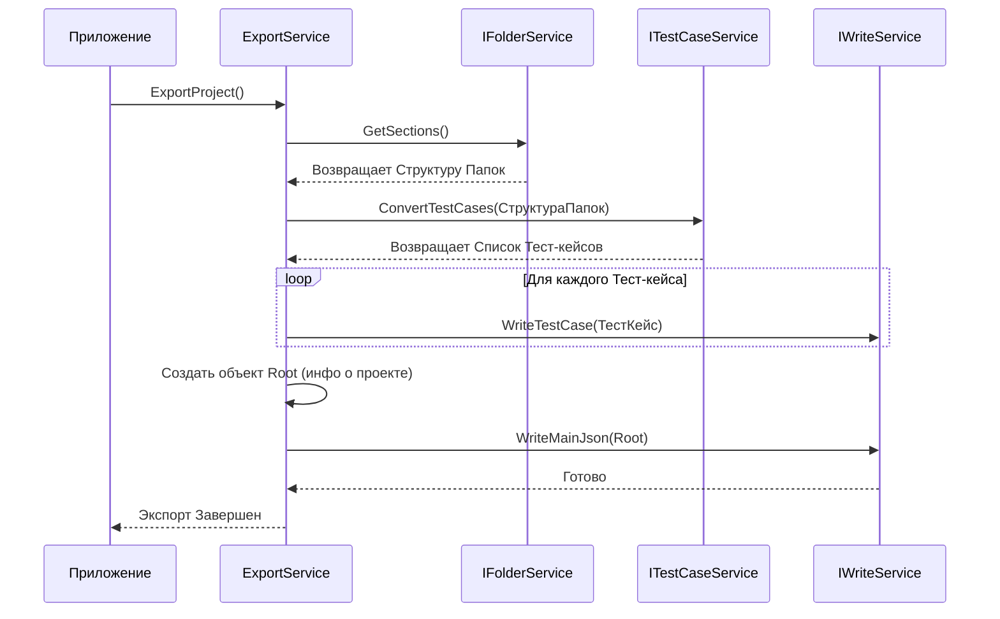

# Chapter 2: Процесс Экспорта Проекта


В [предыдущей главе: Запуск и Конфигурация Приложения](01_запуск_и_конфигурация_приложения_.md) мы разобрались, как подготовить и запустить `ZephyrSquadExporter`. Мы узнали, что после всех настроек класс `App` вызывает главный сервис для начала работы. Теперь давайте погрузимся в сердце этого процесса — `ExportService`, который отвечает за координацию всего экспорта.

## Зачем нужен Координатор Экспорта?

Представьте, что вы организуете переезд. У вас есть много задач: упаковать вещи по комнатам (папкам), составить список всех коробок (тест-кейсов), погрузить их в машину и доставить на новое место (записать в файлы). Вы вряд ли будете делать всё в одиночку. Скорее всего, вы будете руководить процессом: скажете одним помощникам упаковать спальню, другим — кухню, а затем проконтролируете погрузку.

`ExportService` в `ZephyrSquadExporter` — это как раз такой организатор или "менеджер переезда". Его главная задача — не выполнять всю работу самому, а **координировать** действия других специализированных сервисов, чтобы шаг за шагом собрать все необходимые данные из Zephyr и сохранить их в нужном формате.

Он решает проблему **организации сложного процесса**: экспорт данных включает в себя множество шагов (получить папки, получить тесты, получить шаги, сохранить файлы), и `ExportService` следит за тем, чтобы все шаги выполнялись в правильном порядке и с нужными данными.

**Аналогия с Шеф-поваром:**

Как уже упоминалось, `ExportService` похож на шеф-повара на кухне:
*   Он не нарезает овощи сам и не стоит у плиты постоянно.
*   Он дает указания:
    *   "Повару по папкам" ([Сервис Папок и Циклов](06_сервис_папок_и_циклов_.md)): "Принеси мне структуру всех папок и циклов из холодильника Zephyr".
    *   "Повару по тест-кейсам" ([Сервис Тест-кейсов](07_сервис_тест_кейсов_.md)): "Теперь, используя эту структуру папок, приготовь все тест-кейсы, не забудь шаги и вложения".
    *   "Помощнику по сервировке" (`IWriteService`): "Аккуратно разложи все готовые блюда (данные) по тарелкам (JSON файлам) и поставь на стол (сохрани в папку)".

## Ключевые Задачи `ExportService`

`ExportService` делегирует работу нескольким другим компонентам:

1.  **Получение Структуры Папок:** Сначала нужно понять, как организованы тест-кейсы в Zephyr. `ExportService` просит [Сервис Папок и Циклов](06_сервис_папок_и_циклов_.md) получить эту информацию. Это как получить план здания перед тем, как начать выносить мебель.
2.  **Получение Тест-кейсов:** Зная структуру папок, `ExportService` поручает [Сервису Тест-кейсов](07_сервис_тест_кейсов_.md) извлечь все детали каждого тест-кейса, включая его шаги и вложения. Этот сервис, в свою очередь, может использовать другие, более мелкие сервисы ([Сервис Шагов Тест-кейса](08_сервис_шагов_тест_кейса_.md), [Сервис Вложений](09_сервис_вложений_.md)).
3.  **Запись Результатов:** Когда все данные собраны, `ExportService` передает их специальному сервису `IWriteService`. Этот сервис отвечает за преобразование собранных данных в формат JSON и сохранение их в файлы на вашем диске: отдельный файл для каждого тест-кейса и один главный файл `root.json` со структурой проекта.

## Как это используется?

Важно понимать: вам, как пользователю, **не нужно напрямую вызывать `ExportService`**. Его работа начинается автоматически после того, как вы настроили `zephyr.config.json` и запустили приложение. Класс `App`, как мы видели в [Главе 1](01_запуск_и_конфигурация_приложения_.md), получает экземпляр `ExportService` благодаря Dependency Injection и вызывает его единственный публичный метод `ExportProject()`.

*   **Входы:**
    *   Конфигурация из `zephyr.config.json` (неявно, через DI).
    *   Данные, полученные от других сервисов ([IFolderService](06_сервис_папок_и_циклов_.md), [ITestCaseService](07_сервис_тест_кейсов_.md)).
*   **Выходы:**
    *   Сообщения в лог о ходе процесса.
    *   Созданные JSON файлы в папке, указанной в `resultPath` в конфигурации. Эти файлы содержат всю экспортированную информацию о проекте.

## Под Капотом: Как Происходит Экспорт?

Давайте представим пошаговый путь выполнения, когда `App` вызывает `ExportService.ExportProject()`:

1.  **Начало:** `ExportService` получает команду начать экспорт. Он логирует сообщение "Exporting project".
2.  **Запрос Папок:** Он обращается к `_folderService` и вызывает его метод `GetSections()`.
    *   `IFolderService` идет в Zephyr (используя [Клиент Zephyr API](03_клиент_zephyr_api_.md)) и возвращает полную структуру папок и циклов проекта.
3.  **Запрос Тест-кейсов:** `ExportService` получает структуру папок и передает ее `_testCaseService`, вызывая метод `ConvertTestCases()`.
    *   `ITestCaseService` (возможно, с помощью [IStepService](08_сервис_шагов_тест_кейса_.md) и [IAttachmentService](09_сервис_вложений_.md)) получает все тест-кейсы, их шаги и информацию о вложениях для каждой папки, полученной на шаге 2. Он преобразует их во внутренний формат ([Модели Данных Zephyr](05_модели_данных_zephyr_.md)) и возвращает список готовых тест-кейсов.
4.  **Запись Тест-кейсов:** `ExportService` берет полученный список тест-кейсов и для каждого из них вызывает метод `_writeService.WriteTestCase()`.
    *   `IWriteService` создает отдельный JSON файл для каждого тест-кейса и сохраняет его в целевую папку.
5.  **Формирование `root.json`:** `ExportService` собирает итоговую информацию: имя проекта, список ID всех экспортированных тест-кейсов, структуру папок (полученную на шаге 2) и другую метаинформацию. Он создает объект `Root`.
6.  **Запись `root.json`:** `ExportService` вызывает метод `_writeService.WriteMainJson()`, передавая ему объект `Root`.
    *   `IWriteService` создает главный файл `root.json`, описывающий весь проект, и сохраняет его.
7.  **Завершение:** `ExportService` логирует сообщение "Exporting project complete". Работа завершена.

**Диаграмма Последовательности (Упрощенная):**



## Погружение в Код

Давайте посмотрим на ключевые части кода `ExportService`.

**1. Конструктор (`Services/ExportService.cs`)**

```csharp
// Services/ExportService.cs
public class ExportService : IExportService
{
    private readonly ILogger<ExportService> _logger; // Для записи логов
    private readonly IFolderService _folderService; // Сервис для работы с папками
    private readonly ITestCaseService _testCaseService; // Сервис для работы с тест-кейсами
    private readonly IWriteService _writeService; // Сервис для записи файлов
    private readonly string _projectName; // Имя проекта из конфигурации

    // Конструктор, куда DI передает нужные сервисы
    public ExportService(ILogger<ExportService> logger, IFolderService folderService,
        ITestCaseService testCaseService, IWriteService writeService, IConfiguration configuration)
    {
        _logger = logger;
        _folderService = folderService;     // Сохраняем сервис папок
        _testCaseService = testCaseService; // Сохраняем сервис тест-кейсов
        _writeService = writeService;     // Сохраняем сервис записи

        // Получаем имя проекта из конфигурации (zephyr.config.json)
        var section = configuration.GetSection("zephyr");
        var projectName = section["projectName"];
        if (string.IsNullOrEmpty(projectName))
        {
            throw new ArgumentException("Не указано имя проекта в конфигурации!");
        }

        _projectName = projectName;
    }
    // ... метод ExportProject() ниже ...
}
```

*   **Объяснение:** Конструктор получает все необходимые "инструменты" (сервисы `IFolderService`, `ITestCaseService`, `IWriteService`) и настройки (`IConfiguration`) благодаря Dependency Injection (DI), настроенному в `Program.cs`. Он сохраняет эти инструменты в приватных полях, чтобы использовать их позже. Он также извлекает имя проекта из конфигурации для использования при создании файла `root.json`.

**2. Метод `ExportProject` (`Services/ExportService.cs`)**

```csharp
// Services/ExportService.cs (продолжение)
public async Task ExportProject()
{
    _logger.LogInformation("Начинаем экспорт проекта...");

    // --- Шаг 1: Получить структуру папок ---
    // Обращаемся к Сервису Папок
    var sections = await _folderService.GetSections();
    _logger.LogInformation($"Найдено {sections.Sections.Count} корневых папок/циклов.");

    // --- Шаг 2: Получить и конвертировать тест-кейсы ---
    // Передаем структуру папок Сервису Тест-кейсов
    var testCases = await _testCaseService.ConvertTestCases(sections.SectionMap);
    _logger.LogInformation($"Конвертировано {testCases.Count} тест-кейсов.");

    // --- Шаг 3: Записать каждый тест-кейс в отдельный файл ---
    _logger.LogInformation("Начинаем запись тест-кейсов в файлы...");
    foreach (var testCase in testCases)
    {
        // Передаем каждый тест-кейс Сервису Записи
        await _writeService.WriteTestCase(testCase);
    }
    _logger.LogInformation("Запись отдельных файлов тест-кейсов завершена.");

    // --- Шаг 4: Создать и записать главный файл root.json ---
    _logger.LogInformation("Создание файла root.json...");
    var root = new Root // Создаем объект с общей информацией
    {
        ProjectName = _projectName,             // Имя проекта
        TestCases = testCases.Select(t => t.Id).ToList(), // Список ID всех тест-кейсов
        SharedSteps = new List<Guid>(),         // (Пока не используется)
        Attributes = new List<Attribute>(),     // (Пока не используется)
        Sections = sections.Sections            // Структура папок
    };

    // Передаем объект Root Сервису Записи
    await _writeService.WriteMainJson(root);
    _logger.LogInformation("Файл root.json успешно записан.");

    _logger.LogInformation("Экспорт проекта успешно завершен!");
}
```

*   **Объяснение:** Этот метод четко следует шагам, описанным ранее. Он вызывает `_folderService`, затем `_testCaseService`, потом в цикле `_writeService.WriteTestCase` для каждого тест-кейса, и в конце собирает объект `Root` и вызывает `_writeService.WriteMainJson`. Обратите внимание на использование `_logger` для информирования пользователя о прогрессе. Ключевое слово `await` используется потому, что операции получения данных из Zephyr и записи файлов могут занимать время (это асинхронные операции).

## Заключение

В этой главе мы рассмотрели `ExportService` — главного координатора процесса экспорта в `ZephyrSquadExporter`. Мы узнали, что он не выполняет всю работу сам, а действует как менеджер или шеф-повар, делегируя задачи специализированным сервисам:
*   [IFolderService](06_сервис_папок_и_циклов_.md) для получения структуры папок.
*   [ITestCaseService](07_сервис_тест_кейсов_.md) для извлечения тест-кейсов.
*   `IWriteService` для сохранения результатов в JSON файлы.

Мы увидели, как `ExportService` orchestrates (организует) эти шаги в методе `ExportProject`, чтобы в итоге получить полный экспорт данных проекта из Zephyr.

Теперь, когда мы понимаем общую картину экспорта, самое время разобраться, как наше приложение взаимодействует с самим Zephyr. Как оно отправляет запросы и получает ответы?

**Следующий шаг:** Давайте изучим компонент, отвечающий за все коммуникации с Zephyr API. Переходим к [Главе 3: Клиент Zephyr API](03_клиент_zephyr_api_.md).

---

Generated by [AI Codebase Knowledge Builder](https://github.com/The-Pocket/Tutorial-Codebase-Knowledge)