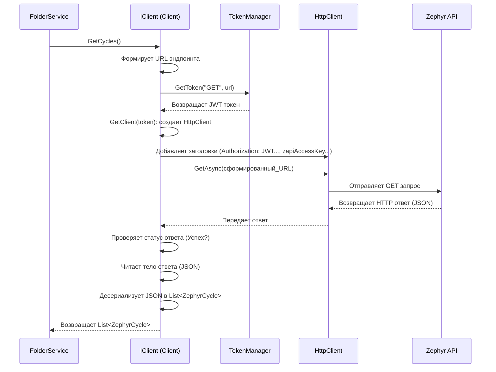

# Chapter 3: Клиент Zephyr API


В [предыдущей главе: Процесс Экспорта Проекта](02_процесс_экспорта_проекта_.md) мы увидели, как `ExportService` координирует весь процесс выгрузки данных, взаимодействуя с другими сервисами. Но как именно эти сервисы получают информацию из самого Zephyr Squad? Чтобы общаться с внешним миром (в нашем случае, с серверами Zephyr), нам нужен специальный компонент. В этой главе мы познакомимся с **Клиентом Zephyr API**.

## Проблема: Как "поговорить" с Zephyr?

Представьте, что наше приложение `ZephyrSquadExporter` хочет получить список всех циклов тестирования из вашего проекта в Zephyr. Приложение не может просто "пойти и взять" их. Ему нужно связаться с сервером Zephyr через Интернет, объяснить, что ему нужно, и получить ответ. Это похоже на звонок в службу поддержки или заказ товара онлайн.

Сервис Zephyr Squad предоставляет специальный **API** (Application Programming Interface) — это как "меню" или набор правил, по которым другие программы могут с ним общаться. Чтобы получить данные, наше приложение должно:

1.  Знать "адрес" нужного сервиса Zephyr API (его URL).
2.  Сформировать правильный запрос (например, "GET cycles for project X").
3.  Подтвердить, что у него есть право доступа (предъявить "пропуск" или токен).
4.  Отправить этот запрос по сети.
5.  Получить ответ от Zephyr (обычно в формате JSON) и понять его.

Делать все это вручную в каждом сервисе (для папок, для тест-кейсов) было бы сложно и привело бы к повторению кода. Вот тут-то и приходит на помощь **Клиент Zephyr API**.

## Решение: Клиент Zephyr API - Наш "Курьер" и "Переводчик"

**Клиент Zephyr API** (`Client` в коде) — это компонент, который берет на себя всю работу по общению с Zephyr API. Он инкапсулирует (прячет внутри себя) все детали этого взаимодействия.

Можно представить его как **курьера** или **переводчика**:

*   Другие сервисы (например, [Сервис Папок и Циклов](06_сервис_папок_и_циклов_.md)) дают ему задание: "Принеси список циклов для проекта 10000".
*   Клиент знает, куда идти (базовый URL Zephyr API из файла `zephyr.config.json`).
*   Он знает, как правильно сформулировать запрос к нужному "отделу" Zephyr (конкретный эндпоинт API, например, `/public/rest/api/1.0/cycles/search`).
*   Он получает "пропуск" (токен аутентификации) у [Менеджера Токенов Доступа](04_менеджер_токенов_доступа_.md), чтобы доказать свое право на доступ.
*   Он отправляет запрос, используя стандартные веб-технологии (HTTP GET-запросы).
*   Он получает ответ от Zephyr (в виде JSON-строки).
*   Он "переводит" этот ответ в понятный для других частей приложения формат (в объекты C#, такие как `List<ZephyrCycle>`, которые разбираются в главе [Модели Данных Zephyr](05_модели_данных_zephyr_.md)).
*   Наконец, он доставляет результат обратно тому сервису, который его просил.

Таким образом, клиент API упрощает работу других сервисов: им не нужно знать тонкости протокола HTTP, форматы URL Zephyr или детали аутентификации — они просто просят клиента "Дай мне вот эти данные".

## Ключевые Концепции

Чтобы понять, как работает клиент API, разберем несколько основных идей:

1.  **API (Application Programming Interface)**: Набор правил и инструментов, по которым программы общаются друг с другом. API Zephyr Squad определяет, какие запросы можно делать, чтобы получить информацию (например, о циклах, папках, тестах) или выполнить действия. Похоже на меню в ресторане: оно говорит, какие блюда (данные) можно заказать и как это сделать (какой запрос отправить).
2.  **HTTP Запросы (HTTP Requests)**: Стандартный способ обмена информацией в вебе. Когда вы открываете сайт в браузере, он отправляет HTTP GET-запрос к серверу. Наш клиент использует такие же GET-запросы, чтобы *получить* данные от Zephyr API.
3.  **Эндпоинты (Endpoints)**: Это конкретные URL-адреса внутри API, каждый из которых отвечает за определенную операцию или тип данных. Например:
    *   URL для получения циклов: `/public/rest/api/1.0/cycles/search?...`
    *   URL для получения папок внутри цикла: `/public/rest/api/1.0/folders?...`
    Клиент знает, какой эндпоинт использовать для каждой задачи.
4.  **Аутентификация (Authentication)**: Процесс подтверждения личности. Zephyr API должен знать, кто делает запрос и имеет ли он право на получение данных. Для этого используется:
    *   **Ключи доступа (Access Key, Secret Key)**: Вы указываете их в `zephyr.config.json`. Они как логин и пароль для API.
    *   **JWT (JSON Web Token)**: На основе ключей генерируется временный *токен* — строка символов, которая служит "пропуском". Клиент запрашивает этот токен у [Менеджера Токенов Доступа](04_менеджер_токенов_доступа_.md) и прикрепляет его к каждому запросу в специальном HTTP-заголовке (`Authorization`).
5.  **JSON (JavaScript Object Notation)**: Формат обмена данными, который легко читается и людьми, и машинами. Zephyr API возвращает ответы в виде JSON. Клиент получает этот JSON и преобразует его в объекты C#, с которыми удобно работать в коде.

**Пример JSON ответа (очень упрощенно):**

```json
[
  {
    "id": "123",
    "name": "Цикл регресса v1.0",
    "projectId": 10000
  },
  {
    "id": "456",
    "name": "Цикл нового функционала",
    "projectId": 10000
  }
]
```

Клиент преобразует это в список объектов `ZephyrCycle`.

## Как это используется?

Вам, как пользователю приложения, и даже большинству разработчиков, работающих над другими частями `ZephyrSquadExporter`, **не нужно напрямую использовать `Client`**. Он используется *внутренними* сервисами, такими как `FolderService` или `TestCaseService`.

Эти сервисы получают экземпляр `IClient` через Dependency Injection (помните "сборку Lego" из Главы 1?). `IClient` — это *интерфейс*, который определяет, *что* клиент может делать (например, `GetCycles()`, `GetFolders(...)`), но не говорит, *как* он это делает.

**Пример (концептуальный), как `FolderService` может использовать `IClient`:**

```csharp
// Внутри FolderService (упрощенно)
public class FolderService : IFolderService
{
    private readonly IClient _apiClient; // Получаем клиент через DI

    public FolderService(IClient apiClient)
    {
        _apiClient = apiClient;
    }

    public async Task<SomeFolderStructure> GetSections()
    {
        // 1. Попросить клиента принести список циклов
        List<ZephyrCycle> cycles = await _apiClient.GetCycles();

        // 2. Для каждого цикла попросить клиента принести список папок
        foreach (var cycle in cycles)
        {
            List<ZephyrFolder> folders = await _apiClient.GetFolders(cycle.Id);
            // ... обработать папки ...
        }

        // ... собрать и вернуть структуру папок ...
        return someStructure;
    }
}
```

*   **Входы:** Методы клиента (`GetCycles`, `GetFolders` и др.) могут принимать параметры, уточняющие запрос (например, ID цикла или ID проекта, который клиент знает из конфигурации).
*   **Выходы:** Методы возвращают данные, полученные от Zephyr API, уже преобразованные в удобные C# объекты ([Модели Данных Zephyr](05_модели_данных_zephyr_.md)). Например, `GetCycles()` возвращает `Task<List<ZephyrCycle>>`.

## Под Капотом: Шаги Общения с API

Давайте посмотрим, что происходит внутри клиента, когда, например, `FolderService` вызывает `_apiClient.GetCycles()`:

1.  **Начало запроса:** Метод `GetCycles()` в классе `Client` начинает работу. Он логирует сообщение "Getting cycles".
2.  **Формирование URL:** Клиент строит полный URL-адрес для запроса циклов. Он берет базовый URL (`_baseUrl` из конфига), добавляет часть пути (`/connect`), затем конкретный эндпоинт API (`/public/rest/api/1.0/cycles/search`) и параметры (ID проекта `_projectId` из конфига и `versionId=-1`). Получается что-то вроде: `https://prod-api.zephyr4jiracloud.com/connect/public/rest/api/1.0/cycles/search?projectId=10000&versionId=-1`.
3.  **Получение Токена:** Клиент обращается к `_tokenManager` ([Менеджер Токенов Доступа](04_менеджер_токенов_доступа_.md)) и просит сгенерировать JWT токен для этого конкретного запроса (передавая тип запроса "GET" и относительный URL).
4.  **Подготовка HTTP-клиента:** Клиент вызывает внутренний метод `GetClient(token)`. Этот метод создает объект `HttpClient` (стандартный .NET класс для отправки HTTP-запросов), устанавливает базовый адрес и добавляет необходимые HTTP-заголовки:
    *   `Authorization`: `JWT <сгенерированный_токен>` (Это наш "пропуск")
    *   `zapiAccessKey`: `<ваш_Access_Key>` (Еще одно требование Zephyr API)
    *   `User-Agent`: `ZAPI` (Просто идентификатор)
5.  **Отправка Запроса:** Клиент использует подготовленный `HttpClient` для отправки GET-запроса на сформированный URL (шаг 2). `await client.GetAsync(...)`.
6.  **Проверка Ответа:** Клиент ждет ответа от сервера Zephyr. Когда ответ получен, он проверяет, был ли запрос успешным (код статуса HTTP 200 OK). Если нет (например, 401 Unauthorized - неправильный токен, 404 Not Found - неверный URL, 500 Internal Server Error - проблема на сервере Zephyr), он логирует ошибку и выбрасывает исключение, чтобы остановить процесс экспорта.
7.  **Чтение и Десериализация:** Если ответ успешный, клиент читает тело ответа (которое содержит JSON-строку) с помощью `await response.Content.ReadAsStringAsync()`. Затем он использует `JsonSerializer.Deserialize<List<ZephyrCycle>>(content)` для преобразования этой строки в список объектов `ZephyrCycle` ([Модели Данных Zephyr](05_модели_данных_zephyr_.md)).
8.  **Возврат Результата:** Наконец, клиент возвращает полученный список циклов (`List<ZephyrCycle>`) тому сервису, который его вызвал (`FolderService` в нашем примере).

**Диаграмма Последовательности (Получение циклов):**



## Погружение в Код

Рассмотрим ключевые фрагменты кода клиента.

**1. Интерфейс `IClient` (`Client/IClient.cs`)**

Этот файл определяет "контракт" — какие методы должен предоставлять любой класс, реализующий этот интерфейс. Это позволяет другим сервисам зависеть от абстракции (`IClient`), а не от конкретной реализации (`Client`).

```csharp
// Client/IClient.cs
using ZephyrSquadExporter.Models;

namespace ZephyrSquadExporter.Client;

// Определяет, какие операции может выполнять наш API клиент
public interface IClient
{
    // Получить список всех циклов тестирования
    Task<List<ZephyrCycle>> GetCycles();
    // Получить список папок внутри указанного цикла
    Task<List<ZephyrFolder>> GetFolders(string cycleId);
    // Получить тесты (executions) из цикла
    Task<List<ZephyrExecution>> GetTestCasesFromCycle(string cycleId);
    // Получить тесты (executions) из папки
    Task<List<ZephyrExecution>> GetTestCasesFromFolder(string cycleId, string folderId);
    // Получить шаги для тест-кейса (issue)
    Task<List<ZephyrStep>> GetSteps(string issueId);
    // Получить список вложений для тест-кейса
    Task<List<ZephyrAttachment>> GetAttachmentsFromExecution(string issueId, string entityId);
    // Скачать конкретное вложение в виде байтов
    Task<byte[]> GetAttachmentFromExecution(string issueId, string entityId);
}
```

*   **Объяснение:** Этот интерфейс просто перечисляет методы для получения различных данных из Zephyr API. Использование `Task<...>` указывает, что это асинхронные операции (они могут занять время, т.к. включают сетевые запросы).

**2. Конструктор Класса `Client` (`Client/Client.cs`)**

Здесь класс `Client` получает нужные ему зависимости и настройки при создании.

```csharp
// Client/Client.cs
using Microsoft.Extensions.Configuration;
using Microsoft.Extensions.Logging;
// ... другие using ...

public class Client : IClient // Реализует интерфейс IClient
{
    private readonly ILogger<Client> _logger; // Для логирования
    private readonly TokenManager _tokenManager; // Для получения токенов
    private readonly string _baseUrl; // Базовый URL API (из конфига)
    private readonly string _projectId; // ID проекта (из конфига)
    private readonly string _accessKey; // Ключ доступа (из конфига)

    private const string Section = "/connect"; // Часть пути для всех API запросов

    public Client(ILogger<Client> logger, TokenManager tokenManager, IConfiguration configuration)
    {
        _logger = logger;
        _tokenManager = tokenManager; // Сохраняем TokenManager

        // Читаем настройки из секции "zephyr" файла zephyr.config.json
        var section = configuration.GetSection("zephyr");
        var url = section["url"];
        if (string.IsNullOrEmpty(url)) /* ... проверка ... */
        var projectId = section["projectId"];
        if (string.IsNullOrEmpty(projectId)) /* ... проверка ... */
        var accessKey = section["accessKey"];
        if (string.IsNullOrEmpty(accessKey)) /* ... проверка ... */

        // Сохраняем прочитанные настройки для использования в методах
        _baseUrl = url.TrimEnd('/'); // Убедимся, что нет слеша в конце
        _projectId = projectId;
        _accessKey = accessKey;
    }
     // ... остальные методы клиента ...
}
```

*   **Объяснение:** Конструктор получает логгер, менеджер токенов и конфигурацию через Dependency Injection. Он читает `url`, `projectId` и `accessKey` из конфигурационного файла (`zephyr.config.json`) и сохраняет их в приватных полях для дальнейшего использования при построении запросов.

**3. Пример Метода: `GetCycles` (`Client/Client.cs`)**

Давайте детально посмотрим на один из методов, реализующих общение с API.

```csharp
// Client/Client.cs (продолжение)
using System.Text.Json; // Для работы с JSON

public async Task<List<ZephyrCycle>> GetCycles()
{
    _logger.LogInformation("Получаем циклы..."); // Запись в лог

    // 1. Формируем относительный URL эндпоинта
    var url = $"/public/rest/api/1.0/cycles/search?projectId={_projectId}&versionId=-1";

    // 2. Получаем JWT токен для этого запроса
    var token = _tokenManager.GetToken("GET", url);

    // 3. Создаем и настраиваем HTTP-клиент
    var client = GetClient(token); // Вызываем вспомогательный метод

    // 4. Отправляем GET запрос
    var response = await client.GetAsync(Section + url); // Section = "/connect"

    // 5. Проверяем, успешен ли ответ
    if (!response.IsSuccessStatusCode)
    {
        _logger.LogError($"Ошибка получения циклов. Статус: {response.StatusCode}");
        // ... обработка ошибки, выброс исключения ...
        throw new Exception($"Ошибка получения циклов. Статус: {response.StatusCode}");
    }

    // 6. Читаем тело ответа (JSON)
    var content = await response.Content.ReadAsStringAsync();

    // 7. Преобразуем (десериализуем) JSON в список объектов ZephyrCycle
    var cycles = JsonSerializer.Deserialize<List<ZephyrCycle>>(content);

    _logger.LogDebug($"Найдено {cycles?.Count} циклов."); // Лог (если включен Debug уровень)

    // 8. Возвращаем результат
    return cycles;
}
```

*   **Объяснение:** Этот код точно следует шагам, описанным ранее. Он строит URL, получает токен, настраивает HTTP-клиент (через `GetClient`), отправляет запрос, проверяет ответ, десериализует JSON и возвращает C# объекты.

**4. Вспомогательный Метод: `GetClient` (`Client/Client.cs`)**

Этот приватный метод отвечает за создание и настройку `HttpClient` для каждого запроса.

```csharp
// Client/Client.cs (продолжение)
private HttpClient GetClient(string token)
{
    // Создаем новый экземпляр HttpClient
    var client = new HttpClient();
    // Устанавливаем базовый URL (например, "https://prod-api.zephyr4jiracloud.com/")
    client.BaseAddress = new Uri(_baseUrl);

    // Добавляем необходимые HTTP-заголовки для аутентификации и идентификации
    client.DefaultRequestHeaders.Add("Authorization", "JWT " + token); // Наш пропуск
    client.DefaultRequestHeaders.Add("zapiAccessKey", _accessKey);    // Ключ доступа Zephyr
    client.DefaultRequestHeaders.Add("User-Agent", "ZAPI");           // Имя нашего 'агента'

    return client; // Возвращаем настроенный клиент
}
```

*   **Объяснение:** Метод создает `HttpClient`, задает ему базовый адрес из конфигурации и добавляет три критически важных заголовка: `Authorization` с JWT токеном, `zapiAccessKey` с ключом доступа и `User-Agent`. Без этих заголовков API Zephyr отклонит наши запросы.

## Заключение

В этой главе мы разобрались с **Клиентом Zephyr API** — незаменимым компонентом-посредником, который обрабатывает все детали общения с внешним API Zephyr Squad. Мы узнали, что он:

*   Выполняет роль "курьера", принимая запросы от других сервисов.
*   Знает нужные "адреса" (эндпоинты) и "язык" (HTTP GET-запросы) для общения с Zephyr.
*   Использует "пропуск" (JWT токен) для аутентификации, получая его от [Менеджера Токенов Доступа](04_менеджер_токенов_доступа_.md).
*   "Переводит" ответы Zephyr (JSON) в понятные C# объекты.

Благодаря этому клиенту, остальная часть приложения может не беспокоиться о сложностях сетевого взаимодействия и аутентификации, а просто запрашивать нужные данные.

Мы несколько раз упомянули "пропуск" - JWT токен и `TokenManager`. Как именно генерируется этот токен?

**Следующий шаг:** Давайте погрузимся в механизм аутентификации и разберем работу [Менеджера Токенов Доступа](04_менеджер_токенов_доступа_.md).

---

Generated by [AI Codebase Knowledge Builder](https://github.com/The-Pocket/Tutorial-Codebase-Knowledge)