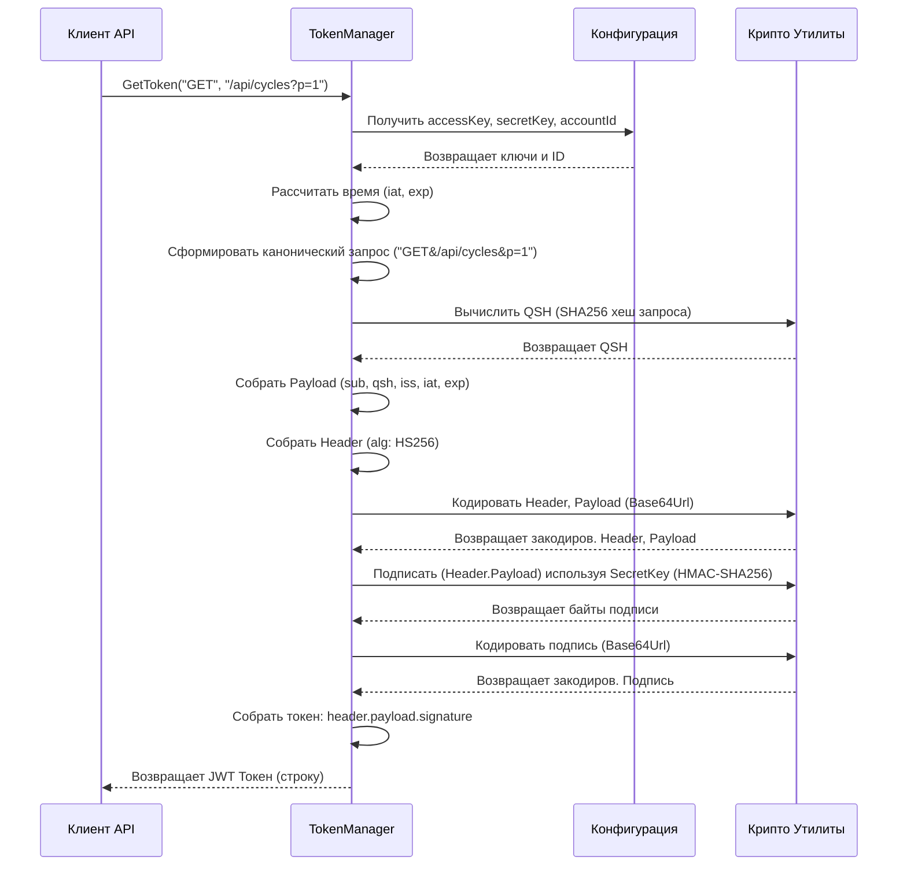

# Chapter 4: Менеджер Токенов Доступа


В [предыдущей главе: Клиент Zephyr API](03_клиент_zephyr_api_.md) мы узнали, как наш `ZephyrSquadExporter` "общается" с серверами Zephyr с помощью специального клиента. Мы упомянули, что для каждого запроса клиент должен предъявлять "пропуск", чтобы доказать свое право на доступ. Этот "пропуск" — не что иное, как временный токен аутентификации. В этой главе мы подробно разберем, как создаются эти токены, и познакомимся с компонентом, который за это отвечает — **Менеджером Токенов Доступа**.

## Проблема: Как безопасно "представиться" API?

Представьте, что вы хотите войти в хорошо охраняемое здание (это наш Zephyr API). Вы же не можете просто так зайти — охрана потребует у вас пропуск. Причем для разных зон может потребоваться разный уровень доступа, и желательно, чтобы ваш пропуск действовал ограниченное время (вдруг вы его потеряете?).

Точно так же, когда наш [Клиент Zephyr API](03_клиент_zephyr_api_.md) хочет получить данные (например, список тест-кейсов), он должен "представиться" серверу Zephyr и доказать, что он имеет право на доступ. Передавать каждый раз ваш логин и пароль (или даже постоянные ключи API) небезопасно. Что если кто-то перехватит запрос? Он получит ваши постоянные учетные данные!

Zephyr Squad API решает эту проблему с помощью **JWT (JSON Web Tokens)**. Это специальные, криптографически подписанные "электронные пропуска", которые:

1.  **Доказывают личность**: Содержат информацию о том, кто сделал запрос (на основе ваших `accessKey` и `accountId`).
2.  **Временные**: Действуют ограниченный срок (например, час). Даже если токен украден, он скоро станет бесполезен.
3.  **Привязаны к запросу**: Конкретный токен подходит только для конкретного действия (например, "получить список папок", но не "удалить проект").
4.  **Защищены от подделки**: Подписаны с использованием вашего `secretKey`, что гарантирует их подлинность.

Процесс создания таких токенов довольно специфичен и требует выполнения строгих правил Zephyr API. Делать это вручную внутри каждого метода [Клиента Zephyr API](03_клиент_zephyr_api_.md) было бы сложно и привело бы к дублированию кода.

## Решение: Менеджер Токенов Доступа (`TokenManager`) - Наш Мастер Ключей

Именно для решения этой задачи существует `TokenManager`. Это специализированный компонент, который отвечает исключительно за генерацию правильных JWT-токенов для аутентификации запросов к Zephyr API.

Думайте о `TokenManager` как о **мастере ключей** в том самом охраняемом здании:

*   У него есть доступ к "сейфу" с вашими главными ключами (`accessKey`, `secretKey`) и вашим ID (`accountId`), которые вы указали в файле `zephyr.config.json`.
*   Когда [Клиент Zephyr API](03_клиент_zephyr_api_.md) собирается "пойти" в определенный "отдел" здания (сделать запрос к конкретному эндпоинту API, например, за списком циклов), он приходит к мастеру ключей.
*   Клиент говорит: "Мне нужно сходить в отдел `/public/rest/api/1.0/cycles/search` методом GET".
*   Мастер ключей (`TokenManager`) берет эту информацию (метод `GET` и URL `/public/rest/api/1.0/cycles/search?projectId=...`), ваши главные ключи и ID, и **создает специальный временный ключ (JWT токен)**.
*   Этот временный ключ подходит только для указанного "отдела" (конкретного запроса API) и действует ограниченное время.
*   Клиент берет этот временный ключ (токен) и предъявляет его "охране" (Zephyr API) при запросе.

Таким образом, `TokenManager` инкапсулирует (скрывает внутри себя) всю сложную логику генерации JWT, предоставляя [Клиенту Zephyr API](03_клиент_zephyr_api_.md) простой способ получить нужный "пропуск" для каждого запроса.

## Ключевые Идеи о JWT в Zephyr

Чтобы лучше понять работу `TokenManager`, давайте кратко разберем, из чего состоит JWT токен, который он генерирует:

1.  **Что такое JWT?** Это строка вида `xxxxx.yyyyy.zzzzz`, где:
    *   `xxxxx` - Заголовок (Header), закодированный в Base64Url. Говорит, как токен подписан (алгоритм).
    *   `yyyyy` - Полезная нагрузка (Payload), закодированная в Base64Url. Содержит "утверждения" (claims) — информацию о токене:
        *   `iss` (Issuer): Кто выдал токен (ваш `accessKey`).
        *   `sub` (Subject): Для кого предназначен токен (ваш `accountId`).
        *   `iat` (Issued At): Когда токен был выдан (текущее время).
        *   `exp` (Expiration Time): Когда токен истекает (обычно `iat` + 1 час).
        *   `qsh` (Query String Hash): **Очень важно!** Это хеш (уникальный отпечаток) самого запроса API (метод + относительный URL + параметры). Именно он привязывает токен к конкретному запросу.
    *   `zzzzz` - Подпись (Signature), закодированная в Base64Url. Создается путем хеширования заголовка и полезной нагрузки с использованием вашего `secretKey`. Гарантирует, что токен не был изменен и выдан именно вами.

2.  **Почему он безопасен?**
    *   **Временный:** Короткий срок жизни (`exp`) ограничивает ущерб, если токен попадет не в те руки.
    *   **Привязан к запросу:** `qsh` не позволяет использовать перехваченный токен для других запросов API.
    *   **Защищен подписью:** `secretKey` известен только вам и API, поэтому никто не может подделать токен или изменить его содержимое без вашего секретного ключа.

## Как это используется?

Вам, как пользователю, или даже разработчику, работающему над другими сервисами (вроде [Сервиса Папок и Циклов](06_сервис_папок_и_циклов_.md)), **не нужно напрямую взаимодействовать с `TokenManager`**.

Он используется исключительно **внутри** [Клиента Zephyr API](03_клиент_zephyr_api_.md). Приложение `ZephyrSquadExporter` автоматически создает один экземпляр `TokenManager` при запуске (благодаря настройке в `Program.cs`, см. [Главу 1](01_запуск_и_конфигурация_приложения_.md)) и передает его клиенту API через Dependency Injection.

Когда клиент API (`Client`) готовится отправить запрос к Zephyr, он вызывает единственный публичный метод `TokenManager` — `GetToken()`, передавая ему детали запроса (метод HTTP и относительный URL). `TokenManager` возвращает готовую строку JWT, которую клиент затем включает в заголовок `Authorization` HTTP-запроса.

*   **Вход для `GetToken(string methodType, string url)`:**
    *   `methodType`: Тип HTTP-запроса (например, `"GET"`).
    *   `url`: Относительный URL запроса к API (например, `"/public/rest/api/1.0/cycles/search?projectId=10000&versionId=-1"`).
*   **Выход:**
    *   Строка, содержащая сгенерированный JWT (например, `"eyJhbGciOiJIUzI1NiIsInR5cCI6IkpXVCJ9.eyJzdWIiOiI3MT...pMLSwiZXhwIjoxNzAx...QiLCJxc2giOiJkNz...NzAifQ.9WkvH..."`).

## Под Капотом: Как создается Токен?

Давайте пошагово проследим, что происходит внутри `TokenManager`, когда [Клиент Zephyr API](03_клиент_zephyr_api_.md) вызывает `GetToken("GET", "/api/cycles?p=1")` (URL упрощен для примера):

1.  **Получение данных:** `TokenManager` извлекает `accessKey`, `secretKey` и `accountId`, которые он сохранил при своем создании (получив их из конфигурации).
2.  **Расчет времени:** Определяется текущее время (`iat` - Issued At) и время истечения срока действия токена (`exp` - Expiry Time), обычно `iat` + 3600 секунд (1 час). Время указывается в миллисекундах с начала эпохи Unix (01.01.1970).
3.  **Формирование канонического запроса:** Создается стандартизированная строка запроса, как требует Zephyr API: `GET&/api/cycles&p=1`. (Метод + `&` + Путь без параметров + `&` + Параметры).
4.  **Вычисление `qsh`:** От канонической строки запроса вычисляется хеш SHA-256. Это и есть `qsh` (Query String Hash). Например, `d7a8fbb307d7809469ca9abcb0082e4f8d5651e46d3cdb762d02d0bf37c9e592`.
5.  **Сборка Payload (Полезная нагрузка):** Создается словарь (а затем JSON) с утверждениями:
    *   `sub`: ваш `accountId`
    *   `qsh`: вычисленный хеш из шага 4
    *   `iss`: ваш `accessKey`
    *   `iat`: время выдачи из шага 2
    *   `exp`: время истечения из шага 2
6.  **Сборка Header (Заголовок):** Создается JSON, указывающий тип токена и алгоритм подписи: `{"typ": "JWT", "alg": "HS256"}`.
7.  **Кодирование:** Заголовок и Полезная нагрузка преобразуются в строки Base64Url (специальный вариант Base64, безопасный для использования в URL). Получаем `encodedHeader` и `encodedPayload`.
8.  **Создание Подписи:** Строка `encodedHeader + "." + encodedPayload` хешируется с использованием алгоритма HMAC-SHA256 и вашего `secretKey`. Результат — это байты подписи.
9.  **Кодирование Подписи:** Байты подписи также кодируются в Base64Url, получаем `encodedSignature`.
10. **Сборка Токена:** Три закодированные части соединяются точками: `encodedHeader + "." + encodedPayload + "." + encodedSignature`.
11. **Возврат Токена:** Готовая строка JWT возвращается [Клиенту Zephyr API](03_клиент_zephyr_api_.md).

**Диаграмма Последовательности:**



## Погружение в Код (`Client/TokenManager.cs`)

Давайте посмотрим на ключевые части реализации `TokenManager`.

**1. Конструктор:**

```csharp
// Client/TokenManager.cs
using Microsoft.Extensions.Configuration;
using Microsoft.Extensions.Logging;
// ... другие using ...

public class TokenManager
{
    private readonly ILogger<TokenManager> _logger;
    private readonly string _accessKey; // Сохраняем ключ доступа
    private readonly string _secretKey; // Сохраняем секретный ключ
    private readonly string _accountId; // Сохраняем ID аккаунта

    private const int ExpireTime = 3600; // Время жизни токена в секундах (1 час)

    public TokenManager(ILogger<TokenManager> logger, IConfiguration configuration)
    {
        _logger = logger;

        // Читаем ключи и ID из секции "zephyr" конфигурационного файла
        var section = configuration.GetSection("zephyr");
        var accessKey = section["accessKey"];
        if (string.IsNullOrEmpty(accessKey)) /* ... проверка ... */
        var secretKey = section["secretKey"];
        if (string.IsNullOrEmpty(secretKey)) /* ... проверка ... */
        var accountId = section["accountId"];
        if (string.IsNullOrEmpty(accountId)) /* ... проверка ... */

        // Сохраняем значения в полях класса для дальнейшего использования
        _accessKey = accessKey;
        _secretKey = secretKey;
        _accountId = accountId;
    }
    // ... метод GetToken() и вспомогательные методы ниже ...
}
```

*   **Объяснение:** При создании `TokenManager` (это происходит один раз при запуске приложения), он получает доступ к конфигурации (`IConfiguration`) через Dependency Injection. Он читает ваши `accessKey`, `secretKey` и `accountId` из файла `zephyr.config.json` и сохраняет их в приватных полях `_accessKey`, `_secretKey`, `_accountId`. Это позволяет ему использовать эти данные каждый раз, когда нужно сгенерировать токен.

**2. Основной метод `GetToken`:**

```csharp
// Client/TokenManager.cs (продолжение)
using System.Text;
using System.Text.Json;
using System.Security.Cryptography; // Для хеширования и подписи

public string GetToken(string methodType, string url)
{
    _logger.LogDebug("Генерация токена для {MethodType} {Url}", methodType, url);

    // 1. Время жизни токена (Unix timestamp в миллисекундах)
    var utc0 = new DateTime(1970, 1, 1, 0, 0, 0, 0, DateTimeKind.Utc);
    var issueTime = DateTime.Now; // Время выдачи (сейчас)
    var iat = (long)issueTime.Subtract(utc0).TotalMilliseconds;
    // Ожидаемое время истечения (из конфига не берется, возможно баг, должно быть iat + ExpireTime * 1000)
    // var exp = (long)issueTime.AddMilliseconds(ExpireTime).Subtract(utc0).TotalMilliseconds;
    // В оригинальном коде была ошибка, используем константу в секундах
    var exp = (long)issueTime.AddSeconds(ExpireTime).Subtract(utc0).TotalMilliseconds;


    // 2. Формирование канонического запроса и QSH
    var urls = url.Split('?'); // Разделяем путь и параметры
    var canonicalPath = $"{methodType}&{urls[0]}&{(urls.Length > 1 ? urls[1] : "")}"; // Собираем строку
    var qsh = GetQsh(canonicalPath); // Вычисляем хеш запроса (см. ниже)

    // 3. Сборка Payload (полезной нагрузки)
    var payload = new Dictionary<string, object>
    {
        { "sub", _accountId },
        { "qsh", qsh },
        { "iss", _accessKey },
        { "iat", iat },
        { "exp", exp }
    };

    // 4. Сборка Header (заголовка)
    var header = new Dictionary<string, object> { { "typ", "JWT" }, { "alg", "HS256" } };

    // 5. Кодирование и подпись (упрощенно)
    var segments = new List<string>();
    segments.Add(Base64UrlEncode(JsonSerializer.SerializeToUtf8Bytes(header)));    // Кодируем Header
    segments.Add(Base64UrlEncode(JsonSerializer.SerializeToUtf8Bytes(payload)));  // Кодируем Payload

    var stringToSign = string.Join(".", segments); // Соединяем для подписи
    var signatureBytes = GetHash(_secretKey, Encoding.UTF8.GetBytes(stringToSign)); // Подписываем секретным ключом
    segments.Add(Base64UrlEncode(signatureBytes)); // Кодируем подпись

    // 6. Возвращаем готовый токен
    return string.Join(".", segments.ToArray());
}
```

*   **Объяснение:** Этот метод выполняет шаги 1-11, описанные ранее. Он вычисляет время, формирует канонический запрос, вызывает `GetQsh()` для хеша, собирает `payload` и `header`, кодирует их с помощью `Base64UrlEncode()`, подписывает результат с помощью `GetHash()` и секретного ключа, кодирует подпись и, наконец, соединяет все три части точками, возвращая готовую строку JWT.

**3. Вспомогательные методы (кратко):**

Внутри `TokenManager` есть еще несколько приватных методов, которые помогают `GetToken()`:

*   **`GetQsh(string url)`:**
    *   Принимает каноническую строку запроса.
    *   Вычисляет хеш SHA-256 от этой строки.
    *   Возвращает хеш в виде строки шестнадцатеричных символов. Это и есть значение `qsh` для Payload.

    ```csharp
    // Client/TokenManager.cs (фрагмент Qsh)
    private static string GetQsh(string url)
    {
        var hash = new StringBuilder();
        // Вычисляем SHA256 хеш от строки запроса
        var crypto = SHA256.HashData(Encoding.UTF8.GetBytes(url));

        // Преобразуем байты хеша в строку hex
        foreach (var theByte in crypto) { hash.Append(theByte.ToString("x2")); }
        return hash.ToString(); // Возвращаем строку qsh
    }
    ```

*   **`GetHash(string key, byte[] value)`:**
    *   Используется для создания *подписи* JWT.
    *   Принимает секретный ключ (`_secretKey`) и данные для подписи (закодированные header + payload).
    *   Использует алгоритм HMAC-SHA256 для создания хеша (подписи).
    *   Возвращает подпись в виде массива байт.

    ```csharp
    // Client/TokenManager.cs (фрагмент подписи)
    private static byte[] GetHash(string key, byte[] value)
    {
        // Используем HMACSHA256 с секретным ключом
        using var hash = new HMACSHA256(Encoding.UTF8.GetBytes(key));
        return hash.ComputeHash(value); // Возвращаем байты подписи
    }
    ```

*   **`Base64UrlEncode(byte[] input)`:**
    *   Принимает массив байт (например, JSON заголовка или подпись).
    *   Кодирует его в стандартный Base64.
    *   Заменяет символы `+` на `-`, `/` на `_` и убирает конечные `=` чтобы сделать строку безопасной для URL.
    *   Возвращает закодированную строку.

    ```csharp
    // Client/TokenManager.cs (фрагмент кодирования)
    private static string Base64UrlEncode(byte[] input) =>
        Convert.ToBase64String(input) // Стандартный Base64
            .Split('=')[0]           // Убрать '=' в конце
            .Replace('+', '-')       // Заменить '+' на '-'
            .Replace('/', '_');      // Заменить '/' на '_'
    ```

*   **Объяснение:** Эти вспомогательные функции инкапсулируют специфические криптографические операции и операции кодирования, делая основной метод `GetToken` более читаемым и сфокусированным на логике сборки JWT.

## Заключение

В этой главе мы погрузились в механизм аутентификации `ZephyrSquadExporter` и разобрали роль **Менеджера Токенов Доступа (`TokenManager`)**. Мы узнали, что:

*   Для безопасного взаимодействия с Zephyr API используются **JWT (JSON Web Tokens)** — временные, подписанные и привязанные к конкретному запросу "пропуска".
*   `TokenManager` — это наш "мастер ключей", который генерирует эти JWT, используя ваши `accessKey`, `secretKey`, `accountId` из конфигурации и детали каждого запроса (метод и URL).
*   Он скрывает всю сложность вычисления хешей (`qsh`), подписи (`HMAC-SHA256`) и кодирования (`Base64Url`), предоставляя [Клиенту Zephyr API](03_клиент_zephyr_api_.md) простой способ получить токен для каждого запроса.
*   Эта система обеспечивает безопасность, так как ваши основные ключи не передаются по сети с каждым запросом, а используются только для создания кратковременных токенов.

Теперь, когда мы понимаем, как наше приложение запускается ([Глава 1](01_запуск_и_конфигурация_приложения_.md)), как координируется процесс экспорта ([Глава 2](02_процесс_экспорта_проекта_.md)), как происходит общение с API ([Глава 3](03_клиент_zephyr_api_.md)) и как решается вопрос аутентификации (эта глава), мы готовы посмотреть на то, *какие именно данные* мы получаем от Zephyr и как они представлены внутри нашего приложения.

**Следующий шаг:** Давайте изучим структуры данных, которые используются для представления информации из Zephyr (циклы, папки, тест-кейсы, шаги) внутри `ZephyrSquadExporter`. Переходим к [Главе 5: Модели Данных Zephyr](05_модели_данных_zephyr_.md).

---

Generated by [AI Codebase Knowledge Builder](https://github.com/The-Pocket/Tutorial-Codebase-Knowledge)