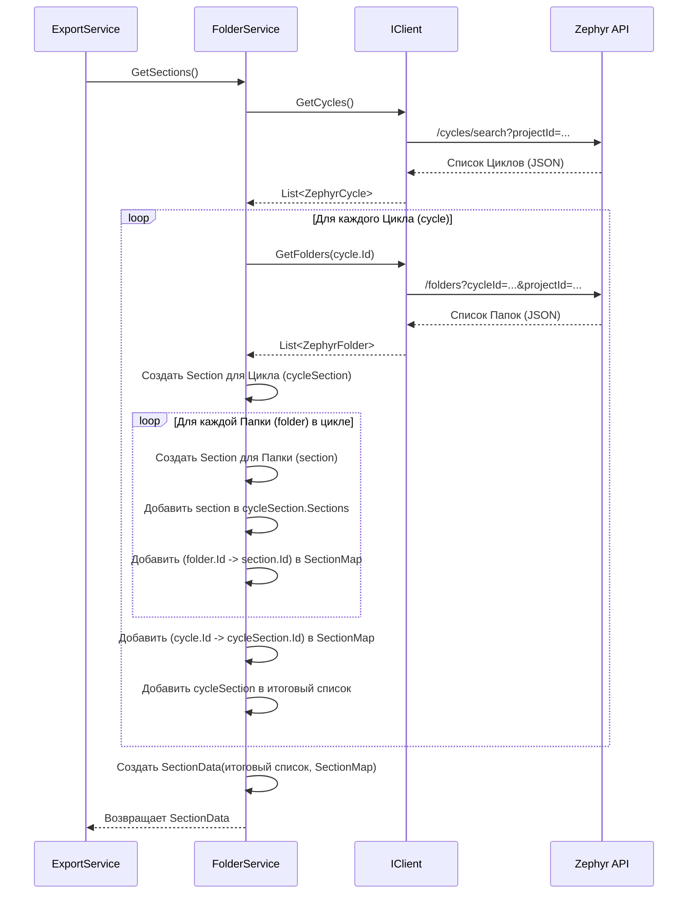

# Chapter 6: Сервис Папок и Циклов


В [предыдущей главе: Модели Данных Zephyr](05_модели_данных_zephyr_.md) мы увидели, как данные, полученные от Zephyr API в формате JSON, превращаются в удобные C# объекты с помощью моделей. Теперь, когда у нас есть "ингредиенты" (модели), давайте посмотрим на один из "поваров", который их использует — **Сервис Папок и Циклов** (`FolderService`). Он отвечает за то, чтобы понять, как устроен ваш проект в Zephyr.

## Зачем нужен отдельный сервис для папок и циклов?

Представьте, что вы хотите экспортировать все тест-кейсы из вашего проекта в Zephyr. Тест-кейсы обычно не лежат все в одной куче, они организованы. В Zephyr они могут быть сгруппированы по **циклам тестирования** (Test Cycles), а внутри циклов — по **папкам** (Folders). Прежде чем собирать сами тест-кейсы, нам нужно получить **карту** или **структуру** этой организации.

**Проблема:** Как нашему приложению узнать, какие циклы существуют в проекте и какие папки находятся внутри каждого из них?

**Решение:** Эту задачу решает **Сервис Папок и Циклов** (`FolderService`).

Думайте об этом сервисе как о **библиотекаре**, работающем с каталогом вашего проекта в Zephyr:

1.  **Находит стеллажи:** Сначала он запрашивает у [Клиента Zephyr API](03_клиент_zephyr_api_.md) список всех "стеллажей" — это **циклы тестирования** в вашем проекте.
2.  **Осматривает полки на стеллажах:** Затем для каждого найденного "стеллажа" (цикла) он снова обращается к API, чтобы узнать, какие "папки с документами" (папки Zephyr) находятся на этом стеллаже.
3.  **Создает каталог:** Полученную информацию о циклах и папках он преобразует во внутреннюю, понятную для нашего приложения структуру — список объектов `Section` (Секция). Эта структура представляет иерархию проекта: циклы являются родительскими секциями, а папки Zephyr — дочерними секциями внутри них.
4.  **Делает пометки:** Кроме самой структуры, он создает специальную "карту соответствия" (`SectionMap`). Эта карта помогает быстро найти нужную внутреннюю секцию (`Section`), зная ID цикла или папки из Zephyr. Это пригодится позже, когда мы будем размещать тест-кейсы по нужным секциям.

Этот внутренний каталог (`SectionData`), созданный `FolderService`, затем используется [Сервисом Экспорта](02_процесс_экспорта_проекта_.md) (`ExportService`) для координации дальнейшей работы и [Сервисом Тест-кейсов](07_сервис_тест_кейсов_.md) для запроса и организации самих тестов.

## Как это используется?

Вам, как пользователю (и даже большинству разработчиков других частей приложения), **не нужно напрямую вызывать `FolderService`**. Он работает "за кулисами".

[Сервис Экспорта](02_процесс_экспорта_проекта_.md) (`ExportService`), о котором мы говорили в Главе 2, получает экземпляр `IFolderService` через Dependency Injection и вызывает его единственный метод `GetSections()`.

*   **Вход:** `FolderService` неявно использует [Клиент Zephyr API](03_клиент_zephyr_api_.md) (`IClient`), который был ему предоставлен при создании (через DI). Этот клиент уже настроен для общения с вашим Zephyr (используя данные из `zephyr.config.json` и [Менеджер Токенов Доступа](04_менеджер_токенов_доступа_.md)).
*   **Выход:** Метод `GetSections()` возвращает объект `SectionData`. Этот объект содержит две важные части:
    1.  `Sections`: Список объектов `Section`, представляющих корневые элементы структуры — циклы тестирования. Каждый объект `Section` цикла может содержать вложенный список `Sections` для папок внутри него.
    2.  `SectionMap`: Словарь (Dictionary), который сопоставляет ID папки или цикла из Zephyr (строка) с внутренним представлением этой папки/цикла (`ZephyrSection`, который содержит уникальный ID `Guid` для использования внутри `ZephyrSquadExporter`). Эта карта нужна для быстрой навигации и связи данных.

## Под Капотом: Как "Библиотекарь" Составляет Каталог?

Давайте посмотрим, что происходит шаг за шагом, когда `ExportService` вызывает `FolderService.GetSections()`.

1.  **Запрос Циклов:** `FolderService` просит `_client` ([Клиент Zephyr API](03_клиент_zephyr_api_.md)) "Дай мне список всех циклов тестирования". `_client` отправляет запрос к Zephyr API (используя токен от [Менеджера Токенов Доступа](04_менеджер_токенов_доступа_.md)) и получает в ответ список объектов `ZephyrCycle` ([Модели Данных Zephyr](05_модели_данных_zephyr_.md)).
2.  **Обработка Циклов (по одному):** `FolderService` начинает перебирать полученные циклы. Для каждого цикла `ZephyrCycle`:
    *   **Запрос Папок:** Он снова просит `_client`: "А теперь дай мне список папок *внутри вот этого конкретного цикла*" (передавая ID цикла). `_client` делает еще один запрос к API и получает список `ZephyrFolder` для данного цикла.
    *   **Создание Секции Цикла:** Создается внутренний объект `Section`, представляющий *текущий цикл*. Ему присваивается имя цикла (`cycle.Name`) и генерируется новый, уникальный внутренний ID (`Guid.NewGuid()`).
    *   **Обработка Папок (внутри цикла):** `FolderService` перебирает папки `ZephyrFolder`, полученные для этого цикла. Для каждой папки:
        *   **Создание Секции Папки:** Создается еще один внутренний объект `Section`, представляющий *эту папку*. Ему присваивается имя папки (`folder.Name`) и тоже генерируется уникальный внутренний ID.
        *   **Добавление в Цикл:** Эта секция папки добавляется в список `Sections` родительской секции цикла.
        *   **Запись в Карту Соответствия:** В `_sectionMap` добавляется запись: "ID папки из Zephyr (`folder.Id`) соответствует вот этому внутреннему ID (`section.Id`) и это папка".
    *   **Запись Цикла в Карту Соответствия:** После обработки всех папок цикла, в `_sectionMap` добавляется запись для самого цикла: "ID цикла из Zephyr (`cycle.Id`) соответствует вот этому внутреннему ID (`cycleSection.Id`) и это цикл (не папка)".
    *   **Добавление Цикла в Общий Список:** Готовая секция цикла (со всеми вложенными секциями папок) добавляется в итоговый список `listOfFolders`.
3.  **Возврат Результата:** После обработки всех циклов, `FolderService` упаковывает итоговый список `listOfFolders` и карту `_sectionMap` в один объект `SectionData` и возвращает его `ExportService`.

**Диаграмма Последовательности:**



## Погружение в Код

Теперь посмотрим на код, реализующий эту логику.

**1. Интерфейс `IFolderService` (`Services/IFolderService.cs`)**

Это простой "контракт", который говорит, что любой сервис папок должен уметь делать одно: получать секции.

```csharp
// Файл: Services/IFolderService.cs
using ZephyrSquadExporter.Models;

namespace ZephyrSquadExporter.Services;

// Определяет контракт для сервиса, работающего с папками/циклами
public interface IFolderService
{
    // Основной метод: получить структуру секций проекта
    Task<SectionData> GetSections();
}
```

*   **Объяснение:** Интерфейс объявляет один асинхронный метод `GetSections`, который возвращает `Task<SectionData>`. Это позволяет другим частям программы (как `ExportService`) зависеть от `IFolderService`, не зная деталей его реализации.

**2. Конструктор `FolderService` (`Services/FolderService.cs`)**

При создании `FolderService` получает необходимые ему инструменты.

```csharp
// Файл: Services/FolderService.cs
using Microsoft.Extensions.Logging;
using Models; // Наше пространство имен для внутренних моделей (Section и т.д.)
using ZephyrSquadExporter.Client;
using ZephyrSquadExporter.Models; // Модели данных от Zephyr API (ZephyrCycle и т.д.)

namespace ZephyrSquadExporter.Services;

public class FolderService : IFolderService // Реализует интерфейс
{
    private readonly ILogger<FolderService> _logger; // Для записи логов
    private readonly IClient _client; // Клиент для общения с Zephyr API
    // Словарь для хранения соответствия ID Zephyr -> внутренний ID (Guid)
    private readonly Dictionary<string, ZephyrSection> _sectionMap = new();

    // Конструктор, вызываемый при запуске приложения (через DI)
    public FolderService(ILogger<FolderService> logger, IClient client)
    {
        _logger = logger; // Сохраняем логгер
        _client = client; // Сохраняем API клиент
    }

    // ... метод GetSections() ниже ...
}
```

*   **Объяснение:** Конструктор получает логгер (`ILogger`) и клиент API (`IClient`) через Dependency Injection. Он сохраняет их в приватных полях `_logger` и `_client`. Также он инициализирует пустой словарь `_sectionMap`, который будет заполняться в процессе работы.

**3. Метод `GetSections` (`Services/FolderService.cs`)**

Здесь происходит основная "работа библиотекаря".

```csharp
// Файл: Services/FolderService.cs (продолжение)
public async Task<SectionData> GetSections()
{
    _logger.LogInformation("Получаем секции (циклы и папки)...");

    var listOfFolders = new List<Section>(); // Итоговый список корневых секций (циклов)

    // --- Шаг 1: Получить все циклы ---
    var cycles = await _client.GetCycles(); // Используем API клиент

    // --- Шаг 2: Обработать каждый цикл ---
    foreach (var cycle in cycles) // Перебираем полученные циклы
    {
        // --- Шаг 2.1: Получить папки для текущего цикла ---
        var folders = await _client.GetFolders(cycle.Id); // Передаем ID цикла

        // --- Шаг 2.2: Создать внутреннюю секцию для цикла ---
        var cycleSection = new Section // Создаем объект Section (внутренняя модель)
        {
            Name = cycle.Name,        // Берем имя из модели ZephyrCycle
            Id = Guid.NewGuid(),      // Генерируем уникальный внутренний ID
            Sections = new List<Section>() // Готовим список для вложенных папок
            // PostconditionSteps, PreconditionSteps - пока не используем, оставляем пустыми
        };

        // --- Шаг 2.3: Обработать папки внутри цикла ---
        foreach (var folder in folders) // Перебираем папки для этого цикла
        {
            // Создаем внутреннюю секцию для папки
            var section = new Section
            {
                Name = folder.Name,       // Берем имя из модели ZephyrFolder
                Id = Guid.NewGuid(),      // Генерируем уникальный внутренний ID
                Sections = new List<Section>() // Папки у нас пока без вложенности
            };

            // Добавляем секцию папки в список секций цикла
            cycleSection.Sections.Add(section);

            // Запоминаем соответствие: ID папки Zephyr -> наш внутренний ID
            _sectionMap.Add(folder.Id, new ZephyrSection
            {
                Id = section.Id, // Наш внутренний Guid
                IsFolder = true,   // Помечаем, что это папка
                CycleId = cycle.Id // Сохраняем ID родительского цикла Zephyr
            });
        }

        // --- Шаг 2.4: Запомнить соответствие для самого цикла ---
        _sectionMap.Add(cycle.Id, new ZephyrSection
        {
            Id = cycleSection.Id, // Наш внутренний Guid для цикла
            IsFolder = false,     // Помечаем, что это НЕ папка (это цикл)
            CycleId = cycle.Id    // ID цикла совпадает сам с собой
        });

        // --- Шаг 2.5: Добавить готовую секцию цикла в общий список ---
        listOfFolders.Add(cycleSection);
    } // Конец цикла по обработке одного цикла

    _logger.LogInformation($"Найдено {listOfFolders.Count} циклов.");

    // --- Шаг 3: Вернуть результат ---
    // Упаковываем список секций и карту соответствия в один объект
    return new SectionData
    {
        Sections = listOfFolders,   // Готовая структура папок
        SectionMap = _sectionMap    // Карта соответствия ID
    };
}
```

*   **Объяснение:** Этот код точно следует шагам, описанным ранее. Он получает циклы, затем в цикле для каждого из них получает папки. Для каждого цикла и каждой папки создается внутренний объект `Section` с уникальным `Guid`. Эти `Section` связываются в иерархию (папки вкладываются в циклы). Параллельно заполняется словарь `_sectionMap`, который хранит связь между ID из Zephyr и нашими внутренними `Guid` для этих секций, что облегчит последующую привязку тест-кейсов к нужным папкам/циклам. В конце метод возвращает объект `SectionData`, содержащий и структуру (`Sections`), и карту (`SectionMap`).

**Примечание о Моделях `Section`, `SectionData`, `ZephyrSection`:**

*   `Section` (из пространства имен `Models`): Это *внутренняя* модель нашего приложения, используемая для построения иерархии проекта (секций, которые могут содержать другие секции). Она отличается от `ZephyrCycle` и `ZephyrFolder` ([Модели Данных Zephyr](05_модели_данных_zephyr_.md)), которые представляют данные *как они приходят от API*.
*   `SectionData` (`ZephyrSquadExporter.Models`): Простой контейнер для возврата двух результатов из `GetSections`: списка корневых `Section` и карты `_sectionMap`.
*   `ZephyrSection` (`ZephyrSquadExporter.Models`): Маленький класс, используемый в `_sectionMap`. Он хранит внутренний `Guid` секции, признак (папка это или цикл) и ID родительского цикла Zephyr.

## Заключение

В этой главе мы познакомились с **Сервисом Папок и Циклов** (`FolderService`) — нашим "библиотекарем", который наводит порядок в структуре проекта Zephyr. Мы узнали, что он:

*   Отвечает за получение информации о циклах тестирования и папках внутри них.
*   Использует [Клиента Zephyr API](03_клиент_zephyr_api_.md) для запроса этих данных у Zephyr.
*   Преобразует полученные данные (`ZephyrCycle`, `ZephyrFolder`) во внутреннюю иерархическую структуру (`List<Section>`).
*   Создает карту соответствия (`SectionMap`) между идентификаторами Zephyr и внутренними идентификаторами нашего приложения.
*   Подготавливает эту структуру для дальнейшего использования другими сервисами, в первую очередь, для размещения тест-кейсов.

Итак, наш "библиотекарь" составил каталог стеллажей и папок. Теперь пора заполнить эти папки содержимым — самими тест-кейсами!

**Следующий шаг:** Давайте рассмотрим, как `ZephyrSquadExporter` получает информацию непосредственно о тест-кейсах, используя уже созданную структуру папок. Переходим к [Главе 7: Сервис Тест-кейсов](07_сервис_тест_кейсов_.md).

---

Generated by [AI Codebase Knowledge Builder](https://github.com/The-Pocket/Tutorial-Codebase-Knowledge)