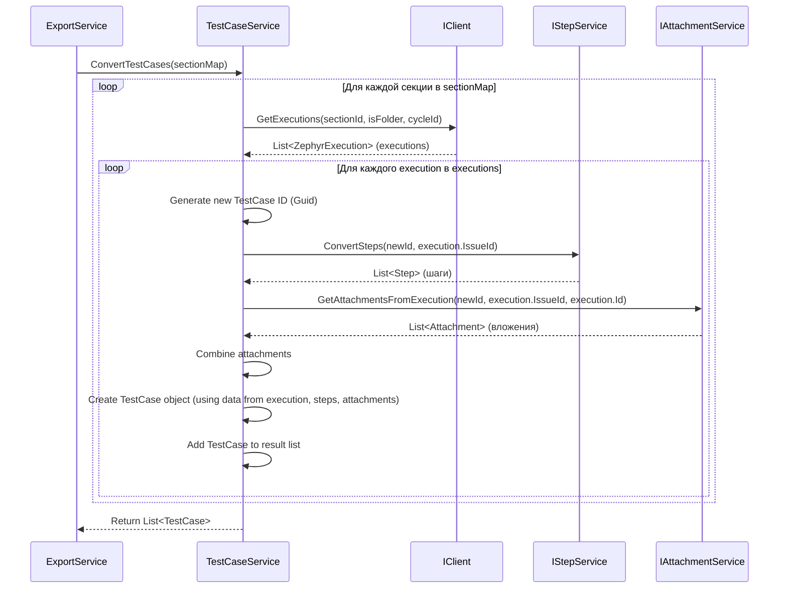

# Chapter 7: Сервис Тест-кейсов


В [предыдущей главе: Сервис Папок и Циклов](06_сервис_папок_и_циклов_.md) мы узнали, как `ZephyrSquadExporter` строит карту нашего проекта, определяя структуру циклов и папок. Наш "библиотекарь" (`FolderService`) составил каталог. Теперь пришло время заполнить этот каталог реальным содержимым — информацией о самих тест-кейсах. Но как нам взять данные из Zephyr и подготовить их для импорта в другую систему (Test IT)? Этим занимается **Сервис Тест-кейсов**.

## Проблема: Как "перевести" тест-кейс из Zephyr в нужный формат?

Представьте, что у вас есть подробная инструкция на одном языке (данные о тест-кейсе в Zephyr), а вам нужно пересказать ее на другом языке, понятном совершенно иной системе (формат `TestCase` для Test IT). Просто скопировать текст не получится — нужно перевести смысл, структуру и все связанные детали.

В Zephyr информация о тест-кейсе в рамках цикла или папки представлена через сущность "Execution" (выполнение). Эта сущность содержит название, описание, метки тест-кейса из Jira, но также тесно связана с шагами и вложениями. Целевая система, Test IT, ожидает данные в своем формате, который мы называем `TestCase`.

Нам нужен компонент, который выполнит роль **переводчика**: возьмет "инструкцию" из Zephyr (`ZephyrExecution`) и аккуратно переведет все ее части — название, описание, шаги, вложения — в новый формат (`TestCase`).

## Решение: Сервис Тест-кейсов – Наш Переводчик Артефактов

**Сервис Тест-кейсов** (`TestCaseService` в коде) — это именно тот компонент, который выполняет эту задачу перевода. Его основная работа:

1.  Получить данные о "выполнениях" (`ZephyrExecution`, которые представляют тест-кейсы в контексте цикла/папки) для каждой секции (цикла или папки), найденной [Сервисом Папок и Циклов](06_сервис_папок_и_циклов_.md).
2.  Для каждого выполнения извлечь ключевую информацию: имя (из `issueKey`), описание (`issueDescription`), метки (`issueLabel`).
3.  Попросить помощи у других специализированных сервисов:
    *   [Сервис Шагов Тест-кейса](08_сервис_шагов_тест_кейса_.md) (`IStepService`): "Переведи, пожалуйста, все шаги для этого тест-кейса".
    *   [Сервис Вложений](09_сервис_вложений_.md) (`IAttachmentService`): "Найди и подготовь все вложения, связанные с этим тест-кейсом и его шагами".
4.  Собрать всю переведенную информацию (основные детали, шаги, вложения) в единый объект формата `TestCase`, понятный для целевой системы.

**Аналогия с Переводчиком Документов:**

Представьте `TestCaseService` как бюро переводов:

*   К нему приходит заказ: "Вот карта папок (`SectionMap`) из архива Zephyr, нужно перевести все документы (тест-кейсы) в них".
*   Переводчик берет карту и для каждой папки запрашивает документы (`ZephyrExecution`) из архива (через [Клиент Zephyr API](03_клиент_zephyr_api_.md)).
*   Для каждого документа он:
    *   Переводит заголовок и основной текст (имя, описание).
    *   Отправляет разделы с инструкциями (шаги) специалисту по техническому переводу ([Сервис Шагов Тест-кейса](08_сервис_шагов_тест_кейса_.md)).
    *   Отправляет приложения (вложения) специалисту по обработке файлов ([Сервис Вложений](09_сервис_вложений_.md)).
    *   Собирает все переведенные части вместе в один документ нового формата (`TestCase`).
*   В конце он возвращает стопку готовых, переведенных документов (`List<TestCase>`).

## Как это используется?

Как и с другими сервисами, вам, как пользователю, **не нужно напрямую взаимодействовать с `TestCaseService`**. Он является важной частью внутреннего механизма экспорта.

[Сервис Экспорта](02_процесс_экспорта_проекта_.md) (`ExportService`), управляющий всем процессом, вызывает `TestCaseService` после того, как получил структуру папок от [Сервиса Папок и Циклов](06_сервис_папок_и_циклов_.md).

*   **Вход:** Основной вход для `TestCaseService` — это `SectionMap` (словарь `Dictionary<string, ZephyrSection>`), который он получает от `ExportService`. Эта карта содержит соответствие между ID циклов/папок Zephyr и внутренними ID нашего приложения, информацию о том, является ли секция папкой, и ID родительского цикла.
*   **Выход:** Главный результат работы `TestCaseService` — это список (`List<TestCase>`) объектов. Каждый объект `TestCase` представляет собой полностью сформированный тест-кейс со всеми его деталями (имя, описание, шаги, вложения, теги и т.д.), готовый для записи в JSON-файл.

## Под Капотом: Процесс Перевода

Давайте представим, как `TestCaseService` работает шаг за шагом, когда `ExportService` вызывает его метод `ConvertTestCases`, передавая ему `SectionMap`:

1.  **Начало Перевода:** Метод `ConvertTestCases` получает карту секций `sectionMap`. Он создает пустой список, куда будет складывать готовые `TestCase`.
2.  **Обход Секций:** Сервис начинает перебирать каждую запись в `sectionMap`. Каждая запись представляет либо цикл, либо папку из Zephyr.
3.  **Запрос Выполнений:** Для текущей секции он обращается к [Клиенту Zephyr API](03_клиент_zephyr_api_.md) (`_client`). Он вызывает либо `GetTestCasesFromCycle`, либо `GetTestCasesFromFolder`, передавая ID из `sectionMap` и ID цикла (если это папка). В ответ он получает список "выполнений" (`List<ZephyrExecution>`) для этой секции. Это и есть наши "документы" из Zephyr, которые нужно перевести.
4.  **Перевод Каждого Выполнения:** Сервис перебирает каждое полученное `ZephyrExecution` (`execution`):
    *   **Генерация ID:** Создается уникальный внутренний идентификатор (GUID) для будущего объекта `TestCase`.
    *   **Запрос Шагов:** Сервис обращается к "специалисту по шагам" — `_stepService.ConvertSteps(...)`, передавая ему ID нового тест-кейса и ID задачи Jira (`execution.Execution.IssueId`). `IStepService` возвращает готовый список шагов в нужном формате.
    *   **Запрос Вложений:** Сервис обращается к "специалисту по вложениям" — `_attachmentService.GetAttachmentsFromExecution(...)`, передавая ID нового тест-кейса, ID задачи Jira и ID самого выполнения Zephyr. `IAttachmentService` возвращает список вложений, связанных непосредственно с выполнением.
    *   **Сборка Всех Вложений:** Сервис собирает вместе вложения от `_attachmentService` и те вложения, которые могли быть найдены `_stepService` внутри шагов.
    *   **Создание `TestCase`:** Создается новый объект `TestCase`. Его поля заполняются данными:
        *   `Id`: Сгенерированный ранее уникальный `Guid`.
        *   `Name`: Берется из `execution.IssueKey` (ключ задачи Jira).
        *   `Description`: Берется из `execution.IssueDescription`.
        *   `Steps`: Список шагов, полученный от `_stepService`.
        *   `Tags`: Метки из `execution.IssueLabel` (если есть, разделяются по запятой).
        *   `Attachments`: Объединенный список всех вложений.
        *   `SectionId`: Внутренний `Guid` секции (из `sectionMap`), к которой относится этот тест-кейс.
        *   Другие поля, такие как `State`, `Priority`, `Duration`, заполняются значениями по умолчанию или предопределенными значениями.
    *   **Добавление в Список:** Готовый объект `TestCase` добавляется в общий список переведенных тест-кейсов.
5.  **Возврат Результата:** После обработки всех секций и всех выполнений в них, метод `ConvertTestCases` возвращает итоговый `List<TestCase>` сервису `ExportService`.

**Диаграмма Последовательности:**



## Погружение в Код

Давайте заглянем в код, отвечающий за "перевод" тест-кейсов.

**1. Интерфейс `ITestCaseService` (`Services/ITestCaseService.cs`)**

Определяет "контракт" для сервиса тест-кейсов. Он должен уметь конвертировать тесты, используя карту секций.

```csharp
// Файл: Services/ITestCaseService.cs
using Models; // Пространство имен для внутренних моделей Test IT (TestCase)
using ZephyrSquadExporter.Models; // Модели данных от Zephyr

namespace ZephyrSquadExporter.Services;

public interface ITestCaseService
{
    // Основной метод: конвертировать тест-кейсы, используя карту секций
    Task<List<TestCase>> ConvertTestCases(Dictionary<string, ZephyrSection> sectionMap);
}
```

*   **Объяснение:** Интерфейс объявляет один асинхронный метод `ConvertTestCases`. Он принимает на вход `Dictionary<string, ZephyrSection>` (карту секций от `FolderService`) и обещает вернуть `Task<List<TestCase>>` (список готовых объектов `TestCase` для Test IT).

**2. Конструктор `TestCaseService` (`Services/TestCaseService.cs`)**

Здесь сервис получает все необходимые ему зависимости при создании.

```csharp
// Файл: Services/TestCaseService.cs
using Microsoft.Extensions.Logging;
using Models; // Модели Test IT
using ZephyrSquadExporter.Client;
using ZephyrSquadExporter.Models; // Модели Zephyr

namespace ZephyrSquadExporter.Services;

public class TestCaseService : ITestCaseService
{
    private readonly ILogger<TestCaseService> _logger; // Для логов
    private readonly IClient _client; // Клиент для запросов к Zephyr API
    private readonly IStepService _stepService; // Сервис для получения шагов
    private readonly IAttachmentService _attachmentService; // Сервис для получения вложений
    public const int _duration = 10000; // Длительность по умолчанию (пример)

    // Конструктор, вызываемый через Dependency Injection
    public TestCaseService(ILogger<TestCaseService> logger, IClient client, IStepService stepService,
        IAttachmentService attachmentService)
    {
        _logger = logger;
        _client = client;             // Сохраняем клиент API
        _stepService = stepService;         // Сохраняем сервис шагов
        _attachmentService = attachmentService; // Сохраняем сервис вложений
    }

    // ... метод ConvertTestCases() ниже ...
}
```

*   **Объяснение:** Конструктор получает и сохраняет все необходимые "инструменты": логгер, [Клиент Zephyr API](03_клиент_zephyr_api_.md), [Сервис Шагов Тест-кейса](08_сервис_шагов_тест_кейса_.md) и [Сервис Вложений](09_сервис_вложений_.md). Все они предоставляются автоматически системой Dependency Injection при запуске приложения.

**3. Основной метод `ConvertTestCases` (`Services/TestCaseService.cs`)**

Это сердце "переводчика". Здесь происходит итерация по секциям и вызов других сервисов.

```csharp
// Файл: Services/TestCaseService.cs (продолжение)
public async Task<List<TestCase>> ConvertTestCases(Dictionary<string, ZephyrSection> sectionMap)
{
    _logger.LogInformation("Конвертируем тест-кейсы...");

    var testCases = new List<TestCase>(); // Список для готовых TestCase

    // --- Шаг 1: Обход секций из карты ---
    foreach (var sectionEntry in sectionMap) // sectionEntry.Key = ID Zephyr, sectionEntry.Value = ZephyrSection
    {
        // --- Шаг 2: Получить выполнения (ZephyrExecution) для секции ---
        var executions = await GetExecution(sectionEntry.Key, sectionEntry.Value); // Вызов вспомогательного метода

        // --- Шаг 3: Обработка каждого выполнения ---
        foreach (var execution in executions)
        {
            var testCaseId = Guid.NewGuid(); // Генерируем новый ID для TestCase

            // --- Шаг 3.1: Получить шаги ---
            var steps = await _stepService.ConvertSteps(testCaseId, execution.Execution.IssueId.ToString());

            // --- Шаг 3.2: Получить вложения ---
            var attachments = await _attachmentService.GetAttachmentsFromExecution(
                testCaseId,
                execution.Execution.IssueId.ToString(),
                execution.Execution.Id);

            // (Здесь происходит сбор всех вложений, включая те, что из шагов - опущено для простоты)
            // ... код сборки вложений ...

            // --- Шаг 3.3: Создать объект TestCase ---
            var testCase = new TestCase
            {
                Id = testCaseId, // Уникальный ID
                Name = execution.IssueKey, // Имя из ключа Jira
                Description = execution.IssueDescription, // Описание из Jira
                State = StateType.NotReady, // Статус по умолчанию
                Priority = PriorityType.Medium, // Приоритет по умолчанию
                Steps = steps, // Список шагов от StepService
                Tags = ConvertTags(execution.IssueLabel), // Метки из Jira (если есть)
                Duration = _duration, // Длительность по умолчанию
                Attachments = attachments, // Собранные вложения
                SectionId = sectionEntry.Value.Id // Внутренний ID секции
                // ... другие поля TestCase ...
            };

            testCases.Add(testCase); // Добавляем готовый TestCase в список
        }
    }

    _logger.LogInformation($"Конвертировано {testCases.Count} тест-кейсов.");
    return testCases; // Возвращаем полный список
}

// Вспомогательный метод для извлечения меток (тегов)
private List<string> ConvertTags(string? labels)
{
    if (string.IsNullOrEmpty(labels))
    {
        return new List<string>(); // Возвращаем пустой список, если меток нет
    }
    // Разделяем строку по запятым, убираем пробелы по краям
    return labels.Split(",", StringSplitOptions.RemoveEmptyEntries | StringSplitOptions.TrimEntries).ToList();
}
```

*   **Объяснение:** Этот метод реализует основной алгоритм: проходит по всем секциям `sectionMap`, для каждой запрашивает `ZephyrExecution` с помощью `GetExecution`, а затем для каждого `execution` вызывает `_stepService` и `_attachmentService`. После этого он собирает все данные в новый объект `TestCase` и добавляет его в итоговый список. Метод `ConvertTags` используется для простой обработки строки с метками.

**4. Вспомогательный метод `GetExecution` (`Services/TestCaseService.cs`)**

Этот небольшой метод определяет, какой метод клиента API вызвать, основываясь на типе секции (цикл или папка).

```csharp
// Файл: Services/TestCaseService.cs (продолжение)
private async Task<List<ZephyrExecution>> GetExecution(string sectionId, ZephyrSection section)
{
    // Проверяем, является ли секция папкой (IsFolder берется из ZephyrSection)
    if (section.IsFolder)
    {
        // Если папка, запрашиваем выполнения из папки, передавая ID цикла и ID папки
        _logger.LogDebug($"Запрос выполнений для папки {sectionId} в цикле {section.CycleId}");
        return await _client.GetTestCasesFromFolder(section.CycleId, sectionId);
    }
    else
    {
        // Если не папка (значит, это цикл), запрашиваем выполнения из цикла
        _logger.LogDebug($"Запрос выполнений для цикла {sectionId}");
        return await _client.GetTestCasesFromCycle(sectionId);
    }
}
```

*   **Объяснение:** Метод принимает ID секции Zephyr (`sectionId`) и объект `ZephyrSection` (который содержит флаг `IsFolder` и `CycleId`, установленные [Сервисом Папок и Циклов](06_сервис_папок_и_циклов_.md)). В зависимости от флага `IsFolder`, он вызывает соответствующий метод [Клиента Zephyr API](03_клиент_zephyr_api_.md) для получения списка `ZephyrExecution`.

## Заключение

В этой главе мы рассмотрели **Сервис Тест-кейсов** (`TestCaseService`), ключевой компонент-переводчик в `ZephyrSquadExporter`. Мы узнали, что он:

*   Отвечает за преобразование данных о выполнениях тест-кейсов из Zephyr (`ZephyrExecution`) в формат `TestCase`, понятный для целевой системы.
*   Работает итеративно, обрабатывая каждую папку и цикл, полученные от [Сервиса Папок и Циклов](06_сервис_папок_и_циклов_.md).
*   Координирует работу с другими сервисами — [Клиентом Zephyr API](03_клиент_zephyr_api_.md), [Сервисом Шагов Тест-кейса](08_сервис_шагов_тест_кейса_.md) и [Сервисом Вложений](09_сервис_вложений_.md) — чтобы собрать всю необходимую информацию.
*   Формирует и возвращает полный список `TestCase`, готовых к записи.

Мы увидели, как `TestCaseService` извлекает основную информацию, но для полного "перевода" ему нужны детали шагов. Как именно он их получает?

**Следующий шаг:** Давайте погрузимся в детали того, как сервис обрабатывает шаги тест-кейсов. Переходим к [Главе 8: Сервис Шагов Тест-кейса](08_сервис_шагов_тест_кейса_.md).

---

Generated by [AI Codebase Knowledge Builder](https://github.com/The-Pocket/Tutorial-Codebase-Knowledge)