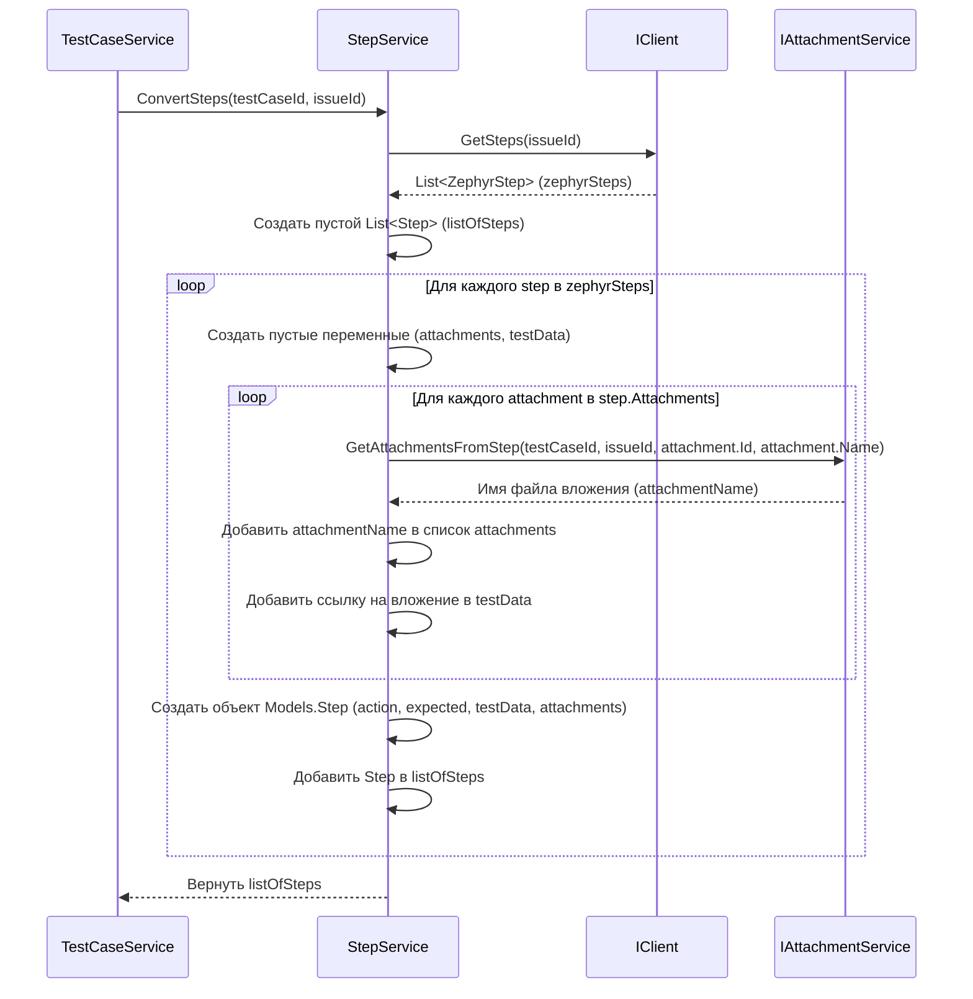

# Chapter 8: Сервис Шагов Тест-кейса


В [предыдущей главе: Сервис Тест-кейсов](07_сервис_тест_кейсов_.md) мы увидели, как `TestCaseService` работает как "переводчик", преобразуя общую информацию о тест-кейсе из формата Zephyr (`ZephyrExecution`) в наш внутренний формат `TestCase`. Однако часто самая важная часть тест-кейса — это его пошаговая инструкция. `TestCaseService` не занимается деталями этих шагов сам, а поручает эту задачу специальному помощнику — **Сервису Шагов Тест-кейса** (`StepService`).

## Зачем нужен отдельный сервис для шагов?

Представьте, что вы пишете кулинарный рецепт. У вас есть общее описание блюда (как `TestCaseService` обрабатывает `ZephyrExecution`), но самое главное — это пошаговая инструкция: "1. Нарежьте лук. 2. Обжарьте до золотистого цвета...". Каждый шаг может иметь свои нюансы, например, "добавьте фото нарезанного лука" (вложение).

**Проблема:** Как для конкретного тест-кейса получить из Zephyr все его шаги (действие, данные, ожидаемый результат) и правильно обработать файлы, прикрепленные *именно к этим шагам*? Эти данные нужно не просто получить, но и преобразовать в структуру `Step`, которая является частью нашего `TestCase`.

**Решение:** Использовать **Сервис Шагов Тест-кейса** (`StepService`).

## Сервис Шагов (`StepService`) – Наш Протоколист Инструкций

`StepService` — это как **детальный протоколист** или **специалист по инструкциям** для каждого тест-кейса:

1.  **Получает Задание:** [Сервис Тест-кейсов](07_сервис_тест_кейсов_.md) говорит ему: "Для тест-кейса с ID задачи Jira таким-то (например, `PROJ-123`) найди и запиши все шаги".
2.  **Запрашивает Детали:** `StepService` обращается к [Клиенту Zephyr API](03_клиент_zephyr_api_.md) и просит: "Дай мне шаги (`ZephyrStep`) для задачи `PROJ-123`".
3.  **Обрабатывает Шаги по Одному:** Для каждого полученного шага `ZephyrStep` он выполняет следующие действия:
    *   Извлекает основную информацию: действие (`step`), данные (`data`), ожидаемый результат (`result`).
    *   **Работает с Вложениями Шага:** Если у шага есть вложения (`ZephyrAttachment`), он обращается к другому специалисту — [Сервису Вложений](09_сервис_вложений_.md) (`IAttachmentService`), и говорит: "Обработай, пожалуйста, вот эти файлы, связанные с этим конкретным шагом". `IAttachmentService` подготавливает вложения (например, скачивает их или получает их имена) и возвращает информацию `StepService`.
    *   **Форматирует Результат:** Собирает всю информацию (действие, результат, данные, а также ссылки на обработанные вложения) в один объект `Step` (внутренняя модель для шага в Test IT).
4.  **Возвращает Протокол:** Когда все шаги обработаны, `StepService` возвращает [Сервису Тест-кейсов](07_сервис_тест_кейсов_.md) полный список готовых объектов `Step`.

Таким образом, `StepService` инкапсулирует логику получения и преобразования именно шагов, включая специфическую обработку их вложений, освобождая `TestCaseService` от этих деталей.

## Как это используется?

Как и другие "внутренние" сервисы, `StepService` используется не напрямую вами, а другими компонентами `ZephyrSquadExporter`.

[Сервис Тест-кейсов](07_сервис_тест_кейсов_.md) вызывает `StepService` для каждого тест-кейса (`ZephyrExecution`), который он обрабатывает.

*   **Вход:** Метод `ConvertSteps` сервиса принимает два параметра:
    *   `testCaseId` (типа `Guid`): Внутренний уникальный идентификатор `TestCase`, к которому будут принадлежать эти шаги. Он нужен, чтобы [Сервис Вложений](09_сервис_вложений_.md) знал, куда "приписывать" вложения шагов.
    *   `issueId` (типа `string`): ID задачи Jira, для которой нужно получить шаги из Zephyr.
*   **Выход:** Метод `ConvertSteps` возвращает `Task<List<Step>>`. Это означает, что он а Mсинхронно (может потребоваться время на запросы к API) вернет список (`List`) объектов `Step`. Каждый объект `Step` содержит действие, ожидаемый результат, данные и информацию о вложениях для одного шага, уже в формате, готовом для включения в `TestCase`.

**Пример вызова (внутри `TestCaseService`):**

```csharp
// ... внутри цикла обработки execution в TestCaseService ...
var testCaseId = Guid.NewGuid(); // Сгенерировали ID для нового TestCase

// Вызываем StepService для получения шагов
List<Step> steps = await _stepService.ConvertSteps(testCaseId, execution.Execution.IssueId.ToString());

// Теперь 'steps' содержит готовый список шагов для этого TestCase
// ...
```

## Под Капотом: Как Собираются Шаги?

Давайте проследим путь выполнения, когда `TestCaseService` вызывает `_stepService.ConvertSteps(someGuid, "PROJ-123")`.

1.  **Начало Работы:** Метод `ConvertSteps` получает `testCaseId` и `issueId`. Он логирует начало процесса для `issueId`. Создается пустой список для хранения итоговых объектов `Step`.
2.  **Запрос Шагов к API:** `StepService` обращается к `_client` ([Клиент Zephyr API](03_клиент_zephyr_api_.md)) и вызывает `_client.GetSteps("PROJ-123")`.
3.  **Получение Ответа:** Клиент API общается с Zephyr, получает JSON со списком шагов и десериализует его в `List<ZephyrStep>` ([Модели Данных Zephyr](05_модели_данных_zephyr_.md)). Этот список возвращается в `StepService`.
4.  **Обработка Каждого Шага:** `StepService` начинает перебирать полученные `ZephyrStep` (`step`):
    *   **Инициализация:** Создаются пустые переменные для данных и списка имен вложений этого шага.
    *   **Обработка Вложений Шага:** Если у текущего `step` есть список `step.Attachments` и он не пуст:
        *   Сервис перебирает каждое вложение `attachment` в списке.
        *   Для каждого вложения он вызывает метод `_attachmentService.GetAttachmentsFromStep(...)`, передавая ему `testCaseId`, `issueId`, ID и имя вложения (`attachment.Id`, `attachment.Name`). Этот метод занимается фактической обработкой вложения (например, скачиванием или просто формированием имени файла) и возвращает имя файла (или путь), который будет использоваться во внутреннем представлении.
        *   Возвращенное имя файла добавляется в список `attachments` текущего шага.
        *   Также имя файла добавляется в специальном формате (`<p><<<filename.ext>>></p>`) к строке `testData`, чтобы в поле "Данные" шага была ссылка на это вложение.
    *   **Создание Объекта `Step`:** Создается новый объект `Models.Step` (модель шага для Test IT). Его поля заполняются:
        *   `Action`: Берется из `step.Step`.
        *   `Expected`: Берется из `step.Result`.
        *   `TestData`: Берется из `step.Data` и к нему добавляются сформированные ссылки на вложения из `testData`.
        *   `ActionAttachments`, `ExpectedAttachments`: Остаются пустыми (данные Zephyr API не разделяют вложения по этим категориям для самого шага).
        *   `TestDataAttachments`: Сюда помещается список имен файлов вложений, полученный от `_attachmentService`.
    *   **Добавление в Список:** Готовый объект `Step` добавляется в итоговый список `listOfSteps`.
5.  **Возврат Результата:** После перебора всех `ZephyrStep` из ответа API, метод `ConvertSteps` возвращает `listOfSteps`, содержащий все преобразованные шаги, сервису `TestCaseService`.

**Диаграмма Последовательности:**



## Погружение в Код

Рассмотрим код, отвечающий за работу с шагами.

**1. Интерфейс `IStepService` (`Services/IStepService.cs`)**

Определяет контракт: сервис должен уметь конвертировать шаги по ID задачи Jira.

```csharp
// Файл: Services/IStepService.cs
// Используем пространство имен Models для возвращаемого типа Step
using Models;

namespace ZephyrSquadExporter.Services;

// Определяет контракт для сервиса шагов
public interface IStepService
{
    // Асинхронный метод для конвертации шагов
    // Принимает внутренний ID тест-кейса и ID задачи Jira
    // Возвращает список объектов Step (для Test IT)
    Task<List<Step>> ConvertSteps(Guid testCaseId, string issueId);
}
```

*   **Объяснение:** Этот простой интерфейс гарантирует, что любая реализация `IStepService` будет иметь метод `ConvertSteps` с нужными параметрами и возвращаемым типом.

**2. Конструктор `StepService` (`Services/StepService.cs`)**

Здесь сервис получает зависимости при создании.

```csharp
// Файл: Services/StepService.cs
// Используем разные пространства имен для моделей, логгера и клиента
using JsonWriter; // (Возможно, не используется напрямую здесь, но есть using)
using Microsoft.Extensions.Logging;
using Models; // Модели для Test IT (Step)
using ZephyrSquadExporter.Client; // Для IClient
using ZephyrSquadExporter.Models; // Модели Zephyr (ZephyrStep) - неявно через IClient

namespace ZephyrSquadExporter.Services;

public class StepService : IStepService // Реализует интерфейс
{
    private readonly ILogger<StepService> _logger; // Логгер
    private readonly IClient _client; // Клиент API
    private readonly IAttachmentService _attachmentService; // Сервис вложений

    // Конструктор, вызываемый через Dependency Injection
    public StepService(ILogger<StepService> logger, IClient client, IAttachmentService attachmentService)
    {
        _logger = logger;
        _client = client;             // Сохраняем клиент API
        _attachmentService = attachmentService; // Сохраняем сервис вложений
    }

    // ... метод ConvertSteps() ниже ...
}
```

*   **Объяснение:** Как и другие сервисы, `StepService` получает свои "инструменты" (`ILogger`, `IClient`, `IAttachmentService`) через конструктор благодаря Dependency Injection. Эти инструменты будут использоваться внутри метода `ConvertSteps`.

**3. Метод `ConvertSteps` (`Services/StepService.cs`)**

Основной метод, выполняющий всю работу по конвертации шагов.

```csharp
// Файл: Services/StepService.cs (продолжение)
public async Task<List<Step>> ConvertSteps(Guid testCaseId, string issueId)
{
    _logger.LogInformation("Конвертируем шаги для задачи {issueId}", issueId);

    var listOfSteps = new List<Step>(); // Готовим список для результата

    // 1. Запрос шагов из Zephyr API
    var steps = await _client.GetSteps(issueId);

    // 2. Обработка каждого полученного шага
    foreach (var step in steps) // step имеет тип ZephyrStep
    {
        var attachments = new List<string>(); // Имена вложений для поля TestDataAttachments
        var testData = string.Empty; // Строка для ссылок на вложения в поле TestData

        // 3. Обработка вложений внутри шага
        foreach (var attachment in step.Attachments) // attachment имеет тип ZephyrAttachment
        {
            // Вызываем сервис вложений для обработки файла
            var attachmentName = await _attachmentService.GetAttachmentsFromStep(testCaseId, issueId,
                attachment.Id, attachment.Name);
            // Формируем HTML-подобную ссылку на вложение
            testData += $"<p><<<{attachmentName}>>></p>";
            // Добавляем имя файла в список для этого шага
            attachments.Add(attachmentName);
        }

        // 4. Создание объекта Step (для Test IT)
        listOfSteps.Add(new Step
        {
            Action = step.Step ?? string.Empty, // Действие шага
            Expected = step.Result ?? string.Empty, // Ожидаемый результат
            TestData = (step.Data ?? string.Empty) + $"<p>{testData}</p>", // Данные + ссылки на вложения
            ActionAttachments = new List<string>(), // Пока не заполняем отдельно
            ExpectedAttachments = new List<string>(), // Пока не заполняем отдельно
            TestDataAttachments = attachments // Список имен файлов вложений
        });
    }

    return listOfSteps; // Возвращаем список преобразованных шагов
}
```

*   **Объяснение:** Код следует шагам, описанным ранее. Он запрашивает `ZephyrStep` у клиента API. Затем для каждого `ZephyrStep` он перебирает его `Attachments`, вызывая `_attachmentService` для каждого из них. Имена обработанных вложений сохраняются и используются для формирования поля `TestData` (со ссылками) и поля `TestDataAttachments` (список имен) в новом объекте `Models.Step`. Готовый `Step` добавляется в итоговый список, который возвращается в конце. Используется оператор `?? string.Empty` для предотвращения ошибок, если поля `Step` или `Result` в ответе API окажутся `null`.

## Заключение

В этой главе мы изучили **Сервис Шагов Тест-кейса** (`StepService`). Мы узнали, что он играет роль "протоколиста", который:

*   Специализируется на получении и преобразовании шагов (`ZephyrStep`) для конкретного тест-кейса (`issueId`).
*   Извлекает действие, данные и ожидаемый результат для каждого шага.
*   Координирует работу с [Сервисом Вложений](09_сервис_вложений_.md) (`IAttachmentService`) для обработки файлов, прикрепленных *непосредственно к шагам*.
*   Формирует список объектов `Step` (внутренняя модель) со всей информацией, включая ссылки на вложения, готовый для использования [Сервисом Тест-кейсов](07_сервис_тест_кейсов_.md).

Мы несколько раз упомянули [Сервис Вложений](09_сервис_вложений_.md), который помогает `TestCaseService` и `StepService` обрабатывать файлы. Как именно он это делает?

**Следующий шаг:** Пришло время подробно рассмотреть, как `ZephyrSquadExporter` управляет всеми типами вложений. Переходим к [Главе 9: Сервис Вложений](09_сервис_вложений_.md).

---

Generated by [AI Codebase Knowledge Builder](https://github.com/The-Pocket/Tutorial-Codebase-Knowledge)