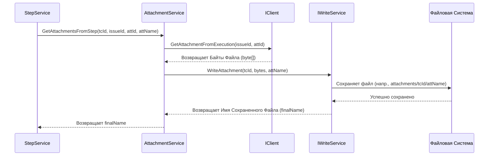

# Chapter 9: Сервис Вложений


В [предыдущей главе: Сервис Шагов Тест-кейса](08_сервис_шагов_тест_кейса_.md) мы увидели, как `StepService` детально обрабатывает инструкции внутри тест-кейса, включая работу с файлами, прикрепленными непосредственно к шагам. Он обращался за помощью к другому специалисту — **Сервису Вложений** (`AttachmentService`). В этой заключительной главе о компонентах экспорта мы подробно рассмотрим этого "сотрудника архива", который отвечает за все файлы, связанные с вашими тестами.

## Зачем нужен Сервис Вложений?

Представьте, что вы экспортируете тест-кейс, описывающий проверку загрузки изображения на сайт. В шагах могут быть такие пункты, как "1. Откройте форму загрузки. 2. Загрузите файл `test-image.png`. 3. Убедитесь, что превью отображается корректно (см. `expected-preview.jpg`)." Чтобы этот тест-кейс был полным при импорте в другую систему, нам нужны не только описания шагов, но и сами файлы `test-image.png` и `expected-preview.jpg`.

Информация о том, что эти файлы *существуют* и как они называются, приходит из Zephyr вместе с данными о тест-кейсе или его шагах ([Модели Данных Zephyr](05_модели_данных_zephyr_.md), в частности `ZephyrAttachment`). Но сами файлы (их содержимое) нужно получать отдельно.

**Проблема:** Как получить фактическое содержимое файлов, прикрепленных к тестам или шагам в Zephyr, и сохранить их локально, чтобы они были доступны после экспорта?

**Решение:** Использовать **Сервис Вложений** (`AttachmentService`).

## Что делает Сервис Вложений?

`AttachmentService` выполняет роль **сотрудника архива**:

1.  **Получает Заявку:** От [Сервиса Тест-кейсов](07_сервис_тест_кейсов_.md) или [Сервиса Шагов Тест-кейса](08_сервис_шагов_тест_кейса_.md) он получает "заявку" на обработку файла. Эта заявка содержит идентификаторы (`issueId`, `entityId`, `attachmentId`) и имя файла (`attachmentName`).
2.  **Находит Документ в Хранилище:** Используя [Клиент Zephyr API](03_клиент_zephyr_api_.md) (`IClient`), он отправляет запрос в "хранилище" Zephyr: "Дай мне содержимое файла с такими-то идентификаторами".
3.  **Получает Содержимое:** Zephyr API возвращает содержимое файла в виде **бинарных данных** (последовательности байт). Это и есть сам файл.
4.  **Делает Копию:** `AttachmentService` берет эти бинарные данные и передает их другому помощнику — `IWriteService` (сервис записи). Он говорит: "Сохрани эти данные вот с таким именем (`attachmentName`) для вот этого тест-кейса (`testCaseId`)".
5.  **Сообщает Местоположение Копии:** `IWriteService` сохраняет файл на диск (например, в папку `attachments/ИдентификаторТестКейса/ИмяФайла.ext`) и сообщает `AttachmentService` итоговое имя (или путь) сохраненного файла.
6.  **Возвращает Результат:** `AttachmentService` возвращает это имя файла тому сервису, который его изначально запросил.

Таким образом, `AttachmentService` координирует процесс получения файла из Zephyr и его сохранения на локальный диск, используя для этого клиент API и сервис записи.

## Ключевые Понятия

*   **`ZephyrAttachment`**: Это модель данных ([Модели Данных Zephyr](05_модели_данных_zephyr_.md)), которая содержит *метаданные* о вложении: его ID, имя (`Name`) и расширение (`FileExtension`). Самого файла там нет.
*   **Бинарные данные (Binary Data)**: Это фактическое содержимое файла, представленное в виде последовательности байтов. Именно эти данные скачиваются из Zephyr.
*   **`IWriteService`**: Это другой сервис (не рассматриваемый подробно в этой главе), который умеет брать бинарные данные и имя файла и сохранять их в правильное место на диске. `AttachmentService` делегирует ему задачу физической записи файла.

## Как это используется?

`AttachmentService` — это внутренний компонент, напрямую вы его не вызываете. Он используется двумя другими сервисами:

1.  **[Сервис Тест-кейсов](07_сервис_тест_кейсов_.md):** Вызывает метод `GetAttachmentsFromExecution(...)`, чтобы получить все вложения, прикрепленные *непосредственно к выполнению тест-кейса* в Zephyr.
2.  **[Сервис Шагов Тест-кейса](08_сервис_шагов_тест_кейса_.md):** Вызывает метод `GetAttachmentsFromStep(...)`, чтобы получить конкретное вложение, прикрепленное *к определенному шагу* тест-кейса.

**РассмотримInputs/Outputs:**

*   **`GetAttachmentsFromExecution(Guid testCaseId, string issueId, string entityId)`**:
    *   **Входы:**
        *   `testCaseId`: Внутренний ID (GUID) тест-кейса, к которому относятся вложения.
        *   `issueId`: ID задачи Jira.
        *   `entityId`: ID выполнения Zephyr.
    *   **Выход:** `Task<List<string>>` — Список имен файлов, которые были скачаны и сохранены `IWriteService` для этого выполнения.
*   **`GetAttachmentsFromStep(Guid testCaseId, string issueId, string attachmentId, string attachmentName)`**:
    *   **Входы:**
        *   `testCaseId`: Внутренний ID (GUID) тест-кейса.
        *   `issueId`: ID задачи Jira.
        *   `attachmentId`: ID конкретного вложения Zephyr.
        *   `attachmentName`: Имя файла вложения.
    *   **Выход:** `Task<string>` — Имя файла, которое было сохранено `IWriteService` для этого конкретного вложения.

## Под Капотом: Как "Архивариус" Копирует Файл?

Давайте посмотрим на примере, что происходит, когда [Сервис Шагов Тест-кейса](08_сервис_шагов_тест_кейса_.md) вызывает `_attachmentService.GetAttachmentsFromStep(testCaseId, "PROJ-123", "attach456", "screenshot.png")`:

1.  **Запрос Поступает:** Метод `GetAttachmentsFromStep` получает все необходимые ID и имя файла. Он логирует начало операции.
2.  **Запрос Данных Файла:** `AttachmentService` обращается к `_client` ([Клиент Zephyr API](03_клиент_zephyr_api_.md)) и вызывает `_client.GetAttachmentFromExecution("PROJ-123", "attach456")`. Обратите внимание, что даже для вложений шага API Zephyr может требовать ID задачи и ID самого вложения.
3.  **Получение Байтов:** Клиент API связывается с Zephyr, скачивает файл `screenshot.png` и возвращает его содержимое в виде массива байт (`byte[]`) сервису `AttachmentService`.
4.  **Запрос на Сохранение:** `AttachmentService` теперь имеет бинарные данные файла. Он вызывает метод `_writeService.WriteAttachment(testCaseId, attachmentBytes, "screenshot.png")`.
5.  **Сохранение Файла:** `IWriteService` берет байты, создает необходимые папки (например, `attachments/здесь_guid_testCaseId/`) и сохраняет файл под именем `screenshot.png`. Он возвращает итоговое имя файла (это может быть просто `screenshot.png` или полный путь, зависит от реализации `IWriteService`) обратно в `AttachmentService`.
6.  **Возврат Имени Файла:** `AttachmentService` получает имя сохраненного файла от `IWriteService` и возвращает его вызвавшему сервису ([Сервис Шагов Тест-кейса](08_сервис_шагов_тест_кейса_.md)).

**Диаграмма Последовательности (для `GetAttachmentsFromStep`):**



Метод `GetAttachmentsFromExecution` работает похожим образом, но сначала запрашивает у клиента *список* метаданных вложений (`List<ZephyrAttachment>`), а затем в цикле выполняет шаги 2-6 для каждого вложения из списка.

## Погружение в Код

Рассмотрим основные части кода `AttachmentService`.

**1. Интерфейс `IAttachmentService` (`Services/IAttachmentService.cs`)**

Определяет, какие операции должен уметь выполнять сервис вложений.

```csharp
// Файл: Services/IAttachmentService.cs
namespace ZephyrSquadExporter.Services;

// Контракт для сервиса, работающего с вложениями
public interface IAttachmentService
{
    // Получить вложения, прикрепленные к выполнению (тест-кейсу в цикле)
    Task<List<string>> GetAttachmentsFromExecution(Guid testCaseId, string issueId, string entityId);

    // Получить конкретное вложение, прикрепленное к шагу
    Task<string> GetAttachmentsFromStep(Guid testCaseId, string issueId, string attachmentId, string attachmentName);
}
```

*   **Объяснение:** Интерфейс объявляет два асинхронных метода: один для получения *всех* вложений выполнения (возвращает список имен) и другой для получения *одного* вложения шага (возвращает одно имя).

**2. Конструктор `AttachmentService` (`Services/AttachmentService.cs`)**

Здесь сервис получает свои зависимости.

```csharp
// Файл: Services/AttachmentService.cs
using JsonWriter; // Для IWriteService
using Microsoft.Extensions.Logging;
using ZephyrSquadExporter.Client; // Для IClient

namespace ZephyrSquadExporter.Services;

public class AttachmentService : IAttachmentService // Реализует интерфейс
{
    private readonly ILogger<AttachmentService> _logger; // Логгер
    private readonly IClient _client; // Клиент для API Zephyr
    private readonly IWriteService _writeService; // Сервис для записи на диск

    // Конструктор, вызываемый Dependency Injection
    public AttachmentService(ILogger<AttachmentService> logger, IClient client, IWriteService writeService)
    {
        _logger = logger;
        _client = client;          // Сохраняем клиент API
        _writeService = writeService; // Сохраняем сервис записи
    }

    // ... методы GetAttachmentsFromExecution и GetAttachmentsFromStep ниже ...
}
```

*   **Объяснение:** Конструктор стандартно получает и сохраняет логгер, клиент API (`IClient`) и сервис записи (`IWriteService`). Эти компоненты будут использоваться для выполнения задач сервиса.

**3. Метод `GetAttachmentsFromStep` (`Services/AttachmentService.cs`)**

Метод для обработки одного вложения из шага.

```csharp
// Файл: Services/AttachmentService.cs (продолжение)
public async Task<string> GetAttachmentsFromStep(Guid testCaseId, string issueId, string attachmentId, string attachmentName)
{
    _logger.LogInformation("Получаем вложение из шага для задачи {IssueId}, вложение ID: {AttachmentId}", issueId, attachmentId);

    // Шаг 1: Запросить бинарные данные файла у клиента API
    var attachmentBytes = await _client.GetAttachmentFromExecution(issueId, attachmentId);

    // Шаг 2: Передать данные сервису записи и получить имя сохраненного файла
    var finalFileName = await _writeService.WriteAttachment(testCaseId, attachmentBytes, attachmentName);

    // Шаг 3: Вернуть имя файла
    return finalFileName;
}
```

*   **Объяснение:** Этот код точно следует шагам 1-3 и 5-6 из диаграммы последовательности. Он вызывает `_client` для получения байтов, затем `_writeService` для их сохранения, и возвращает результат работы `_writeService`.

**4. Метод `GetAttachmentsFromExecution` (`Services/AttachmentService.cs`)**

Метод для обработки всех вложений, прикрепленных к выполнению.

```csharp
// Файл: Services/AttachmentService.cs (продолжение)
public async Task<List<string>> GetAttachmentsFromExecution(Guid testCaseId, string issueId, string entityId)
{
    _logger.LogInformation("Получаем вложения из выполнения для задачи {IssueId}", issueId);

    var listOfAttachments = new List<string>(); // Список для имен сохраненных файлов

    // Шаг A: Получить список метаданных вложений
    var attachmentsMetadata = await _client.GetAttachmentsFromExecution(issueId, entityId);

    // Шаг B: Обработать каждое вложение в цикле
    foreach (var attachment in attachmentsMetadata) // attachment - это ZephyrAttachment
    {
        // Шаг B1: Скачать байты конкретного вложения
        var attachmentBytes = await _client.GetAttachmentFromExecution(issueId, attachment.Id);

        // Шаг B2: Сохранить файл через WriteService
        var name = await _writeService.WriteAttachment(testCaseId, attachmentBytes, attachment.Name);

        // Шаг B3: Добавить имя сохраненного файла в список
        listOfAttachments.Add(name);
    }

    _logger.LogDebug("Найдено {AttachmentCount} вложений: {Attachments}", listOfAttachments.Count, listOfAttachments);

    // Шаг C: Вернуть список имен
    return listOfAttachments;
}
```

*   **Объяснение:** Этот метод сначала получает список `ZephyrAttachment` от клиента (шаг A). Затем он проходит по этому списку в цикле `foreach` (шаг B). Внутри цикла он выполняет те же действия, что и `GetAttachmentsFromStep`: скачивает байты (B1), сохраняет файл (B2) и добавляет полученное имя в итоговый список (B3). В конце (шаг C) возвращается полный список имен сохраненных файлов.

## Заключение

В этой главе мы завершили наше погружение в основные сервисы `ZephyrSquadExporter`, рассмотрев **Сервис Вложений** (`AttachmentService`). Мы узнали, что он:

*   Отвечает за получение бинарных данных файлов, прикрепленных к тест-кейсам или шагам в Zephyr.
*   Использует [Клиент Zephyr API](03_клиент_zephyr_api_.md) для скачивания файлов.
*   Делегирует задачу сохранения файлов на диск сервису `IWriteService`.
*   Возвращает имена сохраненных файлов другим сервисам ([Сервису Тест-кейсов](07_сервис_тест_кейсов_.md) и [Сервису Шагов Тест-кейса](08_сервис_шагов_тест_кейса_.md)), чтобы те могли включить ссылки на них в экспортируемые данные.
*   Работает как "архивариус", обеспечивая полноту экспорта за счет включения всех необходимых файловых вложений.

На этом мы завершаем обзор ключевых компонентов, участвующих в процессе экспорта данных из Zephyr с помощью `ZephyrSquadExporter`. Мы проследили весь путь: от запуска и конфигурации ([Глава 1](01_запуск_и_конфигурация_приложения_.md)), через координацию процесса ([Глава 2](02_процесс_экспорта_проекта_.md)) и общение с API ([Глава 3](03_клиент_zephyr_api_.md) и [Глава 4](04_менеджер_токенов_доступа_.md)), использование моделей данных ([Глава 5](05_модели_данных_zephyr_.md)), до детальной обработки папок, циклов, тест-кейсов, шагов и вложений ([Глава 6](06_сервис_папок_и_циклов_.md) - [Глава 9](09_сервис_вложений_.md)). Теперь у вас должно быть хорошее представление о том, как эта утилита устроена "под капотом".

---

Generated by [AI Codebase Knowledge Builder](https://github.com/The-Pocket/Tutorial-Codebase-Knowledge)