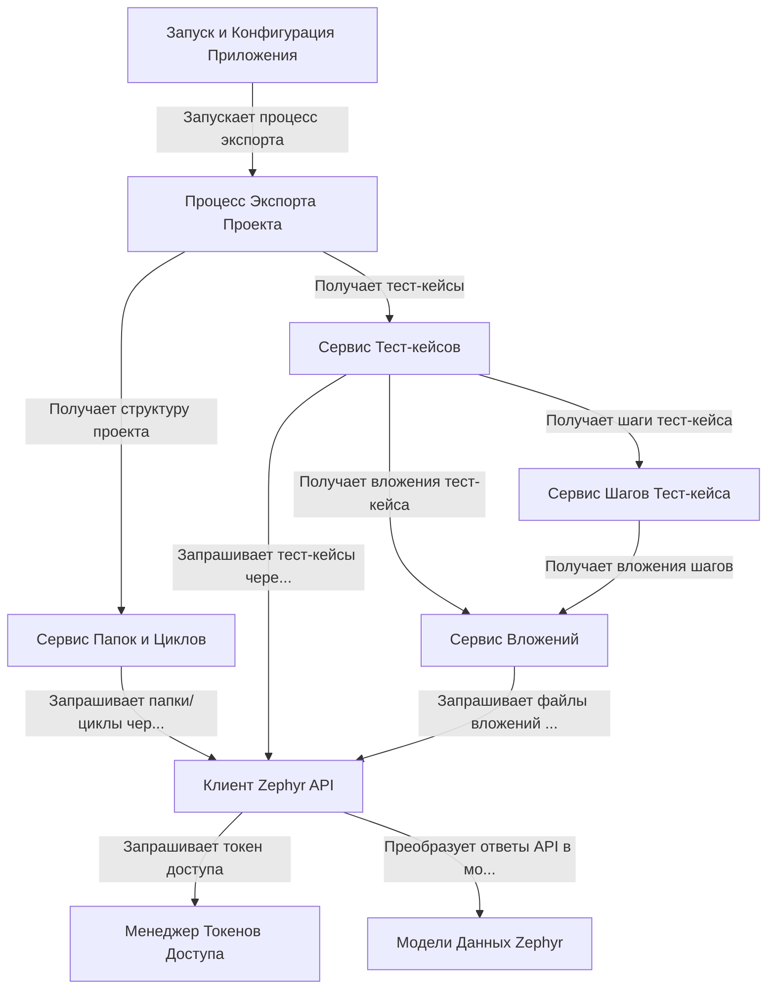

# Tutorial: ZephyrSquadExporter

**ZephyrSquadExporter** - это утилита для *экспорта* данных из **Zephyr Squad** (дополнение для Jira).
Она подключается к Zephyr через API, используя данные из файла `zephyr.config.json`, и выгружает структуру *папок*, *циклов тестирования*, *тест-кейсы*, их *шаги* и *вложения*.
Результат сохраняется в виде **JSON** файлов, готовых для импорта в другие системы, например, Test IT.

**Source Repository:** [None](None)

## Chapters

1. [Запуск и Конфигурация Приложения
](01_запуск_и_конфигурация_приложения_.md)
2. [Процесс Экспорта Проекта
](02_процесс_экспорта_проекта_.md)
3. [Клиент Zephyr API
](03_клиент_zephyr_api_.md)
4. [Менеджер Токенов Доступа
](04_менеджер_токенов_доступа_.md)
5. [Модели Данных Zephyr
](05_модели_данных_zephyr_.md)
6. [Сервис Папок и Циклов
](06_сервис_папок_и_циклов_.md)
7. [Сервис Тест-кейсов
](07_сервис_тест_кейсов_.md)
8. [Сервис Шагов Тест-кейса
](08_сервис_шагов_тест_кейса_.md)
9. [Сервис Вложений
](09_сервис_вложений_.md)

---

Generated by [AI Codebase Knowledge Builder](https://github.com/The-Pocket/Tutorial-Codebase-Knowledge)