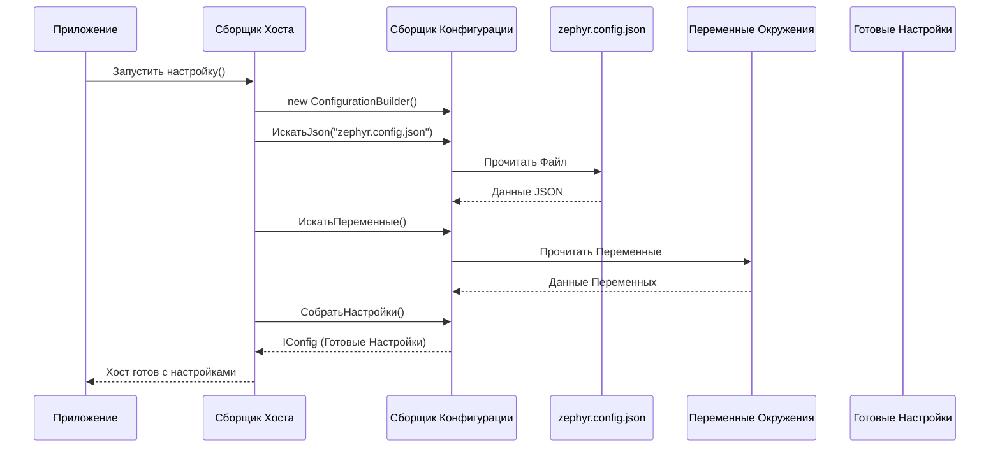

# Chapter 1: Конфигурация (Configuration)


Добро пожаловать в руководство по `ZephyrSquadServerExporter`! В этой первой главе мы разберемся с самым первым шагом: настройкой нашего инструмента. Представьте, что вы собираетесь использовать новый инструмент — вам сначала нужно его настроить, верно? Точно так же и с `ZephyrSquadServerExporter`.

## Зачем нужна конфигурация?

Прежде чем `ZephyrSquadServerExporter` сможет начать свою работу по экспорту тест-кейсов из Zephyr Squad (который работает внутри Jira), ему нужно знать несколько важных вещей:

1.  **Куда подключаться?** Какой адрес у вашего сервера Jira?
2.  **Как войти?** Какие логин и пароль или специальный ключ (токен) использовать для доступа к Jira и Zephyr?
3.  **С каким проектом работать?** В Jira может быть много проектов, нам нужно указать конкретный.
4.  **Куда сохранить результат?** В какую папку на вашем компьютере положить экспортированные данные?

Именно для этого и нужна конфигурация. Это как подробная инструкция или список настроек для нашего инструмента. Вместо того чтобы каждый раз вписывать эти данные прямо в код программы (что неудобно и небезопасно), мы используем отдельный файл настроек.

## Файл `zephyr.config.json`

Основной способ задать настройки — это создать файл с именем `zephyr.config.json` и положить его рядом с исполняемым файлом `ZephyrSquadServerExporter`. Этот файл написан в формате JSON (JavaScript Object Notation), который легко читать и человеку, и компьютеру.

Вот как может выглядеть этот файл:

**Вариант 1: Использование токена доступа**

```json
{
  "resultPath": "/Users/user01/Documents/importer",
  "zephyr": {
    "url": "https://jira.instance.ru",
    "token": "MDc2MjIxNjVzNjg40OkJCA43J4AfsIRBXomRs8bKw81+D",
    "projectKey": "PK"
  }
}
```

**Вариант 2: Использование логина и пароля**

```json
{
  "resultPath": "/Users/user01/Documents/importer",
  "zephyr": {
    "url": "https://jira.instance.ru",
    "login": "User",
    "password": "pass",
    "projectKey": "PK"
  }
}
```

Давайте разберем каждую настройку:

*   `resultPath`: Полный путь к папке на вашем компьютере, куда программа сохранит результаты экспорта (готовые файлы с тест-кейсами). Убедитесь, что эта папка существует.
*   `zephyr`: Этот блок содержит настройки для подключения к Jira/Zephyr.
    *   `url`: Адрес вашего Jira сервера. Например, `https://mycompany.atlassian.net` или `https://jira.mycompany.com`.
    *   `token`: Специальный ключ (API-токен) для доступа к Jira. Это предпочтительный и более безопасный способ аутентификации по сравнению с логином/паролем. Вы можете создать его в настройках вашего профиля Jira.
    *   `login`: Ваш логин для входа в Jira. Используйте это поле *только если* вы не используете `token`.
    *   `password`: Ваш пароль для входа в Jira. Используйте это поле *только если* вы не используете `token` и используете `login`.
    *   `projectKey`: Ключ проекта в Jira, из которого вы хотите экспортировать тесты (например, "TEST", "PROJ", "APP"). Вы можете найти его в настройках проекта Jira.

**Важно:** Используйте *либо* `token`, *либо* пару `login` и `password`. Не нужно указывать все вместе.

Преимущество использования файла `zephyr.config.json` в том, что вы можете легко изменить настройки (например, если поменялся пароль или вы хотите экспортировать другой проект), не трогая сам код программы.

## Как программа читает конфигурацию?

Когда `ZephyrSquadServerExporter` запускается, одна из первых вещей, которую он делает — это чтение настроек. За это отвечает небольшой кусочек кода в файле `Program.cs`.

```csharp
// Файл: Program.cs (упрощенный фрагмент)

private static IConfiguration SetupConfiguration()
{
    return new ConfigurationBuilder()
        // Указываем, где искать файлы конфигурации
        .SetBasePath(Directory.GetCurrentDirectory())
        // Говорим искать файл zephyr.config.json
        .AddJsonFile("zephyr.config.json")
        // Также разрешаем использовать переменные окружения
        .AddEnvironmentVariables()
        // Собираем все настройки вместе
        .Build();
}
```

Этот код выполняет следующие шаги:

1.  Создает "строителя" конфигурации (`ConfigurationBuilder`).
2.  Указывает ему искать файлы в той же папке, где запущена программа (`SetBasePath`).
3.  Просит его найти и прочитать файл `zephyr.config.json` (`AddJsonFile`).
4.  Также позволяет переопределить настройки с помощью переменных окружения (`AddEnvironmentVariables`) — это более продвинутый способ, но JSON-файл обычно удобнее для начала.
5.  Собирает (`Build`) все найденные настройки в единый объект `IConfiguration`.

Этот объект `IConfiguration` затем становится доступен другим частям программы, которым нужны эти настройки.

## Под капотом: Процесс загрузки конфигурации

Давайте представим, как происходит загрузка настроек шаг за шагом, когда вы запускаете приложение:

1.  **Запуск:** Вы запускаете `ZephyrSquadServerExporter`.
2.  **Инициализация:** Файл `Program.cs` начинает работу, вызывая метод `CreateHostBuilder`.
3.  **Настройка Сервисов:** Внутри `CreateHostBuilder` происходит настройка различных компонентов программы (сервисов).
4.  **Загрузка Конфигурации:** Вызывается наш метод `SetupConfiguration()`.
5.  **Поиск Файла:** `ConfigurationBuilder` ищет файл `zephyr.config.json` в текущей папке.
6.  **Чтение Файла:** Если файл найден, его содержимое считывается.
7.  **Поиск Переменных Окружения:** Затем проверяются переменные окружения (они могут перезаписать значения из файла).
8.  **Создание Объекта:** Все настройки объединяются в один объект `IConfiguration`.
9.  **Доступность Настроек:** Этот объект `IConfiguration` передается тем компонентам, которым он нужен, например, компоненту, отвечающему за подключение к Jira (о нем мы поговорим в главе [Клиент API (Client)](04_клиент_api__client__.md)).

Вот как это можно изобразить схематически:



## Использование конфигурации

После того как настройки загружены в объект `IConfiguration`, другие части программы могут легко их получить. Например, компонент, который подключается к Jira (мы назовем его [Клиент API (Client)](04_клиент_api__client__.md)), получает этот объект и читает из него нужные значения.

```csharp
// Файл: Client/Client.cs (упрощенный фрагмент)

public class Client : IClient
{
    private readonly string _baseUrl;
    private readonly HttpClient _client;

    // Конструктор получает готовый объект с настройками
    public Client(IConfiguration configuration)
    {
        // Получаем секцию настроек "zephyr"
        var section = configuration.GetSection("zephyr");

        // Читаем конкретные значения
        var url = section["url"];
        var projectKey = section["projectKey"];
        var token = section["token"];
        // ... (чтение логина/пароля, если нужно) ...

        _baseUrl = url.TrimEnd('/'); // Сохраняем URL
        _client = new HttpClient(); // Создаем HTTP-клиент
        _client.BaseAddress = new Uri(_baseUrl); // Устанавливаем базовый адрес

        // Добавляем заголовок авторизации (с токеном или логином/паролем)
        if (!string.IsNullOrEmpty(token))
        {
            _client.DefaultRequestHeaders.Add("Authorization", "Bearer " + token);
        }
        // ... (логика для логина/пароля) ...
        else {
            throw new ArgumentException("Не указан токен или логин/пароль в конфигурации");
        }
    }

    // ... (остальные методы клиента) ...
}
```

Как видите, компонент `Client` не знает, откуда пришли настройки — из файла или переменных окружения. Он просто просит объект `configuration` дать ему нужные значения (`url`, `token`, `projectKey`). Это делает код чище и проще для понимания.

## Заключение

В этой главе мы узнали, что такое конфигурация в `ZephyrSquadServerExporter` и зачем она нужна. Мы рассмотрели основной способ ее задания — через файл `zephyr.config.json`, разобрали его структуру и назначение каждого параметра. Мы также немного заглянули под капот, чтобы понять, как приложение читает эти настройки при запуске.

Правильная настройка конфигурации — это первый и необходимый шаг для успешного экспорта ваших данных из Zephyr Squad.

Теперь, когда мы знаем, как настроить `ZephyrSquadServerExporter`, давайте посмотрим, как он представляет данные, которые он экспортирует. В следующей главе мы рассмотрим [Модели Данных (Models)](02_модели_данных__models__.md).

---

Generated by [AI Codebase Knowledge Builder](https://github.com/The-Pocket/Tutorial-Codebase-Knowledge)