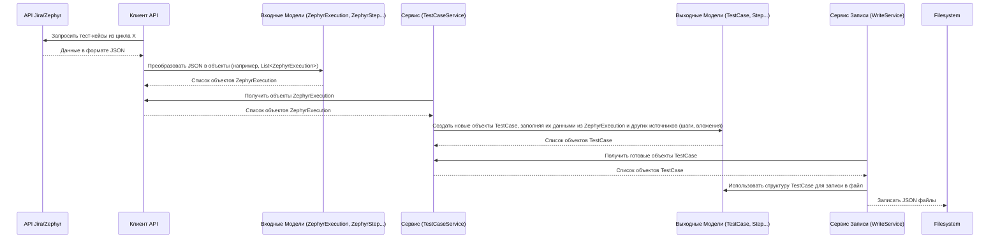

# Chapter 2: Модели Данных (Models)


В [предыдущей главе: Конфигурация (Configuration)](01_конфигурация__configuration__.md) мы научились настраивать `ZephyrSquadServerExporter`, указывая ему, куда подключаться и откуда брать данные. Теперь, когда инструмент знает *где* искать, давайте разберемся, *что* он ищет и как он понимает структуру этих данных.

Представьте, что вы получили посылку с разобранной мебелью. Чтобы ее собрать, вам нужна инструкция или чертеж, показывающий, какие детали есть и как они должны соединяться. В мире программирования такими "чертежами" для данных являются **Модели Данных**.

## Зачем нужны Модели?

Когда `ZephyrSquadServerExporter M` общается с Jira и Zephyr Squad через их API (специальный интерфейс для программ), он получает информацию в виде структурированного текста (обычно в формате JSON). Эта информация описывает проекты, тест-кейсы, шаги, папки и так далее.

Проблема в том, что программа не может просто работать с сырым текстом. Ей нужно четкое представление о том, *какие именно* данные она получила. Например, у тест-кейса есть название, описание, шаги, метки (labels). Модель данных как раз и описывает эту структуру: "У объекта 'Тест-кейс' должны быть поле 'Название' (это текст), поле 'Описание' (тоже текст), поле 'Шаги' (это список других объектов 'Шаг')".

Кроме того, данные, которые мы получаем *из* Zephyr, могут иметь одну структуру, а формат, в который мы хотим их экспортировать (например, для загрузки в другую систему), может требовать другую структуру. Поэтому у нас есть два основных типа моделей:

1.  **Модели для данных из Jira/Zephyr (Входные Модели):** Они описывают структуру данных так, как ее отдает API Jira и Zephyr.
2.  **Модели для Экспорта (Выходные Модели):** Они описывают структуру данных в том формате, в котором мы хотим получить результат (например, структуру файлов для импорта в другую систему управления тестами).

Модели помогают программе:

*   **Понимать** данные, полученные от API.
*   **Структурировать** эти данные в памяти компьютера.
*   **Преобразовывать** данные из "входного" формата Zephyr в "выходной" формат для экспорта.
*   **Проверять** (иногда), что данные имеют ожидаемый вид.

## Два Типа Моделей: Откуда и Куда

Давайте рассмотрим эти два типа моделей подробнее.

### 1. Входные Модели (Данные из Jira/Zephyr)

Это набор "чертежей", описывающих объекты, которые мы получаем из Jira и Zephyr. В коде `ZephyrSquadServerExporter` они обычно находятся в папке `Models` (внутри самого проекта `ZephyrSquadServerExporter`) и представлены C# классами.

Примеры таких моделей:

*   `JiraProject`: Описывает проект в Jira (его ключ, ID, имя).
*   `ZephyrCycle`: Описывает тестовый цикл в Zephyr (имя, ID проекта, ID версии).
*   `ZephyrFolder`: Описывает папку внутри тестового цикла.
*   `ZephyrExecution`: Описывает конкретный тест-кейс *внутри* тестового цикла (его ID задачи в Jira, название, описание из Jira).
*   `ZephyrStep`: Описывает шаг тест-кейса в Zephyr (описание шага, ожидаемый результат).
*   `JiraIssue`: Описывает общую информацию о задаче (issue) в Jira, к которой привязан тест-кейс (метки, приоритет, вложения).

**Пример:** Класс `ZephyrExecution` может выглядеть примерно так (упрощенно):

```csharp
// Файл: Models/ZephyrExecution.cs (упрощенный фрагмент)
using System.Text.Json.Serialization;

namespace ZephyrSquadServerExporter.Models;

// ... (другие части файла)

public class ZephyrExecution
{
    // Атрибут [JsonPropertyName("...")] говорит программе,
    // какому полю в JSON-данных от API соответствует это свойство класса.
    [JsonPropertyName("issueId")]
    public int IssueId { get; set; } // ID задачи в Jira, к которой относится тест-кейс

    [JsonPropertyName("id")]
    public int Id { get; set; } // ID самого выполнения (используется для получения шагов)

    [JsonPropertyName("summary")]
    public string Name { get; set; } // Название тест-кейса (берется из названия задачи Jira)

    [JsonPropertyName("issueDescription")]
    public string? Description { get; set; } // Описание тест-кейса (из описания задачи Jira)

    [JsonPropertyName("label")]
    public string Labels { get; set; } // Метки (тэги) из задачи Jira (в виде строки)

    // ... могут быть и другие поля
}
```

Этот класс говорит: "Объект `ZephyrExecution` имеет целочисленный ID задачи (`IssueId`), целочисленный ID выполнения (`Id`), текстовое название (`Name`), необязательное текстовое описание (`Description`) и текстовое поле с метками (`Labels`). Когда мы получаем JSON от API, поле `"issueId"` из JSON должно попасть в свойство `IssueId` нашего объекта".

### 2. Выходные Модели (Данные для Экспорта)

Это набор "чертежей", описывающих структуру данных в том формате, который нам нужен *на выходе*. Эти модели часто определены не в самом `ZephyrSquadServerExporter`, а во внешнем, подключаемом проекте. В нашем случае, судя по файлу `.csproj`, используется проект `Models` (который подключается строкой `<ProjectReference Include="..\Models\Models.csproj" />`). Этот внешний проект содержит стандартные модели для системы, в которую мы, вероятно, будем импортировать данные.

Примеры таких моделей (из внешнего проекта `Models`):

*   `TestCase`: Описывает тест-кейс в целевом формате (ID, имя, описание, шаги, предусловия, постусловия, атрибуты, вложения и т.д.).
*   `Section`: Описывает секцию или папку в целевой структуре.
*   `Step`: Описывает шаг тест-кейса в целевом формате (действие, ожидаемый результат, тестовые данные).
*   `Attachment`: Описывает вложение.
*   `Link`: Описывает связь с другими элементами.

**Пример:** Класс `TestCase` из внешнего проекта `Models` может выглядеть так (упрощенно):

```csharp
// Файл: ../Models/TestCase.cs (из внешнего проекта Models, упрощенный фрагмент)
// Обратите внимание, что пространства имен могут отличаться - здесь просто Models
namespace Models;

public class TestCase
{
    public Guid Id { get; set; } // Уникальный идентификатор тест-кейса в новом формате
    public string Name { get; set; } // Название тест-кейса
    public string Description { get; set; } // Описание
    public StateType State { get; set; } // Статус (например, "Готов", "Не готов")
    public PriorityType Priority { get; set; } // Приоритет (например, "Высокий", "Средний")
    public List<Step> Steps { get; set; } // Список шагов (используется модель Step из этого же проекта)
    public List<string> Tags { get; set; } // Список меток (тэгов)
    public List<Attachment> Attachments { get; set; } // Список вложений
    public Guid SectionId { get; set; } // ID секции (папки), к которой принадлежит тест-кейс

    // ... другие поля, такие как PreconditionSteps, PostconditionSteps, Attributes, Links и т.д.
}
```

Этот класс определяет финальную структуру тест-кейса, которую мы хотим получить. Заметьте, она отличается от `ZephyrExecution`. Например, здесь есть поля `State`, `Priority`, `SectionId`, которых не было напрямую в `ZephyrExecution`, а `Steps` и `Attachments` используют *другие* модели (`Step`, `Attachment`) из этого же внешнего проекта `Models`.

## Как Модели Используются в Процессе Экспорта

1.  **Получение Данных:** Когда [Клиент API (Client)](04_клиент_api__client__.md) делает запрос к Jira/Zephyr API (например, запрашивает список тест-кейсов в цикле), API возвращает данные в формате JSON. `Client` использует *входные модели* (например, `ZephyrExecution`), чтобы "разобрать" этот JSON и превратить его в список объектов C#, с которыми удобно работать в коде.
2.  **Преобразование Данных:** Затем другие компоненты, такие как [Сервис Тест-кейсов (TestCaseService)](06_сервис_тест_кейсов__testcaseservice__.md), берут эти объекты (созданные по *входным моделям*). Они обрабатывают их, возможно, запрашивают дополнительные данные (как шаги или вложения, используя другие *входные модели* вроде `ZephyrStep` или `JiraIssue`), а затем создают новые объекты, используя *выходные модели* (например, `TestCase`, `Step` из *внешнего* проекта `Models`). На этом этапе происходит основная "магия" — данные из структуры Zephyr преобразуются в целевую структуру.
3.  **Запись Результата:** Наконец, [Сервис Записи (WriteService)](08_сервис_записи__writeservice__.md) берет готовые объекты (созданные по *выходным моделям*) и записывает их в файлы (скорее всего, тоже в формате JSON), структура которых соответствует этим *выходным моделям*.

## Под Капотом: Поток Данных Через Модели

Давайте представим этот процесс схематически:



### Преобразование: От Входной к Выходной Модели

Ключевой момент — это работа сервисов, таких как `TestCaseService`. Посмотрим на очень упрощенный фрагмент кода, который иллюстрирует преобразование данных из `ZephyrExecution` (входная модель) и `JiraIssue` (еще одна входная модель) в `TestCase` (выходная модель).

```csharp
// Файл: Services/TestCaseService.cs (сильно упрощенный фрагмент)
using Models; // Используем пространство имен из внешнего проекта для выходных моделей
using ZephyrSquadServerExporter.Models; // Используем пространство имен для входных моделей
// ... другие using ...

public class TestCaseService : ITestCaseService
{
    // ... (конструктор и другие поля) ...

    public async Task<TestCase> ConvertSingleTestCase(ZephyrExecution execution, ZephyrSection section)
    {
        // 1. Получаем дополнительную информацию из Jira (метки, вложения)
        // Используем входную модель JiraIssue
        JiraIssue issue = await _client.GetIssueById(execution.IssueId.ToString());

        // 2. Получаем шаги для тест-кейса
        // Используем входную модель ZephyrStep и преобразуем во внутреннюю модель Step
        // (Предположим, _stepService.ConvertSteps возвращает List<Models.Step>)
        List<Models.Step> steps = await _stepService.ConvertSteps(Guid.NewGuid(), execution.IssueId.ToString());

        // 3. Создаем НОВЫЙ объект TestCase (выходная модель)
        var testCase = new TestCase // <-- Создаем объект выходной модели
        {
            Id = Guid.NewGuid(), // Генерируем новый ID для целевой системы

            // --- Отображение полей ---
            Name = execution.Name, // Берем имя из входной модели ZephyrExecution
            Description = execution.Description, // Описание из ZephyrExecution
            SectionId = section.Id, // ID секции, к которой относится кейс

            // Берем метки из входной модели JiraIssue
            Tags = issue.Fields.labels,

            // Используем список шагов, уже преобразованный в выходную модель Step
            Steps = steps,

            // Устанавливаем значения по умолчанию или на основе логики
            State = StateType.NotReady,
            Priority = PriorityType.Medium, // Можно усложнить логику определения приоритета

            // ... (заполнение других полей: вложения, атрибуты и т.д.)
        };

        return testCase;
    }

    // ... (остальные методы) ...
}
```

В этом примере видно, как сервис берет данные из нескольких *входных* моделей (`execution` типа `ZephyrExecution`, `issue` типа `JiraIssue`) и использует их для заполнения полей *выходной* модели (`testCase` типа `TestCase`). Это и есть суть работы с моделями в `ZephyrSquadServerExporter`: получение данных в одном формате и их преобразование в другой.

## Заключение

В этой главе мы узнали, что **Модели Данных** — это как чертежи, описывающие структуру информации, с которой работает `ZephyrSquadServerExporter`. Мы увидели, что есть два типа моделей:

*   **Входные модели:** Описывают данные, получаемые из API Jira и Zephyr (например, `ZephyrExecution`, `ZephyrStep`).
*   **Выходные модели:** Описывают данные в том формате, который нужен для экспорта (например, `TestCase`, `Section`, `Step` из внешнего проекта `Models`).

Модели помогают программе понимать, обрабатывать и преобразовывать данные на пути от Zephyr к финальным экспортированным файлам. Они обеспечивают порядок и структуру в работе с информацией.

Теперь, когда мы знаем, как настроить программу ([Глава 1](01_конфигурация__configuration__.md)) и как она представляет данные ([Глава 2](02_модели_данных__models__.md)), пора взглянуть на главный компонент, который управляет всем процессом экспорта. В следующей главе мы рассмотрим [Сервис Экспорта (ExportService)](03_сервис_экспорта__exportservice__.md).

---

Generated by [AI Codebase Knowledge Builder](https://github.com/The-Pocket/Tutorial-Codebase-Knowledge)