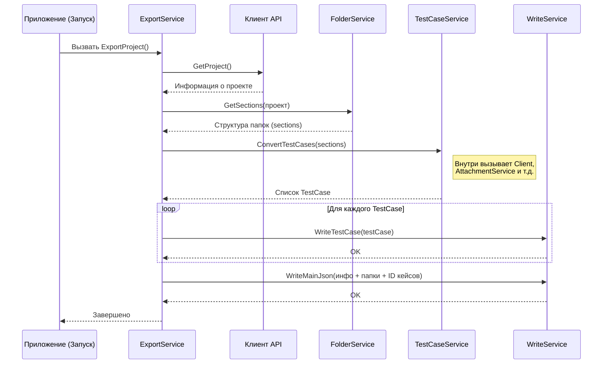

# Chapter 3: Сервис Экспорта (ExportService)


В [предыдущей главе: Модели Данных (Models)](02_модели_данных__models__.md) мы разобрались, как `ZephyrSquadServerExporter` представляет данные, которые он получает из Zephyr и которые хочет экспортировать. Мы увидели "чертежи" для тест-кейсов, папок и шагов. Теперь, когда мы знаем, как устроены данные, пора познакомиться с главным координатором всего процесса — **Сервисом Экспорта (ExportService)**.

## Дирижер Оркестра Экспорта

Представьте себе большой оркестр. Есть скрипачи, трубачи, барабанщики — каждый отвечает за свою партию. Но чтобы получилась гармоничная музыка, нужен дирижер. Он не играет сам, но он знает всю партитуру, дает команды музыкантам, задает темп и следит, чтобы все играли слаженно.

`ExportService` в `ZephyrSquadServerExporter` — это и есть такой дирижер для процесса экспорта данных. Он не занимается сам получением данных из Zephyr, не конвертирует каждый тест-кейс и не записывает файлы напрямую. Вместо этого он **руководит** другими специализированными сервисами (нашими "музыкантами"), чтобы достичь конечной цели — получения готового набора файлов с экспортированными тестами.

Зачем нужен такой координатор?

*   **Порядок:** Он гарантирует, что шаги экспорта выполняются в правильной последовательности (сначала получаем информацию о проекте, потом структуру папок, потом тест-кейсы и т.д.).
*   **Четкое разделение обязанностей:** Каждый сервис занимается своим делом. `ExportService` только управляет, а другие сервисы выполняют конкретные задачи. Это делает код более понятным и легким для поддержки.
*   **Центральная точка:** Если нам нужно понять *общий ход* процесса экспорта, достаточно посмотреть на `ExportService`.

## Как Работает `ExportService`?

`ExportService` выполняет свою работу, последовательно вызывая другие сервисы. Давайте посмотрим на основной метод `ExportProject`, который запускает весь процесс.

Представьте, что вы нажали кнопку "Экспорт". Что произойдет дальше под управлением `ExportService`?

1.  **Получить информацию о проекте:** `ExportService` говорит: "Эй, [Клиент API (Client)](04_клиент_api__client__.md), дай мне основную информацию о проекте, который указан в конфигурации (название, версии и т.д.)".
2.  **Разобраться с папками:** Получив информацию о проекте, `ExportService` просит [Сервис Папок/Секций (FolderService)](05_сервис_папок_секций__folderservice__.md): "Вот информация о проекте, теперь построй мне структуру папок (секций) для тестов".
3.  **Преобразовать тест-кейсы:** Зная структуру папок, `ExportService` обращается к [Сервису Тест-кейсов (TestCaseService)](06_сервис_тест_кейсов__testcaseservice__.md): "У нас есть папки, теперь для каждой из них найди тест-кейсы, получи их детали (шаги, вложения) и преобразуй их в наш финальный формат (используя [Выходные Модели](02_модели_данных__models__.md))".
4.  **Записать результаты:** Когда тест-кейсы готовы в нужном формате, `ExportService` командует [Сервису Записи (WriteService)](08_сервис_записи__writeservice__.md): "Вот готовые тест-кейсы и структура папок. Запиши все это аккуратно в JSON-файлы в указанную папку".

По сути, `ExportService` дергает за нужные ниточки в нужный момент.

## Заглянем в Код: `ExportService.cs`

Давайте посмотрим на упрощенный код `ExportService`, чтобы увидеть эту логику в действии.

**1. Знакомство с "Музыкантами" (Зависимости)**

Прежде чем дирижер сможет управлять оркестром, ему нужно знать, кто в нем играет. `ExportService` получает ссылки на другие сервисы, которыми он будет управлять, через специальный механизм под названием "Внедрение зависимостей" (Dependency Injection). Это происходит в его конструкторе:

```csharp
// Файл: Services/ExportService.cs (фрагмент)

using Microsoft.Extensions.Logging; // Для записи логов
using JsonWriter; // Для сервиса записи
using ZephyrSquadServerExporter.Client; // Для клиента API
using Models; // Для выходных моделей
// ... другие using ...

public class ExportService : IExportService
{
    // Приватные поля для хранения ссылок на другие сервисы
    private readonly ILogger<ExportService> _logger; // Сервис для логирования
    private readonly IClient _client; // Наш Клиент API
    private readonly IFolderService _folderService; // Сервис для работы с папками
    private readonly ITestCaseService _testCaseService; // Сервис для работы с тест-кейсами
    private readonly IWriteService _writeService; // Сервис для записи файлов

    // Конструктор: Сюда передаются готовые экземпляры нужных сервисов
    public ExportService(ILogger<ExportService> logger, IClient client,
                         IFolderService folderService, ITestCaseService testCaseService,
                         IWriteService writeService)
    {
        _logger = logger;
        _client = client; // Сохраняем ссылку на Клиент API
        _folderService = folderService; // Сохраняем ссылку на Сервис Папок
        _testCaseService = testCaseService; // Сохраняем ссылку на Сервис Тест-кейсов
        _writeService = writeService; // Сохраняем ссылку на Сервис Записи
    }

    // ... остальной код ...
}
```

Этот код показывает, что `ExportService` "знает" о существовании `IClient`, `IFolderService`, `ITestCaseService` и `IWriteService`. Когда `ExportService` создается (это происходит при запуске программы, как мы увидим), он получает готовые к работе экземпляры этих сервисов. `ILogger` используется для записи сообщений о ходе работы (например, "Начинаю экспорт", "Экспорт завершен").

**2. Главный Метод: `ExportProject()`**

Это сердце `ExportService`, где происходит вся координация.

```csharp
// Файл: Services/ExportService.cs (фрагмент)

public async Task ExportProject()
{
    _logger.LogInformation("Exporting project"); // Сообщаем, что процесс начался

    // 1. Получаем информацию о проекте от Клиента API
    var zephyrProject = await _client.GetProject();
    _logger.LogInformation("Получена информация о проекте: {ProjectName}", zephyrProject.Name);

    // 2. Получаем структуру папок (секций) от Сервиса Папок
    var sections = await _folderService.GetSections(zephyrProject.Versions, zephyrProject.Id);
    _logger.LogInformation("Получена структура папок");

    // 3. Конвертируем тест-кейсы с помощью Сервиса Тест-кейсов
    // Передаем ему все найденные секции
    var testCases = await _testCaseService.ConvertTestCases(sections.AllSections);
    _logger.LogInformation("Конвертировано {Count} тест-кейсов", testCases.Count);

    // 4. Записываем каждый тест-кейс в отдельный файл с помощью Сервиса Записи
    foreach (var testCase in testCases)
    {
        await _writeService.WriteTestCase(testCase);
    }
    _logger.LogInformation("Записаны файлы отдельных тест-кейсов");

    // 5. Готовим корневой объект для главного файла (index.json)
    var root = new Root // Используем модель Root из библиотеки Models
    {
        ProjectName = zephyrProject.Name, // Имя проекта
        TestCases = testCases.Select(t => t.Id).ToList(), // Список ID всех тест-кейсов
        SharedSteps = new List<Guid>(), // Общие шаги (в данном случае пустой список)
        Attributes = new List<Attribute>(), // Атрибуты (в данном случае пустой список)
        Sections = sections.SectionsTree // Иерархия папок
    };

    // 6. Записываем главный файл index.json с помощью Сервиса Записи
    await _writeService.WriteMainJson(root);
    _logger.LogInformation("Записан главный файл index.json");

    _logger.LogInformation("Exporting project complete"); // Сообщаем о завершении
}
```

Давайте разберем шаги этого метода:

1.  **`_client.GetProject()`:** Вызывает [Клиент API (Client)](04_клиент_api__client__.md), чтобы получить данные о проекте Zephyr. Результат сохраняется в `zephyrProject`.
2.  **`_folderService.GetSections(...)`:** Вызывает [Сервис Папок/Секций (FolderService)](05_сервис_папок_секций__folderservice__.md), передавая ему информацию о версиях проекта и его ID. Получает обратно структуру папок (`sections`).
3.  **`_testCaseService.ConvertTestCases(...)`:** Вызывает [Сервис Тест-кейсов (TestCaseService)](06_сервис_тест_кейсов__testcaseservice__.md), передавая ему список всех секций. Этот сервис внутри себя запросит детали каждого тест-кейса (опять же, используя `Client`), шаги, вложения ([Сервис Вложений (AttachmentService)](07_сервис_вложений__attachmentservice__.md)) и преобразует их в [Выходные Модели](02_модели_данных__models__.md) `TestCase`. Возвращается список готовых `TestCase`.
4.  **Цикл `foreach` с `_writeService.WriteTestCase(testCase)`:** Для каждого готового объекта `TestCase`, вызывает [Сервис Записи (WriteService)](08_сервис_записи__writeservice__.md), чтобы записать этот тест-кейс в отдельный файл.
5.  **Создание объекта `Root`:** Собирает общую информацию (имя проекта, список ID всех тест-кейсов, структуру папок) в один объект `Root`. Эта модель (`Root`) приходит из той же внешней библиотеки `Models`, что и `TestCase`.
6.  **`_writeService.WriteMainJson(root)`:** Снова вызывает [Сервис Записи (WriteService)](08_сервис_записи__writeservice__.md), чтобы записать объект `Root` в главный файл `index.json`.

Как видите, `ExportService` сам не выполняет сложной логики получения или преобразования данных, он лишь координирует работу других сервисов.

## Под Капотом: Поток Управления

Давайте визуализируем, как `ExportService` взаимодействует с другими компонентами во время вызова `ExportProject()`:



Эта диаграмма показывает, как `ExportService` последовательно обращается к `Client`, `FolderService`, `TestCaseService` и `WriteService`, передавая им нужные данные и получая результаты для следующего шага.

### Где Создаются Сервисы?

Вы можете задаться вопросом: а откуда `ExportService` берет готовые `Client`, `FolderService` и другие? Это настраивается при старте приложения в файле `Program.cs`. Помните метод `CreateHostBuilder` из [Главы 1](01_конфигурация__configuration__.md)? Там есть специальная часть, которая "регистрирует" все наши сервисы:

```csharp
// Файл: Program.cs (фрагмент)

static IHostBuilder CreateHostBuilder(string[] strings)
{
    // ... (настройка логирования и конфигурации) ...
    .ConfigureServices((_, services) =>
    {
        // Здесь мы говорим: "Когда кому-то понадобится IExportService,
        // создай и дай ему один экземпляр ExportService".
        services.AddSingleton<IExportService, ExportService>();

        // То же самое для других сервисов:
        services.AddSingleton<IClient, Client.Client>();
        services.AddSingleton<IFolderService, FolderService>();
        services.AddSingleton<ITestCaseService, TestCaseService>();
        services.AddSingleton<IWriteService, WriteService>();
        services.AddSingleton<IAttachmentService, AttachmentService>();
        // ... и другие ...

        // Регистрируем и главный класс приложения
        services.AddSingleton<App>();
        // Регистрируем конфигурацию
        services.AddSingleton(SetupConfiguration());
    });
}
```

`AddSingleton` означает, что будет создан только один экземпляр каждого сервиса на все время работы приложения. Когда .NET создает `ExportService`, он видит, что тому нужны `IClient`, `IFolderService` и т.д., находит их в этом списке зарегистрированных сервисов и автоматически передает их в конструктор `ExportService`. Этот механизм называется **Внедрение Зависимостей (Dependency Injection)** и помогает сделать код гибким и слабо связанным (сервисы зависят от интерфейсов, а не конкретных реализаций).

## Заключение

В этой главе мы познакомились с `ExportService` — главным дирижером процесса экспорта в `ZephyrSquadServerExporter`. Мы узнали, что он не выполняет тяжелую работу сам, а координирует действия других специализированных сервисов:

*   [Клиент API (Client)](04_клиент_api__client__.md) для получения данных из Zephyr/Jira.
*   [Сервис Папок/Секций (FolderService)](05_сервис_папок_секций__folderservice__.md) для построения структуры папок.
*   [Сервис Тест-кейсов (TestCaseService)](06_сервис_тест_кейсов__testcaseservice__.md) для конвертации тестов (с помощью других сервисов, как [Сервис Вложений (AttachmentService)](07_сервис_вложений__attachmentservice__.md)).
*   [Сервис Записи (WriteService)](08_сервис_записи__writeservice__.md) для сохранения результатов в файлы.

`ExportService` обеспечивает правильную последовательность шагов и связывает воедино работу всех остальных компонентов.

Теперь, когда мы увидели общую картину и роль дирижера, давайте подробнее рассмотрим первого "музыканта" в нашем оркестре — компонент, который непосредственно общается с Zephyr и Jira. В следующей главе мы погрузимся в [Клиент API (Client)](04_клиент_api__client__.md).

---

Generated by [AI Codebase Knowledge Builder](https://github.com/The-Pocket/Tutorial-Codebase-Knowledge)