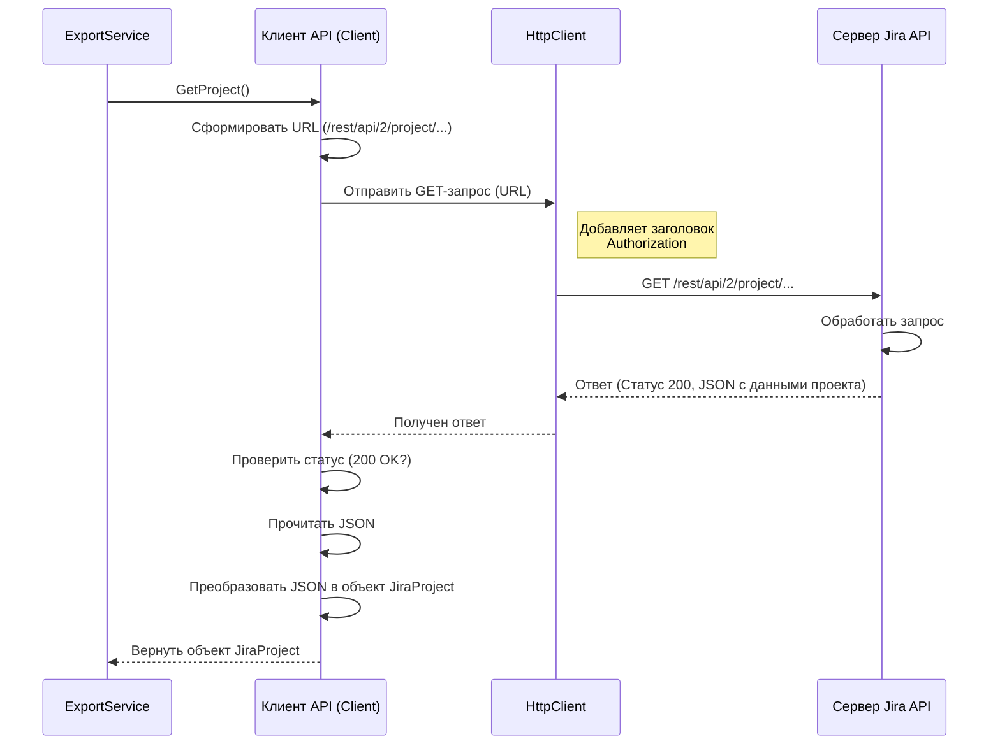

# Chapter 4: Клиент API (Client)


В [предыдущей главе: Сервис Экспорта (ExportService)](03_сервис_экспорта__exportservice__.md) мы познакомились с "дирижером" нашего процесса — `ExportService`. Мы видели, как он руководит другими сервисами, чтобы выполнить экспорт. Но кто именно выполняет команды дирижера, когда нужно получить данные с удаленного сервера? Кто тот "посол", который идет в Jira и Zephyr Squad и приносит оттуда нужную информацию?

Эту роль выполняет **Клиент API (Client)**. Это наш специалист по общению с внешним миром, а точнее — с API (Application Programming Interface) Jira и Zephyr Squad.

## Зачем нужен Клиент API? Проблема общения

Представьте, что наша программа `ZephyrSquadServerExporter` хочет получить список всех тест-кейсов из определенного проекта в Jira. Она не может просто "подумать" об этом и получить данные. Ей нужно:

1.  Знать точный "сетевой адрес" сервера Jira.
2.  Знать, как "представиться" этому серверу (использовать логин/пароль или специальный ключ-токен).
3.  Знать, на каком "языке" (формате запросов) общаться с API Jira и Zephyr, чтобы запросить именно список тест-кейсов.
4.  Уметь "понять" ответ сервера (который обычно приходит в текстовом формате JSON) и преобразовать его во что-то полезное для программы.

Выполнять все эти шаги напрямую в каждом месте программы, где нужны данные из Jira, было бы очень сложно и неудобно. Код стал бы запутанным и повторяющимся.

Именно эту проблему решает **Клиент API (Client)**. Он берет на себя всю сложность общения с удаленным сервером. Другие части программы (например, `ExportService`) просто говорят Клиенту: "Пожалуйста, принеси мне информацию о проекте" или "Дай мне список папок для этого цикла", а Клиент уже сам разбирается, как это сделать.

Думайте о Клиенте как о **курьере** или **переводчике**:

*   Он знает точный адрес Jira (из [Конфигурации](01_конфигурация__configuration__.md)).
*   У него есть "пропуск" для входа (данные аутентификации из [Конфигурации](01_конфигурация__configuration__.md)).
*   Он знает, как правильно сформулировать запрос на "языке API" Jira/Zephyr.
*   Он получает ответ, "переводит" его на понятный программе язык (в объекты C#, используя [Входные Модели Данных](02_модели_данных__models__.md)) и доставляет его тому, кто запрашивал.

## Основные задачи Клиента API

Клиент API отвечает за несколько ключевых вещей:

1.  **Подключение и Аутентификация:** При запуске он читает URL сервера Jira, а также токен или логин/пароль из [Конфигурации](01_конфигурация__configuration__.md) и настраивает способ "представления" себя серверу при каждом запросе.
2.  **Отправка Запросов:** Он формирует и отправляет HTTP-запросы (в основном GET-запросы для получения данных) на правильные адреса (эндпоинты) API Jira и Zephyr.
3.  **Обработка Ответов:** Он получает ответы от сервера, проверяет, был ли запрос успешным (например, код ответа 200 OK), и читает данные ответа (обычно в формате JSON).
4.  **Десериализация:** Он превращает текстовый JSON-ответ в структурированные объекты C#, используя классы из папки `Models` ([Входные Модели Данных](02_модели_данных__models__.md)). Например, JSON с информацией о проекте превращается в объект `JiraProject`.
5.  **Обработка Ошибок:** Если что-то пошло не так (например, сервер недоступен, неверный URL, ошибка аутентификации), Клиент сообщает об ошибке (логирует ее и/или "выбрасывает" исключение), чтобы остальная часть программы знала о проблеме.

## Настройка Клиента: Откуда он знает куда идти?

Как мы упомянули, Клиент берет адрес сервера и данные для входа из [Конфигурации](01_конфигурация__configuration__.md). Это происходит один раз при создании объекта `Client`, в его **конструкторе**. Вспомните, как в `Program.cs` мы регистрировали сервисы:

```csharp
// Файл: Program.cs (упрощенный фрагмент)
services.AddSingleton<IConfiguration>(SetupConfiguration()); // Регистрируем конфигурацию
services.AddSingleton<IClient, Client.Client>();           // Регистрируем Клиент API
```

Когда .NET создает экземпляр `Client.Client`, он автоматически передает ему уже готовый объект `IConfiguration`. Конструктор Клиента использует этот объект для чтения настроек.

```csharp
// Файл: Client/Client.cs (упрощенный фрагмент конструктора)
using Microsoft.Extensions.Configuration;
using Microsoft.Extensions.Logging;
using System.Text;
using ZephyrSquadServerExporter.Models; // Используем для моделей

namespace ZephyrSquadServerExporter.Client;

public class Client : IClient
{
    private readonly ILogger<Client> _logger; // Для записи логов
    private readonly string _baseUrl; // Адрес сервера Jira
    private readonly string _projectKey; // Ключ нужного проекта
    private readonly HttpClient _client; // Инструмент для отправки HTTP-запросов

    // Конструктор получает логгер и конфигурацию
    public Client(ILogger<Client> logger, IConfiguration configuration)
    {
        _logger = logger;

        // Получаем секцию "zephyr" из конфигурации
        var section = configuration.GetSection("zephyr");

        // Читаем URL, проверяем что он указан
        var url = section["url"];
        if (string.IsNullOrEmpty(url)) { /* ... обработка ошибки ... */ }

        // Читаем ключ проекта, проверяем что он указан
        var projectKey = section["projectKey"];
        if (string.IsNullOrEmpty(projectKey)) { /* ... обработка ошибки ... */ }

        // Читаем данные для аутентификации (токен ИЛИ логин/пароль)
        var token = section["token"];
        var login = section["login"];
        var password = section["password"];

        _baseUrl = url.TrimEnd('/');    // Сохраняем URL (удаляем / в конце, если есть)
        _projectKey = projectKey;       // Сохраняем ключ проекта

        _client = new HttpClient();             // Создаем HTTP-клиент
        _client.BaseAddress = new Uri(_baseUrl); // Устанавливаем базовый адрес

        // Настраиваем заголовок Authorization для аутентификации
        if (!string.IsNullOrEmpty(token)) // Если есть токен
        {
            _client.DefaultRequestHeaders.Add("Authorization", "Bearer " + token);
        }
        else if (!string.IsNullOrEmpty(login) && !string.IsNullOrEmpty(password)) // Если есть логин и пароль
        {
            // Кодируем логин:пароль в Base64 для Basic-аутентификации
            var basicAuthValue = Convert.ToBase64String(Encoding.ASCII.GetBytes($"{login}:{password}"));
            _client.DefaultRequestHeaders.Add("Authorization", "Basic " + basicAuthValue);
        }
        else // Если ни токена, ни логина/пароля нет
        {
            throw new ArgumentException("Не указан токен или логин/пароль в конфигурации");
        }

        _logger.LogInformation("Клиент API настроен для {BaseUrl}", _baseUrl);
    }

    // ... остальные методы Клиента (GetProject, GetCycles и т.д.) ...
}
```

Этот код показывает, как Клиент при "рождении" сразу получает все необходимое: адрес сервера, ключ проекта и способ аутентификации. Он создает и настраивает внутренний объект `HttpClient`, который будет использоваться для всех последующих запросов.

## Как использовать Клиент? Пример: Получение информации о проекте

Давайте посмотрим, как другой сервис, например, [Сервис Экспорта (ExportService)](03_сервис_экспорта__exportservice__.md), использует Клиент для получения базовой информации о проекте Jira.

Вспомним фрагмент из `ExportService`:

```csharp
// Файл: Services/ExportService.cs (упрощенный фрагмент)
public class ExportService : IExportService
{
    private readonly IClient _client; // Поле для хранения ссылки на Клиент
    // ... другие поля и конструктор ...

    public async Task ExportProject()
    {
        _logger.LogInformation("Exporting project");

        // === Вот здесь используется Клиент ===
        // Просто вызываем метод GetProject() у нашего клиента
        var zephyrProject = await _client.GetProject();
        // =====================================

        _logger.LogInformation("Получена информация о проекте: {ProjectName}", zephyrProject.Name);

        // ... дальнейшие шаги экспорта ...
    }
}
```

Как видите, для `ExportService` все очень просто: он просто вызвал метод `_client.GetProject()`. Ему не нужно знать URL, как происходит аутентификация или как разбирается ответ. Он просто попросил Клиента и получил готовый результат — объект `zephyrProject` типа `JiraProject` ([Входная Модель Данных](02_модели_данных__models__.md)), содержащий ID, ключ и имя проекта.

## Под капотом: Что происходит при вызове `GetProject()`?

Давайте заглянем глубже и посмотрим, что делает сам Клиент, когда `ExportService` вызывает его метод `GetProject()`.

**Шаг за шагом:**

1.  **Вызов метода:** `ExportService` вызывает `_client.GetProject()`.
2.  **Логирование:** Клиент записывает в лог сообщение о том, что он начинает получать информацию о проекте, используя ключ `_projectKey`.
3.  **Формирование URL:** Клиент берет базовый адрес (`_baseUrl`, например, `https://jira.mycompany.com`) и добавляет к нему путь к API для получения информации о проекте (`/rest/api/2/project/{_projectKey}`). Получается полный URL, например: `https://jira.mycompany.com/rest/api/2/project/MYPROJ`.
4.  **Отправка запроса:** Внутренний `HttpClient` (`_client`) отправляет HTTP GET-запрос на этот URL. `HttpClient` автоматически добавляет к запросу заголовок `Authorization` (с токеном или логином/паролем), который был настроен в конструкторе.
5.  **Ожидание ответа:** Программа ждет, пока сервер Jira обработает запрос и пришлет ответ.
6.  **Получение ответа:** Клиент получает ответ от сервера.
7.  **Проверка статуса:** Клиент проверяет код состояния ответа. Если это код успеха (например, 200 OK), то все хорошо. Если код ошибки (например, 401 Unauthorized - неверный токен, 404 Not Found - неверный URL или ключ проекта, 500 Internal Server Error - проблема на сервере), Клиент записывает ошибку в лог и генерирует исключение.
8.  **Чтение данных:** Если запрос был успешным, Клиент читает тело ответа. Это строка в формате JSON, например: `{"id": "10001", "key": "MYPROJ", "name": "Мой Проект", ...}`.
9.  **Десериализация:** Клиент использует встроенную библиотеку `System.Text.Json` для преобразования этой JSON-строки в объект C# типа `JiraProject` ([Входная Модель Данных](02_модели_данных__models__.md)). Библиотека сама сопоставляет поля JSON (`"id"`, `"key"`, `"name"`) со свойствами класса `JiraProject` (`Id`, `Key`, `Name`).
10. **Логирование результата:** Клиент может записать в лог (на уровне Debug), что проект успешно найден.
11. **Возврат результата:** Клиент возвращает созданный объект `JiraProject` тому, кто его вызывал (`ExportService`).

**Визуализация процесса:**



**Как это выглядит в коде `Client.cs`:**

```csharp
// Файл: Client/Client.cs (упрощенный фрагмент метода GetProject)

// Импортируем JsonSerializer для работы с JSON
using System.Text.Json;
// Импортируем наши входные модели
using ZephyrSquadServerExporter.Models;

public class Client : IClient
{
    // ... (поля и конструктор, как мы видели ранее) ...

    public async Task<JiraProject> GetProject()
    {
        _logger.LogInformation("Получение проекта по ключу {ProjectKey}", _projectKey);

        // 3. Формируем относительный путь к API
        var relativeUrl = $"/rest/api/2/project/{_projectKey}";

        // 4. Отправляем GET-запрос с помощью HttpClient
        // BaseAddress добавится автоматически
        var response = await _client.GetAsync(relativeUrl);

        // 7. Проверяем, успешен ли запрос
        if (!response.IsSuccessStatusCode)
        {
            // Если нет - логируем ошибку и выбрасываем исключение
            _logger.LogError("Ошибка при получении проекта {ProjectKey}. Статус: {StatusCode}. Ответ: {Response}",
                _projectKey, response.StatusCode, await response.Content.ReadAsStringAsync());
            throw new Exception($"Ошибка получения проекта {_projectKey}. Статус: {response.StatusCode}");
        }

        // 8. Читаем тело ответа как строку
        var content = await response.Content.ReadAsStringAsync();

        // 9. Десериализуем JSON-строку в объект JiraProject
        var project = JsonSerializer.Deserialize<JiraProject>(content);

        _logger.LogDebug("Найден проект {@ProjectId}", project);

        // 11. Возвращаем результат
        return project;
    }

    // ... (другие методы: GetCycles, GetFolders, GetTestCasesFromCycle и т.д.) ...
    // Все они работают по схожему принципу:
    // 1. Сформировать URL для нужного ресурса API
    // 2. Отправить GET-запрос
    // 3. Проверить ответ
    // 4. Прочитать JSON
    // 5. Десериализовать JSON в соответствующую модель (ZephyrCycle, List<ZephyrFolder>...)
    // 6. Вернуть результат
}
```

Как видите, метод `GetProject` четко следует описанным шагам. Он инкапсулирует (скрывает) всю логику HTTP-взаимодействия и работы с JSON, предоставляя простой способ получить данные о проекте. Другие методы (`GetCycles`, `GetFolders`, `GetTestCasesFromCycle`, `GetSteps` и т.д., которые определены в интерфейсе `IClient`) работают по тому же принципу, но используют другие URL API и другие [Входные Модели Данных](02_модели_данных__models__.md) для десериализации ответов.

## Заключение

В этой главе мы подробно рассмотрели **Клиент API (Client)** — важнейший компонент `ZephyrSquadServerExporter`, отвечающий за все внешние коммуникации. Мы узнали, что:

*   Клиент выступает в роли "посла" или "курьера" к серверу Jira и Zephyr Squad API.
*   Он берет на себя всю сложность отправки запросов, аутентификации, получения ответов и их преобразования в понятные программе объекты C# ([Входные Модели Данных](02_модели_данных__models__.md)).
*   Он получает необходимые настройки (URL, токен/логин) из [Конфигурации](01_конфигурация__configuration__.md).
*   Другие сервисы (как [ExportService](03_сервис_экспорта__exportservice__.md)) используют Клиент через простой интерфейс (`IClient`), не вдаваясь в детали сетевого взаимодействия.

Клиент API — это фундамент, на котором строятся все операции по извлечению данных из Zephyr. Без него наша программа была бы "немой" и не смогла бы получить нужную информацию.

Теперь, когда мы знаем, как `ZephyrSquadServerExporter` общается с Jira, мы готовы посмотреть, как он использует эту возможность для получения структуры папок (секций) для тест-кейсов. В следующей главе мы изучим [Сервис Папок/Секций (FolderService)](05_сервис_папок_секций__folderservice__.md).

---

Generated by [AI Codebase Knowledge Builder](https://github.com/The-Pocket/Tutorial-Codebase-Knowledge)