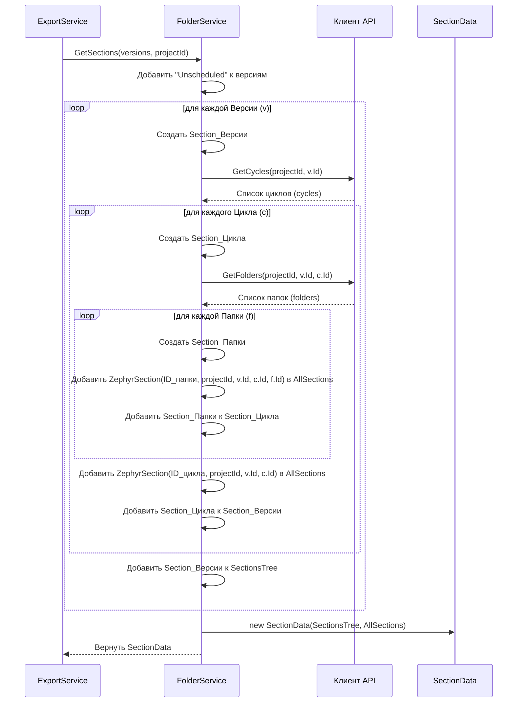

# Chapter 5: Сервис Папок/Секций (FolderService)


В [предыдущей главе: Клиент API (Client)](04_клиент_api__client__.md) мы узнали, как наш "посол", `Client`, получает сырую информацию из Jira и Zephyr Squad. Он приносит нам списки версий, циклов, папок и тест-кейсов. Но эта информация приходит в том виде, как ее хранит Zephyr. Что если система, в которую мы хотим импортировать тесты (назовем ее "целевая система", например, Test IT), ожидает другую структуру папок?

Представьте, что вы переезжаете из дома, где книги расставлены по комнатам (Версия), затем по шкафам (Цикл) и по полкам (Папка), в новый дом, где все книги должны быть просто в библиотеке, но рассортированы по логическим разделам (Секции), возможно, с вложенными подразделами. Нужен кто-то, кто возьмет старую схему и перестроит ее в новую.

Именно этим и занимается **Сервис Папок/Секций (FolderService)**.

## Зачем нужен `FolderService`? Проблема организации

Zephyr Squad организует тест-кейсы в иерархии:

1.  **Версия** (Release/Version в Jira, к которой привязаны тесты)
2.  **Тестовый Цикл** (Test Cycle внутри версии)
3.  **Папка** (Folder внутри тестового цикла)

Целевая система, для которой `ZephyrSquadServerExporter` готовит данные, скорее всего, использует другую, возможно, более простую структуру, часто называемую **Секциями** (Sections). Эти секции могут быть вложенными друг в друга, образуя дерево папок.

`FolderService` решает задачу **преобразования** иерархии "Версия -> Цикл -> Папка" из Zephyr в иерархическую структуру "Секций", понятную целевой системе. Он действует как наш **библиотекарь-архитектор**: проходит по всем "комнатам", "шкафам" и "полкам" старой системы и создает новый, логичный каталог (дерево секций) для "библиотеки" в новом доме.

## Что делает `FolderService`?

1.  **Получает Структуру из Zephyr:** Используя [Клиент API (Client)](04_клиент_api__client__.md), `FolderService` запрашивает список версий проекта, затем для каждой версии — список ее тестовых циклов, и для каждого цикла — список вложенных папок.
2.  **Строит Дерево Секций:** На основе полученной информации он создает структуру вложенных объектов `Section` ([Выходная Модель](02_модели_данных__models__.md)). Эта структура (`SectionsTree`) соответствует требуемому формату для целевой системы.
    *   Версия Zephyr обычно становится секцией верхнего уровня.
    *   Цикл внутри версии становится вложенной секцией.
    *   Папка внутри цикла становится еще более вложенной секцией.
3.  **Создает Плоский Список Ссылок:** Одновременно с построением дерева, `FolderService` создает "плоский" список `AllSections` ([Внутренняя Модель](02_модели_данных__models__.md) `ZephyrSection`). Каждый элемент этого списка содержит ID созданной секции и оригинальные ID версии, цикла и папки из Zephyr, которым она соответствует. Этот список нужен позже [Сервису Тест-кейсов (TestCaseService)](06_сервис_тест_кейсов__testcaseservice__.md), чтобы быстро определить, в какую новую секцию поместить тест-кейс, зная его исходное расположение в Zephyr.
4.  **Обрабатывает "Нераспределенные" Тесты:** Zephyr позволяет тестам не принадлежать ни к одной версии (Unscheduled). `FolderService` специально создает для таких тестов отдельную секцию верхнего уровня (обычно с названием "Unscheduled"), чтобы они тоже были включены в экспорт.

## Как `FolderService` используется?

Главный координатор, [Сервис Экспорта (ExportService)](03_сервис_экспорта__exportservice__.md), вызывает `FolderService` после получения основной информации о проекте.

```csharp
// Файл: Services/ExportService.cs (упрощенный фрагмент)

public class ExportService : IExportService
{
    // ... другие сервисы ...
    private readonly IFolderService _folderService; // Ссылка на Сервис Папок

    // Конструктор получает FolderService
    public ExportService(..., IFolderService folderService, ...)
    {
        // ...
        _folderService = folderService;
        // ...
    }

    public async Task ExportProject()
    {
        _logger.LogInformation("Exporting project");

        // 1. Получаем инфо о проекте (и его версии) от Клиента
        var zephyrProject = await _client.GetProject();

        // === 2. Вызываем FolderService ===
        // Передаем список версий проекта и ID проекта
        var sectionData = await _folderService.GetSections(zephyrProject.Versions, zephyrProject.Id);
        // ==================================

        _logger.LogInformation("Получена структура папок");

        // 3. Используем результат для конвертации тест-кейсов
        var testCases = await _testCaseService.ConvertTestCases(sectionData.AllSections);

        // ... дальнейшая запись данных ...
        // Дерево секций используется при записи главного файла index.json
        var root = new Root
        {
            // ...
            Sections = sectionData.SectionsTree // Используем дерево секций
        };
        // ...
    }
}
```

**Что происходит:**

*   `ExportService` вызывает метод `_folderService.GetSections()`.
*   В качестве входных данных передается список версий (`zephyrProject.Versions`) и ID проекта (`zephyrProject.Id`), полученные ранее от [Клиента API](04_клиент_api__client__.md).
*   `FolderService` выполняет свою работу (опрашивает `Client`, строит структуру).
*   Он возвращает объект `SectionData`.

**Что такое `SectionData`?**

Это простая модель, которая содержит два результата работы `FolderService`:

```csharp
// Файл: Models\SectionData.cs
using Models; // Пространство имен для выходных моделей (Section)

namespace ZephyrSquadServerExporter.Models;

public class SectionData
{
    // 1. Структура папок в виде дерева (для index.json)
    public List<Section> SectionsTree { get; set; }

    // 2. Плоский список всех созданных секций с их Zephyr-координатами
    // (для TestCaseService)
    public List<ZephyrSection> AllSections { get; set; }
}
```

Этот объект `SectionData` затем используется в `ExportService`:
*   `sectionData.AllSections` передается в `TestCaseService`, чтобы он мог правильно сопоставить тест-кейсы с новыми секциями.
*   `sectionData.SectionsTree` используется при формировании итогового файла `index.json`, описывающего структуру проекта в целевой системе.

## Под Капотом: Как Строится Структура?

Давайте представим, как `FolderService` действует шаг за шагом, когда `ExportService` вызывает `GetSections()`:

1.  **Начало:** `FolderService` получает список версий проекта и ID проекта.
2.  **"Unscheduled":** `FolderService` первым делом добавляет фиктивную "версию" с именем "Unscheduled" и ID "-1" в начало списка. Это нужно для обработки тестов, не привязанных к версии.
3.  **Цикл по Версиям:** Для каждой версии (включая "Unscheduled"):
    *   Создается объект `Section` ([Выходная Модель](02_модели_данных__models__.md)) для этой версии. Ей присваивается имя версии и генерируется уникальный ID (`Guid.NewGuid()`).
    *   **Запрос Циклов:** `FolderService` обращается к [Клиенту API](04_клиент_api__client__.md), чтобы получить список тестовых циклов для *текущей* версии и ID проекта.
    *   **Цикл по Циклам:** Для каждого найденного цикла:
        *   Создается вложенный объект `Section` для этого цикла. Ему присваивается имя цикла и генерируется уникальный ID.
        *   **Запрос Папок:** `FolderService` снова обращается к [Клиенту API](04_клиент_api__client__.md), чтобы получить список папок для *текущего* цикла (используя ID проекта, версии и цикла).
        *   **Цикл по Папкам:** Для каждой найденной папки:
            *   Создается еще один вложенный объект `Section` для папки. Ему присваивается имя папки и генерируется уникальный ID.
            *   **Сохранение Ссылки (Папка):** Создается объект `ZephyrSection` ([Внутренняя Модель](02_модели_данных__models__.md)), который хранит *новый* ID секции папки и *старые* ID проекта, версии, цикла и папки. Этот объект добавляется в плоский список `_allSections`.
            *   Созданная секция папки добавляется в список дочерних секций (`Sections`) для секции текущего цикла.
        *   **Сохранение Ссылки (Цикл без папок):** Если у цикла не было папок, или для представления самого цикла, создается объект `ZephyrSection`, который хранит *новый* ID секции цикла и *старые* ID проекта, версии и цикла (ID папки будет отсутствовать или пустым). Этот объект добавляется в плоский список `_allSections`.
        *   Созданная секция цикла (со всеми ее дочерними секциями-папками) добавляется в список дочерних секций (`Sections`) для секции текущей версии.
    *   Готовая секция версии (со всеми ее дочерними секциями циклов и папок) добавляется в итоговый список секций `listOfSections`.
4.  **Результат:** После обработки всех версий, `FolderService` создает объект `SectionData`, помещая в него:
    *   `SectionsTree`: Построенный иерархический список `listOfSections`.
    *   `AllSections`: Накопленный плоский список `_allSections`.
5.  **Возврат:** `FolderService` возвращает объект `SectionData` вызвавшему его `ExportService`.

**Визуализация процесса:**



## Погружение в код `FolderService`

Давайте посмотрим на упрощенные части кода, реализующие эту логику.

**1. Конструктор и Поля**

Сервис получает необходимые зависимости ([Клиент API](04_клиент_api__client__.md) и логгер) и инициализирует пустой список для `_allSections`.

```csharp
// Файл: Services/FolderService.cs (фрагмент)
using Microsoft.Extensions.Logging;
using Models; // Выходные модели (Section, Step)
using ZephyrSquadServerExporter.Client; // Клиент API
using ZephyrSquadServerExporter.Models; // Внутренние и входные модели (SectionData, JiraProjectVersion, ZephyrCycle, ZephyrFolder, ZephyrSection)

namespace ZephyrSquadServerExporter.Services;

public class FolderService : IFolderService
{
    private readonly ILogger<FolderService> _logger;
    private readonly IClient _client;

    // Поле для накопления плоского списка секций
    private readonly List<ZephyrSection> _allSections = new();

    // Конструктор для получения зависимостей
    public FolderService(ILogger<FolderService> logger, IClient client)
    {
        _logger = logger;
        _client = client;
    }

    // ... остальной код ...
}
```

**2. Метод `GetSections`**

Основной метод, который запускает процесс. Он добавляет "Unscheduled" и затем перебирает все версии, вызывая `GetCycles` для каждой.

```csharp
// Файл: Services/FolderService.cs (фрагмент)

public async Task<SectionData> GetSections(List<JiraProjectVersion> versions, string projectId)
{
    _logger.LogInformation("Получение секций...");

    // Итоговый список для дерева секций
    var listOfSections = new List<Section>();

    // Добавляем фиктивную версию "Unscheduled"
    versions.Insert(0, new JiraProjectVersion
    {
        Name = "Unscheduled", // Имя для секции
        Id = "-1",            // Специальный ID для запроса циклов без версии
        ProjectId = int.Parse(projectId),
    });

    // Перебираем все версии (включая "Unscheduled")
    foreach (var version in versions)
    {
        _logger.LogDebug("Обработка версии: {VersionName}", version.Name);

        // Получаем дочерние секции (циклы) для этой версии
        var cycleSections = await GetCycles(version);

        // Создаем секцию для версии
        var versionSection = new Section
        {
            Name = version.Name,
            Id = Guid.NewGuid(), // Уникальный ID для новой секции
            Sections = cycleSections // Вкладываем полученные секции циклов
            // PreconditionSteps, PostconditionSteps остаются пустыми
        };

        listOfSections.Add(versionSection);
    }

    _logger.LogInformation("Структура секций получена.");

    // Возвращаем результат в объекте SectionData
    return new SectionData
    {
        SectionsTree = listOfSections, // Дерево
        AllSections = _allSections     // Плоский список
    };
}
```

**3. Метод `GetCycles`**

Этот метод вызывается для каждой версии. Он получает циклы с помощью `Client`, перебирает их, вызывает `GetFolders` для получения вложенных папок, создает секции для циклов и добавляет информацию в `_allSections`.

```csharp
// Файл: Services/FolderService.cs (фрагмент)

private async Task<List<Section>> GetCycles(JiraProjectVersion version)
{
    var listOfCycleSections = new List<Section>();

    // Запрашиваем циклы для данной версии у Клиента API
    var cycles = await _client.GetCyclesByProjectIdAndVersionId(version.ProjectId.ToString(), version.Id);
    _logger.LogDebug("Найдено {CycleCount} циклов для версии {VersionName}", cycles.Count, version.Name);


    foreach (var cycle in cycles)
    {
        // Получаем дочерние секции (папки) для этого цикла
        var folderSections = await GetFolders(cycle);

        // Создаем секцию для цикла
        var cycleSection = new Section
        {
            Name = cycle.Name,
            Id = Guid.NewGuid(),
            Sections = folderSections // Вкладываем полученные секции папок
        };

        // Добавляем запись в плоский список _allSections
        // Связываем новый ID секции (cycleSection.Id) со старыми ID (версии и цикла)
        _allSections.Add(new ZephyrSection
        {
            Id = cycleSection.Id,           // Новый ID
            ProjectId = version.ProjectId.ToString(), // Старый ID проекта
            VersionId = version.Id,         // Старый ID версии
            CycleId = cycle.Id              // Старый ID цикла (ID папки нет)
        });
        _logger.LogTrace("Добавлен ZephyrSection для цикла: {CycleId}", cycle.Id);

        listOfCycleSections.Add(cycleSection);
    }

    return listOfCycleSections;
}
```

**4. Метод `GetFolders`**

Этот метод вызывается для каждого цикла. Он получает папки с помощью `Client`, перебирает их, создает секции для папок и добавляет детальную информацию (включая ID папки) в `_allSections`.

```csharp
// Файл: Services/FolderService.cs (фрагмент)

private async Task<List<Section>> GetFolders(ZephyrCycle cycle)
{
    var listOfFolderSections = new List<Section>();

    // Папки есть только у реальных циклов (ID != "-1")
    if (!cycle.Id.Equals("-1"))
    {
        // Запрашиваем папки для данного цикла у Клиента API
        var folders = await _client.GetFoldersByProjectIdAndVersionIdAndCycleId(
            cycle.ProjectId.ToString(), cycle.VersionId.ToString(), cycle.Id);
         _logger.LogDebug("Найдено {FolderCount} папок для цикла {CycleName}", folders.Count, cycle.Name);

        foreach (var folder in folders)
        {
            // Создаем секцию для папки
            var folderSection = new Section
            {
                Name = folder.Name,
                Id = Guid.NewGuid(),
                Sections = new List<Section>() // Папки не имеют дальнейшей вложенности
            };

            // Добавляем запись в плоский список _allSections
            // Связываем новый ID (folderSection.Id) со старыми ID (включая ID папки)
            _allSections.Add(new ZephyrSection
            {
                Id = folderSection.Id,            // Новый ID
                ProjectId = cycle.ProjectId.ToString(), // Старый ID проекта
                VersionId = cycle.VersionId.ToString(), // Старый ID версии
                CycleId = cycle.Id,               // Старый ID цикла
                FolderId = folder.Id.ToString()   // Старый ID папки (!)
            });
            _logger.LogTrace("Добавлен ZephyrSection для папки: {FolderId}", folder.Id);

            listOfFolderSections.Add(folderSection);
        }
    }

    return listOfFolderSections;
}
```

Как видите, `FolderService` последовательно обходит иерархию Zephyr, используя `Client` для получения данных на каждом уровне, и строит параллельно две структуры: иерархическое дерево `Section` для представления в целевой системе и плоский список `ZephyrSection` для внутреннего использования при сопоставлении тест-кейсов.

## Заключение

В этой главе мы рассмотрели `FolderService`, который играет ключевую роль в адаптации структуры проекта из Zephyr Squad к формату целевой системы. Мы узнали, что:

*   `FolderService` преобразует иерархию Zephyr "Версия -> Цикл -> Папка" в дерево "Секций".
*   Он использует [Клиент API (Client)](04_клиент_api__client__.md) для получения данных о версиях, циклах и папках.
*   В результате своей работы он создает две структуры:
    *   `SectionsTree`: Иерархическое дерево секций ([Выходная Модель](02_модели_данных__models__.md) `Section`) для файла `index.json`.
    *   `AllSections`: Плоский список ([Внутренняя Модель](02_модели_данных__models__.md) `ZephyrSection`), связывающий новые ID секций с оригинальными ID из Zephyr, для использования [Сервисом Тест-кейсов](06_сервис_тест_кейсов__testcaseservice__.md).
*   Он обрабатывает случай "нераспределенных" тестов, создавая для них секцию "Unscheduled".

Теперь, когда у нас есть готовая структура папок (секций) для нашего проекта в целевом формате, мы готовы перейти к самому главному — обработке и конвертации самих тест-кейсов, которые будут размещены в этих секциях. Этим занимается следующий сервис в нашем конвейере. Давайте перейдем к [Главе 6: Сервис Тест-кейсов (TestCaseService)](06_сервис_тест_кейсов__testcaseservice__.md).

---

Generated by [AI Codebase Knowledge Builder](https://github.com/The-Pocket/Tutorial-Codebase-Knowledge)