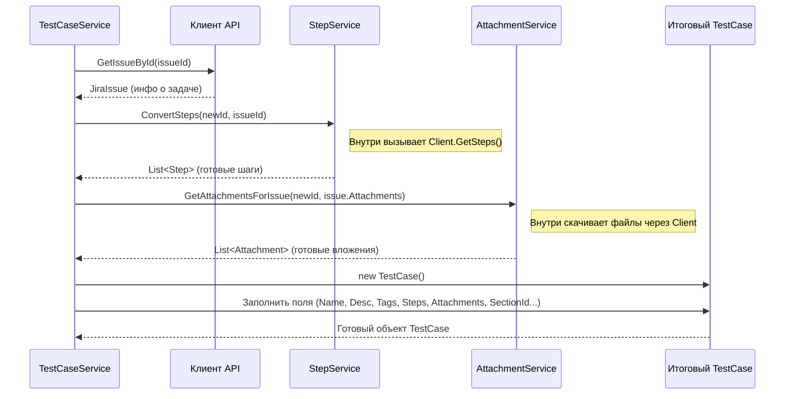

# Chapter 6: Сервис Тест-кейсов (TestCaseService)


В [предыдущей главе: Сервис Папок/Секций (FolderService)](05_сервис_папок_секций__folderservice__.md) мы научились создавать структуру папок (секций) для наших тест-кейсов в том виде, который нужен целевой системе. Мы подготовили "стеллажи и полки" в нашей новой библиотеке. Теперь настало время взять сами "книги" — наши тест-кейсы из Zephyr — и перенести их на эти полки, аккуратно переведя всю важную информацию.

Этой задачей занимается **Сервис Тест-кейсов (TestCaseService)**.

## Зачем нужен `TestCaseService`? Переводчик для тестов

Представьте, что у вас есть анкета, заполненная на одном языке (Zephyr), и вам нужно перенести все данные из нее в другую форму, на другом языке и с немного другой структурой (целевая система). Вам понадобится переводчик, который внимательно прочитает каждую строчку старой анкеты, найдет соответствующее поле в новой форме и перепишет информацию.

`TestCaseService` — это и есть наш **переводчик для каждого отдельного тест-кейса**. Его основная задача — взять информацию о тесте из Zephyr (там это называется "execution" - выполнение) и преобразовать её в формат объекта `TestCase` ([Выходная Модель](02_модели_данных__models__.md)), который мы сможем потом сохранить.

Почему это не может сделать, скажем, [Сервис Экспорта (ExportService)](03_сервис_экспорта__exportservice__.md)?

*   **Сложность:** Конвертация одного тест-кейса — это многоэтапный процесс. Нужно получить основную информацию, потом детали из Jira (статус, приоритет, метки), потом шаги, потом вложения. Выносить всю эту логику в `ExportService` сделало бы его слишком громоздким и сложным.
*   **Разделение Ответственности:** `TestCaseService` фокусируется исключительно на *одном* тест-кейсе за раз. Он знает всё о том, как преобразовать *именно тест-кейс*. Это делает код чище и понятнее.

## Как работает `TestCaseService`? Сборка информации

Чтобы "перевести" один тест-кейс из Zephyr в целевой формат `TestCase`, `TestCaseService` выполняет несколько шагов, координируя работу других компонентов:

1.  **Найти Тест-кейсы для Секции:** Сначала `TestCaseService` получает информацию о том, где искать тесты. Он берет одну из секций, созданных [Сервисом Папок/Секций (FolderService)](05_сервис_папок_секций__folderservice__.md), и с помощью [Клиента API (Client)](04_клиент_api__client__.md) запрашивает у Zephyr список тест-кейсов ("executions"), которые находятся в этой конкретной папке или цикле.
2.  **Обработать Каждый Тест-кейс:** Для каждого найденного тест-кейса ("execution") из Zephyr:
    *   **Получить Детали из Jira:** Используя ID задачи Jira, связанной с "execution", `TestCaseService` обращается к [Клиенту API (Client)](04_клиент_api__client__.md), чтобы получить дополнительные сведения из самой задачи Jira (например, метки, приоритет, полный список вложений).
    *   **Конвертировать Шаги:** Он просит специализированный сервис (мы назовем его `StepService`, который здесь не описан подробно, но представьте, что он есть) получить шаги этого тест-кейса из Zephyr и преобразовать их в формат `Step` ([Выходная Модель](02_модели_данных__models__.md)).
    *   **Обработать Вложения:** Он обращается к [Сервису Вложений (AttachmentService)](07_сервис_вложений__attachmentservice__.md), чтобы скачать файлы, прикрепленные к задаче Jira, и подготовить информацию о них в нужном формате `Attachment` ([Выходная Модель](02_модели_данных__models__.md)).
    *   **Собрать Всё Вместе:** Наконец, `TestCaseService` создает новый объект `TestCase` ([Выходная Модель](02_модели_данных__models__.md)). Он заполняет его поля данными, полученными на предыдущих шагах:
        *   Имя и описание из Zephyr "execution".
        *   Метки из задачи Jira.
        *   Конвертированные шаги от `StepService`.
        *   Подготовленные вложения от `AttachmentService`.
        *   Приоритет (может браться из Jira, если есть, или устанавливаться по умолчанию).
        *   Статус (обычно устанавливается по умолчанию, например, "NotReady").
        *   ID секции, к которой относится этот тест-кейс.
        *   Некоторые другие поля могут заполняться значениями по умолчанию (например, `Duration` - предполагаемое время выполнения).

## Как `TestCaseService` используется?

Главный дирижер, [Сервис Экспорта (ExportService)](03_сервис_экспорта__exportservice__.md), вызывает `TestCaseService` после того, как [Сервис Папок/Секций (FolderService)](05_сервис_папок_секций__folderservice__.md) подготовил структуру папок.

```csharp
// Файл: Services/ExportService.cs (упрощенный фрагмент)

public class ExportService : IExportService
{
    // ... другие сервисы ...
    private readonly ITestCaseService _testCaseService; // Ссылка на Сервис Тест-кейсов

    // Конструктор получает TestCaseService
    public ExportService(..., ITestCaseService testCaseService, ...)
    {
        // ...
        _testCaseService = testCaseService;
        // ...
    }

    public async Task ExportProject()
    {
        // ... (получение информации о проекте) ...

        // 2. Получаем структуру папок от FolderService
        var sectionData = await _folderService.GetSections(...);
        _logger.LogInformation("Получена структура папок");

        // === 3. Вызываем TestCaseService ===
        // Передаем ему плоский список всех секций
        var testCases = await _testCaseService.ConvertTestCases(sectionData.AllSections);
        // ==================================

        _logger.LogInformation("Конвертировано {Count} тест-кейсов", testCases.Count);

        // 4. Записываем каждый тест-кейс
        foreach (var testCase in testCases)
        {
            await _writeService.WriteTestCase(testCase);
        }

        // ... (запись главного файла index.json) ...
    }
}
```

**Что здесь происходит:**

*   `ExportService` вызывает метод `_testCaseService.ConvertTestCases()`.
*   В качестве входных данных передается `sectionData.AllSections` — это "плоский" список всех секций, созданных [Сервисом Папок/Секций (FolderService)](05_сервис_папок_секций__folderservice__.md). Каждая запись в этом списке содержит ID новой секции и оригинальные ID из Zephyr (проекта, версии, цикла, папки).
*   `TestCaseService` внутри себя пройдется по этому списку, для каждой секции запросит тесты у Zephyr (`Client`), конвертирует их и вернет `ExportService` полный список готовых объектов `TestCase`.
*   `ExportService` затем передает эти готовые `TestCase` [Сервису Записи (WriteService)](08_сервис_записи__writeservice__.md) для сохранения в файлы.

## Под капотом: Как происходит конвертация

Давайте представим пошаговый процесс работы `TestCaseService`, когда `ExportService` вызывает `ConvertTestCases`:

1.  **Начало:** `TestCaseService` получает список `allSections` (объектов `ZephyrSection`).
2.  **Инициализация:** Создается пустой список для хранения итоговых объектов `TestCase`.
3.  **Цикл по Секциям:** `TestCaseService` перебирает каждую `ZephyrSection` из полученного списка. Для каждой секции:
    *   **Запрос "Executions":** Используя ID проекта, версии, цикла и папки из `ZephyrSection`, он вызывает [Клиент API (Client)](04_клиент_api__client__.md), чтобы получить список соответствующих "executions" (тест-кейсов) из Zephyr. Он использует специальный метод `GetExecution`, который сам решает, получать ли тесты из папки (если `FolderId` есть) или из всего цикла (если `FolderId` нет).
    *   **Цикл по "Executions":** Для каждого полученного "execution" (`ZephyrExecution`):
        *   **Генерация ID:** Создается новый уникальный ID (`Guid`) для будущего объекта `TestCase`. Этот ID будет использоваться в целевой системе.
        *   **Получение Деталей Задачи Jira:** Вызывается `_client.GetIssueById(execution.IssueId)`, чтобы получить объект `JiraIssue` со всеми полями задачи Jira (метки, приоритет, вложения).
        *   **Конвертация Шагов:** Вызывается `_stepService.ConvertSteps(newTestCaseId, execution.IssueId)`. `StepService` (здесь не показан) сам обратится к `Client` за шагами из Zephyr и вернет готовый список объектов `Step` ([Выходная Модель](02_модели_данных__models__.md)).
        *   **Получение Вложений:** Вызывается `_attachmentService.GetAttachmentsForIssue(newTestCaseId, issue.Fields.Attachments)`. [Сервис Вложений](07_сервис_вложений__attachmentservice__.md) обработает список вложений из `JiraIssue`, скачает нужные файлы и вернет список объектов `Attachment` ([Выходная Модель](02_модели_данных__models__.md)).
        *   **(Дополнительно) Вложения из шагов:** В коде также есть логика, которая собирает вместе вложения, прикрепленные непосредственно к задаче Jira, и вложения, которые могли быть добавлены к шагам во время их конвертации сервисом `StepService`.
        *   **Создание TestCase:** Создается объект `TestCase` ([Выходная Модель](02_модели_данных__models__.md)) и заполняется его поля:
            *   `Id`: Сгенерированный на шаге 4a `Guid`.
            *   `Name`, `Description`: Берутся из `execution`.
            *   `SectionId`: Берется из `section.Id` (ID секции, в которой мы сейчас работаем).
            *   `Tags`: Берутся из `issue.Fields.labels`.
            *   `Steps`: Список, полученный от `StepService`.
            *   `Attachments`: Список, полученный от `AttachmentService` (и дополненный вложениями шагов).
            *   `Priority`: Устанавливается в `PriorityType.Medium` (можно усложнить логику, чтобы брать из `issue.Fields.Priority`).
            *   `State`: Устанавливается в `StateType.NotReady`.
            *   `Duration`: Устанавливается в константу `_duration` (например, 10000 миллисекунд).
            *   Остальные поля (PreconditionSteps, Links и т.д.) инициализируются пустыми списками.
        *   **Добавление в Список:** Готовый объект `TestCase` добавляется в общий список, созданный на шаге 2.
4.  **Возврат Результата:** После обработки всех секций и всех "executions", `TestCaseService` возвращает полный список сконвертированных объектов `TestCase` вызвавшему его `ExportService`.

**Визуализация конвертации одного тест-кейса:**



## Погружение в код `TestCaseService`

Давайте посмотрим на ключевые фрагменты кода `TestCaseService`.

**1. Конструктор и Зависимости**

Сервис получает ссылки на `Client`, `StepService`, `AttachmentService` и логгер. Это его инструменты для работы.

```csharp
// Файл: Services/TestCaseService.cs (фрагмент)
using Microsoft.Extensions.Logging;
using Models; // Для выходных моделей (TestCase, Step, Attachment и т.д.)
using ZephyrSquadServerExporter.Client; // Клиент API
using ZephyrSquadServerExporter.Models; // Для входных моделей (ZephyrSection, ZephyrExecution, JiraIssue)

namespace ZephyrSquadServerExporter.Services;

public class TestCaseService : ITestCaseService
{
    private readonly ILogger<TestCaseService> _logger;
    private readonly IClient _client; // Для получения данных из Jira/Zephyr
    private readonly IStepService _stepService; // Для конвертации шагов
    private readonly IAttachmentService _attachmentService; // Для обработки вложений
    public const int _duration = 10000; // Время выполнения по умолчанию (в мс)

    // Конструктор для получения зависимостей
    public TestCaseService(ILogger<TestCaseService> logger, IClient client, IStepService stepService,
        IAttachmentService attachmentService)
    {
        _logger = logger;
        _client = client;
        _stepService = stepService;
        _attachmentService = attachmentService;
    }

    // ... остальной код ...
}
```

**2. Основной метод `ConvertTestCases`**

Этот метод организует всю работу: перебирает секции, запрашивает тесты для каждой и запускает процесс конвертации.

```csharp
// Файл: Services/TestCaseService.cs (фрагмент)

public async Task<List<TestCase>> ConvertTestCases(List<ZephyrSection> allSections)
{
    _logger.LogInformation("Конвертируем тест-кейсы...");

    var testCases = new List<TestCase>(); // Список для готовых тест-кейсов

    // Перебираем каждую секцию, полученную от FolderService
    foreach (var section in allSections)
    {
        // Запрашиваем Zephyr executions для текущей секции
        var executions = await GetExecution(section);
        _logger.LogDebug("Найдено {Count} тестов в секции {SectionName} (ID: {SectionId})",
                         executions.Count, section.Name, section.Id); // Предполагаем, что у ZephyrSection есть Name

        // Перебираем каждый найденный тест ("execution")
        foreach (var execution in executions)
        {
            // Запускаем конвертацию одного тест-кейса
            var testCase = await ConvertSingleTestCase(execution, section);
            testCases.Add(testCase);
            _logger.LogTrace("Сконвертирован тест-кейс: {TestCaseName} (ID: {TestCaseId})",
                             testCase.Name, testCase.Id);
        }
    }

    _logger.LogInformation("Конвертация тест-кейсов завершена. Всего: {Count}", testCases.Count);
    return testCases;
}
```
*Примечание: В предоставленном ранее коде `TestCaseService.cs` вся логика была внутри цикла по `allSections`. Мы немного реструктурировали ее для ясности, выделив гипотетический метод `ConvertSingleTestCase`.*

**3. Логика конвертации одного тест-кейса (внутри цикла `foreach (var execution...)`)**

Вот как может выглядеть логика обработки одного `execution` (внутри метода `ConvertTestCases` или вынесенная в `ConvertSingleTestCase`):

```csharp
// Файл: Services/TestCaseService.cs (упрощенный фрагмент внутри цикла по executions)

// Генерируем ID для нового тест-кейса
var testCaseId = Guid.NewGuid();

// 1. Получаем детали задачи из Jira
_logger.LogDebug("Получаем детали задачи Jira ID: {IssueId} для теста {TestName}",
                 execution.IssueId, execution.Name);
var issue = await _client.GetIssueById(execution.IssueId.ToString());

// 2. Конвертируем шаги
_logger.LogDebug("Конвертируем шаги для задачи Jira ID: {IssueId}", execution.IssueId);
var steps = await _stepService.ConvertSteps(testCaseId, execution.IssueId.ToString());

// 3. Получаем вложения из задачи
_logger.LogDebug("Обрабатываем вложения для задачи Jira ID: {IssueId}", execution.IssueId);
var attachments = await _attachmentService.GetAttachmentsForIssue(testCaseId, issue.Fields.Attachments);

// 4. (Опционально) Добавляем вложения, которые могли быть привязаны к шагам
steps.ForEach(s =>
{
    attachments.AddRange(s.ActionAttachments);    // Вложения Действия
    attachments.AddRange(s.ExpectedAttachments);  // Вложения Ожидаемого результата
    attachments.AddRange(s.TestDataAttachments);  // Вложения Тестовых данных
});

// 5. Создаем итоговый объект TestCase
_logger.LogDebug("Создаем объект TestCase для {TestName}", execution.Name);
var testCase = new TestCase
{
    Id = testCaseId,
    Name = execution.Name,                      // Имя из Zephyr execution
    Description = execution.Description,          // Описание из Zephyr execution
    SectionId = section.Id,                     // ID секции из FolderService
    State = StateType.NotReady,                 // Статус по умолчанию
    Priority = PriorityType.Medium,             // Приоритет по умолчанию (можно брать из issue.Fields.Priority)
    Steps = steps,                              // Конвертированные шаги
    Tags = issue.Fields.labels,                 // Метки из задачи Jira
    Attachments = attachments,                  // Все собранные вложения
    Duration = _duration,                       // Время выполнения по умолчанию
    PreconditionSteps = new List<Step>(),       // Пусто по умолчанию
    PostconditionSteps = new List<Step>(),      // Пусто по умолчанию
    Attributes = new List<CaseAttribute>(),     // Пусто по умолчанию
    Iterations = new List<Iteration>(),         // Пусто по умолчанию
    Links = new List<Link>(),                   // Пусто по умолчанию
};

// Готовый testCase добавляется в общий список (как в п.2)
```

**4. Помощник `GetExecution`**

Этот приватный метод инкапсулирует логику выбора правильного эндпоинта API для получения тестов: либо из папки, либо из цикла целиком.

```csharp
// Файл: Services/TestCaseService.cs (фрагмент)

// Метод для получения "executions" для конкретной секции
private async Task<List<ZephyrExecution>> GetExecution(ZephyrSection section)
{
    _logger.LogDebug("Запрос тестов для Секции ID: {SectionId} (Проект: {ProjectId}, Версия: {VersionId}, Цикл: {CycleId}, Папка: {FolderId})",
                     section.Id, section.ProjectId, section.VersionId, section.CycleId, section.FolderId ?? "N/A");

    // Если у секции есть FolderId, значит она соответствует папке в Zephyr
    if (section.FolderId != null)
    {
        _logger.LogTrace("Запрос тестов из ПАПКИ {FolderId}", section.FolderId);
        // Используем метод клиента для получения тестов ИЗ ПАПКИ
        return await _client.GetTestCasesFromFolder(
            section.ProjectId, section.VersionId, section.CycleId, section.FolderId);
    }
    else // Иначе секция соответствует циклу (или версии "Unscheduled")
    {
        _logger.LogTrace("Запрос тестов из ЦИКЛА {CycleId}", section.CycleId);
        // Используем метод клиента для получения тестов ИЗ ЦИКЛА
        return await _client.GetTestCasesFromCycle(
            section.ProjectId, section.VersionId, section.CycleId);
    }
}
```

Таким образом, `TestCaseService` действует как сборочный цех: он берет "заготовку" (`ZephyrExecution`), запрашивает дополнительные "комплектующие" у других сервисов (`StepService`, `AttachmentService`) и у `Client`, а затем собирает из всего этого финальный продукт — объект `TestCase`.

## Заключение

В этой главе мы разобрались с сердцем процесса конвертации — **Сервисом Тест-кейсов (TestCaseService)**. Мы узнали, что:

*   Он отвечает за преобразование информации об отдельных тест-кейсах из формата Zephyr ("execution") в целевой формат `TestCase`.
*   Он работает как "переводчик" или "сборщик", получая данные из разных источников:
    *   Базовая информация из Zephyr `execution`.
    *   Детали (метки, приоритет) из связанной задачи Jira (через [Клиент API](04_клиент_api__client__.md)).
    *   Конвертированные шаги от `StepService`.
    *   Обработанные вложения от [Сервиса Вложений (AttachmentService)](07_сервис_вложений__attachmentservice__.md).
*   Он использует структуру секций, созданную [Сервисом Папок/Секций (FolderService)](05_сервис_папок_секций__folderservice__.md), чтобы знать, где искать тесты и к какой секции их привязывать.
*   Результатом его работы является список готовых объектов `TestCase`, которые затем передаются [Сервису Записи (WriteService)](08_сервис_записи__writeservice__.md).

Мы почти завершили разбор процесса конвертации! Но остался один важный аспект, который `TestCaseService` делегирует другому компоненту — работа с файлами, прикрепленными к тестам. В следующей главе мы подробно рассмотрим, как это происходит, изучив [Сервис Вложений (AttachmentService)](07_сервис_вложений__attachmentservice__.md).

---

Generated by [AI Codebase Knowledge Builder](https://github.com/The-Pocket/Tutorial-Codebase-Knowledge)