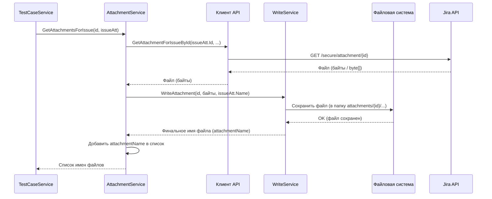

# Chapter 7: Сервис Вложений (AttachmentService)


В [предыдущей главе: Сервис Тест-кейсов (TestCaseService)](06_сервис_тест_кейсов__testcaseservice__.md) мы увидели, как `TestCaseService` собирает всю информацию о тест-кейсе: его название, описание, шаги, метки. Но часто к тест-кейсам (или их шагам) прикрепляются файлы: скриншоты, лог-файлы, примеры данных. Просто скопировать *информацию* о том, что файл прикреплен, недостаточно – нам нужны сами эти файлы!

Кто же будет заниматься этой специфической задачей – поиском, скачиванием и подготовкой файлов к сохранению? Для этого у нас есть отдельный специалист – **Сервис Вложений (AttachmentService)**.

## Зачем нужен `AttachmentService`? Проблема файлов

Представьте, что вы переносите старый фотоальбом в новый. Вы аккуратно переписываете подписи к фотографиям (это делает наш `TestCaseService`), но сами фотографии нужно тоже как-то достать и вклеить в новый альбом. Просто текст "Здесь была фотография котика" не годится.

Точно так же и с тестами. Если к задаче в Jira прикреплен скриншот `error_screenshot.png` или к шагу теста приложен `debug.log`, то при экспорте мы хотим получить эти файлы рядом с нашим тест-кейсом.

`AttachmentService` решает именно эту проблему: он **находит и скачивает** файлы, связанные с тест-кейсами или их шагами, и **передает их для сохранения**, сообщая, как этот файл будет называться в новой структуре.

Думайте о `AttachmentService` как о **сотруднике архива**:
*   Ему говорят: "Найди документ №123 (файл по его ID)".
*   Он идет в архив Jira/Zephyr (используя [Клиент API (Client)](04_клиент_api__client__.md)) и достает сам документ (содержимое файла).
*   Затем он передает этот документ "секретарю" (нашему [Сервису Записи (WriteService)](08_сервис_записи__writeservice__.md)) со словами: "Сохрани это как 'Скриншот ошибки от 10 мая'".
*   Он сообщает тому, кто просил (например, `TestCaseService`), под каким именем файл был сохранен.

## Что делает `AttachmentService`?

Основные задачи этого сервиса:

1.  **Получить Запрос:** Он получает от `TestCaseService` или `StepService` информацию о том, какие файлы нужно скачать. Обычно это ID файла и его исходное имя.
2.  **Скачать Файл:** Используя [Клиент API (Client)](04_клиент_api__client__.md), он запрашивает у сервера Jira/Zephyr содержимое файла по его уникальному ID. `Client` возвращает ему файл в виде набора байтов (сырых данных).
3.  **Передать на Сохранение:** Он передает эти байты и имя файла [Сервису Записи (WriteService)](08_сервис_записи__writeservice__.md). `WriteService` уже знает, в какую папку на диске нужно положить файл, и сохраняет его. `WriteService` также может немного изменить имя файла, чтобы избежать конфликтов, и сообщает `AttachmentService` финальное имя сохраненного файла.
4.  **Вернуть Имя:** `AttachmentService` возвращает финальное имя (или путь) сохраненного файла тому, кто его вызвал (`TestCaseService` или `StepService`). Это имя потом будет вписано в данные тест-кейса или шага (например, в поле `Attachments` у `TestCase` или в текст шага `TestData`).

## Как он используется?

`AttachmentService` вызывается в двух основных местах:

**1. Из `TestCaseService` (для вложений к задаче Jira):**

Когда `TestCaseService` обрабатывает тест-кейс, он получает из `JiraIssue` список вложений, прикрепленных прямо к задаче. Он передает этот список `AttachmentService`.

```csharp
// Файл: Services/TestCaseService.cs (упрощенный фрагмент)

// ... внутри цикла обработки execution ...
var issue = await _client.GetIssueById(execution.IssueId.ToString());

// === Вызываем AttachmentService ===
// Передаем ID нового тест-кейса (для контекста сохранения) и список объектов вложений из Jira
var attachmentsFromIssue = await _attachmentService.GetAttachmentsForIssue(testCaseId, issue.Fields.Attachments);
// attachmentsFromIssue теперь содержит список имен сохраненных файлов,
// например: ["screenshot1.png", "log_file_aBcDeF.txt"]
// ==================================

// ... потом эти имена добавляются к списку вложений TestCase ...
var testCase = new TestCase
{
    // ... другие поля ...
    Attachments = attachmentsFromIssue, // Используем полученный список имен
    // ...
};
```

**2. Из `StepService` (для вложений к шагам Zephyr):**

Когда `StepService` (который мы здесь не разбирали подробно, но представьте, что он есть) конвертирует шаги теста, он может обнаружить вложения, прикрепленные к конкретному шагу в Zephyr. Для каждого такого вложения он вызывает `AttachmentService`.

```csharp
// Файл: Services/StepService.cs (гипотетический фрагмент)

// ... внутри цикла обработки шагов из Zephyr ...
foreach (var zephyrAttachment in zephyrStep.Attachments)
{
    // === Вызываем AttachmentService ===
    // Передаем ID тест-кейса, ID задачи, ID вложения и его имя
    var savedAttachmentName = await _attachmentService.GetAttachmentsForStep(
        testCaseId,
        issueId,
        zephyrAttachment.Id, // ID вложения из Zephyr
        zephyrAttachment.Name // Имя вложения из Zephyr
    );
    // savedAttachmentName теперь содержит имя сохраненного файла, например: "step_image.jpg"
    // ==================================

    // Добавляем ссылку на сохраненный файл в тестовые данные шага
    stepTestData += $"<p><<<{savedAttachmentName}>>></p>";
    // И добавляем имя в список вложений шага
    stepAttachments.Add(savedAttachmentName);
}
```

В обоих случаях `AttachmentService` возвращает только *имя* сохраненного файла. Этого достаточно, потому что [Сервис Записи (WriteService)](08_сервис_записи__writeservice__.md) сохраняет все вложения для одного тест-кейса в определенную подпапку, и система, в которую будут импортироваться данные, сможет найти файл по имени внутри этой папки.

## Под капотом: Как скачивается и сохраняется файл?

Давайте посмотрим на типичный сценарий, когда `TestCaseService` вызывает `GetAttachmentsForIssue` для списка файлов.

1.  **Вызов:** `TestCaseService` вызывает `_attachmentService.GetAttachmentsForIssue(testCaseId, список_вложений)`.
2.  **Начало:** `AttachmentService` создает пустой список для хранения имен сохраненных файлов.
3.  **Цикл:** Он перебирает каждый объект вложения (`IssueAttachment`) из полученного списка. Для каждого вложения:
    *   **Запрос к Клиенту:** Он вызывает `_client.GetAttachmentForIssueById(attachment.Id, attachment.Name)`. Этот метод `Client` обращается к API Jira, скачивает файл по его ID и возвращает содержимое файла в виде массива байтов (`byte[]`).
    *   **Запрос к Сервису Записи:** `AttachmentService` вызывает `_writeService.WriteAttachment(testCaseId, attachmentBytes, attachment.Name)`. Он передает:
        *   `testCaseId`: Чтобы `WriteService` знал, к какому тест-кейсу относится файл и мог создать правильную подпапку (например, `attachments/{testCaseId}`).
        *   `attachmentBytes`: Сами данные файла.
        *   `attachment.Name`: Исходное имя файла.
    *   **Сохранение:** `WriteService` создает нужную папку (если ее нет), сохраняет байты в файл (возможно, изменив имя для уникальности) и возвращает `AttachmentService` *финальное имя* сохраненного файла.
    *   **Добавление в Результат:** `AttachmentService` добавляет это финальное имя в свой список результатов.
4.  **Возврат:** После обработки всех вложений из списка, `AttachmentService` возвращает полный список финальных имен файлов сервису `TestCaseService`.

**Визуализация процесса (для одного файла):**



## Погружение в код `AttachmentService`

Теперь посмотрим на реальный код.

**1. Конструктор:**

`AttachmentService` зависит от трех других компонентов: логгера (для записи сообщений), [Клиента API](04_клиент_api__client__.md) (для скачивания) и [Сервиса Записи](08_сервис_записи__writeservice__.md) (для сохранения). Он получает их при создании.

```csharp
// Файл: Services/AttachmentService.cs (фрагмент)
using JsonWriter; // Используется IWriteService
using Microsoft.Extensions.Logging;
using ZephyrSquadServerExporter.Client; // Используется IClient
using ZephyrSquadServerExporter.Models; // Используется IssueAttachment

namespace ZephyrSquadServerExporter.Services;

public class AttachmentService : IAttachmentService
{
    private readonly ILogger<AttachmentService> _logger;
    private readonly IClient _client; // Наш 'курьер', чтобы сходить за файлом
    private readonly IWriteService _writeService; // Наш 'секретарь', чтобы сохранить файл

    // Конструктор получает нужные инструменты
    public AttachmentService(ILogger<AttachmentService> logger, IClient client, IWriteService writeService)
    {
        _logger = logger;
        _client = client;             // Сохраняем ссылку на Client
        _writeService = writeService; // Сохраняем ссылку на WriteService
    }

    // ... методы сервиса ...
}
```

**2. Метод `GetAttachmentsForIssue`:**

Этот метод обрабатывает список вложений, прикрепленных к задаче Jira.

```csharp
// Файл: Services/AttachmentService.cs (фрагмент)

public async Task<List<string>> GetAttachmentsForIssue(Guid testCaseId, List<IssueAttachment> attachments)
{
    _logger.LogInformation("Получаем вложения для задачи...");

    // Список для хранения имен файлов, которые будут сохранены
    var listOfAttachments = new List<string>();

    // Перебираем каждое вложение из списка, полученного от TestCaseService
    foreach (var attachment in attachments)
    {
        _logger.LogDebug("Скачиваем вложение ID: {AttachmentId}, Имя: {AttachmentName}",
                         attachment.Id, attachment.Name);
        // 1. Просим Клиента скачать файл по ID
        var attachmentBytes = await _client.GetAttachmentForIssueById(attachment.Id, attachment.Name);

        _logger.LogDebug("Сохраняем вложение {AttachmentName}", attachment.Name);
        // 2. Просим Сервис Записи сохранить скачанные байты
        // Передаем ID тест-кейса для определения папки сохранения
        var name = await _writeService.WriteAttachment(testCaseId, attachmentBytes, attachment.Name);

        // 3. Добавляем финальное имя файла (возвращенное WriteService) в наш список
        listOfAttachments.Add(name);
    }

    _logger.LogDebug("Найдено {AttachmentCount} вложений: {Attachments}",
                     listOfAttachments.Count, listOfAttachments);

    // Возвращаем список имен сохраненных файлов
    return listOfAttachments;
}
```

**3. Метод `GetAttachmentsForStep`:**

Этот метод похож, но используется для скачивания вложений, прикрепленных к шагам тестов в Zephyr. Он обычно вызывается для одного файла за раз.

```csharp
// Файл: Services/AttachmentService.cs (фрагмент)

public async Task<string> GetAttachmentsForStep(Guid testCaseId, string issueId, string attachmentId, string attachmentName)
{
    // Сообщение в лог немного отличается
    _logger.LogInformation("Получаем вложение из шага для задачи {IssueId}", issueId);
    _logger.LogDebug("Скачиваем вложение шага ID: {AttachmentId}, Имя: {AttachmentName}",
                     attachmentId, attachmentName);

    // 1. Просим Клиента скачать файл, но используем ДРУГОЙ метод - для вложений шага
    var attachmentBytes = await _client.GetAttachmentForStepById(attachmentId);

    _logger.LogDebug("Сохраняем вложение шага {AttachmentName}", attachmentName);
    // 2. Просим Сервис Записи сохранить файл (так же, как и для вложений задачи)
    return await _writeService.WriteAttachment(testCaseId, attachmentBytes, attachmentName);
    // 3. Сразу возвращаем финальное имя файла
}
```

Как видите, `AttachmentService` является простым, но важным посредником. Он берет конкретную задачу (скачать файл) у `TestCaseService` или `StepService`, использует `Client` для получения данных и `WriteService` для их сохранения, а затем сообщает результат.

## Заключение

В этой главе мы познакомились с **Сервисом Вложений (AttachmentService)** – нашим специалистом по файлам. Мы узнали, что:

*   Он отвечает за скачивание файлов, прикрепленных к задачам Jira или шагам тестов Zephyr.
*   Он использует [Клиент API (Client)](04_клиент_api__client__.md) для получения содержимого файлов по их ID.
*   Он передает скачанные данные [Сервису Записи (WriteService)](08_сервис_записи__writeservice__.md) для сохранения на диск.
*   Он возвращает имена сохраненных файлов, чтобы их можно было указать в экспортированных данных тест-кейсов и шагов.

`AttachmentService` гарантирует, что не только текстовая информация, но и все связанные файлы будут корректно экспортированы вместе с вашими тестами.

Мы рассмотрели почти все компоненты нашего конвейера экспорта! Остался последний, но очень важный шаг: фактическая запись всех подготовленных данных (тест-кейсов, секций, главного файла `index.json` и скачанных вложений) на диск вашего компьютера. Этим занимается наш финальный сервис. Перейдем к [Главе 8: Сервис Записи (WriteService)](08_сервис_записи__writeservice__.md).

---

Generated by [AI Codebase Knowledge Builder](https://github.com/The-Pocket/Tutorial-Codebase-Knowledge)