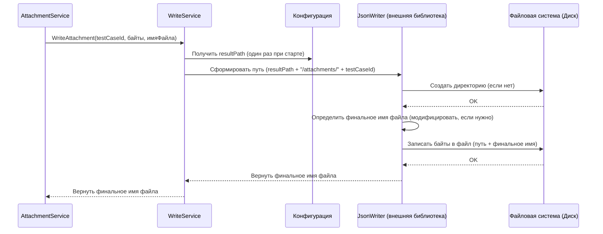

# Chapter 8: Сервис Записи (WriteService)


В [предыдущей главе: Сервис Вложений (AttachmentService)](07_сервис_вложений__attachmentservice__.md) мы узнали, как наш специалист по файлам, `AttachmentService`, скачивает необходимые вложения с сервера Jira. Он получает сами файлы в виде набора байтов. Но что происходит дальше? Как эти байты, а также вся подготовленная информация о тест-кейсах и структуре папок, превращаются в настоящие файлы на вашем компьютере?

Представьте, что вы закончили писать большой отчет. У вас есть текст (наши объекты `TestCase` и `Root`), и стопка иллюстраций (скачанные вложения). Теперь вам нужен кто-то, кто возьмет весь этот материал, аккуратно распечатает текст на страницах, вклеит иллюстрации в нужные места и сложит все в папку на вашем столе.

Эту финальную роль в `ZephyrSquadServerExporter` выполняет **Сервис Записи (WriteService)**. Это наш "принтер" и "секретарь" в одном лице. Он берет готовые данные и файлы и **материализует** их в виде JSON-файлов и файлов вложений в указанной вами папке.

## Зачем нужен `WriteService`? Проблема сохранения

К этому моменту другие сервисы проделали огромную работу:
*   [Клиент API (Client)](04_клиент_api__client__.md) получил данные из Jira/Zephyr.
*   [Сервис Папок/Секций (FolderService)](05_сервис_папок_секций__folderservice__.md) построил структуру папок.
*   [Сервис Тест-кейсов (TestCaseService)](06_сервис_тест_кейсов__testcaseservice__.md) преобразовал тесты в нужный формат (`TestCase`).
*   [Сервис Вложений (AttachmentService)](07_сервис_вложений__attachmentservice__.md) скачал файлы.

Но все это пока существует только в памяти компьютера. Проблема: как аккуратно и в правильном формате сохранить все это на диск? Нужно создать правильные папки, преобразовать объекты `TestCase` и `Root` в текст формата JSON, записать этот текст в файлы с правильными именами, сохранить байты вложений в файлы с их именами.

Именно эту задачу решает `WriteService`. Он отвечает за **все операции записи файлов** в проекте.

## Что делает `WriteService`?

`WriteService` берет на себя всю грязную работу по взаимодействию с файловой системой вашего компьютера. Его основные обязанности:

1.  **Подготовка "Места Назначения":** Он использует путь `resultPath`, указанный в [Конфигурации (Configuration)](01_конфигурация__configuration__.md), чтобы определить, куда сохранять все файлы. Он создает эту папку, если она еще не существует.
2.  **Запись Тест-кейсов:** Для каждого готового объекта `TestCase`, полученного от [Сервиса Экспорта (ExportService)](03_сервис_экспорта__exportservice__.md), он:
    *   Преобразует объект `TestCase` в текстовую строку формата JSON.
    *   Создает для него файл с именем вида `{ID_тест-кейса}.json` (например, `f8a3b5c1-....json`) внутри папки `resultPath`.
    *   Записывает JSON-строку в этот файл.
3.  **Запись Главного Файла:** Для объекта `Root` (содержащего имя проекта, список ID всех тест-кейсов и дерево секций), полученного от [Сервиса Экспорта](03_сервис_экспорта__exportservice__.md):
    *   Преобразует объект `Root` в JSON-строку.
    *   Создает файл `index.json` внутри папки `resultPath`.
    *   Записывает JSON-строку в этот файл.
4.  **Сохранение Вложений:** Для каждого файла вложения (полученного от [Сервиса Вложений (AttachmentService)](07_сервис_вложений__attachmentservice__.md) в виде массива байтов):
    *   Создает подпапку `attachments/{ID_тест-кейса}` внутри `resultPath` (если она не существует).
    *   Определяет имя файла (обычно исходное имя вложения, возможно, с изменениями для избежания конфликтов).
    *   Записывает массив байтов в файл с этим именем внутри созданной подпапки.
    *   Возвращает финальное имя сохраненного файла [Сервису Вложений](07_сервис_вложений__attachmentservice__.md).

**Важно:** Реализация `WriteService` в этом проекте фактически обеспечивается внешней библиотекой `JsonWriter`. `ZephyrSquadServerExporter` просто использует эту библиотеку, которая предоставляет готовый сервис, реализующий интерфейс `IWriteService`.

## Как `WriteService` используется?

Другие сервисы вызывают методы `WriteService`, когда им нужно что-то сохранить.

**1. Из [Сервиса Экспорта](03_сервис_экспорта__exportservice__.md):**

```csharp
// Файл: Services/ExportService.cs (упрощенный фрагмент)

public class ExportService : IExportService
{
    // ... другие сервисы ...
    private readonly IWriteService _writeService; // Ссылка на Сервис Записи

    // Конструктор получает WriteService
    public ExportService(..., IWriteService writeService)
    {
        // ...
        _writeService = writeService;
        // ...
    }

    public async Task ExportProject()
    {
        // ... (получение и конвертация данных) ...
        var testCases = await _testCaseService.ConvertTestCases(...);
        var sections = ...; // Получено от FolderService
        var projectName = ...; // Получено от Client

        _logger.LogInformation("Запись файлов тест-кейсов...");
        // === Вызов WriteService для каждого тест-кейса ===
        foreach (var testCase in testCases)
        {
            // Передаем готовый объект TestCase сервису записи
            await _writeService.WriteTestCase(testCase);
        }
        // ==============================================

        // Собираем корневой объект
        var root = new Root
        {
            ProjectName = projectName,
            TestCases = testCases.Select(t => t.Id).ToList(),
            Sections = sections.SectionsTree
            // ... другие поля ...
        };

        _logger.LogInformation("Запись главного файла index.json...");
        // === Вызов WriteService для главного файла ===
        await _writeService.WriteMainJson(root);
        // ===========================================

        _logger.LogInformation("Экспорт проекта завершен");
    }
}
```

**2. Из [Сервиса Вложений](07_сервис_вложений__attachmentservice__.md):**

```csharp
// Файл: Services/AttachmentService.cs (упрощенный фрагмент)

public class AttachmentService : IAttachmentService
{
    // ... другие сервисы ...
    private readonly IWriteService _writeService; // Ссылка на Сервис Записи

    // Конструктор получает WriteService
    public AttachmentService(..., IWriteService writeService)
    {
        // ...
        _writeService = writeService;
        // ...
    }

    public async Task<List<string>> GetAttachmentsForIssue(Guid testCaseId, ...)
    {
        // ... (цикл по вложениям) ...
        foreach (var attachment in attachments)
        {
            // ... (скачивание файла, получение attachmentBytes) ...
            byte[] attachmentBytes = await _client.GetAttachmentForIssueById(...);

            _logger.LogDebug("Сохраняем вложение {AttachmentName}", attachment.Name);
            // === Вызов WriteService для сохранения файла ===
            // Передаем ID тест-кейса, байты файла и исходное имя
            var finalName = await _writeService.WriteAttachment(testCaseId, attachmentBytes, attachment.Name);
            // finalName содержит имя, под которым файл был фактически сохранен
            // ==============================================
            listOfAttachments.Add(finalName);
        }
        return listOfAttachments;
    }
    // ... похожий вызов в GetAttachmentsForStep ...
}

```

Как видите, другие сервисы просто передают `WriteService` готовые данные (объекты C# или массивы байтов) и некоторую контекстную информацию (например, ID тест-кейса), а `WriteService` сам разбирается, как и куда их записать.

## Под Капотом: Как Происходит Запись?

Давайте рассмотрим упрощенную последовательность действий, когда, например, `ExportService` вызывает `WriteTestCase`.

1.  **Вызов:** `ExportService` вызывает `_writeService.WriteTestCase(тестКейсОбъект)`.
2.  **Получение Пути:** `WriteService` читает `resultPath` из конфигурации (это происходит один раз при его создании).
3.  **Определение Имени Файла:** Он берет ID из `тестКейсОбъект.Id` и формирует полное имя файла, например: `/Users/user/Documents/importer/f8a3b5c1-1e8f-4f6a-b5c2-3a5b6d7c8d9e.json`.
4.  **Сериализация в JSON:** `WriteService` (точнее, используемая им библиотека `JsonWriter`) использует стандартные средства .NET (например, `System.Text.Json.JsonSerializer`) для преобразования объекта `тестКейсОбъект` в строку JSON.
    ```json
    // Пример JSON-строки для TestCase
    {
      "Id": "f8a3b5c1-1e8f-4f6a-b5c2-3a5b6d7c8d9e",
      "Name": "Проверка входа пользователя",
      "Description": "Проверить успешный вход с корректными данными.",
      "SectionId": "a1b2c3d4-...",
      "State": "NotReady",
      "Priority": "Medium",
      "Steps": [ /* ... шаги ... */ ],
      "Tags": [ "login", "smoke" ],
      "Attachments": [ "login_success.png" ],
      // ... другие поля ...
    }
    ```
5.  **Запись в Файл:** `WriteService` записывает эту JSON-строку в файл по пути, определенному на шаге 3. Если файл уже существует, он перезаписывается.
6.  **Завершение:** Операция завершена.

Аналогично происходит запись главного файла `index.json` (используется объект `Root`) и файлов вложений (используются байты и создаются подпапки).

**Визуализация Записи Вложения:**



## Погружение в код (Как `WriteService` мог бы работать)

Хотя реальная реализация находится в библиотеке `JsonWriter`, давайте представим, как могли бы выглядеть упрощенные версии методов внутри `WriteService`, если бы мы писали его сами.

**1. Конструктор (Получение `resultPath`)**

Сервис получает `IConfiguration` и извлекает из него `resultPath`.

```csharp
// Файл: JsonWriter/WriteService.cs (гипотетический фрагмент)
using Microsoft.Extensions.Configuration;
using System.Text.Json;
using System.Text.Json.Serialization; // Для JsonStringEnumConverter
using Models; // Для TestCase, Root
using System.IO; // Для работы с файлами и папками

namespace JsonWriter;

public class WriteService //: IWriteService  (здесь предполагаем, что это и есть реализация)
{
    private readonly string _resultPath;
    private readonly JsonSerializerOptions _options; // Настройки для JSON

    public WriteService(IConfiguration configuration)
    {
        // Читаем resultPath из конфигурации
        var resultPath = configuration["resultPath"];
        if (string.IsNullOrEmpty(resultPath))
        {
            throw new ArgumentException("Параметр 'resultPath' не найден в конфигурации.");
        }

        // Убеждаемся, что путь существует (можно создать здесь или позже)
        // Directory.CreateDirectory(resultPath); // Важно: Реальный JsonWriter делает это при первой записи

        _resultPath = resultPath;

        // Настраиваем параметры сериализации JSON
        _options = new JsonSerializerOptions
        {
            WriteIndented = true, // Делает JSON читаемым (с отступами)
            PropertyNamingPolicy = JsonNamingPolicy.CamelCase, // Имена свойств в camelCase (userId, firstName)
            // Конвертируем перечисления (enum) в строки (например, "Medium" вместо числа 1)
            Converters = { new JsonStringEnumConverter(JsonNamingPolicy.CamelCase) }
        };

        // Создаем основную папку сразу
        Directory.CreateDirectory(_resultPath);
    }

    // ... другие методы ...
}
```
*Этот код показывает, как `WriteService` получает путь для сохранения (`resultPath`) и настраивает способ преобразования объектов в JSON (`JsonSerializerOptions`).*

**2. Упрощенный `WriteTestCase`**

```csharp
// Файл: JsonWriter/WriteService.cs (гипотетический фрагмент)

// Принимает объект TestCase
public async Task WriteTestCase(TestCase testCase)
{
    // Формируем имя файла: ID тест-кейса + .json
    var fileName = $"{testCase.Id}.json";
    // Формируем полный путь к файлу
    var filePath = Path.Combine(_resultPath, fileName);

    // Преобразуем объект TestCase в JSON-строку с нашими опциями
    var json = JsonSerializer.Serialize(testCase, _options);

    // Асинхронно записываем JSON-строку в файл
    // Файл будет перезаписан, если уже существует
    await File.WriteAllTextAsync(filePath, json);
}
```
*Этот метод берет объект `TestCase`, превращает его в читаемую JSON-строку и записывает в файл, имя которого соответствует ID тест-кейса.*

**3. Упрощенный `WriteAttachment`**

```csharp
// Файл: JsonWriter/WriteService.cs (гипотетический фрагмент)

// Принимает ID тест-кейса, байты файла и исходное имя
public async Task<string> WriteAttachment(Guid testCaseId, byte[] content, string fileName)
{
    // Формируем путь к папке для вложений этого тест-кейса
    var directoryPath = Path.Combine(_resultPath, "attachments", testCaseId.ToString());

    // Создаем папку, если она не существует
    Directory.CreateDirectory(directoryPath);

    // Формируем полный путь к файлу вложения
    // Важно: реальный WriteService может проверять, существует ли файл,
    // и изменять имя (например, добавлять _1, _2), чтобы избежать перезаписи.
    // Мы упростим и оставим исходное имя (но с очисткой).
    var safeFileName = CleanFileName(fileName); // Функция для удаления недопустимых символов
    var filePath = Path.Combine(directoryPath, safeFileName);

    // Асинхронно записываем массив байтов в файл
    await File.WriteAllBytesAsync(filePath, content);

    // Возвращаем (возможно, очищенное) имя файла
    return safeFileName;
}

// Простая функция для очистки имени файла (удаление недопустимых символов)
private string CleanFileName(string fileName)
{
    return string.Join("_", fileName.Split(Path.GetInvalidFileNameChars()));
}
```
*Этот метод создает специальную папку для вложений тест-кейса, сохраняет туда полученные байты под указанным именем (после небольшой очистки) и возвращает это имя.*

**4. `WriteMainJson` (Концептуально)**
Метод `WriteMainJson(Root root)` работал бы очень похоже на `WriteTestCase`, но:
*   Принимал бы объект `Root`.
*   Формировал бы путь к файлу `index.json`: `Path.Combine(_resultPath, "index.json")`.
*   Сериализовал бы объект `Root` в JSON.
*   Записывал бы JSON в файл `index.json`.

**Напоминание:** Весь этот функционал предоставляется внешней библиотекой `JsonWriter`, подключенной к проекту `ZephyrSquadServerExporter`.

## Заключение

В этой последней главе нашего погружения в `ZephyrSquadServerExporter` мы рассмотрели **Сервис Записи (WriteService)**. Мы узнали, что:

*   Это финальный компонент в цепочке экспорта, ответственный за сохранение всех подготовленных данных на диск.
*   Он реализован с помощью внешней библиотеки `JsonWriter`.
*   Он получает путь для сохранения (`resultPath`) из [Конфигурации](01_конфигурация__configuration__.md).
*   Он записывает:
    *   Каждый `TestCase` в отдельный `{id}.json` файл.
    *   Общий объект `Root` в файл `index.json`.
    *   Скачанные вложения в подпапку `attachments/{testCaseId}`.
*   Другие сервисы ([ExportService](03_сервис_экспорта__exportservice__.md), [AttachmentService](07_сервис_вложений__attachmentservice__.md)) вызывают его для выполнения операций записи.

`WriteService` гарантирует, что результат всей работы по сбору и преобразованию данных будет аккуратно сохранен в файловой системе в формате, готовом для дальнейшего использования (например, для импорта в другую систему).

На этом мы завершаем наш обзор основных компонентов `ZephyrSquadServerExporter`. Мы прошли путь от настройки конфигурации до финальной записи файлов, разобравшись в ролях моделей данных, клиента API и различных сервисов, координирующих и выполняющих процесс экспорта. Надеемся, это руководство помогло вам лучше понять, как устроен этот инструмент!

---

Generated by [AI Codebase Knowledge Builder](https://github.com/The-Pocket/Tutorial-Codebase-Knowledge)