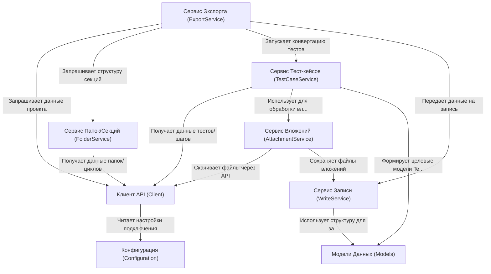

# Tutorial: ZephyrSquadServerExporter

Этот проект, *ZephyrSquadServerExporter*, представляет собой инструмент для **экспорта** данных из Zephyr Squad (плагин для Jira) в локальные файлы. Он работает как *координатор*: сначала он подключается к вашему серверу Jira/Zephyr, используя данные из файла конфигурации (`zephyr.config.json`). Затем он последовательно запрашивает информацию о *структуре папок* (версии, циклы, папки) и *тест-кейсах* (включая шаги и вложения). Все полученные данные преобразуются в стандартизированный формат (`Models`) и **сохраняются** в виде JSON-файлов и скачанных вложений в указанную папку (`resultPath`). Итоговый экспорт предназначен для *импорта* в другие системы управления тестированием, такие как Test IT.

**Source Repository:** [None](None)

## Chapters

1. [Конфигурация (Configuration)
](01_конфигурация__configuration__.md)
2. [Модели Данных (Models)
](02_модели_данных__models__.md)
3. [Сервис Экспорта (ExportService)
](03_сервис_экспорта__exportservice__.md)
4. [Клиент API (Client)
](04_клиент_api__client__.md)
5. [Сервис Папок/Секций (FolderService)
](05_сервис_папок_секций__folderservice__.md)
6. [Сервис Тест-кейсов (TestCaseService)
](06_сервис_тест_кейсов__testcaseservice__.md)
7. [Сервис Вложений (AttachmentService)
](07_сервис_вложений__attachmentservice__.md)
8. [Сервис Записи (WriteService)
](08_сервис_записи__writeservice__.md)

---

Generated by [AI Codebase Knowledge Builder](https://github.com/The-Pocket/Tutorial-Codebase-Knowledge)