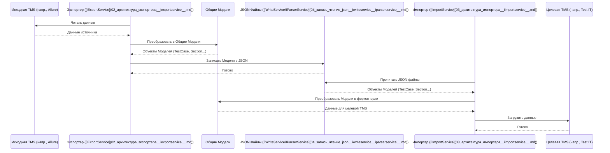

# Chapter 1: Общие Модели Данных (Models project)


Добро пожаловать в руководство по `migrators`! Этот инструмент создан, чтобы помочь вам легко переносить ваши тест-кейсы между различными системами управления тестированием (TMS).

Представьте, что у вас есть тест-кейсы в одной системе, например, Allure TestOps, а вы хотите переехать в другую, скажем, Test IT. Данные в этих системах хранятся по-разному. Как их "перелить" из одной в другую, не потеряв структуру и смысл?

Именно здесь на помощь приходит **`Models project`** — наш универсальный язык для описания тестовых данных.

## Зачем Нужны Общие Модели?

Разные системы управления тестированием (TMS) — как разные страны со своими языками. Allure TestOps "говорит" на одном языке данных, Azure DevOps — на другом, Test IT — на третьем. Прямой "перевод" данных между ними может быть сложным и привести к ошибкам или потере информации.

`Models project` решает эту проблему, вводя **единый, стандартизированный формат** для представления тестовых артефактов.

**Аналогия:** Представьте себе международные грузоперевозки. У вас есть товары из Китая (как данные из Allure) и товары из Германии (как данные из Azure). Чтобы легко перевезти их по всему миру и доставить, например, в Россию (как в Test IT), их упаковывают в **стандартные транспортные контейнеры**. Неважно, что внутри — электроника или одежда — контейнер имеет стандартные размеры и крепления.

Наши **Общие Модели Данных** — это и есть такие "контейнеры". Проект `Models` определяет набор C#-классов (как чертежи этих контейнеров), которые описывают структуру тест-кейсов, шагов, секций, атрибутов и т.д.

Основные "контейнеры" (классы) в `Models`:

*   `TestCase`: Представляет отдельный тест-кейс.
*   `SharedStep`: Представляет переиспользуемый набор шагов.
*   `Section`: Папка или директория для организации тест-кейсов.
*   `Attribute`: Пользовательское поле (атрибут) проекта, например, "Приоритет" или "Компонент".
*   `Step`: Один шаг внутри `TestCase` или `SharedStep`.
*   `Root`: Корневой элемент, описывающий весь проект целиком.

Экспортер (например, из Allure) "упаковывает" данные в эти стандартные классы-модели. Затем Импортер (для Test IT) "распаковывает" данные из этих же моделей и загружает их в целевую систему.

## Ключевые Модели (Классы)

Давайте кратко рассмотрим некоторые важные классы из `Models`. Не пугайтесь кода, мы просто смотрим на "чертежи" наших контейнеров.

### `Root` - Корень Проекта

Это самый верхний уровень, описывающий структуру всего экспортируемого проекта. Он содержит название проекта и списки идентификаторов (ID) для всех основных сущностей: атрибутов, секций, общих шагов и тест-кейсов.

```csharp
// Файл: Migrators/Models/Root.cs
using System.Text.Json.Serialization;

namespace Models;

public class Root
{
    [JsonPropertyName("projectName")] // Имя проекта в JSON будет "projectName"
    [JsonRequired] // Это поле обязательно
    public string ProjectName { get; set; } = null!;

    [JsonPropertyName("attributes")] // Список атрибутов
    public List<Attribute> Attributes { get; set; } = new();

    [JsonPropertyName("sections")] // Список корневых секций
    [JsonRequired]
    public List<Section> Sections { get; set; } = new();

    [JsonPropertyName("sharedSteps")] // Список ID общих шагов
    [JsonRequired]
    public List<Guid> SharedSteps { get; set; } = new();

    [JsonPropertyName("testCases")] // Список ID тест-кейсов
    [JsonRequired]
    public List<Guid> TestCases { get; set; } = new();
}
```

*   Этот класс как опись всего груза: название проекта и списки того, что будет дальше (секции, тест-кейсы и т.д.).
*   Атрибуты `[JsonPropertyName("...")]` указывают, как поля будут называться при сохранении в JSON-файл. `[JsonRequired]` означает, что поле обязательно должно присутствовать.

### `Section` - Структура Папок

Представляет собой папку или директорию в вашей тестовой библиотеке. Секции могут быть вложенными друг в друга, создавая иерархию.

```csharp
// Файл: Migrators/Models/Section.cs
using System.Text.Json.Serialization;

namespace Models;

public class Section
{
    [JsonPropertyName("id")]
    [JsonRequired]
    public Guid Id { get; set; } // Уникальный ID секции

    [JsonPropertyName("name")]
    [JsonRequired]
    public string Name { get; set; } = null!; // Имя секции (папки)

    // ... другие поля, как шаги предусловий/постусловий ...

    [JsonPropertyName("sections")]
    public List<Section> Sections { get; set; } = new(); // Вложенные секции
}
```

*   Каждая секция имеет уникальный `Id` и `Name`.
*   Список `Sections` внутри `Section` позволяет создавать древовидную структуру папок.

### `TestCase` - Тест-кейс

Это сердце процесса — сам тест-кейс со всеми его деталями.

```csharp
// Файл: Migrators/Models/TestCase.cs
using System.Text.Json.Serialization;

namespace Models;

public class TestCase
{
    [JsonPropertyName("id")]
    [JsonRequired]
    public Guid Id { get; set; } // Уникальный ID тест-кейса

    [JsonPropertyName("name")]
    [JsonRequired]
    public string Name { get; set; } = null!; // Название тест-кейса

    [JsonPropertyName("sectionId")]
    [JsonRequired]
    public Guid SectionId { get; set; } // ID секции, к которой принадлежит тест-кейс

    [JsonPropertyName("priority")]
    [JsonRequired]
    public PriorityType Priority { get; set; } // Приоритет (Low, Medium, High...)

    [JsonPropertyName("steps")]
    public List<Step> Steps { get; set; } = new(); // Список шагов теста

    [JsonPropertyName("attributes")]
    public List<CaseAttribute> Attributes { get; set; } = new(); // Значения атрибутов для этого кейса

    // ... и другие поля: описание, теги, вложения, предусловия, постусловия ...
}
```

*   Содержит всю информацию о тест-кейсе: `Id`, имя (`Name`), приоритет (`Priority`), шаги (`Steps`), к какой секции (`SectionId`) он относится.
*   `Attributes` здесь — это список *значений* пользовательских полей для *этого конкретного* тест-кейса (например, Атрибут "Компонент" имеет значение "UI"). Сам атрибут "Компонент" описывается классом `Attribute`.

### `Step` - Шаг Теста

Описывает одно действие и ожидаемый результат внутри тест-кейса или общего шага.

```csharp
// Файл: Migrators/Models/Step.cs
using System.Text.Json.Serialization;

namespace Models;

public class Step
{
    [JsonPropertyName("action")]
    public string Action { get; set; } = string.Empty; // Описание действия

    [JsonPropertyName("expected")]
    public string Expected { get; set; } = string.Empty; // Ожидаемый результат

    [JsonPropertyName("testData")]
    public string TestData { get; set; } = string.Empty; // Тестовые данные для шага

    [JsonPropertyName("sharedStepId")]
    public Guid? SharedStepId { get; set; } // ID общего шага, если этот шаг ссылается на него

    // ... поля для вложений к действию, ожидаемому результату и т.д. ...
}
```

*   Простая структура: `Action` (что сделать), `Expected` (что должно получиться).
*   Может ссылаться на `SharedStep` через `SharedStepId`, что позволяет переиспользовать шаги.

### `Attribute` - Определение Атрибута

Описывает *определение* пользовательского поля в проекте, например, "Тип теста" (с вариантами "Функциональный", "Регрессионный") или "Ответственный".

```csharp
// Файл: Migrators/Models/Attribute.cs
using System.Text.Json.Serialization;

namespace Models;

public class Attribute
{
    [JsonPropertyName("id")]
    [JsonRequired]
    public Guid Id { get; set; } // Уникальный ID атрибута

    [JsonPropertyName("name")]
    [JsonRequired]
    public string Name { get; set; } = null!; // Имя атрибута (напр., "Приоритет")

    [JsonPropertyName("type")]
    [JsonRequired]
    public AttributeType Type { get; set; } // Тип атрибута (напр., Options, String)

    [JsonPropertyName("isRequired")]
    [JsonRequired]
    public bool IsRequired { get; set; } // Обязателен ли атрибут

    [JsonPropertyName("options")]
    public List<string> Options { get; set; } = new(); // Возможные значения для типа Options
}
```

*   Задает "шаблон" для пользовательского поля: его имя, тип, обязательность и возможные опции (если это поле с выбором).
*   Значение этого атрибута для конкретного тест-кейса хранится в списке `Attributes` внутри `TestCase` (используя вспомогательный класс `CaseAttribute`, который связывает `Attribute.Id` со значением).

## Как Это Все Работает Вместе?

Процесс миграции с использованием `Models` выглядит так:

1.  **Экспорт:**
    *   [Архитектура Экспортера (IExportService)](02_архитектура_экспортера__iexportservice__.md) подключается к исходной системе (например, Allure).
    *   Он читает данные (тест-кейсы, секции и т.д.).
    *   Конвертирует эти данные в объекты наших общих моделей (`TestCase`, `Section`, `Attribute` и др.).
2.  **Сохранение:**
    *   Сервис [Запись/Чтение JSON (IWriteService, IParserService)](04_запись_чтение_json__iwriteservice__iparserservice__.md) берет эти объекты моделей и сохраняет их в промежуточные JSON-файлы. Имена файлов стандартные (из `Constants.cs`):
        *   `main.json`: Содержит объект `Root` со структурой проекта.
        *   `testcase.json`: Содержит список всех объектов `TestCase`.
        *   `sharedstep.json`: Содержит список всех объектов `SharedStep`.
        *   И другие файлы для артефактов, если необходимо.

    ```csharp
    // Файл: Migrators/Models/Constants.cs
    namespace Models;

    public static class Constants
    {
            // Стандартные имена файлов для сохранения моделей
            public const string MainJson = "main.json"; // Для Root
            public const string SharedStep = "sharedstep.json"; // Для SharedStep[]
            public const string TestCase = "testcase.json"; // Для TestCase[]
    }
    ```

3.  **Импорт:**
    *   [Архитектура Импортера (IImportService)](03_архитектура_импортера__iimportservice__.md) использует [Запись/Чтение JSON (IWriteService, IParserService)](04_запись_чтение_json__iwriteservice__iparserservice__.md) для чтения данных из этих JSON-файлов обратно в объекты моделей (`TestCase`, `Section` и т.д.).
    *   Импортер преобразует данные из общих моделей в формат, понятный целевой системе (например, Test IT).
    *   Загружает данные в целевую систему через её API, используя [Адаптер API Импортера (IClientAdapter)](07_адаптер_api_импортера__iclientadapter__.md).

Вот упрощенная диаграмма этого потока:



## Что Внутри `Models` Проекта?

Сам `Models` проект (`Migrators/Models/Models.csproj`) — это просто библиотека классов (.NET).

```xml
<!-- Файл: Migrators/Models/Models.csproj -->
<Project Sdk="Microsoft.NET.Sdk">

    <PropertyGroup>
        <TargetFramework>net8.0</TargetFramework> <!-- Используем .NET 8 -->
        <ImplicitUsings>enable</ImplicitUsings> <!-- Автоматическое подключение стандартных пространств имен -->
        <Nullable>enable</Nullable> <!-- Включение проверки на null -->
    </PropertyGroup>

</Project>
```

Он содержит определения классов (`Attribute.cs`, `TestCase.cs`, `Section.cs` и т.д.), которые мы рассмотрели. Эти классы — обычные C# классы (иногда их называют POCO - Plain Old CLR Objects), основная задача которых — хранить данные.

Они используют атрибуты из пространства имен `System.Text.Json.Serialization` (например, `[JsonPropertyName("...")]`), чтобы контролировать, как объекты этих классов будут преобразовываться в формат JSON и обратно. Это стандартный механизм в .NET для работы с JSON.

## Заключение

В этой главе мы познакомились с **Общими Моделями Данных (`Models project`)** — фундаментом `migrators`. Это стандартизированный набор C# классов, который служит универсальным "контейнером" для тестовых данных при переносе между различными TMS. Использование этих моделей позволяет экспортерам и импортерам "общаться" на одном языке, значительно упрощая процесс миграции.

Мы увидели, что `Models` определяют структуру для таких артефактов, как `TestCase`, `Section`, `Step`, `Attribute` и `Root`. Данные из исходной системы упаковываются в эти модели, сохраняются в JSON-файлы, а затем распаковываются и загружаются в целевую систему.

Теперь, когда мы понимаем, *в каком формате* хранятся данные во время миграции, самое время узнать, *как* эти данные извлекаются из исходной системы.

**Следующая глава:** [Архитектура Экспортера (IExportService)](02_архитектура_экспортера__iexportservice__.md)

---

Generated by [AI Codebase Knowledge Builder](https://github.com/The-Pocket/Tutorial-Codebase-Knowledge)