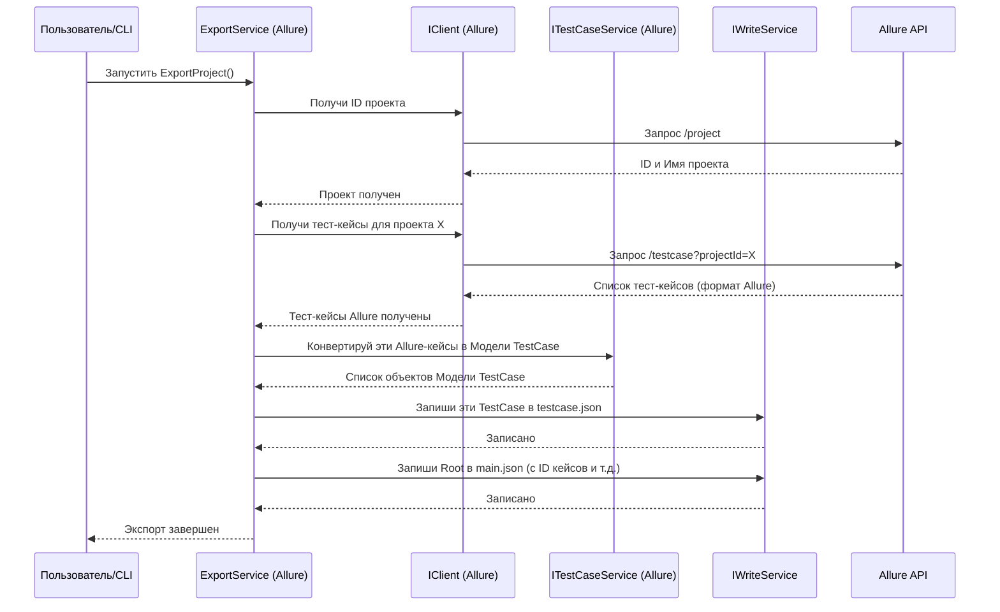

# Chapter 2: Архитектура Экспортера (IExportService)


В [предыдущей главе](01_общие_модели_данных__models_project__.md) мы узнали о **`Models project`** — нашем универсальном формате ("контейнерах") для хранения данных тест-кейсов во время миграции. Мы поняли, *в каком виде* данные путешествуют между системами.

Теперь давайте разберемся, *как* эти данные извлекаются из вашей исходной системы управления тестированием (TMS). Кто отвечает за то, чтобы взять тест-кейсы, секции, атрибуты из, скажем, Allure TestOps и "упаковать" их в наши `Models`-контейнеры?

## Зачем Нужен Экспортер?

Представьте, что вы хотите перевезти вещи из старой квартиры (ваша исходная TMS) в новую. Вам нужен кто-то, кто организует весь процесс: соберет вещи (данные), упакует их в стандартные коробки (`Models`), погрузит в машину (сохранит в файлы) и скажет, что все готово к отправке.

В `migrators` эту роль выполняет **Экспортер**. Каждая исходная TMS (Allure, Azure, TestRail и т.д.) имеет свои особенности, свой API (способ программного взаимодействия). Нам нужен стандартизированный способ сказать: "Эй, Allure, экспортируй мне все данные!".

Именно для этого существует интерфейс `IExportService`.

## Что Такое `IExportService`?

`IExportService` — это как **должностная инструкция** для любого экспортера. Это контракт, который говорит: "Если ты хочешь быть Экспортером в системе `migrators`, ты *должен* уметь выполнять одну главную задачу: экспортировать проект".

На языке C# это выглядит очень просто:

```csharp
// Файл: Пример IExportService (например, AllureExporter/Services/IExportService.cs)
namespace AllureExporter.Services; // Пространство имен зависит от конкретного экспортера

// Определяем контракт (интерфейс) для службы экспорта
public interface IExportService
{
    // Любой экспортер должен реализовать этот метод
    Task ExportProject(); // Задача "Экспортировать Проект"
}
```

*   `public interface IExportService`: Объявляет "инструкцию" под названием `IExportService`. Слово `interface` означает, что мы определяем не конкретного работника, а только *требования* к нему.
*   `Task ExportProject();`: Это единственное требование в инструкции. Оно говорит, что любой класс, реализующий `IExportService`, должен иметь метод `ExportProject`, который выполняет асинхронную ( `Task`) операцию экспорта.

## Реализации: Конкретные Экспортеры

Сама по себе "инструкция" (интерфейс) ничего не делает. Нужны конкретные "работники" (классы), которые эту инструкцию выполняют. У нас есть отдельные проекты для каждого экспортера: `AllureExporter`, `AzureExporter`, `TestRailExporter` и так далее.

В каждом из этих проектов есть свой класс, который **реализует** интерфейс `IExportService`. Например, в `AllureExporter` может быть класс `ExportService`:

```csharp
// Файл: AllureExporter/Services/Implementations/ExportService.cs (Упрощенный пример)
using JsonWriter; // Нужен для записи JSON
using Models;     // Нужен для использования Общих Моделей
// ... другие using ...

namespace AllureExporter.Services.Implementations;

// Класс ExportService ВЫПОЛНЯЕТ инструкцию IExportService
internal sealed class ExportService : IExportService
{
    // Поля для хранения "помощников" (других сервисов)
    private readonly ILogger<ExportService> _logger; // Для записи логов
    private readonly IClient _client; // Для общения с API Allure
    private readonly IWriteService _writeService; // Для записи JSON файлов
    private readonly ISectionService _sectionService; // Для обработки секций
    private readonly ITestCaseService _testCaseService; // Для обработки тест-кейсов
    // ... и другие сервисы-помощники ...

    // Конструктор: Получает нужных помощников при создании объекта ExportService
    public ExportService(
        ILogger<ExportService> logger,
        IClient client,
        IWriteService writeService,
        ISectionService sectionService,
        ITestCaseService testCaseService /* ... другие ... */)
    {
        _logger = logger;
        _client = client;
        _writeService = writeService;
        _sectionService = sectionService;
        _testCaseService = testCaseService;
        // ... сохраняем остальных помощников ...
    }

    // Реализация главного метода из интерфейса IExportService
    public async Task ExportProject()
    {
        _logger.LogInformation("Начинаем экспорт из Allure...");

        // 1. Получаем ID проекта и другую базовую информацию от Allure
        var project = await _client.GetProjectId(); // Используем клиент API

        // 2. Получаем и конвертируем секции (папки) в наши Модели
        var sectionData = await _sectionService.ConvertSection(project.Id);

        // 3. Получаем и конвертируем атрибуты (пользовательские поля)
        var attributes = /* ... вызов сервиса атрибутов ... */;

        // 4. Получаем и конвертируем общие шаги
        var sharedSteps = /* ... вызов сервиса общих шагов ... */;

        // 5. Получаем и конвертируем тест-кейсы
        var testCases = await _testCaseService.ConvertTestCases(/* ... параметры ... */);

        // 6. Сохраняем все полученные Модели в JSON файлы
        await _writeService.WriteTestCases(testCases); // Записываем тест-кейсы
        await _writeService.WriteSharedSteps(sharedSteps); // Записываем общие шаги
        // ... записываем другие данные ...

        // 7. Формируем главный файл main.json с общей структурой
        var mainJson = new Root
        {
            ProjectName = project.Name,
            Sections = /* ... секции ... */,
            TestCases = testCases.Select(t => t.Id).ToList(),
            SharedSteps = sharedSteps.Select(s => s.Id).ToList(),
            Attributes = attributes
        };
        await _writeService.WriteMainJson(mainJson); // Записываем main.json

        _logger.LogInformation("Экспорт из Allure завершен.");
    }
}
```

Этот класс `ExportService` (конкретный для Allure) и есть тот самый "главный управляющий на заводе". Когда вызывается его метод `ExportProject()`, он начинает координировать работу:

1.  **Запрашивает данные у источника:** Использует специальный сервис-"переговорщик" ([Клиент API Экспортера (IClient)](06_клиент_api_экспортера__iclient__.md)) для общения с API исходной TMS (Allure).
2.  **Преобразует данные:** Вызывает другие сервисы-специалисты (например, `ISectionService`, [`ITestCaseService`](05_конвертация_тест_кейсов__itestcaseservice__.md)) для конвертации данных из формата Allure в наши [Общие Модели Данных (`Models`)](01_общие_модели_данных__models_project__.md).
3.  **Сохраняет результат:** Использует сервис-"писатель" ([Запись/Чтение JSON (IWriteService, IParserService)](04_запись_чтение_json__iwriteservice__iparserservice__.md)) для сохранения готовых `Models` в JSON-файлы (`testcase.json`, `sharedstep.json`, `main.json`).

## Как Это Работает Под Капотом?

Давайте представим себе упрощенный поток работы при вызове `ExportProject()` для `AllureExporter`:



Как видите, `ExportService` (здесь `AllureExporter`) – это дирижер оркестра. Он сам не копается в деталях API Allure и не форматирует JSON, но он знает, кого попросить (`IClient`, `ITestCaseService`, `IWriteService`) и в каком порядке, чтобы получить конечный результат – набор JSON-файлов с данными в формате `Models`.

## Множество Экспортеров, Один Интерфейс

Красота подхода с `IExportService` в том, что основная программа, запускающая миграцию, не должна знать детали про Allure, Azure или TestRail. Ей достаточно знать, что есть некий `IExportService`. Она просто создает нужную реализацию (например, `AllureExporter.Services.ExportService`) и вызывает у нее метод `ExportProject()`.

В проекте `migrators` вы найдете множество папок, каждая из которых содержит свою реализацию `IExportService` и сопутствующих сервисов:

*   `Migrators/AllureExporter/`
*   `Migrators/AzureExporter/`
*   `Migrators/HPALMExporter/`
*   `Migrators/PractiTestExporter/`
*   `Migrators/QaseExporter/`
*   `Migrators/SpiraTestExporter/`
*   `Migrators/TestCollabExporter/`
*   `Migrators/TestLinkExporter/`
*   `Migrators/TestRailExporter/`
*   `Migrators/TestRailXmlExporter/`
*   `Migrators/XRayExporter/`
*   `Migrators/ZephyrScaleExporter/`
*   `Migrators/ZephyrScaleServerExporter/`
*   `Migrators/ZephyrSquadExporter/`

Внутри каждой из них есть свой `Services/ExportService.cs` (или похожий), реализующий `IExportService` для конкретной TMS.

## Заключение

В этой главе мы рассмотрели **`IExportService`** — ключевой интерфейс, определяющий контракт для всех экспортеров в `migrators`. Мы узнали, что:

*   `IExportService` задает основную задачу — `ExportProject()`.
*   Каждый конкретный экспортер (для Allure, Azure и т.д.) предоставляет свою **реализацию** этого интерфейса.
*   Эта реализация координирует работу других сервисов ([`IClient`](06_клиент_api_экспортера__iclient__.md), [`ITestCaseService`](05_конвертация_тест_кейсов__itestcaseservice__.md), [`IWriteService`](04_запись_чтение_json__iwriteservice__iparserservice__.md)) для извлечения данных из исходной TMS, их преобразования в [Общие Модели](01_общие_модели_данных__models_project__.md) и сохранения в JSON-файлы.

Теперь, когда мы понимаем, как данные *извлекаются* из источника, логично перейти к тому, как они *загружаются* в целевую систему.

**Следующая глава:** [Архитектура Импортера (IImportService)](03_архитектура_импортера__iimportservice__.md)

---

Generated by [AI Codebase Knowledge Builder](https://github.com/The-Pocket/Tutorial-Codebase-Knowledge)