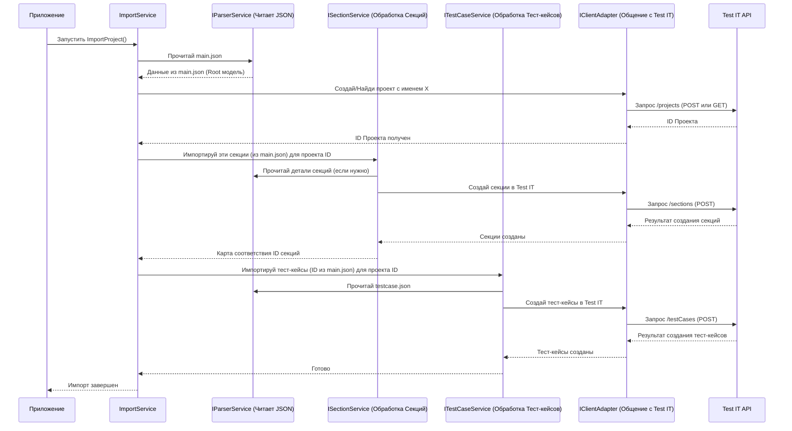

# Chapter 3: Архитектура Импортера (IImportService)


В [предыдущей главе](02_архитектура_экспортера__iexportservice__.md) мы узнали, как **Экспортер (`IExportService`)** извлекает данные из исходной системы (например, Allure) и упаковывает их в стандартные "контейнеры" — наши [Общие Модели Данных](01_общие_модели_данных__models_project__.md), сохраняя их в JSON-файлы. Мы подготовили "коробки с вещами" для переезда.

Теперь нам нужен кто-то, кто эти "коробки" примет на новом месте (в нашей целевой системе, Test IT), распакует их и аккуратно разложит все по полочкам. Эту роль выполняет **Импортер**.

## Зачем Нужен Импортер?

Представьте себе менеджера на складе (в нашем случае, Test IT). Ему привезли партию товара (наши JSON-файлы с тест-кейсами). Его задача — не просто принять коробки, а:

1.  **Открыть и Проверить:** Удостовериться, что внутри именно то, что ожидается (прочитать JSON-файлы и преобразовать их обратно в объекты наших [Общих Моделей](01_общие_модели_данных__models_project__.md)).
2.  **Адаптировать:** Возможно, маркировка на коробках (наши Модели) немного отличается от того, как товары хранятся на складе (формат данных Test IT). Нужно "переклеить этикетки" и подготовить данные для системы.
3.  **Разместить:** Аккуратно разложить товары по нужным полкам и ячейкам на складе (отправить данные в Test IT через его API).

Чтобы стандартизировать этот процесс приема и размещения данных, в `migrators` используется интерфейс `IImportService`.

## Что Такое `IImportService`?

`IImportService` — это **"должностная инструкция"** для главного менеджера по импорту. Она очень проста и требует выполнения одной основной задачи: импортировать весь проект целиком.

В коде это выглядит так:

```csharp
// Файл: Migrators/Importer/Services/IImportService.cs
namespace Importer.Services;

// Определяем контракт (интерфейс) для службы импорта
public interface IImportService
{
    // Любой импортер должен реализовать этот метод
    Task ImportProject(); // Задача "Импортировать Проект"
}
```

*   `public interface IImportService`: Объявляет "инструкцию" `IImportService`. Это не конкретный исполнитель, а описание того, *что* он должен уметь делать.
*   `Task ImportProject();`: Единственное требование — уметь выполнять асинхронную (`Task`) операцию импорта проекта.

## Реализация: Конкретный Импортер Для Test IT

Интерфейс сам по себе не работает. Нужен конкретный класс, который реализует эту "инструкцию". В нашем проекте `Importer` есть класс `ImportService`, который и выполняет эту работу.

```csharp
// Файл: Migrators/Importer/Services/Implementations/ImportService.cs (Упрощенный пример)
using Importer.Client;        // Нужен для общения с Test IT API
using Importer.Models;        // Нужен для чтения Моделей из JSON
using Microsoft.Extensions.Logging; // Для записи логов
// ... другие using ...

namespace Importer.Services.Implementations;

// Этот класс ВЫПОЛНЯЕТ инструкцию IImportService
internal class ImportService : IImportService
{
    // Поля для хранения "помощников":
    private readonly ILogger<ImportService> _logger;        // Логгер
    private readonly IParserService _parserService;     // Сервис чтения JSON
    private readonly IClientAdapter _clientAdapter;     // Адаптер для Test IT API
    private readonly IAttributeService _attributeService; // Сервис для атрибутов
    private readonly ISectionService _sectionService;     // Сервис для секций
    private readonly ITestCaseService _testCaseService;   // Сервис для тест-кейсов
    // ... и другие сервисы-помощники ...

    // Конструктор: Получает всех нужных "помощников" при создании
    public ImportService(
        ILogger<ImportService> logger,
        IParserService parserService,
        IClientAdapter clientAdapter,
        IAttributeService attributeService,
        ISectionService sectionService,
        ITestCaseService testCaseService /*...*/)
    {
        _logger = logger;
        _parserService = parserService;
        _clientAdapter = clientAdapter;
        _attributeService = attributeService;
        _sectionService = sectionService;
        _testCaseService = testCaseService;
        // ... сохраняет ссылки на помощников ...
    }

    // Реализация главного метода из IImportService
    public async Task ImportProject()
    {
        _logger.LogInformation("Начинаем импорт проекта в Test IT...");

        // 1. Читаем главный файл main.json, чтобы понять структуру проекта
        var mainJson = await _parserService.GetMainFile();

        // 2. Создаем/находим проект в Test IT
        var projectId = await /* ... вызов сервиса для работы с проектом ... */;

        // 3. Импортируем секции (папки)
        var sections = await _sectionService.ImportSections(projectId, mainJson.Sections);

        // 4. Импортируем атрибуты (пользовательские поля)
        var attributesMap = await _attributeService.ImportAttributes(projectId, mainJson.Attributes);

        // 5. Импортируем общие шаги (если есть)
        var sharedSteps = await /* ... вызов сервиса общих шагов ... */;

        // 6. Импортируем тест-кейсы
        await _testCaseService.ImportTestCases(projectId, mainJson.TestCases, sections, attributesMap, sharedSteps);

        _logger.LogInformation("Импорт проекта завершен.");
    }
}
```

Этот `ImportService` — наш "менеджер склада". Когда его метод `ImportProject()` вызывается, он координирует весь процесс:

1.  **Читает "накладную":** Использует [Сервис Чтения JSON (`IParserService`)](04_запись_чтение_json__iwriteservice__iparserservice__.md) чтобы прочитать `main.json` и понять, что именно приехало (структура проекта, списки ID тест-кейсов, секций и т.д.).
2.  **Подготавливает Склад:** Убеждается, что в Test IT есть нужный проект (создает или находит существующий).
3.  **Распаковывает и Адаптирует:** Вызывает специализированные сервисы (`IAttributeService`, `ISectionService`, [`ITestCaseService`](05_конвертация_тест_кейсов__itestcaseservice__.md)) для чтения соответствующих JSON-файлов (`attributes.json`, `testcase.json` и т.д.), преобразования данных из [Общих Моделей](01_общие_модели_данных__models_project__.md) в формат, понятный Test IT.
4.  **Размещает на Складе:** Использует [Адаптер API Импортера (`IClientAdapter`)](07_адаптер_api_импортера__iclientadapter__.md), чтобы отправить подготовленные данные в Test IT через его API.

## Как Это Работает Под Капотом?

Давайте посмотрим на упрощенную последовательность действий при вызове `ImportProject()`:



Как видите, `ImportService` выступает в роли координатора. Он не занимается деталями чтения каждого JSON-файла или тонкостями вызовов Test IT A<0xC5><0x8F>I. Он делегирует эти задачи специализированным "помощникам" (`IParserService`, `ISectionService`, `ITestCaseService`, `IClientAdapter`) и следит за общим порядком процесса.

## Основные Шаги Импорта (в коде `ImportProject`)

Давайте еще раз взглянем на ключевые строки в методе `ImportProject`:

1.  **Чтение `main.json`:**
    ```csharp
    // Получаем основную информацию о структуре проекта
    var mainJsonResult = await parserService.GetMainFile();
    ```
    Здесь мы используем [Сервис Чтения/Записи JSON](04_запись_чтение_json__iwriteservice__iparserservice__.md) для загрузки корневого файла `main.json`, который содержит общую структуру: имя проекта, список атрибутов, корневые секции и списки идентификаторов для всех тест-кейсов и общих шагов.

2.  **Импорт Проекта:**
    ```csharp
    // Убеждаемся, что проект существует в Test IT и получаем его ID
    var projectId = await projectService.ImportProject(mainJsonResult.ProjectName);
    ```
    Используется специальный сервис `projectService` (который внутри обращается к `IClientAdapter`), чтобы создать или найти проект в Test IT по имени из `main.json` и получить его внутренний ID в Test IT.

3.  **Импорт Секций:**
    ```csharp
    // Рекурсивно импортируем структуру папок (секций)
    var sections = await sectionService.ImportSections(projectId, mainJsonResult.Sections);
    ```
    Сервис `sectionService` берет структуру секций из `mainJsonResult`, обрабатывает её (возможно, читая дополнительные детали, если они есть) и создает соответствующие папки в Test IT через `IClientAdapter`. Он возвращает карту (`Dictionary`), которая сопоставляет старые ID секций (из [Моделей](01_общие_модели_данных__models_project__.md)) с новыми ID, присвоенными в Test IT.

4.  **Импорт Атрибутов:**
    ```csharp
    // Импортируем определения пользовательских полей
    _attributesMap = await attributeService.ImportAttributes(projectId, mainJsonResult.Attributes);
    ```
    Сервис `attributeService` обрабатывает список атрибутов из `mainJsonResult`, создает (или находит) соответствующие пользовательские поля в проекте Test IT и возвращает карту для сопоставления старых и новых ID атрибутов.

5.  **Импорт Общих Шагов:**
    ```csharp
    // Импортируем переиспользуемые наборы шагов
    var sharedSteps = await sharedStepService.ImportSharedSteps(projectId, mainJsonResult.SharedSteps, sections, _attributesMap);
    ```
    Сервис `sharedStepService` читает данные об общих шагах (используя [`IParserService`](04_запись_чтение_json__iwriteservice__iparserservice__.md) для файла `sharedstep.json`), обрабатывает их и создает соответствующие общие шаги в Test IT.

6.  **Импорт Тест-кейсов:**
    ```csharp
    // Импортируем сами тест-кейсы
    await testCaseService.ImportTestCases(projectId, mainJsonResult.TestCases, sections, _attributesMap, sharedSteps);
    ```
    Это ключевой этап. Сервис [`ITestCaseService`](05_конвертация_тест_кейсов__itestcaseservice__.md) получает список ID тест-кейсов из `mainJsonResult`. Он использует [`IParserService`](04_запись_чтение_json__iwriteservice__iparserservice__.md) для чтения файла `testcase.json`, содержащего детали всех тест-кейсов. Затем он преобразует каждый тест-кейс из формата [Общих Моделей](01_общие_модели_данных__models_project__.md) в формат Test IT API, используя карты `sections`, `_attributesMap`, `sharedSteps` для правильной привязки к созданным ранее сущностям. Наконец, он отправляет данные в Test IT через [Адаптер API (`IClientAdapter`)](07_адаптер_api_импортера__iclientadapter__.md).

## Заключение

В этой главе мы изучили **`IImportService`** — интерфейс, отвечающий за координацию процесса импорта данных в целевую систему (Test IT). Мы увидели, что:

*   `IImportService` определяет главную задачу: `ImportProject()`.
*   Конкретная реализация (`Importer.Services.Implementations.ImportService`) оркеструет работу множества других сервисов.
*   Процесс импорта включает чтение JSON-файлов (через [`IParserService`](04_запись_чтение_json__iwriteservice__iparserservice__.md)), создание/поиск проекта, импорт секций, атрибутов, общих шагов и, наконец, тест-кейсов (с помощью [`ITestCaseService`](05_конвертация_тест_кейсов__itestcaseservice__.md)).
*   Взаимодействие с API Test IT происходит через [Адаптер API (`IClientAdapter`)](07_адаптер_api_импортера__iclientadapter__.md).

Мы узнали, как Экспортер извлекает данные, и как Импортер их загружает. Центральное место в обоих процессах занимает чтение и запись данных в промежуточный формат JSON. Как именно это происходит?

**Следующая глава:** [Запись/Чтение JSON (IWriteService, IParserService)](04_запись_чтение_json__iwriteservice__iparserservice__.md)

---

Generated by [AI Codebase Knowledge Builder](https://github.com/The-Pocket/Tutorial-Codebase-Knowledge)