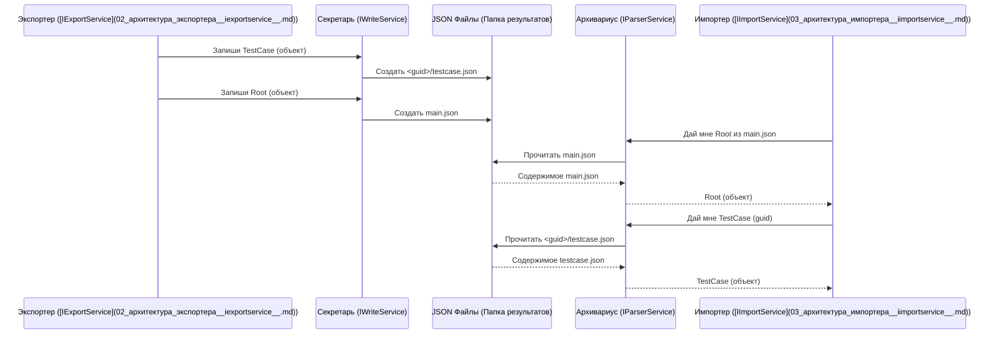

# Chapter 4: Запись/Чтение JSON (IWriteService, IParserService)


В предыдущей главе [Архитектура Импортера (IImportService)](03_архитектура_импортера__iimportservice__.md) мы разобрались, как `ImportService` управляет процессом загрузки данных в целевую систему (например, Test IT). Мы видели, что он координирует работу множества помощников, чтобы взять данные, преобразовать их и отправить в Test IT.

Но откуда `ImportService` берет эти данные? Помните, в главе [Архитектура Экспортера (IExportService)](02_архитектура_экспортера__iexportservice__.md) мы узнали, что Экспортер извлекает данные из исходной системы и преобразует их в наши [Общие Модели Данных](01_общие_модели_данных__models_project__.md). А куда он их девает?

Представьте себе переезд: вы собрали вещи (Экспортер), упаковали их в стандартные коробки ([Общие Модели](01_общие_модели_данных__models_project__.md)). Но вы не телепортируете их мгновенно в новую квартиру (Целевая TMS). Сначала коробки нужно где-то складировать – возможно, в грузовике или временном хранилище. Потом грузчики (Импортер) приедут, заберут эти коробки и распакуют их на новом месте.

Вот этим "временным хранилищем" для наших данных и служат **JSON-файлы**. А за работу с этим хранилищем отвечают два сервиса:

*   **`IWriteService` (Секретарь/Упаковщик):** Берет готовые "коробки" ([Общие Модели](01_общие_модели_данных__models_project__.md)) от Экспортера и аккуратно записывает их содержимое в стандартизированные JSON-файлы и папки.
*   **`IParserService` (Архивариус/Распаковщик):** Находит нужные JSON-файлы по запросу Импортера, читает их и "распаковывает" обратно в "коробки" ([Общие Модели](01_общие_модели_данных__models_project__.md)).

Давайте разберемся, как они работают.

## Почему JSON? Зачем Промежуточное Хранение?

Может возникнуть вопрос: зачем вообще сохранять данные в файлы? Не проще ли Экспортеру сразу передать их Импортеру?

Использование промежуточных JSON-файлов дает несколько преимуществ:

1.  **Разделение процессов (Decoupling):** Экспорт и импорт становятся независимыми. Экспортер может работать в одно время, а импортер – в другое. Им не нужно "общаться" напрямую.
2.  **Отладка и проверка:** Вы всегда можете посмотреть на созданные JSON-файлы. Если что-то пошло не так, можно легко проверить, правильно ли Экспортер выгрузил данные, или проблема возникла уже при Импорте. JSON – формат, который легко читать и человеку, и машине.
3.  **Гибкость:** Экспортированные файлы можно сохранить и использовать позже, или даже передать кому-то еще.

## Как Устроено Хранилище? (Структура Папок и Файлов)

`migrators` использует очень простую и логичную структуру для хранения JSON-данных. Все файлы сохраняются в папку, путь к которой вы указываете в настройках (как правило, `resultPath`).

Вот как это организовано:

```
<папка_результатов>/             (например, C:\migrators_output)
├── main.json                   <-- Главный файл с общей структурой проекта (Root)
├── <GUID_тест_кейса_1>/         <-- Папка для файлов тест-кейса 1
│   ├── testcase.json           <-- Детали тест-кейса 1 (TestCase)
│   ├── attachment1.png         <-- Вложение 1 для тест-кейса 1
│   └── attachment2.docx        <-- Вложение 2 для тест-кейса 1
├── <GUID_тест_кейса_2>/         <-- Папка для файлов тест-кейса 2
│   └── testcase.json           <-- Детали тест-кейса 2
├── <GUID_общего_шага_1>/       <-- Папка для файлов общего шага 1
│   └── sharedstep.json         <-- Детали общего шага 1 (SharedStep)
└── ...                         <-- Другие папки для тест-кейсов и общих шагов
```

*   **`main.json`:** Это корневой файл, самый главный. Он содержит объект `Root` из наших [Общих Моделей](01_общие_модели_данных__models_project__.md), который описывает общую структуру: имя проекта, список атрибутов, корневые секции и списки *идентификаторов* (GUID) всех тест-кейсов и общих шагов.
*   **Папки с GUID:** Для каждого тест-кейса (`TestCase`) и каждого общего шага (`SharedStep`) создается отдельная папка. Имя папки – это уникальный идентификатор (GUID) этого объекта.
*   **`testcase.json` / `sharedstep.json`:** Внутри папки с GUID лежит файл с детальным описанием соответствующего тест-кейса или общего шага в формате JSON. Имена этих файлов стандартизированы.
*   **Вложения (Attachments):** Если у тест-кейса или шага есть вложенные файлы (картинки, документы), они сохраняются прямо в папку с соответствующим GUID.

Стандартные имена файлов (`main.json`, `testcase.json`, `sharedstep.json`) определены в специальном файле `Constants.cs` в проекте `Models`:

```csharp
// Файл: Migrators/Models/Constants.cs
namespace Models;

public static class Constants
{
        // Стандартные имена файлов для сохранения моделей
        public const string MainJson = "main.json"; // Для Root
        public const string SharedStep = "sharedstep.json"; // Для SharedStep
        public const string TestCase = "testcase.json"; // Для TestCase
}
```
*Это просто набор констант, чтобы не писать имена файлов вручную в коде и избежать опечаток.*

Теперь посмотрим, кто отвечает за создание и чтение этой структуры.

## `IWriteService` - Наш Секретарь-Записчик

Представьте себе очень организованного секретаря. Ему приносят информацию (объекты [Общих Моделей](01_общие_модели_данных__models_project__.md)), а его задача – аккуратно разложить ее по нужным папкам и файлам в архиве (в нашей папке результатов).

Эту роль выполняет `IWriteService`. Вот его "должностная инструкция" (интерфейс):

```csharp
// Файл: Migrators/JsonWriter/IWriteService.cs
using Models; // Используем Общие Модели

namespace JsonWriter;

public interface IWriteService
{
    // Записать вложение (контент файла)
    Task<string> WriteAttachment(Guid id, byte[] content, string fileName);

    // Записать детали Тест-кейса
    Task WriteTestCase(TestCase testCase);

    // Записать детали Общего Шага
    Task WriteSharedStep(SharedStep sharedStep);

    // Записать главный файл main.json
    Task WriteMainJson(Root mainJson);
}
```

*   `WriteAttachment`: Сохраняет файл-вложение. `id` – это GUID тест-кейса или шага, к которому относится вложение. `content` – содержимое файла. `fileName` – имя файла. Возвращает имя, под которым файл был сохранен (может измениться, если файл с таким именем уже есть).
*   `WriteTestCase`: Принимает объект `TestCase`. Внутри создает папку `<testCase.Id>` (если ее нет) и сохраняет в нее файл `testcase.json` с данными этого тест-кейса.
*   `WriteSharedStep`: Работает аналогично `WriteTestCase`, но для объекта `SharedStep` и файла `sharedstep.json`.
*   `WriteMainJson`: Принимает объект `Root` и сохраняет его в файл `main.json` в корне папки результатов.

**Как это работает внутри? (Пример `WriteTestCase`)**

Реализация (`JsonWriter/WriteService.cs`) довольно проста. Она использует стандартные возможности .NET для работы с файлами и JSON.

```csharp
// Файл: Migrators/JsonWriter/WriteService.cs (Упрощенный фрагмент)
using System.Text.Json; // Для работы с JSON
using Models;           // Для Общих Моделей
using Microsoft.Extensions.Logging; // Для логов
using Microsoft.Extensions.Configuration; // Для чтения настроек (пути)

public class WriteService : IWriteService
{
    private readonly JsonSerializerOptions _options = /* ... настройки JSON ... */;
    private readonly ILogger<WriteService> _logger;
    private readonly string _path; // Путь к папке результатов

    public WriteService(ILogger<WriteService> logger, IConfiguration configuration)
    {
        _logger = logger;
        _path = configuration["resultPath"]; // Получаем путь из настроек
        // ... проверка пути ...
    }

    public async Task WriteTestCase(TestCase testCase)
    {
        // 1. Определяем полный путь к папке для этого тест-кейса
        //    (Например, "C:\migrators_output\a1b2c3d4-...")
        var fullPath = Path.Combine(_path, testCase.Id.ToString());

        // 2. Если папки еще нет - создаем ее
        if (!Directory.Exists(fullPath))
        {
            Directory.CreateDirectory(fullPath);
        }

        // 3. Определяем полный путь к файлу testcase.json внутри этой папки
        var filePath = Path.Combine(fullPath, Constants.TestCase); // Используем константу!

        _logger.LogInformation("Записываем тест-кейс {Id}: {Path}", testCase.Id, filePath);

        // 4. Создаем (или перезаписываем) файл и записываем в него JSON
        await using var createStream = File.Create(filePath);
        await JsonSerializer.SerializeAsync(createStream, testCase, _options); // Магия! System.Text.Json делает всю работу
    }

    // ... реализации других методов WriteSharedStep, WriteMainJson, WriteAttachment ...
}
```
*Этот код берет объект `TestCase`, создает для него папку (если нужно) и использует встроенный `JsonSerializer` для преобразования объекта в текст JSON и сохранения этого текста в файл `testcase.json`.*

## `IParserService` - Наш Архивариус-Чтец

Теперь представим архивариуса. Импортеру нужно получить информацию о конкретном тест-кейсе или прочитать общую структуру проекта. Он обращается к архивариусу (`IParserService`), дает ему "запрос" (например, ID нужного тест-кейса), а архивариус находит соответствующий файл в архиве (папке результатов), читает его и выдает Импортеру готовую информацию (объект [Общей Модели](01_общие_модели_данных__models_project__.md)).

"Должностная инструкция" `IParserService` выглядит так:

```csharp
// Файл: Migrators/Importer/Services/IParserService.cs
using Models; // Используем Общие Модели

namespace Importer.Services;

public interface IParserService
{
    // Получить содержимое главного файла (main.json)
    Task<Root> GetMainFile();

    // Получить детали Общего Шага по его GUID
    Task<SharedStep> GetSharedStep(Guid guid);

    // Получить детали Тест-кейса по его GUID
    Task<TestCase> GetTestCase(Guid guid);

    // Получить доступ к файлу вложения
    Task<FileStream> GetAttachment(Guid guid, string fileName);
}
```
*   `GetMainFile`: Находит `main.json`, читает его и возвращает объект `Root`.
*   `GetSharedStep`: Находит папку `<guid>`, читает из нее `sharedstep.json` и возвращает объект `SharedStep`.
*   `GetTestCase`: Находит папку `<guid>`, читает из нее `testcase.json` и возвращает объект `TestCase`.
*   `GetAttachment`: Находит файл `fileName` в папке `<guid>` и возвращает поток (`FileStream`) для чтения этого файла. (Может выполнять сжатие для очень больших файлов).

**Как это работает внутри? (Пример `GetTestCase`)**

Реализация (`Importer/Services/Implementations/ParserService.cs`) выполняет обратные действия по сравнению с `WriteService`.

```csharp
// Файл: Migrators/Importer/Services/Implementations/ParserService.cs (Упрощенный фрагмент)
using System.Text.Json; // Для работы с JSON
using Models;           // Для Общих Моделей
using Microsoft.Extensions.Logging; // Для логов
using Microsoft.Extensions.Configuration; // Для чтения настроек (пути)

internal class ParserService : IParserService
{
    private readonly JsonSerializerOptions _jsonSerializerOptions = /* ... настройки JSON ... */;
    private readonly ILogger<ParserService> _logger;
    private readonly string _resultPath; // Путь к папке результатов

    public ParserService(ILogger<ParserService> logger, IConfiguration configuration)
    {
        _logger = logger;
        _resultPath = configuration["resultPath"]; // Получаем путь
        // ... проверка пути ...
    }

    public async Task<TestCase> GetTestCase(Guid guid)
    {
        // 1. Определяем полный путь к файлу testcase.json для данного GUID
        //    (Например, "C:\migrators_output\a1b2c3d4-...\testcase.json")
        var testCasePath = Path.Combine(_resultPath, guid.ToString(), Constants.TestCase);

        // 2. Проверяем, существует ли файл
        if (!File.Exists(testCasePath))
        {
            _logger.LogError("Файл тест-кейса не найден: {Path}", testCasePath);
            throw new FileNotFoundException("Файл тест-кейса не найден");
        }

        // 3. Читаем все содержимое файла в виде текста
        var testCaseJson = await File.ReadAllTextAsync(testCasePath);

        // 4. Преобразуем (десериализуем) текст JSON обратно в объект TestCase
        var testCase = JsonSerializer.Deserialize<TestCase>(testCaseJson, _jsonSerializerOptions); // Снова магия!

        if (testCase != null) return testCase; // Возвращаем готовый объект

        _logger.LogError("Файл тест-кейса пуст: {Path}", testCasePath);
        throw new ApplicationException("Файл тест-кейса пуст");
    }

    // ... реализации других методов GetMainFile, GetSharedStep, GetAttachment ...
}
```
*Этот код находит нужный `testcase.json` по GUID, читает его содержимое и использует `JsonSerializer`, чтобы превратить текст JSON обратно в объект `TestCase`.*

## Как Это Работает Вместе?

Теперь мы можем представить себе весь поток данных:

1.  **Экспортер** ([`IExportService`](02_архитектура_экспортера__iexportservice__.md)) получает данные из исходной TMS и преобразует их в [Общие Модели](01_общие_модели_данных__models_project__.md) (`TestCase`, `SharedStep`, `Root` и т.д.).
2.  Экспортер передает эти объекты **Секретарю** (`IWriteService`).
3.  `IWriteService` записывает эти объекты в **JSON-файлы** в структурированную папку результатов.
4.  Когда приходит время импорта, **Импортер** ([`IImportService`](03_архитектура_импортера__iimportservice__.md)) решает, какие данные ему нужны (например, все тест-кейсы из `main.json`).
5.  Импортер обращается к **Архивариусу** (`IParserService`) с запросами (например, "дай мне `main.json`", "дай мне `TestCase` с GUID X").
6.  `IParserService` читает нужные **JSON-файлы** и возвращает Импортеру объекты [Общих Моделей](01_общие_модели_данных__models_project__.md).
7.  Импортер использует полученные объекты для загрузки данных в целевую TMS.

Вот упрощенная диаграмма этого взаимодействия:



## Заключение

В этой главе мы познакомились с двумя важными сервисными компонентами - `IWriteService` и `IParserService`, которые отвечают за работу с промежуточным хранилищем данных в формате JSON.

*   **`IWriteService` ("Секретарь")** берет объекты [Общих Моделей](01_общие_модели_данных__models_project__.md) у Экспортера и записывает их в стандартизированные JSON-файлы и папки (`main.json`, `<guid>/testcase.json` и т.д.).
*   **`IParserService` ("Архивариус")** читает эти JSON-файлы по запросу Импортера и преобразует их обратно в объекты [Общих Моделей](01_общие_модели_данных__models_project__.md).

Эта система промежуточного хранения делает процесс миграции более надежным, гибким и удобным для отладки. Экспортер и Импортер "общаются" не напрямую, а через эти файлы, как через почтовый ящик.

Мы уже знаем, *как* данные извлекаются ([Экспортер](02_архитектура_экспортера__iexportservice__.md)), *как* они хранятся ([JSON через Write/Parser Service](04_запись_чтение_json__iwriteservice__iparserservice__.md)) и *как* координируется их загрузка ([Импортер](03_архитектура_импортера__iimportservice__.md)). Но как именно происходит *преобразование* самих тест-кейсов из формата одной системы в [Общие Модели](01_общие_модели_данных__models_project__.md) и затем в формат другой системы?

**Следующая глава:** [Конвертация Тест-кейсов (ITestCaseService)](05_конвертация_тест_кейсов__itestcaseservice__.md)

---

Generated by [AI Codebase Knowledge Builder](https://github.com/The-Pocket/Tutorial-Codebase-Knowledge)