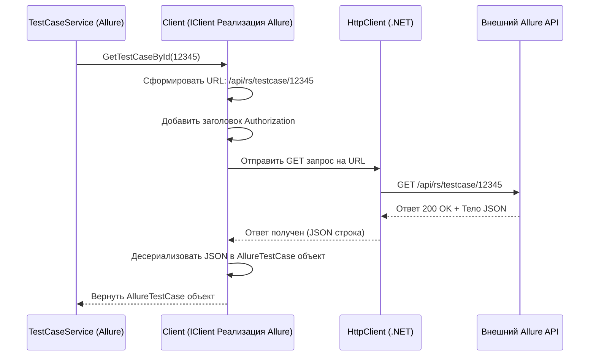

# Chapter 6: Клиент API Экспортера (IClient)


В [предыдущей главе](05_конвертация_тест_кейсов__itestcaseservice__.md) мы узнали, как [`ITestCaseService`](05_конвертация_тест_кейсов__itestcaseservice__.md) выступает в роли "переводчика", преобразуя данные тест-кейсов между форматом исходной TMS и нашими [Общими Моделями Данных](01_общие_модели_данных__models_project__.md). Но чтобы переводить, ему сначала нужно получить "оригинальный текст" — то есть, "сырые" данные из исходной системы (Allure, Azure, Jira и т.д.). Откуда он их берет?

Представьте, что вы хотите заказать пиццу (`TestCase`) из разных ресторанов (разные TMS: Allure, Azure). У каждого ресторана свой номер телефона, свое меню и свои правила заказа (свой API). Вы не можете звонить по одному и тому же номеру и использовать один и тот же скрипт для всех. Вам нужен специальный "переговорщик" для каждого ресторана, который знает его номер, как сделать заказ по его правилам и как понять ответ оператора.

В `migrators` роль такого "переговорщика" для конкретной TMS в процессе экспорта выполняет **`IClient`**.

## Проблема: Разные API у Каждой TMS

Каждая система управления тестированием (TMS) имеет свой собственный API (Application Programming Interface) — набор правил и команд, с помощью которых внешние программы могут с ней взаимодействовать. API Allure TestOps отличается от API Azure DevOps, API Jira — от API TestRail, и так далее.

Если бы наш [`ITestCaseService`](05_конвертация_тест_кейсов__itestcaseservice__.md) (или [главный экспортер `IExportService`](02_архитектура_экспортера__iexportservice__.md)) пытался напрямую "звонить" в каждую TMS, ему бы пришлось знать все детали каждого API:

*   Какие URL-адреса использовать для запроса проектов, тест-кейсов, шагов?
*   Как проходить аутентификацию (использовать токен, логин/пароль)?
*   В каком формате отправлять запросы и получать ответы (JSON, XML)?
*   Как называются нужные поля в ответе?

Это сделало бы код экспортера очень сложным и запутанным. Нам нужен способ изолировать эту специфику.

## Решение: Интерфейс `IClient`

`IClient` — это интерфейс, то есть **"должностная инструкция"** для любого клиента API внутри конкретного проекта-экспортера (например, `AllureExporter`, `AzureExporter`). Эта инструкция говорит: "Если ты хочешь быть клиентом API для системы X, ты должен уметь выполнять такие-то запросы...".

Каждый проект-экспортер (например, `AllureExporter`) определяет свой собственный интерфейс `IClient`, который содержит методы, необходимые для получения данных *именно из этой TMS*.

Вот как может выглядеть **упрощенный** интерфейс `IClient` для Allure:

```csharp
// Файл: Migrators/AllureExporter/Client/IClient.cs (Упрощенный пример)
using AllureExporter.Models.Project; // Модели, специфичные для Allure
using AllureExporter.Models.TestCase; // Модели, специфичные для Allure
// ... другие using для моделей Allure ...

namespace AllureExporter.Client;

// Инструкция для "переговорщика" с Allure API
public interface IClient
{
    // "Должен уметь узнавать ID проекта по имени"
    Task<BaseEntity> GetProjectId();

    // "Должен уметь получать список 'сырых' тест-кейсов для проекта"
    Task<List<long>> GetTestCaseIdsFromMainSuite(long projectId);

    // "Должен уметь получать детальную информацию о 'сыром' тест-кейсе по его ID"
    Task<AllureTestCase> GetTestCaseById(long testCaseId);

    // "Должен уметь скачивать вложение по его ID"
    Task<byte[]> DownloadAttachmentForTestCase(long attachmentId);

    // ... и другие методы для получения секций, шагов, атрибутов и т.д. из Allure ...
}
```

*   `public interface IClient`: Объявляет "инструкцию" `IClient`.
*   Методы (например, `GetProjectId`, `GetTestCaseById`) описывают *что* клиент должен уметь делать.
*   **Важно:** Обратите внимание на возвращаемые типы! Например, `GetTestCaseById` возвращает `Task<AllureTestCase>`. Это **не** наша общая модель `Models.TestCase`, а специальная модель (`AllureTestCase`), которая точно соответствует структуре данных, возвращаемой *именно Allure API*. `IClient` отвечает только за общение с API и получение "сырых" данных в их исходном формате.

## Как `IClient` Используется?

Сервисы внутри экспортера (такие как [`ITestCaseService`](05_конвертация_тест_кейсов__itestcaseservice__.md) или `ISectionService`) используют реализацию `IClient` для получения данных перед их конвертацией в [Общие Модели](01_общие_модели_данных__models_project__.md).

```csharp
// Внутри AllureExporter/Services/Implementations/TestCaseService.cs (Упрощенно)
public class TestCaseService : ITestCaseService
{
    private readonly IClient _client; // Получаем нашего "переговорщика" с Allure
    // ... другие зависимости (логгер, другие сервисы) ...

    public TestCaseService(IClient client, /*...другие...*/)
    {
        _client = client;
        // ...
    }

    public async Task<List<Models.TestCase>> ConvertTestCases(...)
    {
        var testCaseIds = await _client.GetTestCaseIdsFromMainSuite(projectId); // 1. Просим ID кейсов у Allure

        var convertedTestCases = new List<Models.TestCase>();
        foreach (var id in testCaseIds)
        {
            var allureRawTestCase = await _client.GetTestCaseById(id); // 2. Просим детали конкретного кейса у Allure

            // 3. Конвертируем 'сырой' AllureTestCase в нашу Models.TestCase
            var modelTestCase = ConvertAllureToModel(allureRawTestCase, ...);

            convertedTestCases.Add(modelTestCase);
        }
        return convertedTestCases;
    }

    // Метод для конвертации (здесь не показан)
    private Models.TestCase ConvertAllureToModel(AllureTestCase rawData, ...) { /* ... */ }
}
```

Здесь `TestCaseService` не знает, как именно `_client` получает данные из Allure. Он просто вызывает нужный метод (`GetTestCaseIdsFromMainSuite`, `GetTestCaseById`), получает "сырые" данные (`List<long>`, `AllureTestCase`) и затем уже сам занимается их преобразованием в `Models.TestCase`. `IClient` скрывает всю сложность взаимодействия с API.

## Как `Client` Работает Внутри?

Теперь заглянем "под капот" конкретной реализации `IClient`. В каждом проекте-экспортере есть класс, обычно называемый `Client`, который реализует интерфейс `IClient` для своей TMS.

**Пошаговый разбор (на примере `GetTestCaseById` для Allure):**

1.  **Получение запроса:** Метод `GetTestCaseById(long testCaseId)` вызывается (например, из `TestCaseService`).
2.  **Формирование URL:** Код внутри `Client` строит URL-адрес для запроса к Allure API, используя базовый URL из конфигурации и ID тест-кейса. Например: `https://allure.example.com/api/rs/testcase/12345`.
3.  **Подготовка Запроса:** Создается HTTP-запрос (обычно GET-запрос).
4.  **Аутентификация:** К запросу добавляются необходимые заголовки аутентификации (например, `Authorization: Api-Token <ваш_токен>`), прочитанные из [настроек приложения](08_настройки_приложения__appconfig__.md).
5.  **Отправка Запроса:** Используется встроенный в .NET `HttpClient` для отправки запроса на сервер Allure.
6.  **Обработка Ответа:**
    *   Проверяется код состояния ответа (например, `200 OK`). Если ошибка, генерируется исключение или записывается лог.
    *   Если успешно, читается тело ответа (JSON-строка).
7.  **Десериализация:** JSON-строка преобразуется (десериализуется) в объект соответствующего C#-класса, специфичного для Allure (например, `AllureTestCase`). Для этого используется стандартный `System.Text.Json.JsonSerializer`.
8.  **Возврат Результата:** Объект `AllureTestCase` возвращается вызывающей стороне (`TestCaseService`).

**Упрощенная Диаграмма Последовательности:**



**Пример Кода Реализации (`AllureExporter/Client/Client.cs`):**

```csharp
// Файл: Migrators/AllureExporter/Client/Client.cs (Очень Упрощенный Фрагмент)
using System.Net.Http.Headers;
using System.Text.Json;
using AllureExporter.Models.Config; // Для AppConfig
using AllureExporter.Models.TestCase; // Модели Allure
using Microsoft.Extensions.Logging;
using Microsoft.Extensions.Options; // Для доступа к конфигурации

internal class Client : IClient // Реализуем интерфейс IClient
{
    private readonly HttpClient _httpClient; // Инструмент для HTTP-запросов
    private readonly ILogger<Client> _logger;
    // ...

    // Конструктор: получаем HttpClient и доступ к конфигурации
    public Client(ILogger<Client> logger, IOptions<AppConfig> config, HttpClient httpClient)
    {
        _logger = logger;
        _httpClient = httpClient;
        InitClient(config.Value); // Настраиваем HttpClient (URL, Auth)
    }

    // Метод для настройки HttpClient (берет URL и токен из AppConfig)
    private void InitClient(AppConfig config)
    {
        _httpClient.BaseAddress = new Uri(config.Allure.Url); // Базовый URL API
        // Установка заголовка Authorization на основе токена из config
        var token = config.Allure.ApiToken; // Или BearerToken
        _httpClient.DefaultRequestHeaders.Authorization =
            new AuthenticationHeaderValue("Api-Token", token);
    }

    // Реализация метода из интерфейса IClient
    public async Task<AllureTestCase> GetTestCaseById(long testCaseId)
    {
        // Формируем относительный путь к API
        var requestUri = $"api/rs/testcase/{testCaseId}";
        _logger.LogInformation("Запрос деталей тест-кейса Allure: {Uri}", requestUri);

        // Отправляем GET запрос и получаем ответ
        var response = await _httpClient.GetAsync(requestUri);

        // Проверяем, успешен ли запрос
        if (!response.IsSuccessStatusCode)
        {
            _logger.LogError("Ошибка при запросе тест-кейса {Id}: {Code} {Reason}",
                testCaseId, response.StatusCode, await response.Content.ReadAsStringAsync());
            // В реальном коде здесь будет обработка ошибок
            throw new Exception($"Ошибка API: {response.StatusCode}");
        }

        // Читаем тело ответа как строку
        var content = await response.Content.ReadAsStringAsync();

        // Десериализуем JSON строку в объект AllureTestCase
        // System.Text.Json делает всю работу по преобразованию текста в объект C#
        var allureTestCase = JsonSerializer.Deserialize<AllureTestCase>(content);

        // Возвращаем "сырой" объект AllureTestCase
        return allureTestCase;
    }

    // ... Реализации других методов GetProjectId, DownloadAttachment и т.д. ...
}
```

*   Этот класс использует `HttpClient` для отправки запросов.
*   Он читает URL и токен из конфигурации (`AppConfig`, доступной через `IOptions<AppConfig>`).
*   Он использует `JsonSerializer.Deserialize<AllureTestCase>(...)` для преобразования ответа API в C# объект `AllureTestCase`.
*   Он выполняет основную работу по "общению" с API Allure.

## Множество Клиентов для Множества TMS

Важно понимать, что каждый проект-экспортер в `migrators` имеет свою собственную реализацию `IClient`:

*   `AllureExporter/Client/Client.cs` знает, как говорить с Allure API.
*   `AzureExporter/Client/Client.cs` знает, как говорить с Azure DevOps API.
*   `TestRailExporter/Client/Client.cs` знает, как говорить с TestRail API.
*   И так далее...

Все они реализуют *свой* интерфейс `IClient`, определенный внутри их проекта, но идея одна и та же: инкапсулировать детали взаимодействия с конкретным API.

## Заключение

В этой главе мы изучили **`IClient`** — интерфейс и его реализации, которые действуют как "переговорщики" с API конкретной исходной TMS в процессе экспорта.

*   `IClient` определяет **контракт** для взаимодействия с API конкретной TMS.
*   Каждая реализация (`Client` в своем проекте-экспортере) знает **специфику API** своей системы (URL, аутентификацию, форматы данных).
*   Она отвечает за **выполнение HTTP-запросов** и **десериализацию ответов** в C#-модели, специфичные для *этой TMS* (`AllureTestCase`, `AzureWorkItem` и т.д.).
*   Она **скрывает сложность** API от остальной части экспортера (например, от [`ITestCaseService`](05_конвертация_тест_кейсов__itestcaseservice__.md)), предоставляя простые методы для получения "сырых" данных.

Мы увидели, как Экспортер получает данные из источника. Но как Импортер отправляет данные в *целевую* систему? Существует ли похожий "переговорщик" для Импортера?

**Следующая глава:** [Адаптер API Импортера (IClientAdapter)](07_адаптер_api_импортера__iclientadapter__.md)

---

Generated by [AI Codebase Knowledge Builder](https://github.com/The-Pocket/Tutorial-Codebase-Knowledge)