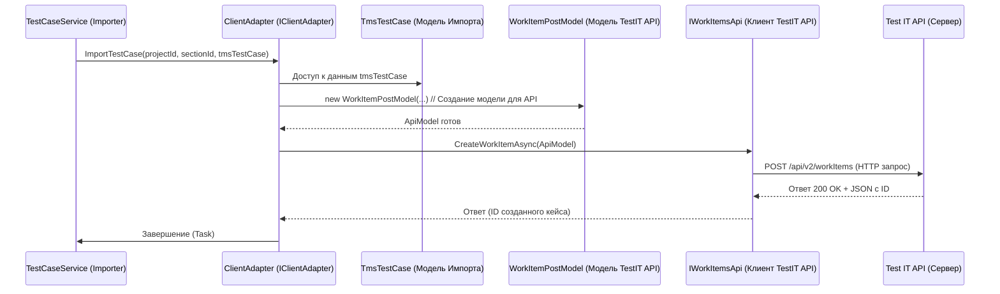

# Chapter 7: Адаптер API Импортера (IClientAdapter)


В [предыдущей главе](06_клиент_api_экспортера__iclient__.md) мы увидели, как **`IClient`** работает в качестве "переговорщика" для Экспортера, получая "сырые" данные из исходной системы управления тестированием (TMS), такой как Allure или Azure. Он прячет сложности работы с конкретным API от остальной части Экспортера.

Теперь давайте перенесемся на другую сторону процесса — **Импорт** данных в нашу целевую систему, **Test IT**. [Сервис Импорта (`IImportService`)](03_архитектура_импортера__iimportservice__.md) и [сервис конвертации тест-кейсов (`ITestCaseService`)](05_конвертация_тест_кейсов__itestcaseservice__.md) подготовили данные в нашем стандартном формате ([`Models`](01_общие_модели_данных__models_project__.md), или немного адаптированные дочерние модели `Tms...`). Но кто теперь возьмет эти стандартизированные "посылки" и доставит их по правильным "адресам" внутри Test IT? Кто знает, как именно создать проект, секцию или тест-кейс, используя API Test IT?

## Проблема: Нужно Понимать API Test IT

Как и любая другая TMS, Test IT имеет свой собственный API со своими правилами, адресами (эндпоинтами) и форматами данных. Наши сервисы импорта (`IImportService`, `ITestCaseService` и другие) уже проделали большую работу: прочитали JSON-файлы (с помощью [`IParserService`](04_запись_чтение_json__iwriteservice__iparserservice__.md)) и подготовили данные. Было бы неудобно, если бы каждый из этих сервисов должен был еще и знать все детали вызовов API Test IT:

*   Какой именно метод из `TestIT.ApiClient` нужно вызвать для создания секции? А для тест-кейса?
*   Как правильно сформировать объект (`WorkItemPostModel`, `SectionPostModel`) для отправки в API?
*   Как обрабатывать ответы и возможные ошибки от API Test IT?

Это привело бы к дублированию кода и усложнило бы сервисы импорта. Нам нужен единый компонент, который специализируется исключительно на общении с API Test IT.

## Решение: `IClientAdapter` - Специализированный Курьер для Test IT

Именно здесь на сцену выходит **`IClientAdapter`**. Представьте его как специализированного курьера, который работает *только* с Test IT. Его задача — взять стандартизированные "посылки" (данные в формате наших [`Models`](01_общие_модели_данных__models_project__.md) или близких к ним `Tms...` моделей) и доставить их по нужным адресам в Test IT (то есть вызвать правильные методы API для создания/обновления сущностей).

`IClientAdapter` — это интерфейс, "должностная инструкция" для такого курьера:

```csharp
// Файл: Migrators/Importer/Client/IClientAdapter.cs
using Importer.Models; // Использует модели, специфичные для импорта (Tms...)
using Models;          // Иногда использует и общие модели
using Attribute = Models.Attribute; // Уточнение для имени 'Attribute'

namespace Importer.Client;

// Инструкция для "курьера" Test IT API
public interface IClientAdapter
{
    // Найти проект по имени, вернуть его ID
    Task<Guid> GetProject(string name);
    // Создать проект, вернуть его ID
    Task<Guid> CreateProject(string name);
    // Создать секцию, вернуть ее ID
    Task<Guid> ImportSection(Guid projectId, Guid parentSectionId, Section section);
    // Создать атрибут, вернуть его представление в TMS
    Task<TmsAttribute> ImportAttribute(Attribute attribute);
    // Создать общий шаг, вернуть его ID
    Task<Guid> ImportSharedStep(Guid projectId, Guid parentSectionId, SharedStep sharedStep);
    // Создать тест-кейс
    Task ImportTestCase(Guid projectId, Guid parentSectionId, TmsTestCase testCase);
    // Получить ID корневой секции проекта
    Task<Guid> GetRootSectionId(Guid projectId);
    // Получить список всех глобальных атрибутов
    Task<List<TmsAttribute>> GetProjectAttributes();
    // Добавить глобальные атрибуты к проекту
    Task AddAttributesToProject(Guid projectId, IEnumerable<Guid> attributeIds);
    // Обновить атрибут
    Task<TmsAttribute> UpdateAttribute(TmsAttribute attribute);
    // Загрузить вложение, вернуть его ID
    Task<Guid> UploadAttachment(string fileName, Stream content);
    // Создать параметр, вернуть его представление в TMS
    Task<TmsParameter> CreateParameter(Parameter parameter);
    // ... и другие методы для получения/обновления данных в Test IT ...
}
```

*   Этот интерфейс определяет набор **высокоуровневых операций**, которые можно выполнить с Test IT: создать проект, импортировать секцию, тест-кейс, атрибут и т.д.
*   Обратите внимание на параметры методов: они принимают либо данные из наших [Общих Моделей](01_общие_модели_данных__models_project__.md) (например, `Section`, `SharedStep`, `Attribute`), либо немного адаптированные модели, специфичные для импорта (например, `TmsTestCase`, `TmsAttribute`). `IClientAdapter` отвечает за преобразование этих данных в формат, который ожидает `TestIT.ApiClient`.
*   Он **скрывает** от остального импортера детали того, какие именно классы и методы из `TestIT.ApiClient` (`IProjectsApi`, `ISectionsApi`, `IWorkItemsApi` и т.д.) вызываются для выполнения этих операций.

## Как `IClientAdapter` Используется?

Сервисы импорта (например, `IImportService`, `ITestCaseService`, `IAttributeService`) используют `IClientAdapter` для фактической загрузки данных в Test IT.

```csharp
// Упрощенный фрагмент из Migrators/Importer/Services/Implementations/TestCaseService.cs
internal class TestCaseService : ITestCaseService
{
    private readonly IClientAdapter _clientAdapter; // Наш "курьер" для Test IT
    private readonly IParserService _parserService;
    // ... другие зависимости ...

    public TestCaseService(IClientAdapter clientAdapter, IParserService parserService, /*...*/)
    {
        _clientAdapter = clientAdapter;
        _parserService = parserService;
        // ...
    }

    public async Task ImportTestCases(Guid projectId, IEnumerable<Guid> testCaseGuids, /*... карты ...*/)
    {
        foreach (var testCaseGuid in testCaseGuids)
        {
            // 1. Читаем данные из JSON -> Models.TestCase
            var modelTestCase = await _parserService.GetTestCase(testCaseGuid);

            // 2. Конвертируем Models.TestCase -> TmsTestCase (специфика импорта)
            var tmsTestCase = ConvertToTmsModel(modelTestCase, /*... карты ...*/);

            // 3. Подготавливаем вложения, параметры и т.д.
            // ... (вызовы других сервисов, работа с tmsTestCase) ...

            // 4. Просим "курьера" доставить готовый TmsTestCase в Test IT
            await _clientAdapter.ImportTestCase(
                projectId, // ID проекта в Test IT
                tmsTestCase.SectionId, // ID секции в Test IT
                tmsTestCase // Подготовленный тест-кейс
            );
        }
    }
    // ... метод ConvertToTmsModel и другие ...
}
```

В этом примере `TestCaseService` подготавливает данные для тест-кейса в формате`TmsTestCase` (который очень близок к `Models.TestCase`, но может содержать ID из Test IT), а затем просто вызывает `_clientAdapter.ImportTestCase(...)`. Ему не нужно знать, как именно `_clientAdapter` будет создавать этот тест-кейс через API Test IT.

## Как `ClientAdapter` Работает Внутри?

Реализация интерфейса `IClientAdapter` находится в классе `ClientAdapter`.

```csharp
// Файл: Migrators/Importer/Client/Implementations/ClientAdapter.cs (Начало)
using Importer.Models;
using Microsoft.Extensions.Logging;
using Microsoft.Extensions.Options;
using Models;
using TestIT.ApiClient.Api; // <--- Использует конкретные API клиенты TestIT!
using TestIT.ApiClient.Client;
using TestIT.ApiClient.Model;
using Attribute = Models.Attribute;
using LinkType = TestIT.ApiClient.Model.LinkType; // Уточнения

namespace Importer.Client.Implementations;

public class ClientAdapter : IClientAdapter // <--- Реализует наш интерфейс
{
    // Логгер, доступ к настройкам и...
    private readonly ILogger<ClientAdapter> _logger;
    private readonly IOptions<AppConfig> _appConfig;

    // ... ссылки на НИЗКОУРОВНЕВЫЕ клиенты API из TestIT.ApiClient!
    private readonly IAttachmentsApi _attachmentsApi;
    private readonly IProjectsApi _projectsApi;
    private readonly IProjectAttributesApi _projectAttributesApi;
    private readonly IProjectSectionsApi _projectSectionsApi;
    private readonly ISectionsApi _sectionsApi;
    private readonly ICustomAttributesApi _customAttributesApi;
    private readonly IWorkItemsApi _workItemsApi;
    private readonly IParametersApi _parametersApi;

    // Конструктор: получает все нужные инструменты (API клиенты)
    public ClientAdapter(
        ILogger<ClientAdapter> logger,
        IOptions<AppConfig> appConfig,
        IAttachmentsApi attachmentsApi,
        IProjectsApi projectsApi,
        IProjectAttributesApi projectAttributesApi,
        // ... и так далее для всех API ...
        IWorkItemsApi workItemsApi,
        IParametersApi parametersApi)
    {
        _logger = logger;
        _appConfig = appConfig;
        _attachmentsApi = attachmentsApi;
        _projectsApi = projectsApi;
        _projectAttributesApi = projectAttributesApi;
        // ... сохраняем ссылки на все API ...
        _workItemsApi = workItemsApi;
        _parametersApi = parametersApi;
    }

    // ... Дальше идут реализации методов интерфейса IClientAdapter ...
}
```

Ключевые моменты:
1.  **Зависимости:** `ClientAdapter` зависит не только от логгера и конфигурации ([`AppConfig`](08_настройки_приложения__appconfig__.md)), но и от множества конкретных *интерфейсов API*, предоставляемых библиотекой `TestIT.ApiClient` (например, `IProjectsApi`, `ISectionsApi`, `IWorkItemsApi`). Эти интерфейсы отвечают за самые низкоуровневые вызовы к API Test IT.
2.  **Регистрация API:** Как `ClientAdapter` получает эти API-клиенты? Они регистрируются в системе внедрения зависимостей при старте приложения. За это отвечает код в `Migrators/Importer/Client/Extensions/ServiceCollectionExtensions.cs`, который создает экземпляры нужных API-клиентов (`ProjectsApi`, `SectionsApi` и т.д.) и настраивает их (например, указывает URL сервера Test IT и токен аутентификации из [`AppConfig`](08_настройки_приложения__appconfig__.md)).

**Пошаговый разбор (на примере `ImportTestCase`):**

1.  **Вызов:** `TestCaseService` вызывает `clientAdapter.ImportTestCase(projectId, sectionId, tmsTestCase)`.
2.  **Преобразование Модели:** Внутри метода `ImportTestCase` в `ClientAdapter` происходит преобразование данных из `TmsTestCase` (наша модель импорта) в модель, которую ожидает `TestIT.ApiClient` (в данном случае, `WorkItemPostModel`). Это включает маппинг полей, преобразование типов перечислений (enum), форматирование атрибутов и т.д.
    ```csharp
    // Внутри ClientAdapter.ImportTestCase (Упрощенно)
    var model = new WorkItemPostModel( /* ... */ )
    {
        EntityTypeName = WorkItemEntityTypes.TestCases, // Указываем, что это тест-кейс
        SectionId = parentSectionId,             // ID секции в Test IT
        Name = testCase.Name,                  // Имя тест-кейса
        State = Enum.Parse<WorkItemStates>(testCase.State.ToString()), // Конвертация статуса
        Priority = Enum.Parse<WorkItemPriorityModel>(testCase.Priority.ToString()), // Конвертация приоритета
        Steps = testCase.Steps.Select(s =>       // Конвертация шагов
            new StepPostModel { Action = s.Action, Expected = s.Expected, /*...*/ }).ToList(),
        Attributes = testCase.Attributes        // Конвертация атрибутов
            .ToDictionary(a => a.Id.ToString(), a => a.Value),
        // ... и так далее для предусловий, постусловий, тегов, ссылок, вложений, итераций ...
    };
    ```
    *Этот код создает объект `WorkItemPostModel`, заполняя его данными из `tmsTestCase`, приводя их к формату, ожидаемому Test IT API.*

3.  **Вызов Низкоуровневого API:** `ClientAdapter` использует соответствующий низкоуровневый клиент API (в данном случае `_workItemsApi`) для отправки подготовленной модели в Test IT.
    ```csharp
    // Внутри ClientAdapter.ImportTestCase (Упрощенно)
    _logger.LogDebug("Importing test case {Name} and {@Model}", testCase.Name, model);

    // Вызываем метод CreateWorkItem из TestIT.ApiClient.IWorkItemsApi
    var resp = await _workItemsApi.CreateWorkItemAsync(model);

    _logger.LogInformation("Imported test case {Name} with id {Id}", testCase.Name, resp.Id);
    ```
    *Здесь происходит реальный HTTP-запрос к API Test IT через библиотеку `TestIT.ApiClient`.*

4.  **Обработка Ответа/Ошибок:** Код обрабатывает ответ от API (например, логирует ID созданного тест-чейса) или перехватывает исключения, если API вернул ошибку.

**Упрощенная Диаграмма Последовательности:**



Эта диаграмма показывает, что `ClientAdapter` выступает как **посредник**: он принимает запрос с данными в формате импортера (`TmsTestCase`), преобразует их в формат API (`WorkItemPostModel`) и вызывает соответствующий низкоуровневый клиент API (`IWorkItemsApi`), который уже непосредственно общается с сервером Test IT.

## Заключение

В этой главе мы рассмотрели **`IClientAdapter`** — ключевой компонент импортера, отвечающий за взаимодействие с API целевой системы (Test IT).

*   `IClientAdapter` действует как **специализированный "курьер"** для Test IT.
*   Он предоставляет **высокоуровневые методы** для выполнения операций в Test IT (создать проект, секцию, тест-кейс и т.д.), принимая данные в формате, близком к нашим [Общим Моделям](01_общие_модели_данных__models_project__.md).
*   Он **скрывает детали** работы с библиотекой `TestIT.ApiClient`, преобразуя данные в нужный формат и вызывая соответствующие низкоуровневые API-методы (`IProjectsApi`, `IWorkItemsApi` и т.д.).
*   Это **упрощает** код других сервисов импорта ([`IImportService`](03_архитектура_импортера__iimportservice__.md), [`ITestCaseService`](05_конвертация_тест_кейсов__itestcaseservice__.md)), которым не нужно знать тонкости API Test IT.

Мы разобрали основные компоненты, отвечающие за извлечение, хранение, преобразование и загрузку данных. Но как вся система узнает, откуда и куда переносить данные, какой использовать токен для доступа к API? Для этого существуют настройки приложения.

**Следующая глава:** [Настройки Приложения (AppConfig)](08_настройки_приложения__appconfig__.md)

---

Generated by [AI Codebase Knowledge Builder](https://github.com/The-Pocket/Tutorial-Codebase-Knowledge)