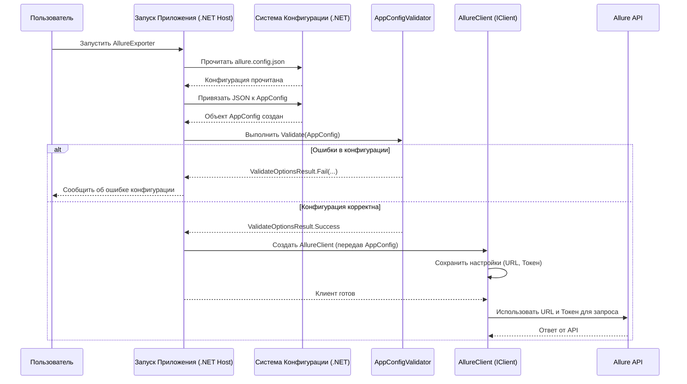

# Chapter 8: Настройки Приложения (AppConfig)


В [предыдущей главе об Адаптере API Импортера (IClientAdapter)](07_адаптер_api_импортера__iclientadapter__.md) мы узнали, как специальный "курьер" (`IClientAdapter`) доставляет наши подготовленные данные в целевую систему, взаимодействуя с ее API (например, API Test IT). В главе [Клиент API Экспортера (IClient)](06_клиент_api_экспортера__iclient__.md) мы видели, как другой "переговорщик" (`IClient`) получает данные из исходной системы.

Но откуда эти "переговорщики" и "курьеры" знают, *куда* им обращаться? По какому адресу находится сервер Allure или Test IT? Какой секретный ключ (токен) или пароль использовать для входа? И в какой именно проект мы хотим загрузить наши тест-кейсы?

Представьте, что вы даете курьеру задание: забрать посылку по одному адресу и доставить по другому. Просто сказать "забери из офиса А и доставь в офис Б" недостаточно. Вам нужно дать точные инструкции:
*   Адрес офиса А (URL сервера Allure)
*   Как попасть внутрь офиса А (Токен доступа для Allure)
*   Что именно забрать (Название проекта в Allure)
*   Точный адрес офиса Б (URL сервера Test IT)
*   Как передать посылку в офисе Б (Токен доступа для Test IT)
*   Куда именно положить посылку (Название проекта в Test IT, если нужно)

Вот для хранения всех этих "инструкций" и параметров подключения в `migrators` используется концепция **Настроек Приложения** или **`AppConfig`**.

## Проблема: Как Управлять Параметрами Подключения?

Каждый раз, когда мы хотим перенести тесты, нам нужно указать:
*   Откуда брать данные (например, Allure TestOps)
*   Куда их загружать (например, Test IT)
*   Данные для доступа к этим системам (URL, токен, логин/пароль)
*   Идентификаторы проектов

Было бы очень неудобно и небезопасно вписывать эти данные прямо в код программы. Если изменится токен или URL, нам придется переписывать и пересобирать программу. Кроме того, хранить секретные ключи прямо в коде — плохая практика.

## Решение: `AppConfig` и Файлы Конфигурации

`AppConfig` — это решение, которое позволяет вынести все эти настройки из кода в отдельные файлы.

**Что такое `AppConfig`?**

`AppConfig` — это набор специальных C#-классов (основной `AppConfig` и вложенные, например, `AllureConfig` для экспортера Allure, `TmsConfig` для импортера Test IT). Эти классы служат "шаблонами" или "контейнерами" для хранения всех необходимых настроек:

*   `Url`: Адрес сервера (например, `https://allure.mycompany.com` или `https://testit.mycompany.com`).
*   `ApiToken` / `PrivateToken`: Секретный ключ для доступа к API.
*   `Login` / `Password`: Имя пользователя и пароль (используется реже, вместо токена).
*   `ProjectName`: Имя проекта в исходной или целевой системе.
*   `ResultPath`: Путь к папке, где [сервисы записи/чтения JSON](04_запись_чтение_json__iwriteservice__iparserservice__.md) будут хранить промежуточные файлы (`main.json`, `testcase.json` и т.д.).
*   Другие специфичные настройки (например, нужно ли мигрировать автотесты, проверять ли SSL-сертификат и т.д.).

**Как Загружаются Настройки?**

Самое важное — эти C#-классы **не заполняются данными прямо в коде**. Вместо этого, они автоматически загружают свои значения из **JSON-файлов** при запуске приложения.

*   Для Экспортера Allure используется файл `allure.config.json`.
*   Для Импортера Test IT используется файл `tms.config.json`.
*   Для других экспортеров (TestRail, Azure и т.д.) будут свои файлы (например, `testrail.config.json`).

**Пример `allure.config.json` (для Экспортера Allure):**

```json
{
  "ResultPath": "output_data", // Папка для сохранения JSON-файлов
  "Allure": {
    "Url": "https://allure.example.com", // Адрес вашего Allure TestOps
    "ProjectName": "My Super Project",    // Название проекта в Allure
    "ApiToken": "YOUR_SECRET_ALLURE_API_TOKEN" // Ваш токен для Allure API
  }
}
```
*Этот файл говорит Экспортеру Allure: куда сохранять результат, к какому серверу Allure подключаться, из какого проекта брать данные и какой токен использовать для доступа.*

**Пример `tms.config.json` (для Импортера Test IT):**

```json
{
  "ResultPath": "output_data", // Папка, откуда читать JSON-файлы
  "Tms": {
    "Url": "https://testit.example.com",      // Адрес вашего Test IT
    "PrivateToken": "YOUR_SECRET_TESTIT_PRIVATE_TOKEN", // Ваш приватный токен для Test IT API
    "ProjectName": "My Imported Project" // Название проекта в Test IT (может создаться новый)
    // "ImportToExistingProject": true // (Необязательно) Импортировать в существующий проект?
    // "CertValidation": false        // (Необязательно) Отключить проверку SSL?
  }
}
```
*Этот файл говорит Импортеру Test IT: откуда читать промежуточные JSON, к какому серверу Test IT подключаться, какой токен использовать, и как назвать проект (или в какой существующий импортировать).*

Такой подход позволяет легко менять настройки (URL, токены, имена проектов) просто редактируя JSON-файлы, без необходимости изменять и перекомпилировать код `migrators`.

## Как Это Реализовано в Коде?

`migrators` использует стандартный механизм конфигурации .NET для загрузки этих JSON-файлов и привязки их к C#-классам.

**1. Классы Конфигурации (C#):**

Сначала определяются C#-классы, структура которых точно повторяет структуру JSON-файлов.

*Для Экспортера Allure:*

```csharp
// Файл: Migrators/AllureExporter/Models/Config/AppConfig.cs
using System.ComponentModel.DataAnnotations; // Для атрибутов [Required]

namespace AllureExporter.Models.Config;

// Главный класс конфигурации
internal class AppConfig
{
    [Required] // Обязательное поле
    public string ResultPath { get; set; } = string.Empty;

    [Required] // Обязательное поле
    public AllureConfig Allure { get; set; } = new(); // Вложенный объект для Allure
}

// Класс для настроек Allure
internal class AllureConfig
{
    [Required] public string Url { get; set; } = string.Empty;
    [Required] public string ProjectName { get; set; } = string.Empty;
    public string ApiToken { get; set; } = string.Empty;  // Или ApiToken, или BearerToken
    public string BearerToken { get; set; } = string.Empty;
}
```
*Структура этих классов (`AppConfig` и `AllureConfig`) точно соответствует структуре `allure.config.json`.*

*Для Импортера Test IT:*

```csharp
// Файл: Migrators/Importer/Models/AppConfig.cs
using System.ComponentModel.DataAnnotations;

namespace Importer.Models;

// Главный класс конфигурации
public class AppConfig
{
    [Required] public string ResultPath { get; set; } = string.Empty;
    [Required] public TmsConfig Tms { get; set; } = new(); // Вложенный объект для Test IT
}

// Класс для настроек Test IT
public class TmsConfig
{
    [Required] public string Url { get; set; } = string.Empty;
    [Required] public string PrivateToken { get; set; } = string.Empty;
    public string ProjectName { get; set; } = string.Empty; // Необязательно, если импорт в существующий
    // Другие необязательные поля...
    public int Timeout { get; set; } // Таймаут для API запросов
    public bool CertValidation { get; set; } = true; // Проверять ли SSL-сертификат
}
```
*Аналогично, структура `AppConfig` и `TmsConfig` здесь соответствует `tms.config.json`.*

**2. Загрузка Конфигурации:**

При запуске приложения (.NET Host) специальный код читает нужный JSON-файл (`allure.config.json` или `tms.config.json`) и "привязывает" его содержимое к экземпляру соответствующего класса `AppConfig`.

```csharp
// Фрагмент из AllureExporter/Program.cs (Настройка приложения)
private static IConfiguration SetupConfiguration()
{
    return new ConfigurationBuilder()
        .SetBasePath(Directory.GetCurrentDirectory()) // Где искать файл
        .AddJsonFile("allure.config.json") // Указываем имя файла!
        .Build();
}

// Фрагмент из AllureExporter/Extensions/ServiceCollectionExtensions.cs (Регистрация AppConfig)
public static void RegisterAppConfig(this IServiceCollection services)
{
    services
        .AddOptions<AppConfig>() // Регистрируем наш класс AppConfig
        .BindConfiguration("")  // Привязываем его к корню конфигурации (из JSON)
        .ValidateDataAnnotations() // Включаем базовую проверку ([Required])
        .ValidateOnStart(); // Проверять при запуске
    // ... (добавление своей валидации, если нужно)
}

// Для Importer/Program.cs код будет аналогичным, но укажет "tms.config.json"
```
*Этот код говорит .NET: "Найди файл `*.config.json`, прочитай его и заполни объект `AppConfig` данными из этого файла". Строка `.BindConfiguration("")` связывает весь JSON с объектом `AppConfig`. Метод `.ValidateOnStart()` запускает проверку конфигурации сразу при старте.*

**3. Использование Конфигурации:**

Теперь любой другой сервис, которому нужны настройки (например, [Клиент API Экспортера (IClient)](06_клиент_api_экспортера__iclient__.md) или [Адаптер API Импортера (IClientAdapter)](07_адаптер_api_импортера__iclientadapter__.md)), может получить доступ к загруженным настройкам через механизм внедрения зависимостей (Dependency Injection), запросив `IOptions<AppConfig>`.

```csharp
// Фрагмент из AllureExporter/Client/Client.cs (Пример использования)
using Microsoft.Extensions.Options; // Необходимо для IOptions
using AllureExporter.Models.Config; // Необходимо для AppConfig

internal class Client : IClient
{
    private readonly HttpClient _httpClient;
    private readonly AppConfig _config; // Поле для хранения конфигурации

    // Конструктор получает настройки через IOptions<AppConfig>
    public Client(IOptions<AppConfig> config, HttpClient httpClient, /*...другие зависимости...*/)
    {
        _httpClient = httpClient;
        _config = config.Value; // Получаем сам объект AppConfig из обертки IOptions

        // Используем настройки для конфигурации HttpClient
        _httpClient.BaseAddress = new Uri(_config.Allure.Url); // Берем URL из config
        var token = _config.Allure.ApiToken; // Берем токен из config
        _httpClient.DefaultRequestHeaders.Authorization =
            new System.Net.Http.Headers.AuthenticationHeaderValue("Api-Token", token);
    }

    // В других методах также можно использовать _config
    public async Task<...> SomeApiCall(...)
    {
        // Например, получить имя проекта
        var projectName = _config.Allure.ProjectName;
        // ...
    }
}
```
*Класс `Client` запрашивает `IOptions<AppConfig>` в конструкторе. .NET автоматически предоставляет ему объект с настройками, загруженными из JSON. Затем клиент может использовать `_config.Allure.Url`, `_config.Allure.ApiToken` и т.д. для своей работы.*

## Валидация Конфигурации: Проверка "Инструкций"

Что если пользователь забыл указать URL в JSON-файле? Или указал неверный токен? Приложение не сможет подключиться к API и, скорее всего, упадет с ошибкой где-то в середине процесса. Чтобы избежать этого, важно проверять ("валидировать") настройки сразу при запуске приложения.

Мы уже видели атрибуты `[Required]` в C#-классах `AppConfig` — это базовая проверка на то, что поле не пустое. Но часто нужны более сложные проверки (например, что URL действительно похож на URL, или что указан хотя бы один из токенов).

Для этого используются специальные классы-валидаторы, реализующие интерфейс `IValidateOptions<T>`.

```csharp
// Файл: Migrators/AllureExporter/Validators/AppConfigValidator.cs
using AllureExporter.Models.Config;
using Microsoft.Extensions.Options;

internal class AppConfigValidator : IValidateOptions<AppConfig>
{
    // Метод Validate проверяет объект options (загруженный AppConfig)
    public ValidateOptionsResult Validate(string? name, AppConfig options)
    {
        // Проверка пути к результатам
        if (string.IsNullOrEmpty(options.ResultPath))
            return ValidateOptionsResult.Fail("ResultPath не может быть пустым."); // Сообщение об ошибке

        // Проверка URL Allure
        if (string.IsNullOrEmpty(options.Allure.Url) ||
            !Uri.IsWellFormedUriString(options.Allure.Url, UriKind.Absolute))
            return ValidateOptionsResult.Fail("Allure.Url должен быть корректным URL.");

        // Проверка имени проекта
        if (string.IsNullOrEmpty(options.Allure.ProjectName))
            return ValidateOptionsResult.Fail("Allure.ProjectName не указан.");

        // Проверка наличия токена (или ApiToken, или BearerToken)
        if (string.IsNullOrEmpty(options.Allure.ApiToken) && string.IsNullOrEmpty(options.Allure.BearerToken))
            return ValidateOptionsResult.Fail("Должен быть указан Allure.ApiToken или Allure.BearerToken.");

        // Если все проверки прошли
        return ValidateOptionsResult.Success; // Все хорошо
    }
}
```
*Этот валидатор выполняет несколько проверок: наличие `ResultPath`, корректность `Url`, наличие `ProjectName` и наличие хотя бы одного токена. Если какая-то проверка не проходит, он возвращает ошибку с описанием проблемы.*

Этот валидатор регистрируется в системе:
```csharp
// Фрагмент из AllureExporter/Extensions/ServiceCollectionExtensions.cs
public static void RegisterAppConfig(this IServiceCollection services)
{
    services
        .AddOptions<AppConfig>()
        // ... (BindConfiguration, ValidateDataAnnotations) ...
        .ValidateOnStart(); // Валидация при старте

    // Добавляем наш кастомный валидатор
    services.AddSingleton<IValidateOptions<AppConfig>, AppConfigValidator>();
}
```
Теперь, благодаря `.ValidateOnStart()` и регистрации `AppConfigValidator`, если в `allure.config.json` будут ошибки или отсутствовать обязательные поля, приложение не запустится и сразу сообщит об ошибке в конфигурации. Это помогает быстро понять, что не так с настройками.

## Поток Работы с Конфигурацией

Давайте представим, как конфигурация используется при запуске, например, `AllureExporter`:


*Диаграмма показывает: приложение читает JSON, создает объект `AppConfig`, валидирует его, и если всё в порядке, передает этот объект компонентам (как `Client`), которым нужны эти настройки для работы.*

## Заключение

В этой главе мы разобрались с **Настройками Приложения (`AppConfig`)**. Это ключевой механизм, который позволяет `migrators` быть гибкими и настраиваемыми.

*   `AppConfig` — это набор C#-классов, хранящих параметры подключения (URL, токены, имена проектов) и другие настройки.
*   Данные для `AppConfig` загружаются из внешних **JSON-файлов** (`allure.config.json`, `tms.config.json` и т.д.), что отделяет конфигурацию от кода.
*   Другие сервисы ([`IClient`](06_клиент_api_экспортера__iclient__.md), [`IClientAdapter`](07_адаптер_api_импортера__iclientadapter__.md)) получают доступ к настройкам через внедрение зависимостей (`IOptions<AppConfig>`).
*   **Валидация** конфигурации при старте приложения помогает выявить ошибки в настройках на раннем этапе.

Теперь у вас есть полное представление об основных архитектурных блоках `migrators`: от [Общих Моделей Данных](01_общие_модели_данных__models_project__.md), через [Экспортеры](02_архитектура_экспортера__iexportservice__.md) и [Импортеры](03_архитектура_импортера__iimportservice__.md), работу с [JSON](04_запись_чтение_json__iwriteservice__iparserservice__.md), [конвертацию тест-кейсов](05_конвертация_тест_кейсов__itestcaseservice__.md), взаимодействие с [API](06_клиент_api_экспортера__iclient__.md)/[API Адаптерами](07_адаптер_api_импортера__iclientadapter__.md), и до [конфигурации](08_настройки_приложения__appconfig__.md).

Это завершает наш обзор основной архитектуры `migrators`. Теперь вы готовы глубже погрузиться в детали конкретных реализаций экспортеров и импортеров или попробовать запустить миграцию самостоятельно! Удачи!

---

Generated by [AI Codebase Knowledge Builder](https://github.com/The-Pocket/Tutorial-Codebase-Knowledge)