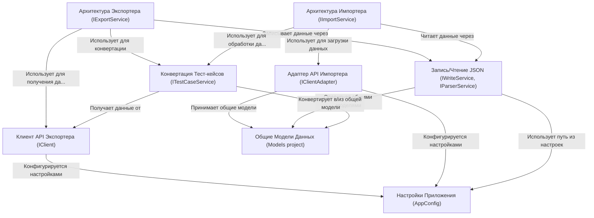

# Tutorial: migrators

Проект `migrators` представляет собой **инструменты для переноса данных** (тест-кейсов, секций, шагов и атрибутов) между различными *системами управления тестированием (TMS)*. Он включает **экспортеры**, которые извлекают данные из исходных систем (например, Allure, Azure, TestRail), и **импортер**, который загружает эти данные в целевую систему *Test IT*. Данные передаются через стандартизированный промежуточный *JSON-формат*, используя **общие модели**.

**Source Repository:** [https://github.com/testit-tms/migrators](https://github.com/testit-tms/migrators)

## Chapters

1. [Общие Модели Данных (Models project)
](01_общие_модели_данных__models_project__.md)
2. [Архитектура Экспортера (IExportService)
](02_архитектура_экспортера__iexportservice__.md)
3. [Архитектура Импортера (IImportService)
](03_архитектура_импортера__iimportservice__.md)
4. [Запись/Чтение JSON (IWriteService, IParserService)
](04_запись_чтение_json__iwriteservice__iparserservice__.md)
5. [Конвертация Тест-кейсов (ITestCaseService)
](05_конвертация_тест_кейсов__itestcaseservice__.md)
6. [Клиент API Экспортера (IClient)
](06_клиент_api_экспортера__iclient__.md)
7. [Адаптер API Импортера (IClientAdapter)
](07_адаптер_api_импортера__iclientadapter__.md)
8. [Настройки Приложения (AppConfig)
](08_настройки_приложения__appconfig__.md)

---

Generated by [AI Codebase Knowledge Builder](https://github.com/The-Pocket/Tutorial-Codebase-Knowledge)